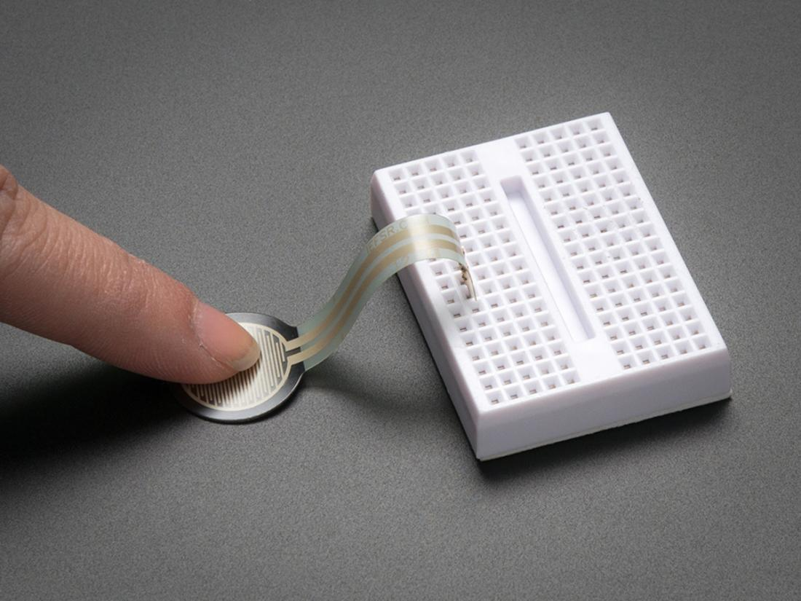
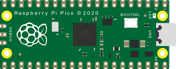
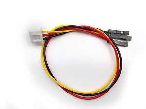
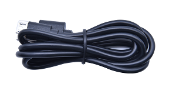
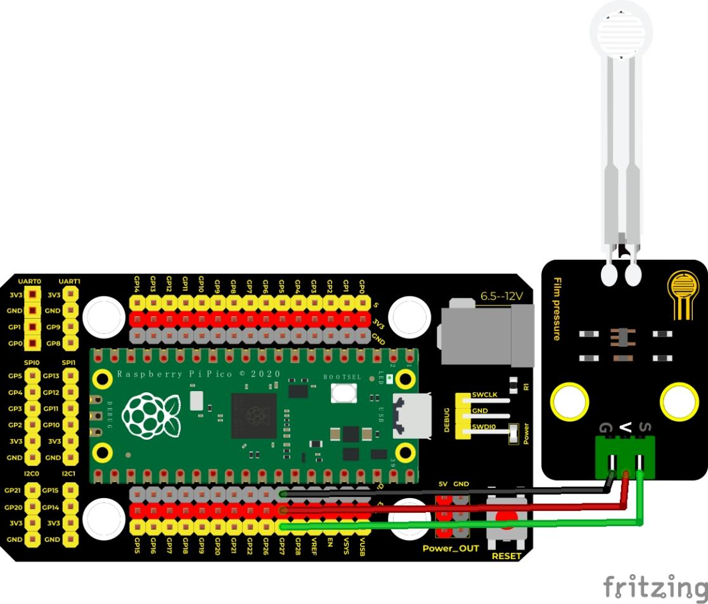
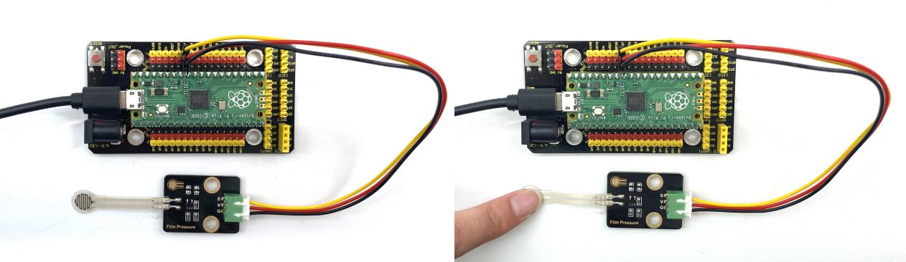
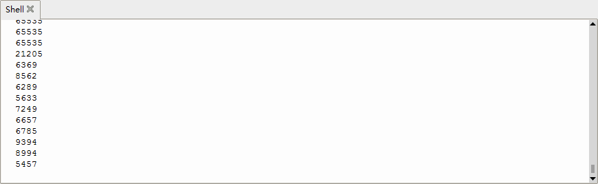

## 实验十五 薄膜压力传感器

****

### 🌟 项目简介  
本实验将带你认识并使用一款轻巧灵敏的**薄膜压力传感器**。它像一张薄薄的“智能贴纸”，一按就变“聪明”——能感知你手指按压的轻重，并把压力大小变成数字信号显示在电脑上！适合做互动装置、电子贺卡、简易体重检测等有趣小项目。

---

### ⚙️ 工作原理  
薄膜压力传感器内部有一种特殊的导电材料，**受力越大，电阻越小**。  
我们把它接入 Raspberry Pi Pico 的模拟输入引脚（ADC），Pico 就会把电阻变化转换成 **0–65535 的数字值**（16位精度）。  
⚠️ 注意：**数值越小 = 压力越大**（因为电阻变小 → 分压降低 → 读到的电压变低 → ADC值变小）。

---

### 🧰 所需材料  

|  |  |  |  |  |
|--------------------------------------------------------------------------|------------------------------------------------------------------|-------------------------------------------------------|----------------------------------------------------------------------|------------------------------------------------------|
| Raspberry Pi Pico板 ×1                                                   | Raspberry Pi Pico扩展板 ×1                                       | Keyes DIY电子积木 薄膜压力传感器 ×1                   | 防反插3Pin杜邦线（公对母）×1                                          | Micro USB数据线 ×1                                   |

> ✅ 小提示：薄膜传感器有三根线——红色（VCC）、黑色（GND）、黄色（S/Signal），接线时请认准颜色！

---

### 🔌 接线说明  

****  

请按以下方式连接（对应扩展板上的标注更清晰）：  
- 传感器 **红色线（VCC）** → 扩展板 **3.3V 引脚**  
- 传感器 **黑色线（GND）** → 扩展板 **GND 引脚**  
- 传感器 **黄色线（S）** → 扩展板 **ADC1 / GP27 引脚**（即 Pico 的第27号GPIO）

> 💡 为什么选 GP27？因为它是 Pico 上支持 ADC 的引脚之一（ADC1），且扩展板上通常明确标为 “ADC1” 或 “A1”，方便初学者识别。

---

### 💻 示例代码（MicroPython）  

```python
# Keyes Starter Kit for Raspberry Pi Pico
# 实验十五：薄膜压力传感器
# 功能：实时读取压力值，并在Shell中打印（数值越小，压力越大）

import machine
import utime

# 创建ADC对象：使用ADC通道1（对应GP27引脚）
film_sensor = machine.ADC(1)

print("✅ 薄膜压力传感器已启动！")
print("👉 用手轻轻按压传感器表面，观察数值变化～")

while True:
    # 读取16位ADC值（范围：0–65535）
    pressure_value = film_sensor.read_u16()
    
    # 打印当前压力值（更清晰地显示变化趋势）
    print("压力值 =", pressure_value)
    
    # 每0.1秒读取一次，避免刷屏太快
    utime.sleep(0.1)
```

---

### 📝 代码解析  

| 代码行 | 说明 |
|--------|------|
| `film_sensor = machine.ADC(1)` | 创建ADC对象，`1` 表示使用 **ADC通道1**（硬件上对应 GP27 引脚） |
| `pressure_value = film_sensor.read_u16()` | 读取16位无符号整数（0–65535），值越小表示按得越用力 |
| `print("压力值 =", pressure_value)` | 在Thonny或串口终端中清晰显示结果，方便观察变化 |
| `utime.sleep(0.1)` | 短暂暂停0.1秒，让数据显示节奏舒适，也减轻Pico负担 |

> ✅ 小技巧：想看到更明显的对比？试试先不按传感器，记下“空载值”（比如62000）；再用力按，看能不能降到30000甚至更低！

---

### 📈 实验现象  

运行代码后，打开 Thonny 下方的 **Shell（交互式窗口）**，你会看到一串不断刷新的数字：  

  

- ✋ **没按压时**：数值较高（如 60000–65000），表示“几乎没压力”  
- 👇 **轻按一下**：数值明显下降（如 45000）  
- 💪 **用力按压**：数值继续下降（可能到 20000 甚至更低）  
- 🌬️ **松开手后**：数值快速回升至初始值  

> ✅ 正常现象：数值会有轻微波动（因环境干扰或接触微动），属于正常范围。

---

### ⚠️ 注意事项  

- 🔌 **务必接3.3V，不可接5V！** 薄膜传感器工作电压为3.3V，接5V可能烧毁！  
- 🧼 **保护传感器表面**：避免用尖锐物戳、刮或折叠传感器，否则易损坏内部导电层。  
- 🧩 **接线前断电**：插拔杜邦线前，请先断开USB线，防止短路。  
- 🐞 **如果没反应？**  
  - 检查黄色线是否确实接到 **GP27 / ADC1**（不是ADC0或其它引脚）；  
  - 检查Thonny是否已正确选择串口并点击“Run”；  
  - 检查传感器三根线颜色是否接错（红-VCC、黑-GND、黄-S）。  

****  
****

---

### 🧠 扩展思维  
在本课实时读取压力值的基础上，如果想让Pico根据压力大小**控制LED亮度**（压力越大LED越亮），该怎样修改代码？