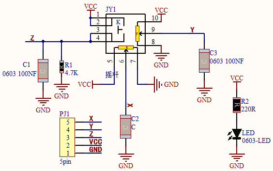
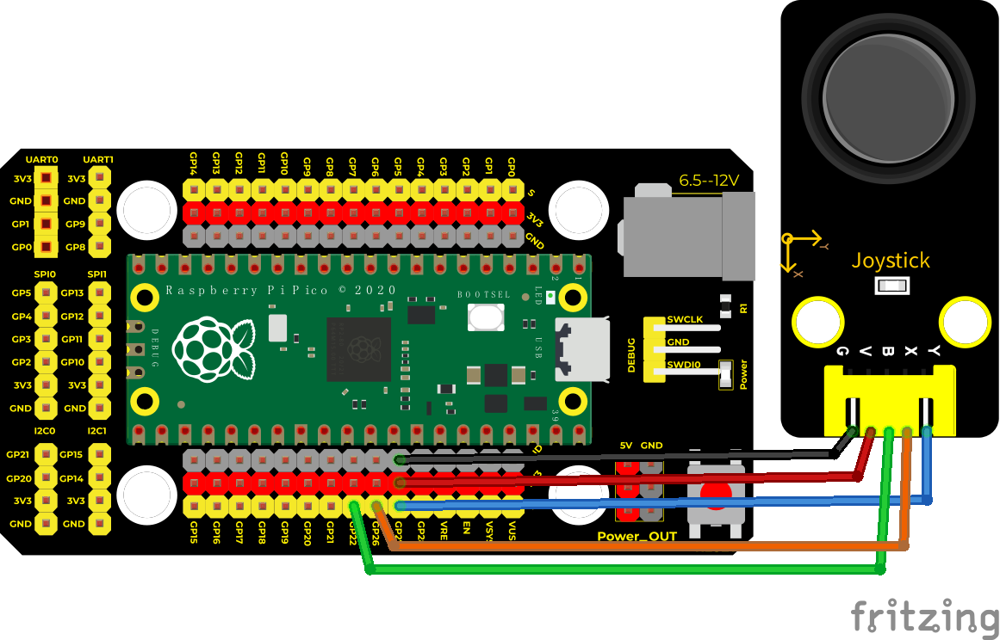
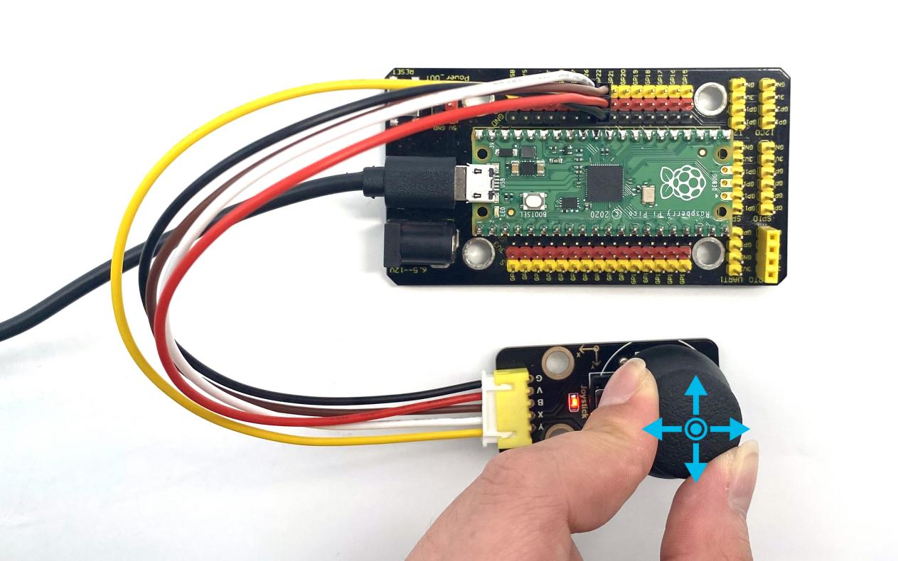
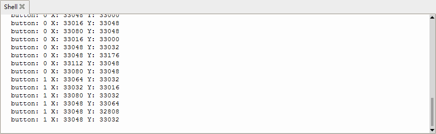

## 实验十六 摇杆模块


### 🌟 项目简介  
你有没有玩过游戏手柄？手柄上的小摇杆轻轻一推，角色就能前后左右移动——它其实是一个“会说话的方向传感器”！本节课，我们将用 Keyes DIY 电子积木摇杆模块，让 Raspberry Pi Pico 听懂摇杆的语言：它往哪边推？有没有按下中间的按钮？通过读取 X 轴、Y 轴的模拟值和按钮（Z 轴）的开关状态，我们就能完整掌握摇杆的每一个动作！

---

### ⚙️ 工作原理  
  
摇杆模块内部藏着“两个可调电阻（电位器）+ 一个轻触开关”：  
- **X轴电位器**：左右摇动时，输出 0–65535 的电压值（对应 MicroPython 的 `read_u16()`）；  
- **Y轴电位器**：上下摇动时，同样输出 0–65535 的电压值；  
- **Z轴按钮（B引脚）**：默认未按下时为 **低电平（0）**，按下后接通 VCC 变为 **高电平（1）** ——注意：这和普通按键模块逻辑相反哦！  

> ✅ 小知识：Pico 的 ADC 引脚（如 GP26、GP27）能将模拟电压“翻译”成数字，范围是 0（0V）到 65535（3.3V），非常灵敏！

---

### 🧰 所需材料  

|  |  |  |  |  |
| ------------------------------------------------------------ | ------------------------------------------------------------ | ----------------------------------------------------- | ------------------------------------------------------------ | ---------------------------------------------------- |
| Raspberry Pi Pico 板 ×1                                      | Raspberry Pi Pico 扩展板 ×1                                  | Keyes DIY 电子积木 摇杆模块 ×1                        | 防反插 5Pin 杜邦线（母对母）×5                               | MicroUSB 数据线 ×1                                   |

---

### 🔌 接线图  

  

✅ **正确接线方式（请严格对照图连接）：**  
| 摇杆模块引脚 | 连接到 Pico 引脚 | 说明         |  
|--------------|------------------|--------------|  
| **VCC**      | **VSYS 或 3.3V** | 供电（推荐 VSYS，更稳定） |  
| **GND**      | **GND**          | 共地         |  
| **X**        | **GP26（ADC0）** | X 轴模拟信号 |  
| **Y**        | **GP27（ADC1）** | Y 轴模拟信号 |  
| **B（Z）**   | **GP22**         | 按钮数字信号（输入） |  

> ⚠️ 注意：摇杆模块的 B 引脚是“按下变高”，所以代码中直接读 `.value()` 即可，无需加 `Pull.UP` 或 `Pull.DOWN`。

---

### 💻 示例代码（MicroPython）

```python
# Keyes Starter Kit for Raspberry Pi Pico
# 实验16：摇杆模块
# 作者：创客教育团队

import machine
import utime

# 初始化引脚
button = machine.Pin(22, machine.Pin.IN)     # B引脚 → GP22，数字输入
x_axis = machine.ADC(26)                     # X引脚 → GP26，模拟输入
y_axis = machine.ADC(27)                     # Y引脚 → GP27，模拟输入

print("摇杆模块已启动！")
print("提示：摇动方向查看X/Y值变化，按下按钮看B值变为1")

while True:
    b_val = button.value()                    # 读取按钮状态：0=未按，1=按下
    x_val = x_axis.read_u16()                 # 读取X轴值（0~65535）
    y_val = y_axis.read_u16()                 # 读取Y轴值（0~65535）

    # 一行显示所有数据，便于观察
    print(f"按钮:{b_val}  X:{x_val}  Y:{y_val}")

    utime.sleep(0.1)  # 每0.1秒刷新一次，避免刷屏太快
```

---

### 📝 代码解析  

| 代码行 | 说明 |  
|--------|------|  
| `button = machine.Pin(22, machine.Pin.IN)` | 将 GP22 设置为**数字输入模式**，用于检测按钮是否按下 |  
| `x_axis = machine.ADC(26)` | 将 GP26 设置为**模拟输入**，读取 X 方向电压 |  
| `x_axis.read_u16()` | 返回 0–65535 的整数（不是 0–1023！Pico ADC 是 16 位） |  
| `f"按钮:{b_val} X:{x_val} Y:{y_val}"` | 使用 f 字符串让打印更清晰易读（比 `end=" "` 更友好） |  
| `utime.sleep(0.1)` | 暂停 0.1 秒，防止串口输出太快看不清，也减轻 CPU 负担 |  

> 💡 小技巧：静止时 X/Y 值通常在 32000–33000 左右（中点电压约 1.65V），向左推 X 变小，向右推 X 变大；向上推 Y 变小，向下推 Y 变大。

---

### 🌈 实验现象  

运行代码后，打开 Thonny 的 Shell（或串口监视器），你会看到类似这样的实时输出：  
```
摇杆模块已启动！
提示：摇动方向查看X/Y值变化，按下按钮看B值变为1
按钮:0  X:32450  Y:32780
按钮:0  X:32448  Y:32782
按钮:1  X:32455  Y:32778   ← 此时按下了摇杆按钮！
按钮:0  X:18230  Y:32790   ← 向左推，X 值明显变小
按钮:0  X:32460  Y:8920    ← 向下推，Y 值明显变小
```

  


✅ 成功标志：  
- 摇杆静止时 X/Y 值稳定在中间范围（≈32000–33000）；  
- 左/右/上/下推动时，对应数值明显增大或减小；  
- 按下按钮时，“按钮:” 后面的数字从 `0` 瞬间变成 `1`。

---

### ⚠️ 注意事项  

- 🔌 **电源选择**：摇杆模块支持 3.3V–5V，但 Pico 的 3.3V 引脚带载能力较弱，**强烈建议接 VSYS 引脚（即 USB 供电直出）**，避免模块工作异常；  
- 🧩 **防反插线材**：使用防反插 5Pin 杜邦线时，请确认颜色对应（红-VCC、黑-GND、绿-X、蓝-Y、黄-B），避免接错烧毁模块；  
- 🧹 **接触不良排查**：若数值跳变剧烈或始终为 0/65535，请检查杜邦线是否插紧、焊点是否虚焊、模块引脚有无氧化；  
- 🐍 **代码上传后需重启**：部分情况下需点击 Thonny 的「Stop/Restart backend」按钮，再运行，确保新代码生效。

---

### 🧠 扩展思维  
在本课摇杆实时数据显示的基础上，如果想让 Pico 根据摇杆方向控制一个 LED 的亮灭（比如：向上推灯亮，向下推灯灭），该怎样修改代码？