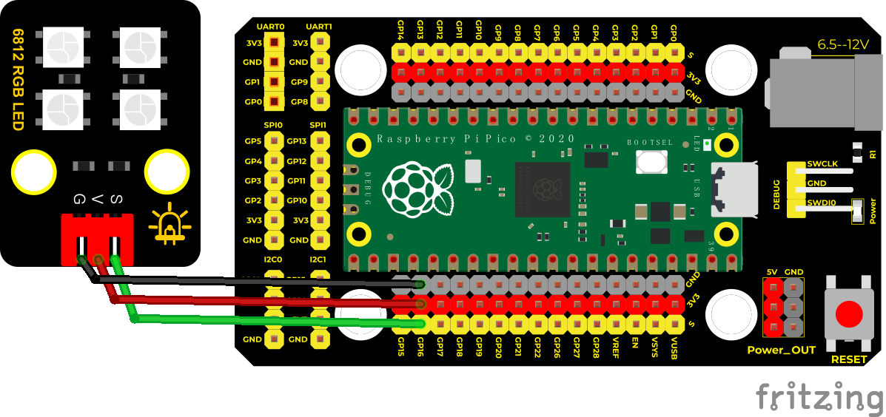
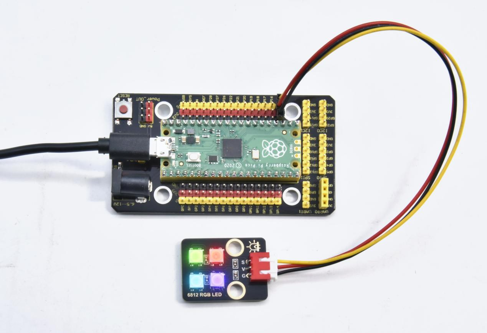

## 实验十七 SK6812 RGB模块

### 🌟 项目简介  
本实验将带你认识一种“聪明”的RGB灯——SK6812智能LED模块。它和之前用PWM控制的普通RGB灯完全不同：**只需1根信号线就能控制多个灯珠，每个灯珠还能独立显示不同颜色！** 我们的模块上有4颗SK6812灯珠（每颗都像一个迷你像素点），它们串联在一起，却能各自“听懂”指令，实现红、绿、蓝、白等丰富色彩组合。不用复杂接线，不用多路PWM，一块Pico就能轻松驾驭！

---

### ⚙️ 工作原理  
SK6812是一种**内置驱动芯片的智能LED**，每个灯珠都集成了控制器和RGB发光芯片（外形像5050贴片LED）。它的神奇之处在于：

- ✅ **单线通信**：所有灯珠共用1根数据线（DIN），Pico发送一串数字信号，第一个灯珠“吃掉”自己的24位颜色数据（红8位+绿8位+蓝8位），再把剩下的数据“吐给”下一个灯珠……像传话一样，级联传递；
- ✅ **自动识别**：灯珠内部有高精度振荡器和恒流电路，保证颜色稳定、亮度一致，不怕电压波动；
- ✅ **底层已封装**：MicroPython通过RP2040的PIO（可编程IO）硬件直接生成精确时序信号，我们只需调用简单函数，无需手动“掐秒”发波形！

> 💡 小知识：这种通信协议叫“单线归零码（NRZ）”，对时序要求极严——差几十纳秒就可能点不亮！幸好Pico的PIO帮我们搞定啦 ✨


---

### 🧰 所需材料  

|  |  |  |  |  |
|--------------------------------------------------------------------------|------------------------------------------------------------------|-------------------------------------------------------|----------------------------------------------------------------------|------------------------------------------------------|
| Raspberry Pi Pico板 ×1                                                   | Raspberry Pi Pico扩展板 ×1                                       | Keyes DIY电子积木 SK6812 RGB模块 ×1                   | 防反插3Pin杜邦线（黑/红/绿）×1                                       | Micro-USB数据线 ×1                                 |

> 🔍 模块接口说明：  
> - `GND` → 黑线（接地）  
> - `VCC` → 红线（接3V3）  
> - `DIN` → 绿线（数据输入，接Pico GP16）

---

### 🔌 接线图  

****  

✅ 正确接法（务必核对）：  
- SK6812 `VCC` → 扩展板 `5V`（或Pico的`VSYS`引脚）  
- SK6812 `GND` → 扩展板 `GND`  
- SK6812 `DIN` → 扩展板 `GP16`（或Pico引脚16）  

> ⚠️ 重要提醒：  
> - 杜邦线务必插紧，防反插设计可避免接错正负极。

---

### 💻 示例代码（MicroPython）  

```python
# Keyes Starter Kit for Raspberry Pi Pico
# 实验十七：SK6812 RGB LED 模块
# 功能：让4颗灯珠分别显示红、绿、蓝、白色

import array, time
from machine import Pin
import rp2

# === 参数设置 ===
NUM_LEDS = 4          # 模块上灯珠数量（共4颗）
PIN_NUM = 16            # 控制引脚：GP16（可改为GP17/GP20等）
brightness = 0.1        # 整体亮度（0.0~1.0，0.1较柔和不刺眼）

# === PIO程序：生成SK6812所需精确时序信号 ===
@rp2.asm_pio(sideset_init=rp2.PIO.OUT_LOW, out_shiftdir=rp2.PIO.SHIFT_LEFT, autopull=True, pull_thresh=24)
def sk6812():
    T1 = 2  # 高电平时间（单位：周期）
    T2 = 5  # 低电平时间（表示“1”）
    T3 = 3  # 低电平时间（表示“0”）
    wrap_target()
    label("bitloop")
    out(x, 1)          .side(0) [T3 - 1]   # 发送1位，先拉低准备
    jmp(not_x, "do_zero") .side(1) [T1 - 1] # 若是“1”，高电平持续T1周期
    jmp("bitloop")     .side(1) [T2 - 1]   # 然后拉低T2周期 → 完成“1”
    label("do_zero")
    nop()              .side(0) [T2 - 1]   # 若是“0”，高电平很短，然后拉低T2周期 → 完成“0”
    wrap()

# === 初始化状态机 ===
sm = rp2.StateMachine(0, sk6812, freq=8_000_000, sideset_base=Pin(PIN_NUM))
sm.active(1)  # 启动状态机，等待接收数据

# === LED控制函数 ===
ar = array.array("I", [0 for _ in range(NUM_LEDS)])  # 存储4颗灯的颜色值（RGB格式）

def pixels_show():
    """将当前颜色数组刷新到LED上"""
    dimmer_ar = array.array("I", [0 for _ in range(NUM_LEDS)])
    for i, c in enumerate(ar):
        r = int(((c >> 8) & 0xFF) * brightness)  # 提取红色分量并调亮度
        g = int(((c >> 16) & 0xFF) * brightness) # 提取绿色分量并调亮度
        b = int((c & 0xFF) * brightness)         # 提取蓝色分量并调亮度
        dimmer_ar[i] = (g << 16) + (r << 8) + b  # 重新组装为GRB格式（SK6812要求）
    sm.put(dimmer_ar, 8)  # 发送数据到PIO状态机
    time.sleep_ms(10)     # 短暂等待显示稳定

def pixels_set(i, color):
    """设置第i颗灯珠的颜色（color = (R, G, B)元组）"""
    ar[i] = (color[1] << 16) + (color[0] << 8) + color[2]  # GRB顺序存入

def pixels_fill(color):
    """让所有灯珠显示同一种颜色"""
    for i in range(len(ar)):
        pixels_set(i, color)

# === 预设颜色常量 ===
RED = (255, 0, 0)    # (R, G, B)
GREEN = (0, 255, 0)
BLUE = (0, 0, 255)
WHITE = (255, 255, 255)
BLACK = (0, 0, 0)

# === 主程序：点亮4颗灯珠 ===
pixels_set(0, RED)     # 第1颗：红色
pixels_set(1, GREEN)   # 第2颗：绿色
pixels_set(2, BLUE)    # 第3颗：蓝色
pixels_set(3, WHITE)   # 第4颗：白色
pixels_show()          # 刷新显示！
time.sleep(5)          # 保持5秒

# === 熄灭所有灯 ===
for i in range(len(ar)):
    pixels_set(i, BLACK)
pixels_show()
```

---

### 📝 代码解析（小学生也能懂！）  

| 代码片段 | 中文解释 |
|----------|----------|
| `NUM_LEDS = 4` | 告诉程序：“我们模块有4颗灯，请按4颗来准备！” |
| `PIN_NUM = 16` | “控制线接在Pico的GP16引脚上”（就像告诉机器人“开关在哪”） |
| `brightness = 0.1` | “把亮度调成10%，保护小眼睛不刺眼！”（数值越大越亮，1.0最亮） |
| `pixels_set(0, RED)` | “让第1颗灯（编号0）变成红色！”（编号从0开始数哦） |
| `pixels_show()` | **最关键一步！** “把刚才设置的颜色，真正发给灯珠显示出来！”（不写这句，灯不会亮！） |
| `GRB顺序` | SK6812芯片要求数据按“绿→红→蓝”顺序发送（不是常见的RGB），代码里已自动转换 ✅ |

> 💡 为什么用 `array.array("I", ...)`？  
> 因为LED需要超快传输数据，普通列表太慢！`array` 是专门为高速数据设计的“超级快递员”，确保信号准时送达每一颗灯珠。

---

### 🌈 实验现象  
烧录代码后，通电观察：  
✅ **第1颗灯珠亮起红色**  
✅ **第2颗灯珠亮起绿色**  
✅ **第3颗灯珠亮起蓝色**  
✅ **第4颗灯珠亮起白色**  
5秒后，**四颗灯珠同时熄灭**。  

效果如图所示：  


---

### ⚠️ 注意事项（安全第一！）  
- 🔌 **电源必须接5V！** SK6812工作电压为3.5V~5.3V，接3.3V会不亮或闪烁；Pico的`VSYS`引脚或扩展板`5V`输出均可；  
- 🧵 **杜邦线插紧、方向别反**：黑线（GND）、红线（5V）、绿线（DIN）一一对应，防反插设计帮你避坑；  
- 🛑 **勿长时间全亮白色**：4颗灯全白时功耗较高，建议亮度≤0.3，避免过热；  
- 🐞 **如果灯不亮？**  
  - ✅ 检查USB线是否为**数据线**（能传数据，非仅充电线）；  
  - ✅ 检查`DIN`是否接在**GP16**（不是GP15或GP17）；  
  - ✅ 检查MicroPython固件是否为**最新版**（旧版可能不支持PIO）；  
  - ✅ 尝试把`brightness`临时调高到`0.5`，确认是否因太暗没看清。

---

### 🧠 扩展思维  
在本课4颗灯珠分别显示固定颜色的基础上，如果想让它们**像呼吸灯一样渐亮渐暗地循环变化**，该怎样修改代码？