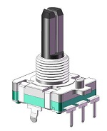
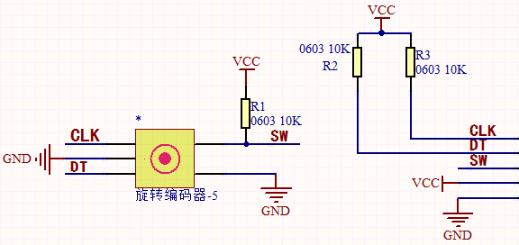
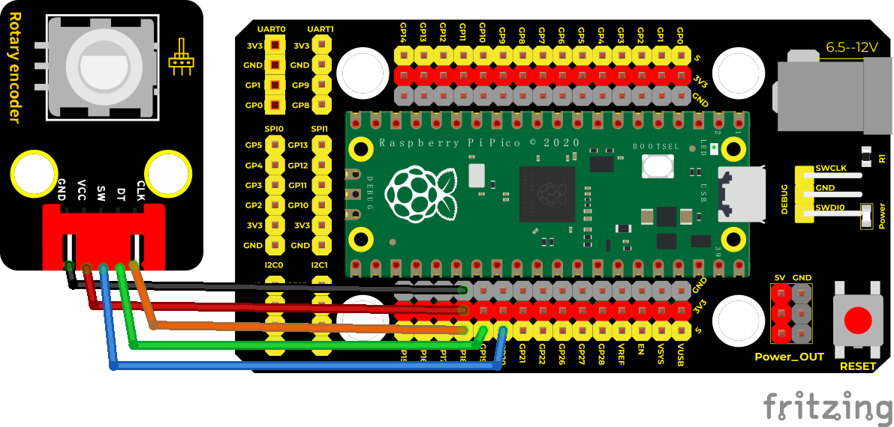
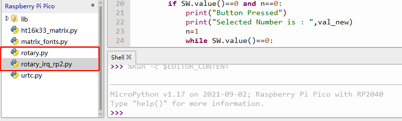
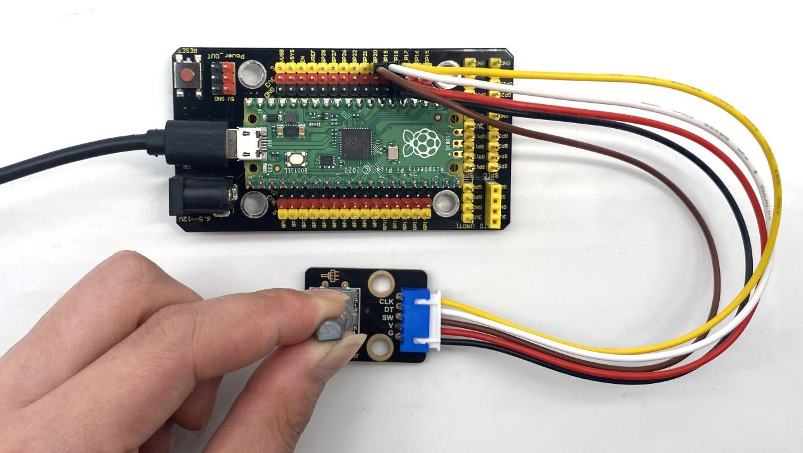
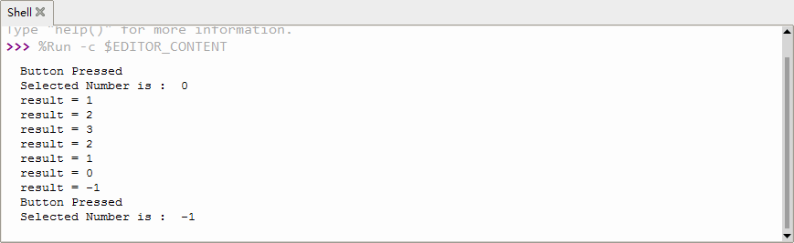

## 实验十八 旋转编码器模块计数



### 🌟 项目简介  
本实验带你认识并使用「旋转编码器」——一种能感知旋转方向和圈数的电子小零件！它就像音响上的音量旋钮、空调遥控器上的温度调节旋钮，轻轻一转就能告诉单片机：“我往左转了”或“我往右转了”。  
在本课中，我们将用 Raspberry Pi Pico 读取旋转编码器的转动方向与次数，并实现：  
✅ 顺时针旋转 → 计数值 **减1**  
✅ 逆时针旋转 → 计数值 **加1**  
✅ 按下中间按钮 → 在 Thonny 的 Shell 窗口中 **打印当前数值**  

简单有趣，是人机交互的第一步！

---

### ⚙️ 工作原理  
旋转编码器（本实验使用的是「增量式编码器」）内部有两个信号触点（CLK 和 DT），当旋钮转动时，它们会按特定顺序输出高低电平变化，形成「相位差为90°的两路脉冲信号」。Pico 通过检测这两路信号的先后顺序，就能判断出是顺时针还是逆时针转动。

  
> 💡 小知识：本模块采用20脉冲/圈设计，每转一小格就产生1个完整周期的 CLK+DT 信号组合，因此可精准计数、无上限（不像电位器只能0~100）！

---

### 🧰 所需材料  

|  |  |  |  |  |
|--------------------------------------------------------------------------|------------------------------------------------------------------|-------------------------------------------------------|----------------------------------------------------------------------|------------------------------------------------------|
| Raspberry Pi Pico 板 ×1                                                 | Raspberry Pi Pico 扩展板 ×1                                       | Keyes DIY 旋转编码器模块 ×1                           | 防反插5Pin杜邦线（公对母）×1                                         | Micro-USB 数据线 ×1                                 |

---

### 🔌 接线说明  

****  

请按图连接（实物接线务必一一对应）👇  
| 编码器引脚 | 接 Pico 引脚 | 说明         |  
|------------|--------------|--------------|  
| `VCC`      | `VSYS` 或 `3.3V` | 供电（推荐接 `VSYS`，更稳定） |  
| `GND`      | `GND`         | 公共地       |  
| `CLK`      | `GP18`        | 时钟信号引脚 |  
| `DT`       | `GP19`        | 数据信号引脚 |  
| `SW`       | `GP20`        | 按键开关引脚 |  

> ✅ 提示：扩展板上已标好 `GP18` `GP19` `GP20`，直接插进对应排针即可；编码器模块背面有丝印标注引脚，请对照连接！

---

### 💻 示例代码（MicroPython）

```python
# Keyes Starter Kit for Raspberry Pi Pico
# 实验十八：旋转编码器模块计数
# 功能：顺时针减1，逆时针加1，按下按键打印当前值

import time
from rotary_irq_rp2 import RotaryIRQ
from machine import Pin

# 初始化按键（带内部上拉，按下为低电平）
SW = Pin(20, Pin.IN, Pin.PULL_UP)

# 初始化旋转编码器（CLK=GP18，DT=GP19）
r = RotaryIRQ(
    pin_num_clk=18,
    pin_num_dt=19,
    min_val=0,
    reverse=False,           # False=顺时针增；True=顺时针减（我们设为False，再手动反转逻辑）
    range_mode=RotaryIRQ.RANGE_UNBOUNDED  # 不限范围，可正负无限计数
)

# 初始读值
val_old = r.value()
n = 0  # 按键防抖标志位

print("✅ 旋转编码器已启动！")
print("👉 顺时针转：数值增加｜逆时针转：数值减少｜按一下：显示当前值")

while True:
    try:
        val_new = r.value()
        
        # 【检测按键按下】（带简单消抖）
        if SW.value() == 0:  # 按下时为低电平
            if n == 0:
                print("\n🔘 按键已按下！")
                print(f"🔢 当前计数值：{val_new}")
                n = 1
            # 等待松手，避免重复触发
            while SW.value() == 0:
                time.sleep_ms(10)
            n = 0
        
        # 【检测旋转变化】
        if val_old != val_new:
            # 注意：本模块硬件特性是「顺时针→值增大」，但题目要求「顺时针减1」
            # 所以我们把显示值取反处理（或改 reverse=True，这里用逻辑反转更直观）
            display_val = -val_new  # 实现题目要求：顺时针显示减，逆时针显示加
            print(f"🔄 旋转更新 → 显示值：{display_val}")
            val_old = val_new
        
        time.sleep_ms(20)  # 小延时，减轻CPU负担，也帮助消抖
        
    except KeyboardInterrupt:
        print("\n👋 实验结束，已退出。")
        break
```

---

### 📝 代码解析（小学生也能懂！）

| 代码片段 | 中文解释 |
|----------|----------|
| `from rotary_irq_rp2 import RotaryIRQ` | 导入一个“专门管旋转编码器”的智能小助手（需提前把 `rotary_irq_rp2.py` 文件复制到 Pico 中！） |
| `SW = Pin(20, Pin.IN, Pin.PULL_UP)` | 把 GP20 号引脚设为“按键输入”，并且打开内部“上拉电阻”——这样不按的时候是高电平（1），一按就变成低电平（0），好识别！ |
| `r = RotaryIRQ(...)` | 创建一个编码器对象，告诉它：CLK 接 GP18、DT 接 GP19；不限制最大最小值（可以一直加/减） |
| `if SW.value() == 0:` | 如果检测到 GP20 是“0”，说明你按下了按钮！ |
| `n = 0 / n = 1` | 这是“防抖小卫士”：防止手抖导致一次按键被当成多次，确保按一下只响应一次 |
| `display_val = -val_new` | 因为硬件默认顺时针值变大，但我们希望“顺时针显示减”，所以加个负号翻转显示效果 ✨ |
| `time.sleep_ms(20)` | 每次循环休息20毫秒，像呼吸一样，让程序更稳、更省电 |

> ✅ 如何添加 `rotary_irq_rp2.py`？  
> 在 Thonny 中 → 点击【视图】→ 勾选【文件浏览器】→ 在左侧「Raspberry Pi Pico」下方右键 → 【上传】→ 选择你的 `rotary_irq_rp2.py` 文件即可！  
> 

---

### 📱 实验现象  

运行代码后，打开 Thonny 下方的 **Shell（交互窗口）**，你会看到类似这样的提示：  
```
✅ 旋转编码器已启动！
👉 顺时针转：数值增加｜逆时针转：数值减少｜按一下：显示当前值
🔄 旋转更新 → 显示值：-5
🔄 旋转更新 → 显示值：-4
🔘 按键已按下！
🔢 当前计数值：-4
🔄 旋转更新 → 显示值：-3
```

✔️ 顺时针旋转 → 显示值 **越来越小**（如 -10 → -11 → -12）  
✔️ 逆时针旋转 → 显示值 **越来越大**（如 -10 → -9 → -8）  
✔️ 按下中间按钮 → 立刻打印当前显示值（例如 `-7`）  

  


---

### ⚠️ 注意事项（安全又成功！）

- 🔌 **接线前务必断开 USB 线**！接好再插，避免短路。  
- 🧩 编码器模块有5个金属针脚，请认准 `VCC-GND-CLK-DT-SW` 顺序，不要插反！  
- 📦 `rotary_irq_rp2.py` 文件必须上传到 Pico 根目录（不是文件夹里），否则会报错 `ImportError`。  
- 🐞 如果旋转没反应：检查 CLK/DT 是否接反（交换 GP18 和 GP19 尝试）；或确认 `rotary_irq_rp2.py` 是否上传成功。  
- 🧯 如果按键一直触发：检查 SW 是否接触不良，或尝试把 `Pin.PULL_UP` 改成 `Pin.PULL_DOWN` 并调换接线（本模块默认高电平有效，一般无需改动）。  

---

### 🧠 扩展思维  
在本课 LED 闪烁的基础上，如果想让它渐亮渐暗（模拟呼吸灯效果），该怎么做？