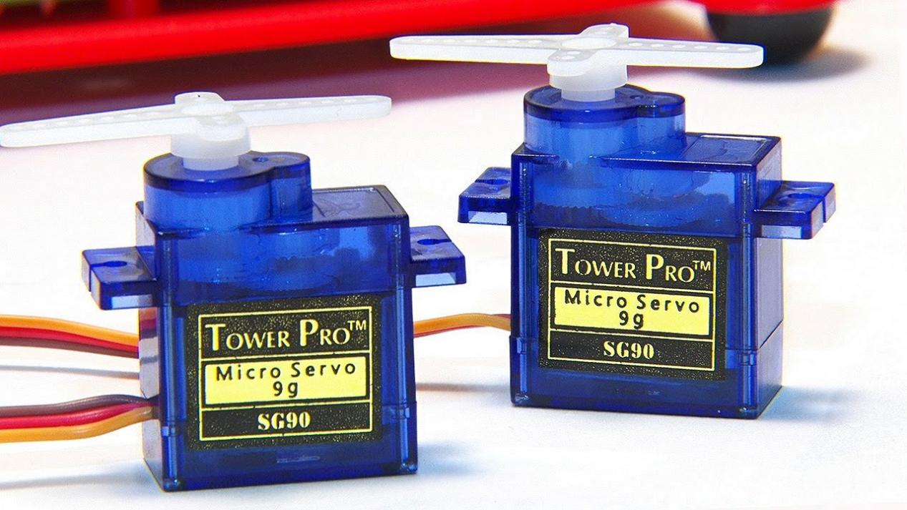
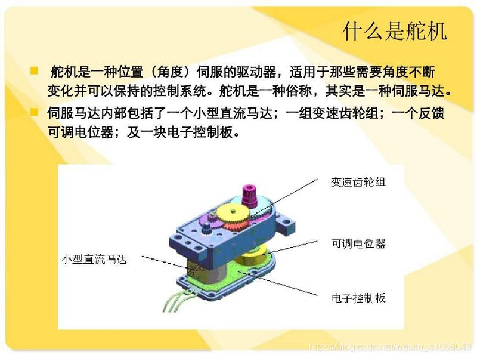
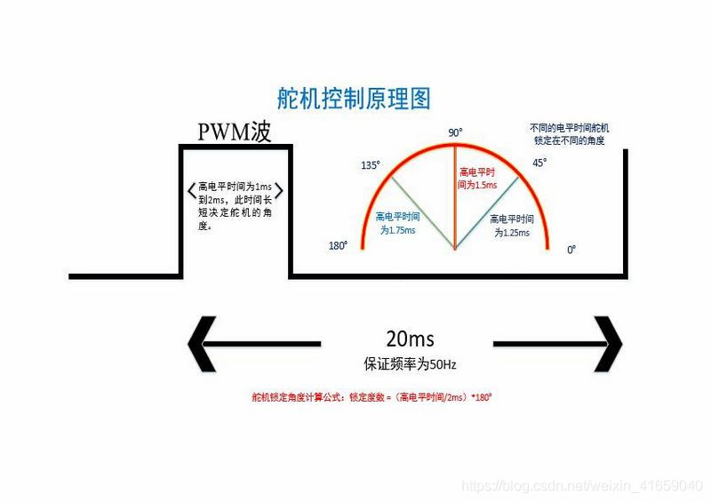
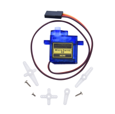
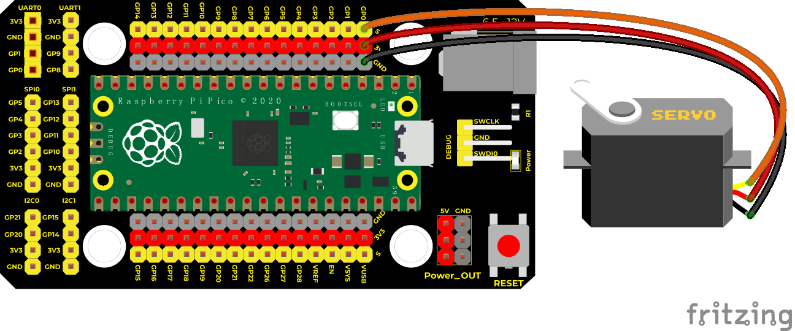
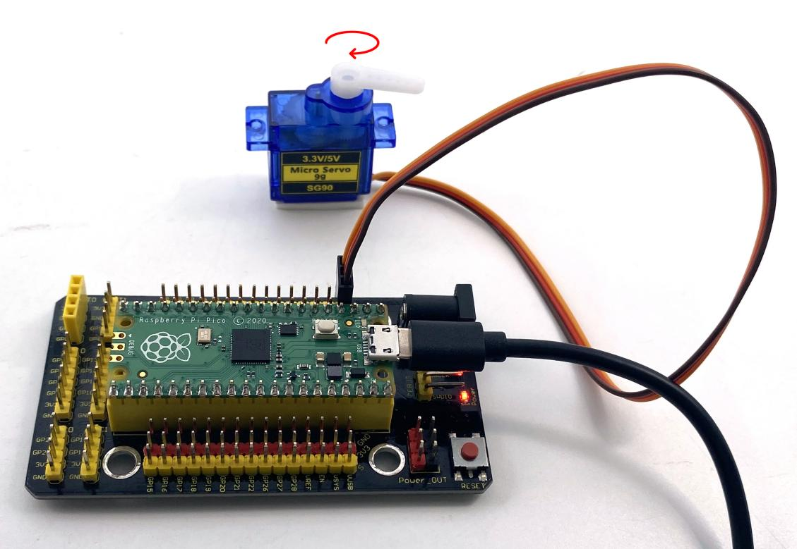

## 实验十九 舵机的控制原理

****

### 🌟 项目简介  
舵机（Servo Motor）是一种能**精确控制转动角度**的小型智能电机，常用于机器人、机械臂、智能小车等项目中。它不像普通电机那样只能“转”或“停”，而是可以“停在某个特定角度”，比如：0°、45°、90°、135°、180°……就像你的手臂能停在任意一个姿势一样！

我们用的这款舵机标称是90°舵机，但实际可稳定控制在接近180°范围内，非常适合初学者动手实践。

---

### ⚙️ 工作原理  
舵机内部有马达、齿轮组和角度传感器（电位器），它通过接收**PWM（脉冲宽度调制）信号**来判断该转到哪个角度：

- ✅ **标准信号周期 = 20ms（即频率 = 50Hz）**  
- ✅ **脉冲宽度（高电平持续时间）决定角度**：
  - `0.5ms` → 约 0°  
  - `1.5ms` → 约 90°（中位）  
  - `2.5ms` → 约 180°  

> 💡 小知识：Pi Pico 的 PWM 输出范围是 0–65535（16位），所以 1.5ms 对应约 `7.5% × 65535 ≈ 4915`，这就是为什么代码里常用 `4915` 表示90°！






舵机分为多种类型：  
🔹 **180°舵机**：最常用，角度范围约 0°~180°（本课使用）  
🔹 **360°连续旋转舵机**：没有角度限制，像普通电机一样可正反转（需特殊信号）  
🔹 **90°舵机**：物理限位更小，但本款实测支持近180°，放心使用！

---

### 🧰 所需材料  

|  |  |  |  |
|--------------------------------------------------------------------------|------------------------------------------------------------------|-----------------------------------------------------|------------------------------------------------------|
| Raspberry Pi Pico 主控板 ×1                                              | KS3017 Pico 扩展板 ×1（带面包板，方便接线）                      | SG90 或类似微型伺服舵机 ×1                          | Micro USB 数据线 ×1（用于供电与编程）              |

> ✅ 提示：舵机三根线颜色可能略有不同，请认准功能——  
> 🔹 **棕色（或黑色）→ GND（接地）**  
> 🔹 **红色（或橙色）→ VCC（5V电源）**  
> 🔹 **黄色（或白色/橙色）→ Signal（信号线，接Pico GPIO）**

---

### 🔌 接线说明  

****

| 舵机引脚 | 连接到         | 说明                     |
|----------|------------------|--------------------------|
| 棕色（GND） | Pico GND 引脚     | 可接扩展板任意黑色GND孔   |
| 红色（VCC） | 扩展板 5V 输出口  | ⚠️ 务必接 **5V**！Pico 的3.3V无法驱动舵机 |
| 黄色（Signal） | Pico GP0（引脚1） | 本课使用 GPIO 0 控制舵机 |

> ✅ 安全提醒：  
> - 舵机启动瞬间电流较大，**不建议直接用Pico的3.3V或USB口供电**；  
> - 使用扩展板的 **5V稳压输出**（由USB供电经稳压芯片提供），更安全可靠；  
> - 若舵机抖动/无力/发热，请立即断电检查接线是否正确！

---

### 💻 示例代码（MicroPython）

#### ▶️ 代码1：三点定位演示（0° → 90° → 180° 循环）

```python
# Keyes Starter Kit for Raspberry Pi Pico
# 实验19.1：舵机三点角度演示
from machine import Pin, PWM
import time

# 初始化PWM引脚（GP0）
pwm = PWM(Pin(0))
pwm.freq(50)  # 设置频率为50Hz（周期20ms）

# 预设角度对应的占空比值（16位精度：0~65535）
angle_0   = 1638   # 约0°（0.5ms）
angle_90  = 4915   # 约90°（1.5ms）
angle_180 = 8192   # 约180°（2.5ms）

while True:
    pwm.duty_u16(angle_0)
    time.sleep(1)
    
    pwm.duty_u16(angle_90)
    time.sleep(1)
    
    pwm.duty_u16(angle_180)
    time.sleep(1)
```

#### ▶️ 代码2：平滑扫描演示（0° ↔ 180° 连续转动）

```python
# Keyes Starter Kit for Raspberry Pi Pico
# 实验19.2：舵机角度平滑扫描
from utime import sleep
from machine import Pin, PWM

# 初始化PWM（GP0）
pwm = PWM(Pin(0))
pwm.freq(50)  # 20ms周期，50Hz

# 将角度0~180映射为占空比1000~9000（留出余量，避免超限抖动）
def convert(x, i_min, i_max, o_min, o_max):
    # x：输入角度；i_min/i_max：角度范围；o_min/o_max：占空比范围
    return max(o_min, min(o_max, (x - i_min) * (o_max - o_min) // (i_max - i_min) + o_min))

def set_angle(degree):
    pos = convert(degree, 0, 180, 1000, 9000)
    pwm.duty_u16(pos)
    sleep(0.01)  # 给舵机一点响应时间

while True:
    # 从0°慢慢转到180°
    for d in range(0, 181, 1):
        set_angle(d)
        sleep(0.01)  # 每步延时10ms，总耗时约1.8秒
    
    # 从180°慢慢转回0°
    for d in range(180, -1, -1):
        set_angle(d)
        sleep(0.01)
```

---

### 📝 代码解析  

✅ **为什么用 `duty_u16()`？**  
Pi Pico 的 PWM 占空比用 16 位整数表示（0 ~ 65535），`duty_u16(4915)` 表示高电平占整个周期的 `4915 / 65535 ≈ 7.5%`，对应 1.5ms 脉宽 → 90°。

✅ **为什么映射范围是 1000~9000？**  
不同品牌舵机存在个体差异，直接用理论值（1638~8192）可能导致卡顿或超限。扩大为 1000~9000 更稳妥，兼顾起始与极限位置。

✅ **`convert()` 函数的作用？**  
这是一个「比例换算器」：把角度（0~180）自动变成合适的占空比（1000~9000），不用手动查表，让代码更清晰、更易修改！

---

### 🌈 实验现象  

✅ **运行代码1后**：舵机会清晰地在三个位置之间切换——  
➡️ 先停在最左边（0°）→ 等1秒 → 转到中间（90°）→ 等1秒 → 转到最右边（180°）→ 等1秒 → 循环  

✅ **运行代码2后**：舵机会像钟摆一样，**匀速、安静、平稳地从左扫到右，再从右扫回左**，全程无抖动、无停顿，非常直观地展现“角度可控”的魅力！


---

### ⚠️ 注意事项（请务必阅读！）

1. **接线别反！**  
   🔌 棕（GND）、红（5V）、黄（Signal）顺序不能错；接反可能烧毁舵机或Pico！

2. **首次上电先测试角度范围**  
   建议先运行代码1，观察舵机是否真的能转到两端。若某端卡住，微调 `angle_0` 或 `angle_180` 的数值（如改为 1200 / 8500）。

3. **避免长时间堵转**  
   如果舵机被外力强行卡住还持续发信号，会发热甚至烧坏。实验中请勿用手硬掰舵机臂！

4. **信号线远离干扰源**  
   尽量让舵机信号线（黄色）远离电机、USB线等大电流线路，减少误动作。




---

### 🧠 扩展思维  
在本课舵机平滑扫描的基础上，如果想让舵机**按音乐节奏左右摆动**（比如检测声音强度后转动），你觉得第一步该做什么？