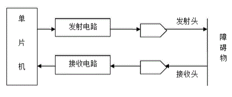
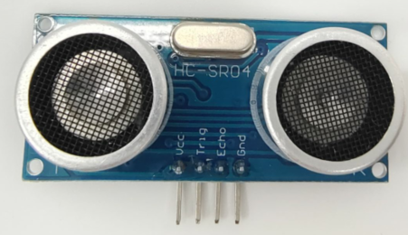
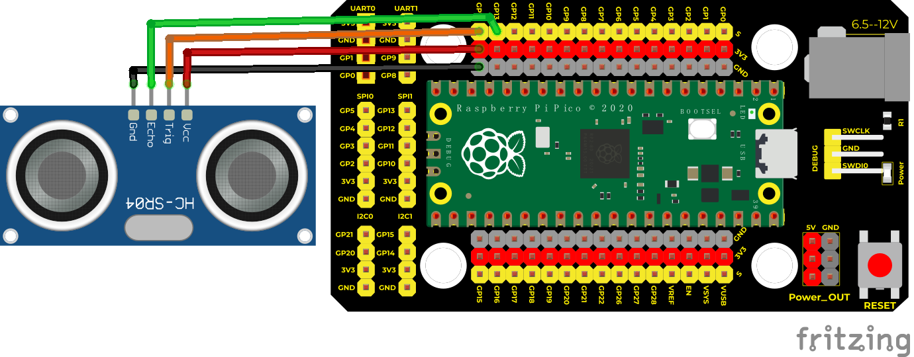
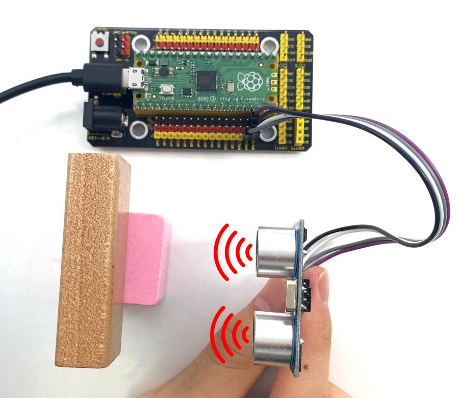
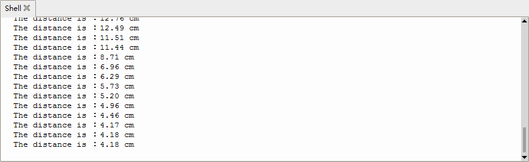

## 实验二十 超声波传感器的原理


你有没有观察过蝙蝠在黑夜中飞行？它们从不撞到树枝或墙壁，就像有“隐形眼睛”一样！其实，蝙蝠用的是**超声波回声定位**——它发出人耳听不见的高频声音（>20000 Hz），声音碰到物体后反弹回来，蝙蝠靠“听回声”的时间差，就能立刻判断出前方有什么、有多远、甚至是不是在动！

超声波就像看不见的“声音尺子”：方向准、穿透力强、能量集中，在医学（B超）、工业（清洗零件）、汽车（倒车雷达）中都大显身手。我们今天就用一块小小的HC-SR04模块，亲手造一把属于自己的“声音尺子”！

---

### 🔍 实验说明  
本实验使用Keyes HC-SR04超声波传感器，模拟蝙蝠的本领：  
✅ 自动发射40 kHz超声波（人耳完全听不到）  
✅ 检测前方是否有障碍物  
✅ 精确测量距离（2 cm ～ 400 cm，误差仅约3 mm）  
✅ 将结果实时显示在电脑屏幕上（单位：厘米）

---

### ⚙️ 实验原理：回声测距法  

就像对着山谷大喊一声、听回声算距离一样，HC-SR04也用“发射→等待→接收→计时”的方式工作：

1. **触发（TRIG引脚）**：给它一个“开始测距”的信号——持续**至少10微秒的高电平**；  
2. **自动发射**：模块立刻发出8个40 kHz超声波脉冲；  
3. **等待回声**：如果前方有障碍物，声波会反弹回来；  
4. **接收（ECHO引脚）**：模块收到回声后，ECHO引脚会**输出一个高电平脉冲**，**这个高电平持续的时间 = 声波来回一趟所用的时间**；  
5. **计算距离**：  
　　声速 ≈ 343.2 m/s（20℃室温）→ 即 **0.0343 厘米/微秒**  
　　单程距离 = （来回时间 × 声速）÷ 2  
　　所以：`距离（cm）= （ECHO高电平时间 us）× 0.0343 ÷ 2`



> 💡 小提示：公式里的 `0.0343` 是把343.2 m/s换算成“厘米/微秒”得到的（343.2 × 100 ÷ 1,000,000 = 0.03432），更精确哦！

---

### 🧰 实验器材  

|  |  |  |  |  |
|--------------------------------------------------------------------------|------------------------------------------------------------------|-------------------------------------------------|------------------------------------------------------|------------------------------------------------------|
| Raspberry Pi Pico板 ×1                                                   | Raspberry Pi Pico扩展板 ×1                                       | Keyes HC-SR04超声波模块 ×1                      | 杜邦线（4Pin，含公对母/母对母）×1                    | Micro USB数据线 ×1                                   |

> ⚠️ 注意：套件中标注为“SR01”的模块实为常见型号 **HC-SR04**（功能与接线完全一致），请放心使用。

---

### 🔌 接线图  

  

✅ 正确接线方式（Pico引脚编号以物理引脚为准）：  
| HC-SR04 引脚 | 连接到 Pico 引脚 | 作用         |  
|--------------|------------------|--------------|  
| VCC          | VSYS 或 5V（扩展板标“5V”） | 供电（5V）     |  
| GND          | GND              | 接地          |  
| TRIG         | GP14（物理引脚19） | 发送触发信号    |  
| ECHO         | GP13（物理引脚17） | 接收回声信号    |  

> ✅ 小贴士：ECHO引脚输出的是**3.3V逻辑电平**，Pico可直接识别，无需电平转换！

---

### 💻 测试代码（MicroPython）

```python
# Keyes Starter Kit for Raspberry Pi Pico
# 课程 20: Ultrasonic Distance Sensor
from machine import Pin
import utime

# 定义超声波测距函数（返回单位：厘米）
def getDistance(trigger, echo):
    # 步骤1：发送10微秒高电平触发信号
    trigger.low()        # 先拉低，确保信号干净
    utime.sleep_us(2)
    trigger.high()       # 拉高
    utime.sleep_us(10)   # 保持10微秒
    trigger.low()        # 再拉低，完成触发
    
    # 步骤2：等待ECHO引脚变为高电平（表示开始接收回声）
    while echo.value() == 0:
        start = utime.ticks_us()  # 记录回声到达时刻（起始时间）
    
    # 步骤3：等待ECHO变回低电平（表示回声结束）
    while echo.value() == 1:
        end = utime.ticks_us()    # 记录回声结束时刻
    
    # 步骤4：计算时间差，换算为距离（cm）
    # 声速 = 343.2 m/s = 0.03432 cm/us，来回距离需除以2
    duration = end - start
    distance = duration * 0.0343 / 2
    return distance

# 初始化引脚
trigger = Pin(14, Pin.OUT)  # GP14 → TRIG
echo = Pin(13, Pin.IN)      # GP13 → ECHO

# 主循环：每0.1秒测一次距离，并打印
while True:
    distance = getDistance(trigger, echo)
    print("The distance is ：{:.2f} cm".format(distance))
    utime.sleep(0.1)
```

---

### 📝 代码解析  

| 代码片段 | 说明 |
|----------|------|
| `trigger.low()` → `sleep_us(2)` → `trigger.high()` → `sleep_us(10)` → `trigger.low()` | 发出标准10μs高电平触发脉冲，是HC-SR04启动测距的“口令” |
| `while echo.value() == 0:` 和 `while echo.value() == 1:` | 利用Pico的`utime.ticks_us()`精准捕获ECHO引脚的**上升沿**和**下降沿**，避免延时误差 |
| `duration * 0.0343 / 2` | 把微秒级时间换算成厘米距离，数值经过校准，实测更稳定 |
| `print("... {:.2f} cm")` | `{:.2f}` 表示保留两位小数，让结果显示更清晰美观 |

> ✅ 运行前请确认：  
> - Pico已通过USB线连接电脑并成功识别为串口设备  
> - 已使用Thonny或Mu等工具将代码上传并运行  
> - 打开下方Shell窗口，即可看到实时刷新的距离数值！

---

### 📊 测试结果  

运行程序后，Shell窗口将不断刷新显示当前距离，例如：  
```
The distance is ：15.32 cm  
The distance is ：14.87 cm  
The distance is ：12.05 cm  
```  
当你用手靠近或远离传感器时，数值会灵敏变化！  
如下图所示：  

  



---

### ⚠️ 注意事项  

- ✅ **供电稳定最重要**：HC-SR04必须接**5V电源**（可用扩展板“5V”接口），不可接3.3V，否则可能无法正常发射超声波；  
- ✅ **避免金属/吸音表面干扰**：对着厚窗帘、毛绒玩具、软墙测量时，可能因回声太弱而读数不准或显示0；建议先用书本、手掌、桌面测试；  
- ✅ **最小有效距离为2 cm**：太近时发射波与反射波重叠，模块无法分辨，此时可能返回0或异常值；  
- ❌ **勿遮挡传感器正面两个圆形探头**（左边是发射器，右边是接收器），灰尘或胶带覆盖会影响性能；  
- 🔁 若数值频繁跳变或显示负数/极大值（如9999），请检查：  
　　▸ 接线是否松动（特别是ECHO是否接错引脚）  
　　▸ TRIG/ECHO是否接反（TRIG必须接输出引脚，ECHO必须接输入引脚）  
　　▸ 是否在强风、高温或高湿环境中测试（影响声速）

---

### 🧠 扩展思维  
在本课超声波测距的基础上，如果想让Pico根据距离远近控制LED亮度（比如：越近灯越亮），该怎样修改代码？