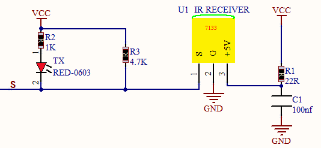
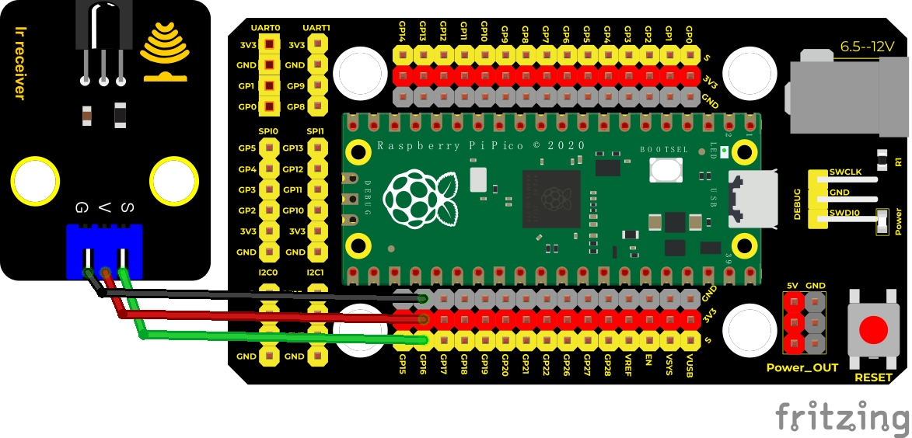
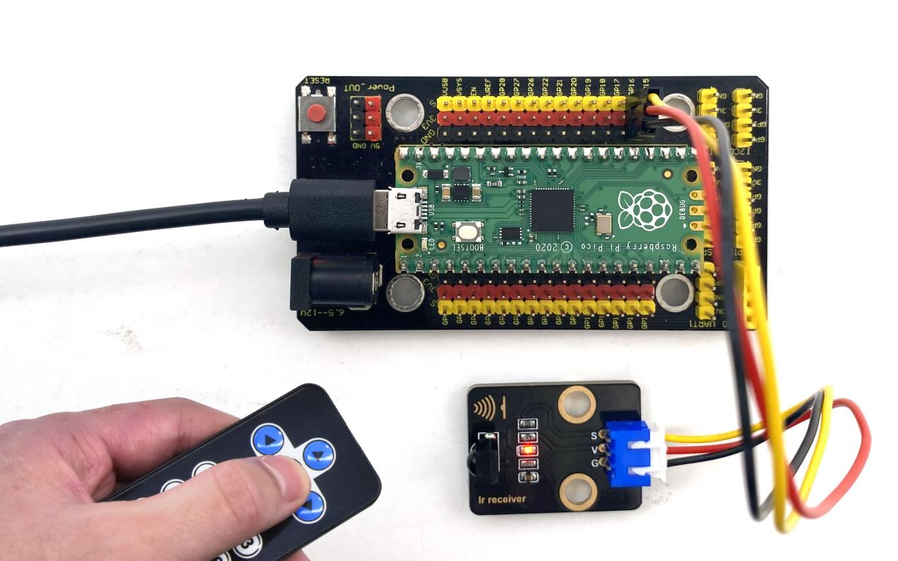
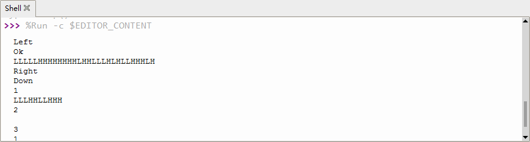

## 实验二十一 红外遥控与接收


### 🌟 项目简介  
红外遥控是我们每天都在用的“看不见的指令”——电视、空调、风扇甚至玩具，很多都靠它来控制！本实验带你亲手让 Raspberry Pi Pico “听懂”遥控器说的话。我们不用复杂电路，只用一个小小的红外接收模块（VS1838B），就能让Pico识别遥控器上每个按键（如“1”“2”“OK”“方向键”等），并在电脑屏幕上清楚显示出来。像给Pico装上了一双“红外耳朵”👂！

---

### ⚙️ 工作原理（小朋友也能懂！）  
红外遥控不是直接发“1”或“OK”，而是像打摩斯电码一样，把按键变成一串**快速闪烁的红外光**（人眼看不见哦）。这个光是用 **38kHz 的高频信号“托着”** 发出去的——就像快递员骑着快电动车（38kHz载波）把包裹（按键信息）送到你家。

我们的红外接收模块（VS1838B）已经内置了“解码小助手”，它自动过滤掉杂光、放大微弱信号、再把38kHz载波去掉，最后输出干净的**高低电平组合**（比如 `"LLLLLLLLHHHHHHHHLHHLHLLLHLLHLHHH"` 就代表数字“1”）。

> 💡 小知识：图中上拉电阻（4.7KΩ）的作用是——让没信号时引脚保持“高电平（H）”，一旦收到红外信号，引脚立刻变“低电平（L）”，这样Pico就能第一时间发现：“有新消息啦！”  



---

### 🧰 所需材料  

|  |  |  |  |  |  |
|--------------------------------------------------------------------------|------------------------------------------------------------------|-------------------------------------------------------|----------------------------------------------------------------------|------------------------------------------------------|-------------------------------------------------|
| Raspberry Pi Pico板 ×1                                                   | Raspberry Pi Pico扩展板 ×1                                       | Keyes 红外接收模块 ×1                                 | 防反插3Pin杜邦线 ×3                                                  | MicroUSB数据线 ×1                                    | 普通红外遥控器 ×1                               |

✅ **小提示**：遥控器电池仓里通常有一片白色绝缘塑料片，实验前一定要**拔掉它**，否则遥控器不会工作！

---

### 🔌 接线说明（超简单！）  

****  

| 红外接收模块 | Raspberry Pi Pico（引脚号） | 作用         |
|--------------|-----------------------------|--------------|
| GND（黑线）  | GND                         | 接地（供电回路） |
| VCC（红线）  | VSYS 或 3.3V（推荐 VSYS）    | 供电（4.5–5.5V更稳定） |
| OUT（黄线）  | GP16（即引脚16）             | 信号输入（Pico“听”的耳朵） |

📌 **重要提醒**：  
- VS1838B模块有方向！凸起的半圆弧面要**正对遥控器方向**（像小喇叭朝外）；  
- 如果接线后无反应，请检查：① 绝缘片是否已拔出？② 模块凸面是否正对遥控器？③ USB线是否为**数据线**（能传数据，不是仅充电线）？

---

### 💻 示例代码（MicroPython）  

```python
# Keyes Starter Kit for Raspberry Pi Pico
# 实验21：红外遥控接收
# 使用引脚GP16接收信号

import utime
from machine import Pin

# 定义红外接收引脚（GP16）
ird = Pin(16, Pin.IN)

# ✅ 遥控器按键编码字典（已适配常见Keyes遥控器）
# 每个字符串代表按下一个键时收到的“密码”
act = {
    "1": "LLLLLLLLHHHHHHHHLHHLHLLLHLLHLHHH",
    "2": "LLLLLLLLHHHHHHHHHLLHHLLLLHHLLHHH",
    "3": "LLLLLLLLHHHHHHHHHLHHLLLLLHLLHHHH",
    "4": "LLLLLLLLHHHHHHHHLLHHLLLLHHLLHHHH",
    "5": "LLLLLLLLHHHHHHHHLLLHHLLLHHHLLHHH",
    "6": "LLLLLLLLHHHHHHHHLHHHHLHLHLLLLHLH",
    "7": "LLLLLLLLHHHHHHHHLLLHLLLLHHHLHHHH",
    "8": "LLLLLLLLHHHHHHHHLLHHHLLLHHLLLHHH",
    "9": "LLLLLLLLHHHHHHHHLHLHHLHLHLHLLHLH",
    "0": "LLLLLLLLHHHHHHHHLHLLHLHLHLHHLHLH",
    "Up": "LLLLLLLLHHHHHHHHLHHLLLHLHLLHHHLH",
    "Down": "LLLLLLLLHHHHHHHHHLHLHLLLLHLHLHHH",
    "Left": "LLLLLLLLHHHHHHHHLLHLLLHLHHLHHHLH",
    "Right": "LLLLLLLLHHHHHHHHHHLLLLHLLLHHHHLH",
    "Ok": "LLLLLLLLHHHHHHHHLLLLLLHLHHHHHHLH",
    "*": "LLLLLLLLHHHHHHHHLHLLLLHLHLHHHHLH",
    "#": "LLLLLLLLHHHHHHHHLHLHLLHLHLHLHHLH"
}

def read_ircode(ird):
    """读取一次红外按键信号，返回按键名称（如'1'、'Ok'）或原始码"""
    wait = 1      # 等待信号开始（高→低跳变）
    complete = 0  # 标记是否接收完成
    seq0 = []     # 记录每次低电平持续时间（单位：微秒）
    seq1 = []     # 记录每次高电平持续时间（单位：微秒）

    # 步骤1：等待遥控器发出信号（引脚由高变低）
    while wait == 1:
        if ird.value() == 0:
            wait = 0

    # 步骤2：开始记录脉冲时长（38kHz调制信号的典型特征）
    while wait == 0 and complete == 0:
        start = utime.ticks_us()
        # 记录低电平时间
        while ird.value() == 0:
            ms1 = utime.ticks_us()
        diff_low = utime.ticks_diff(ms1, start)
        seq0.append(diff_low)

        # 记录高电平时间
        while ird.value() == 1 and complete == 0:
            ms2 = utime.ticks_us()
            diff_high = utime.ticks_diff(ms2, ms1)
            if diff_high > 10000:  # 长于10ms的高电平=本次信号结束
                complete = 1
            else:
                seq1.append(diff_high)

    # 步骤3：将时间序列转为“L/H”字符串（L=短脉冲，H=长脉冲）
    code = ""
    for val in seq1:
        if val < 700:      # <700μs → 短脉冲 → 记为 L（逻辑0）
            code += "L"
        elif val < 2000:   # 700~2000μs → 长脉冲 → 记为 H（逻辑1）
            code += "H"
        # 超过2000μs的忽略（一般是结束标志）

    # 步骤4：匹配按键（查字典）
    command = ""
    for key, value in act.items():
        if code == value:
            command = key
            break
    
    return command if command else code  # 匹配成功返回按键名，否则返回原始码

# 🔁 主循环：持续监听并打印结果
while True:
    cmd = read_ircode(ird)
    if cmd:  # 只有收到有效信号才打印（避免空行）
        print("🎯 收到指令：", cmd)
    utime.sleep(0.5)  # 防止重复触发（两次按键间隔至少0.5秒）
```

---

### 📖 代码解析（逐行看懂）  

- `ird = Pin(16, Pin.IN)`：告诉Pico，“GP16这根针是我的‘耳朵’，专门听红外信号”。  
- `act = {...}`：这是遥控器的“密码本”——每个按键对应一串独特的“L/H”组合，就像每个人的指纹。  
- `read_ircode()` 函数分四步：  
  ① **等信号**：一直等到引脚从高电平（H）突然变低（L），说明遥控器开始发射；  
  ② **记节奏**：精确测量每一次“亮（H）”和“灭（L）”的时间（单位：微秒）；  
  ③ **转密码**：把时间长短翻译成“L”（短）和“H”（长），拼成一串密码；  
  ④ **查字典**：拿这串密码去 `act` 字典里找，找到就返回按键名（如 `"1"`），找不到就返回原始密码。  
- `utime.sleep(0.5)`：防止按住一个键时连续打印多行——加个小暂停，体验更清爽！

---

### 📱 实验现象  

✅ 正确接线并运行程序后：  
- 打开 Thonny 或串口监视器（波特率115200），看到空白界面；  
- 拿起遥控器，**对准红外接收头（凸面朝前）**，按下任意键（如“1”）；  
- 屏幕立刻显示：`🎯 收到指令： 1`；  
- 再按“OK”，显示：`🎯 收到指令： Ok`；  
- 模块上的小LED会同步**快速闪烁**，表示正在接收信号👇  





---

### ⚠️ 注意事项（安全又成功！）  

1. **遥控器必须“激活”**：检查电池是否有电，**拔掉电池仓白色绝缘片**；  
2. **对准再按**：红外光是直线传播，遥控器前端（发光二极管）要正对模块凸面，距离建议10–30cm；  
3. **环境干扰**：避开阳光直射、白炽灯、荧光灯——它们会发出干扰红外光；  
4. **接线别反**：GND（黑）、VCC（红）、OUT（黄）三色线务必对应，接反可能烧坏模块；  
5. **首次失败？别急！**  
   - 先在串口监视器里按遥控器，看是否打印出一长串 `"L"` 和 `"H"`（说明硬件正常，只是没匹配上）；  
   - 如果完全没反应：检查USB线是否支持数据传输、Thonny是否选对端口、Pico是否运行最新MicroPython固件。

---

### 🧠 扩展思维  
在本课实现“按键识别并打印”的基础上，如果想让Pico**接收到“1”时点亮LED，“2”时熄灭LED**，该在代码的哪个位置添加控制语句？需要新增哪些硬件连接？