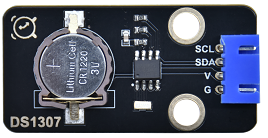
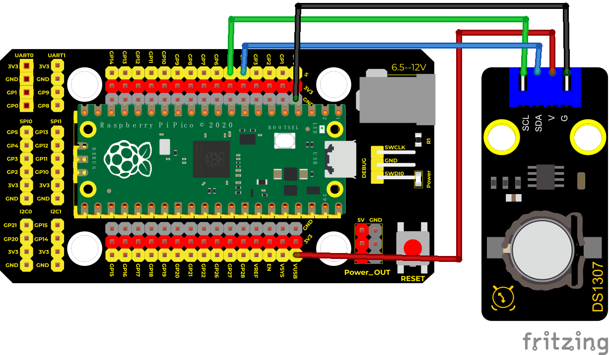
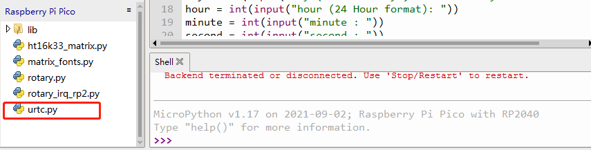
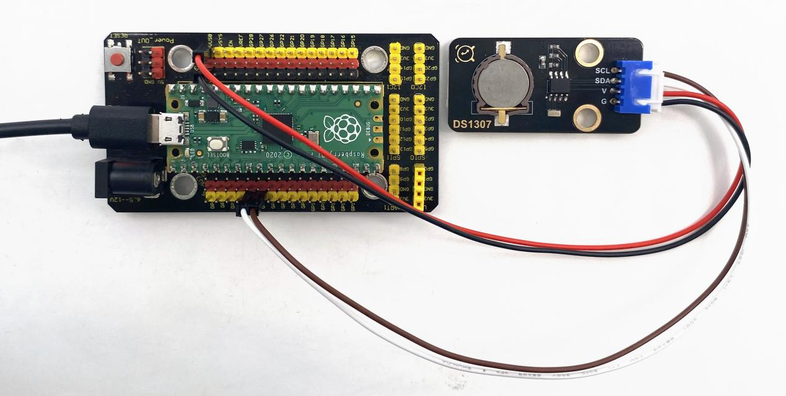
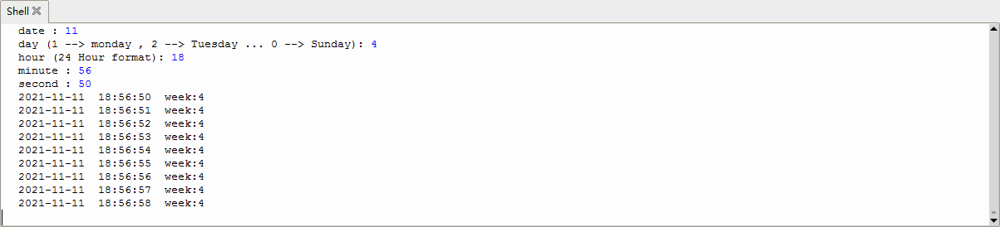

## 实验二十二 DS1307时钟模块

### 🌟 项目简介  
本实验带你认识并使用一款「会自己走时间」的小芯片——DS1307实时时钟模块。它就像一个迷你电子闹钟，即使你的树莓派Pico断电了，只要接上纽扣电池（比如CR2032），它也能悄悄地、准确地继续计时！我们用MicroPython读取它的年、月、日、时、分、秒和星期，并在电脑屏幕上实时显示出来。

---

### ⚙️ 工作原理（小朋友也能懂！）  
DS1307是一颗“很守时”的小芯片，它不靠Pico的主芯片来计时，而是靠自己内部的32.768kHz晶振（像钟表里的摆轮）+ 一颗小电池独立工作。  
✅ 它能自动算闰年（比如2024年2月有29天）  
✅ 断电也不丢时间（电池供电）  
✅ 还自带56字节“小记事本”（NVRAM），可以存点小数据  

它通过 **I²C通信**（两条线：SCL时钟线 + SDA数据线）和Pico“对话”，就像两个人手拉手传纸条一样简单可靠。

  

📌 **引脚小贴士（接线时看这里）：**  
- **SCL** → Pico 的 GP15（时钟线）  
- **SDA** → Pico 的 GP14（数据线）  
- **VCC** → 接 Pico 的 **VUSB（5V）** 或 **VSYS（可接5V或3.3V，推荐VUSB更稳）**  
- **GND** → 接 Pico 的 GND  
- **BAT** → 接纽扣电池（CR2032，正极朝上，模块背面有标注）  
⚠️ 注意：模块上的 X1/X2 是给晶振用的，已焊好，你不用动！

---

### 🧰 所需材料  
|  |  |  |  |  |
|--------------------------------------------------------------------------|------------------------------------------------------------------|---------------------------------------------------|----------------------------------------------------------------------|------------------------------------------------------|
| Raspberry Pi Pico板 ×1                                                   | Raspberry Pi Pico扩展板 ×1                                       | Keyes DS1307实时时钟模块 ×1                       | 防反插4Pin杜邦线（母对母）×4                                          | Micro USB数据线 ×1                                 |

💡 小提示：用扩展板接线更整齐、更不容易插错哦！

---

### 🔌 接线图  
****  
✅ 按图连接即可（SCL→GP15，SDA→GP14，VCC→VUSB，GND→GND）  
✅ 模块背面电池座请装入一颗 **CR2032纽扣电池**（+号朝上）  
✅ VUSB是Pico通过USB线从电脑获得的5V电源，比3.3V更稳定，推荐使用！

> 📌 为什么接VUSB不接3.3V？  
> 因为DS1307模块设计工作电压是5V（部分兼容3.3V），接VUSB更保险，避免因电压不足导致时间不准或通信失败。

---

### 💻 示例代码（MicroPython）  

```python
# Keyes Starter Kit for Raspberry Pi Pico
# 实验二十二：DS1307实时时钟模块

from machine import I2C, Pin
from urtc import DS1307
import utime

# 初始化I2C总线（使用I2C通道1，SCL=GP15，SDA=GP14）
i2c = I2C(1, scl=Pin(15), sda=Pin(14), freq=400000)

# 创建DS1307对象
rtc = DS1307(i2c)

# 【首次使用】请手动设置一次当前时间（运行后按提示输入）
print("🔧 正在设置初始时间，请按提示输入：")
year = int(input("请输入年份（例如：2025）: "))
month = int(input("请输入月份（1-12）: "))
date = int(input("请输入日期（1-31）: "))
# 星期：0=星期日，1=星期一，2=星期二……6=星期六
day = int(input("请输入星期（0=周日，1=周一…6=周六）: "))
hour = int(input("请输入小时（24小时制，0-23）: "))
minute = int(input("请输入分钟（0-59）: "))
second = int(input("请输入秒钟（0-59）: "))

# 把输入的时间打包成元组（年,月,日,星期,时,分,秒,毫秒）
now = (year, month, date, day, hour, minute, second, 0)
rtc.datetime(now)  # 写入DS1307芯片

print("✅ 时间设置成功！开始读取实时时间……\n")

# 主循环：每秒读取并打印一次时间
while True:
    # 读取当前时间（返回元组：(年,月,日,星期,时,分,秒,毫秒)）
    dt = rtc.datetime()
    
    # 格式化输出：年-月-日 时:分:秒 星期X
    print(f"{dt[0]}-{dt[1]:02d}-{dt[2]:02d} {dt[4]:02d}:{dt[5]:02d}:{dt[6]:02d} 星期{['日','一','二','三','四','五','六'][dt[3]]}")
    
    utime.sleep(1)  # 等待1秒，再刷新
```

---

### 📖 代码解析（一看就懂）  
- `from urtc import DS1307`：导入DS1307专用驱动库（需提前将 `urtc.py` 文件复制到Pico中）  
- `i2c = I2C(1, ...)`：告诉Pico用第1组I2C接口，SCL连GP15、SDA连GP14  
- `rtc.datetime(...)`：  
  - ✅ **写时间**：传入 `(年,月,日,星期,时,分,秒,毫秒)` 元组，设置初始时间  
  - ✅ **读时间**：调用 `rtc.datetime()` 不带参数，返回当前时间元组  
- `dt[0]` 是年份，`dt[1]` 是月份……`dt[3]` 是星期（0=周日），`dt[4]` 是小时，以此类推  
- `f"{dt[1]:02d}"` 表示“两位数字显示”，比如 `3` 变成 `03`，更美观  

  
*这是 `urtc.py` 库文件在Thonny中成功导入的样子（你不需要自己写这个文件，下载Keyes配套资料包就有）*

---

### 📺 实验现象  
运行代码后：  
1. 首先出现提示，让你输入年、月、日、星期、时、分、秒（只需设一次）  
2. 设置完成后，屏幕开始**每秒刷新一行时间**，格式如：  
   ```
   2025-04-05 14:23:01 星期六
   2025-04-05 14:23:02 星期六
   2025-04-05 14:23:03 星期六
   ……
   ```
3. 拔掉USB线 → 重新插上 → 时间依然连续走！（因为电池在默默工作 ✅）

  
  
*实际运行效果截图：时间精准跳动，星期自动对应*

---

### ⚠️ 注意事项（安全又成功！）  
- 🔋 务必装入 **CR2032纽扣电池**（新电池最佳），否则断电后时间归零！  
- 🪄 `urtc.py` 文件必须提前上传到Pico根目录（不会传？用Thonny → Device → “Upload file…”）  
- 🔌 接线前务必断开USB！接好再通电，避免短路  
- ❌ 不要将VCC接到Pico的3.3V引脚（部分DS1307模块5V兼容性更好，VUSB更稳妥）  
- 🕵️‍♂️ 如果屏幕没反应或报错 `OSError: [Errno 19] ENODEV`：  
  → 检查SCL/SDA是否接反（SCL一定接GP15！SDA一定接GP14！）  
  → 检查I2C地址是否正确（DS1307默认地址是0x68，`urtc`库已内置，无需修改）  

---

### 🧠 扩展思维  
如果想让DS1307的时间在Pico的LED灯上用闪烁次数表示“小时”和“分钟”，比如亮1次代表1点、亮5次代表5点，该怎样修改代码？