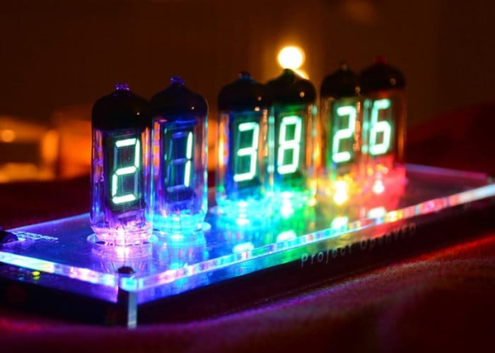
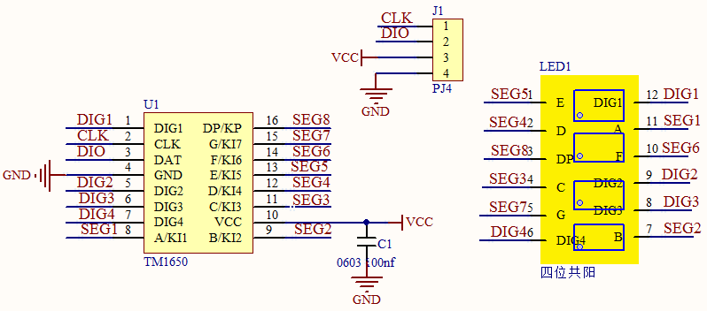
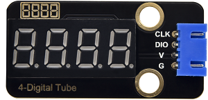
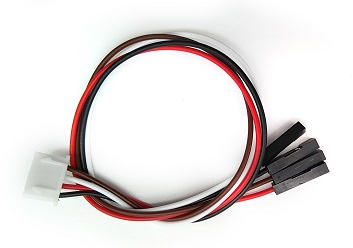
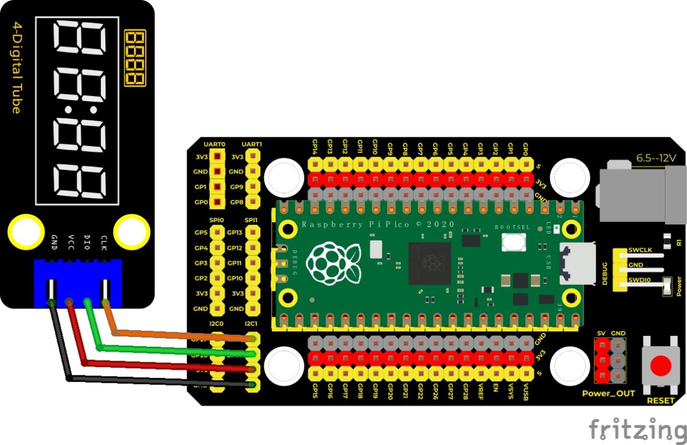
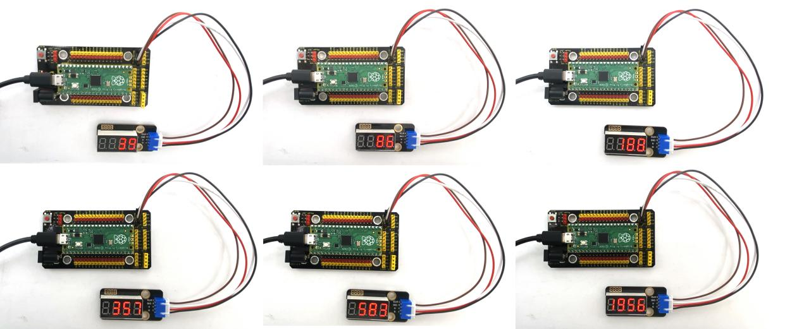

## 实验二十三 TM1650四位数码管模块

****

### 🌟 项目简介  
本实验带你用 Raspberry Pi Pico 控制 Keyes TM1650 四位数码管模块，实现从 `0` 到 `9999` 的自动计数显示。数码管每 0.01 秒（10 毫秒）加 1，循环滚动，直观展现数字变化过程。TM1650 是一款高度集成的 LED 驱动芯片，仅需 **2 根信号线（CLK 和 DIO）** 即可控制 4 位数码管，不占用 I²C 总线，也不需要额外的限流电阻，非常适合初学者快速上手。

> 💡 小知识：TM1650 的通信协议 *类似* I²C，但**不是标准 I²C**——它没有地址应答（ACK）时序中的“释放SDA”动作，而是靠主控主动拉低/释放来模拟，因此我们使用 **bit-banging（位操作）方式** 手动模拟时序，更稳定、更可控。

---

### ⚙️ 工作原理  

TM1650 内部集成了驱动电路、数据锁存器和键盘扫描功能，本实验只使用其 **LED 显示功能**。  
通信采用 **双线串行协议**（CLK 时钟线 + DIO 数据线），通过特定指令控制：

- **起始信号（START）**：DIO 从高→低，CLK 保持高电平  
- **停止信号（STOP）**：DIO 从低→高，CLK 保持高电平  
- **字节发送**：高位在前，每发 1 位，CLK 先拉低 → 等待 → 拉高 → 等待  
- **命令地址 `0x48`**：表示接下来要写入的是「显示控制命令」（不是按键读取）  
- **显示命令字节格式**（1 字节）：  
  `B B B D 0 0 0 E`  
  - `B B B`（bit6~bit4）：亮度等级（000=最亮，111=最暗）  
  - `D`（bit3）：小数点开关（1=点亮该位小数点）  
  - `E`（bit0）：显示使能（1=开启显示，0=关闭）  

  
**数据命令设置：`0x48`（告诉芯片：“我要控制数码管显示！”）**

****  
**显示命令设置详解（1 字节）：**  
- bit6~bit4：亮度（000 最亮 → 111 最暗）  
- bit3：小数点（1 = 亮）  
- bit0：显示开关（1 = 开）

---

### 🧰 所需材料  

|  |  |  |  |  |
|--------------------------------------------------------------------------|------------------------------------------------------------------|-------------------------------------------------------|----------------------------------------------------------------------|------------------------------------------------------|
| Raspberry Pi Pico 主板 ×1                                               | Keyes Pico 扩展板 ×1（带防反插接口，接线更安全）                  | Keyes TM1650 四位数码管模块 ×1                         | 防反插 4Pin 杜邦线（含红/黑/黄/蓝）×1                                 | Micro USB 数据线 ×1（用于供电+下载程序）            |

✅ 提示：模块背面已标注引脚——  
- `VCC` → 接 3.3V（⚠️ 不要接 5V！Pico IO 口耐压仅 3.3V）  
- `GND` → 接 GND  
- `CLK` → 接 GP15（默认，可改）  
- `DIO` → 接 GP14（默认，可改）

---

### 🔌 接线图  

****  

📌 **正确接线口诀（请对照图检查）：**  
- TM1650 `VCC` → 扩展板 `3V3`（或 Pico 的 `VSYS` 也可，但推荐 `3V3`）  
- TM1650 `GND` → 扩展板 `GND`  
- TM1650 `CLK` → 扩展板 `GP15`（即 Pico 的第 20 脚）  
- TM1650 `DIO` → 扩展板 `GP14`（即 Pico 的第 19 脚）  

> ✅ 安全提醒：  
> - Pico 的 GPIO 口最大输出电流约 12mA，TM1650 模块内部已集成限流电阻，**无需外接电阻**；  
> - 请务必确认 `VCC` 接的是 `3V3`，接错 `5V` 可能永久损坏 Pico！

---

### 💻 示例代码（MicroPython）

```python
# Keyes Starter Kit for Raspberry Pi Pico
# 课程 23: TM1650 Four-digit Digital Tube
# 作者：Keyes 教育团队｜适配 MicroPython v1.22+

from machine import Pin
import time

# === TM1650 寄存器地址定义 ===
ADDR_DIS = 0x48  # 显示模式命令地址
ADDR_KEY = 0x49  # 按键读取命令地址（本实验未使用）

# === 亮度等级（0~7，0=最亮，7=最暗）===
BRIGHT_DARKEST = 0
BRIGHT_TYPICAL = 2
BRIGHTEST = 7

# === 数码管段码表（共阳，0~9）===
# 顺序：a b c d e f g dp → 对应 0x3F 中的每一位
NUM = [0x3f, 0x06, 0x5b, 0x4f, 0x66, 0x6d, 0x7d, 0x07, 0x7f, 0x6f]

# === 位选地址（从左到右：千位→百位→十位→个位）===
# 注意：TM1650 规定：0x68=第4位（千位），0x6a=第3位（百位），0x6c=第2位（十位），0x6e=第1位（个位）
# 我们按「显示顺序」映射为 DIG[0]→千位，DIG[1]→百位…所以反向排列：
DIG = [0x6e, 0x6c, 0x6a, 0x68]  # DIG[0]=个位，DIG[1]=十位，DIG[2]=百位，DIG[3]=千位

# === 小数点状态（默认全关）===
DOT = [0, 0, 0, 0]  # DOT[0]对应个位小数点，依此类推

# === 引脚定义（可自由修改！）===
clkPin = 15  # CLK 接 GP15（物理引脚 20）
dioPin = 14  # DIO 接 GP14（物理引脚 19）

clk = Pin(clkPin, Pin.OUT, value=1)
dio = Pin(dioPin, Pin.OUT, value=1)

# === 全局显示命令字（初始：亮度=2，无小数点，显示开启）===
DisplayCommand = (BRIGHT_TYPICAL << 4) | 0x01  # bit6~4=010，bit0=1 → 0x21

# === 时序函数：发送1字节数据 ===
def writeByte(wr_data):
    global clk, dio
    for i in range(8):
        if wr_data & 0x80:
            dio.value(1)
        else:
            dio.value(0)
        clk.value(0)
        time.sleep_us(1)
        clk.value(1)
        time.sleep_us(1)
        clk.value(0)
        wr_data <<= 1

# === 起始信号 ===
def start():
    global clk, dio
    dio.value(1)
    clk.value(1)
    time.sleep_us(1)
    dio.value(0)
    time.sleep_us(1)

# === 应答信号（TM1650 拉低DIO表示收到）===
def ack():
    global clk, dio
    clk.value(0)
    time.sleep_us(1)
    dio = Pin(dioPin, Pin.IN)  # 切换为输入
    # 等待芯片拉低 DIO（最多等 5ms，防死锁）
    for _ in range(5000):
        if dio.value() == 0:
            break
        time.sleep_us(1)
    clk.value(1)
    time.sleep_us(1)
    clk.value(0)
    dio = Pin(dioPin, Pin.OUT, value=1)  # 切回输出

# === 停止信号 ===
def stop():
    global clk, dio
    dio.value(0)
    clk.value(1)
    time.sleep_us(1)
    dio.value(1)
    time.sleep_us(1)

# === 在指定位置显示单个数字（bit=1~4，num=0~9）===
def displayBit(bit, num):
    global ADDR_DIS, DisplayCommand, DIG, NUM, DOT
    if bit < 1 or bit > 4 or num < 0 or num > 9:
        return
    # 第一步：发送显示模式命令
    start()
    writeByte(ADDR_DIS)
    ack()
    writeByte(DisplayCommand)
    ack()
    stop()
    # 第二步：发送位选地址 + 段码
    start()
    writeByte(DIG[bit-1])  # bit-1 → 数组索引（1→0, 2→1...）
    ack()
    if DOT[bit-1]:
        writeByte(NUM[num] | 0x80)  # 加上小数点（dp位=bit7）
    else:
        writeByte(NUM[num])
    ack()
    stop()

# === 清除某一位显示（显示为全灭）===
def clearBit(bit):
    if bit < 1 or bit > 4:
        return
    start()
    writeByte(ADDR_DIS)
    ack()
    writeByte(DisplayCommand)
    ack()
    stop()
    start()
    writeByte(DIG[bit-1])
    ack()
    writeByte(0x00)  # 全灭
    ack()
    stop()

# === 设置亮度（0~7）===
def setBrightness(b=2):
    global DisplayCommand
    DisplayCommand = (DisplayCommand & 0x0f) | ((b & 0x07) << 4)

# === 设置小数点（bit=1~4，OnOff=0或1）===
def displayDot(bit, OnOff):
    if bit < 1 or bit > 4:
        return
    if OnOff:
        DOT[bit-1] = 1
    else:
        DOT[bit-1] = 0

# === 开启/关闭整个数码管显示 ===
def displayOnOFF(OnOff=1):
    global DisplayCommand
    if OnOff:
        DisplayCommand |= 0x01
    else:
        DisplayCommand &= 0xfe

# === 初始化数码管：设亮度、关小数点、开启显示、清屏 ===
def initDigitalTube():
    setBrightness(2)      # 中等亮度
    displayOnOFF(1)       # 开启显示
    for i in range(4):    # 清除全部4位
        clearBit(i+1)

# === 显示一个0~9999的整数（自动补零，如 7 → "0007"）===
def showNum(num):
    if num < 0:
        num = 0
    if num > 9999:
        num = 9999
    # 个位
    displayBit(1, num % 10)
    # 十位
    if num >= 10:
        displayBit(2, (num // 10) % 10)
    # 百位
    if num >= 100:
        displayBit(3, (num // 100) % 10)
    # 千位
    if num >= 1000:
        displayBit(4, num // 1000)

# === 主程序开始 ===
initDigitalTube()

while True:
    for i in range(0, 10000):
        showNum(i)
        time.sleep_ms(10)  # 每次显示10毫秒，实现0.01秒刷新
```

---

### 📝 代码解析（小学生也能懂！）

| 代码片段 | 说明 |
|----------|------|
| `NUM = [0x3f, 0x06, ...]` | 这是「数字形状密码表」：比如 `0x3f` 表示数字 `0` 的亮段（a~g 全亮），`0x06` 表示数字 `1`（只亮 b、c 段）……就像给每个数字发一张“灯亮清单”。 |
| `DIG = [0x6e, 0x6c, 0x6a, 0x68]` | 这是「位置密码表」：`0x6e`=个位，`0x6c`=十位……告诉芯片“我要在哪个位置贴哪张清单”。 |
| `displayBit(1, 5)` | 就像说：“请在**个位**（bit=1）显示数字 **5**！” |
| `showNum(123)` | 自动拆解成：个位=3、十位=2、百位=1、千位=0 → 分别调用 `displayBit()`，不用自己算！ |
| `time.sleep_ms(10)` | 让每个数字“停留”10 毫秒，人眼看起来就是流畅滚动（太快会闪烁，太慢像幻灯片）。 |

> ✅ 小技巧：想让数字变亮？把 `setBrightness(2)` 改成 `setBrightness(0)`；想关掉显示？加一行 `displayOnOFF(0)`。

---

### ✅ 实验现象  

接线无误、程序烧录成功后：  
✅ 上电瞬间，4 位数码管短暂全亮 → 快速清屏 → 开始从 `0000` 缓慢递增；  
✅ 每 0.01 秒跳 1 个数字（`0000` → `0001` → `0002` … `9999` → `0000` 循环）；  
✅ 若某位不亮，请检查 `DIG` 数组顺序、`NUM` 段码是否匹配共阳极、或 `VCC` 是否接对 3.3V。



---

### ⚠️ 注意事项（安全第一！）

- 🔌 **电源必须用 `3V3`！** TM1650 模块标称 3.3V～5.5V，但 Pico 的 GPIO 口只能承受 3.3V，若将模块 `VCC` 接到 `5V` 引脚，可能击穿 Pico！  
- 🧩 **模块方向别接反**：查看模块丝印，`VCC` 在左上角，`GND` 在右上角（与扩展板接口一致）；  
- 🐞 **常见问题排查**：  
  - 全黑？→ 检查 `VCC/GND` 是否接反、`displayOnOFF(1)` 是否执行、`DisplayCommand` 最低位是否为 1；  
  - 乱码？→ 检查 `NUM` 数组是否抄错、`DIG` 顺序是否与硬件位选匹配；  
  - 卡住不动？→ 检查 `CLK/DIO` 是否接错引脚，或 `time.sleep_ms(10)` 是否被误删。

---

### 🧠 扩展思维  
如果想让数码管显示当前时间（小时:分钟），而不是从 0 开始计数，你打算怎么修改 `showNum()` 和主循环？（提示：可用 `time.localtime()` 获取系统时间）