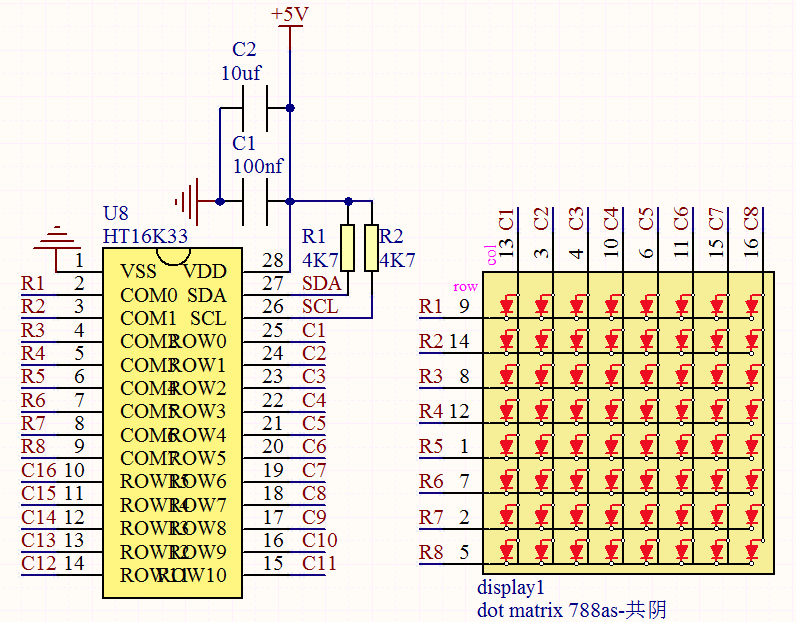
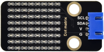
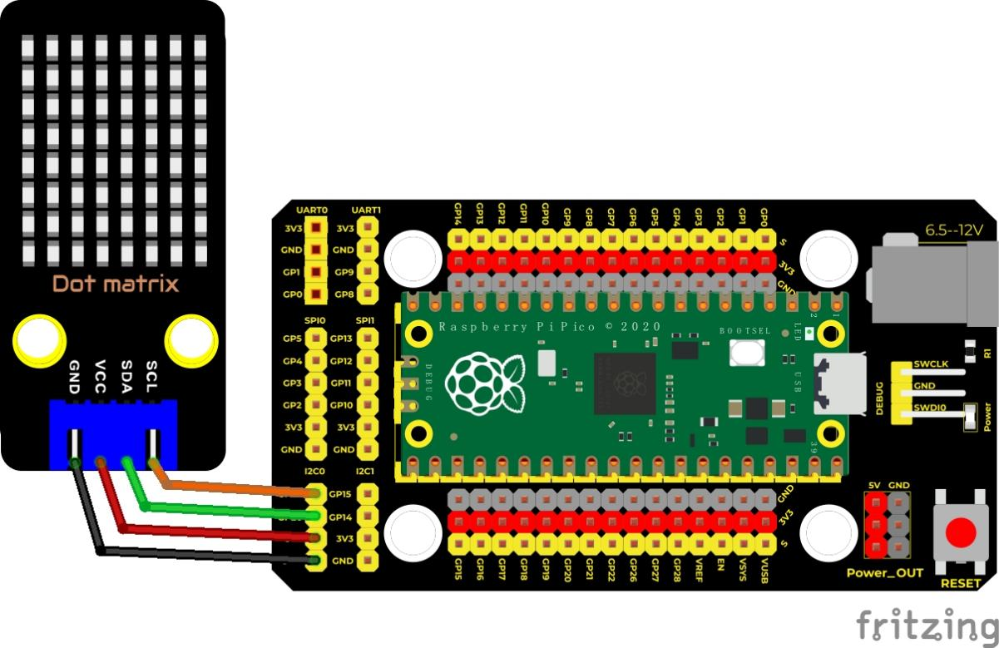
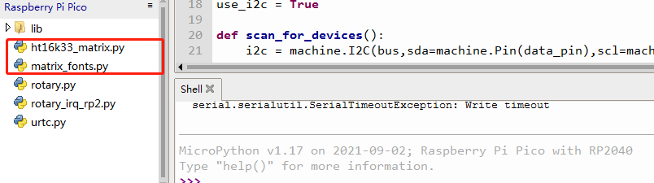
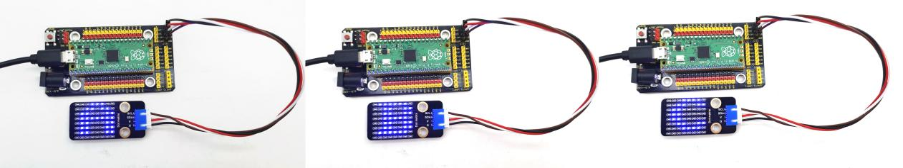

## 实验二十四 HT16K33_8X8点阵模块


### 🌟 项目简介  
你有没有想过：只用2个引脚，就能控制64个LED灯？这听起来像魔法，但HT16K33点阵模块就把它变成了现实！  
本课我们将使用一块小巧的8×8红色点阵屏（共64颗LED），通过I²C通信协议，让Raspberry Pi Pico轻松驱动它——不仅能显示单个字母（如A、B、C），还能滚动显示“Hello World”！整个过程只需连接2根信号线（SCL和SDA），再也不用为“IO口不够用”发愁啦！

---

### ⚙️ 工作原理（小朋友也能懂！）  
想象点阵是一张8行×8列的小方格纸，每个格子就是一个LED灯。要让某个灯亮起来，就像“按坐标找人”：  
✅ 给它所在的**行**通电（高电平）  
✅ 给它所在的**列**接地（低电平）  
→ 这个交叉点的LED就亮啦！

但如果直接用Pico的GPIO一个个控制，需要8+8=16个引脚……太浪费啦！  
💡 所以我们请来“小助手”——**HT16K33芯片**！它内置了驱动电路和内存，Pico只要通过**I²C总线（仅需SCL时钟线 + SDA数据线）** 发送几条指令，HT16K33就会自动帮我们点亮对应位置的灯。  
👉 就像你发微信给朋友：“请把第3行第5列的灯打开”，TA立刻照做——不用你动手接线！

> 🔍 小知识：I²C是一种“两线制”的通信方式，是电子世界里最常用的“对话语言”之一，很多传感器、屏幕都用它哦！

  
有些模块上自带3个拨码开关，可以让你随意拨动开关，这是用来设置I2C通信地址的。设置方法如下表格。我们的这个模块中，模块已经固定了通信地址，A0，A1，A2全部接地，即地址为0x70.

| A0（1）  | A1（2）  | A2（3）  | A0（1）  | A1（2）  | A2（3）  | A0（1）  | A1（2）  | A2（3）  |
|----------|----------|----------|----------|----------|----------|----------|----------|----------|
| 0（OFF） | 0（OFF） | 0（OFF） | 1（ON）  | 0（OFF） | 0（OFF） | 0（OFF） | 1（ON）  | 0（OFF） |
| OX70     | OX71     | OX72     |          |          |          |          |          |          |
| A0（1）  | A1（2）  | A2（3）  | A0（1）  | A1（2）  | A2（3）  | A0（1）  | A1（2）  | A2（3）  |
| 1（ON）  | 1（ON）  | 0（OFF） | 0（OFF） | 0（OFF） | 1（ON）  | 1（ON）  | 0（OFF） | 1（ON）  |
| OX73     | OX74     | OX75     |          |          |          |          |          |          |
| A0（1）  | A1（2）  | A2（3）  | A0（1）  | A1（2）  | A2（3）  |          |          |          |
| 0（OFF） | 1（ON）  | 1（ON）  | 1（ON）  | 1（ON）  | 1（ON）  |          |          |          |
| OX76     | OX77     |          |          |          |          |          |          |          |

---

### 🧰 所需材料  

|  |  |  |  |  |
|--------------------------------------------------------------------------|------------------------------------------------------------------|-------------------------------------------------------|----------------------------------------------------------------------|------------------------------------------------------|
| Raspberry Pi Pico板 ×1                                                   | Raspberry Pi Pico扩展板 ×1                                       | Keyes DIY积木 HT16K33_8X8点阵模块 ×1                 | 防反插4Pin杜邦线（母对母）×4                                         | Micro USB数据线 ×1                                   |

> ✅ 温馨提示：点阵模块背面有清晰丝印标注——  
> **VCC → 接5V或3.3V（本模块兼容）**  
> **GND → 接GND**  
> **SCL → 接Pico GP21（默认I²C0时钟）**  
> **SDA → 接Pico GP20（默认I²C0数据）**

---

### 🔌 接线图  

  

📌 **接线口诀（记住了就不会错！）**  
> “红对红（VCC），黑对黑（GND），  
> 时钟接21（SCL→GP21），数据接20（SDA→GP20）”

---

### 💻 示例代码（MicroPython版）

```python
# Keyes Starter Kit for Raspberry Pi Pico
# 课程24：HT16K33 8×8点阵模块
# 作者：Keyes创客教育团队

import machine
import time
import matrix_fonts
from ht16k33_matrix import ht16k33_matrix

#I²C配置（使用Pico默认I²C0：GP20=SDA，GP21=SCL）
clock_pin = 21   # SCL引脚号
data_pin  = 20   # SDA引脚号
i2c_bus   = 0    # 使用I²C总线0
i2c_addr  = 0x70 # 模块I²C地址（A0/A1/A2全接地）

#检查I²C设备是否连接成功
def scan_i2c():
    i2c = machine.I2C(i2c_bus, sda=machine.Pin(data_pin), scl=machine.Pin(clock_pin))
    devices = i2c.scan()
    if devices:
        print("找到I²C设备，地址为：")
        for addr in devices:
            print("   →", hex(addr))
    else:
        print("未检测到I²C设备，请检查接线！")

scan_i2c()  # 运行检测

# 初始化点阵屏
matrix = ht16k33_matrix(data_pin, clock_pin, i2c_bus, i2c_addr)

# 显示单个字符（传入字模数组即可）
def show_letter(letter):
    if letter in matrix_fonts.textFont1:
        matrix.show_char(matrix_fonts.textFont1[letter])
    else:
        print(f"字符 '{letter}' 暂不支持，请使用 A-Z 或数字")

# 滚动显示文字（支持任意字符串）
def scroll_text(font, text="Hello World", delay=0.05):
    # 前后加空格，让文字自然滑入滑出
    padded_text = " " + text + " "
    length = len(padded_text)
    
    for i in range(length - 1):
        # 取当前字符和下一个字符的字模
        left_char = font[padded_text[i]]
        right_char = font[padded_text[i + 1]]
        
        # 逐像素位移（0~7），实现平滑滚动
        for shift in range(8):
            frame = [0] * 8  # 创建8字节的显示帧（每字节=1列）
            for col in range(8):
                # 左字符左移shift位 + 右字符右移(8-shift)位 → 合成当前列
                frame[col] = (left_char[col] << shift) | (right_char[col] >> (8 - shift))
            
            matrix.show_char(frame)  # 显示这一帧
            time.sleep(delay)

#主程序：循环演示
while True:
    show_letter('A')
    time.sleep(1)
    
    show_letter('B')
    time.sleep(1)
    
    show_letter('C')
    time.sleep(1)
    
    scroll_text(matrix_fonts.textFont1, " Hello World ")
```

---

### 📚 代码解析（一看就懂！）

| 代码片段 | 说明 |
|----------|------|
| `import matrix_fonts` 和 `from ht16k33_matrix import ht16k33_matrix` | 导入两个关键文件：<br>• `matrix_fonts.py`：存着A~Z、0~9等字符的“像素图纸”（字模）<br>• `ht16k33_matrix.py`：封装了与HT16K33芯片通信的全部功能 |
| `scan_i2c()` 函数 | 自动扫描I²C总线上有哪些设备。如果看到 `0x70`，说明点阵模块已正确连接！否则请检查：线有没有松？正负极有没有接反？ |
| `show_letter('A')` | 调用字模库中字母A的8个字节数据（每字节代表一列LED的亮灭状态），发送给点阵屏显示 |
| `scroll_text(...)` | 把一句话拆成“两个相邻字符”，再通过“位移合成”技术，让画面像电影胶片一样一格格滚动，非常流畅！ |



---

### ✅ 实验现象  
接好线，烧录代码后，你会看到：  
🔹 先显示大写字母 **A**，持续1秒；  
🔹 然后变成 **B**，再1秒；  
🔹 再变成 **C**，再1秒；  
🔹 最后开始滚动显示 **" Hello World "** —— 文字从右往左平稳滑过整个8×8屏幕，循环不停！  
（就像老式火车站的电子显示屏～）



---

### ⚠️ 注意事项（安全又成功！）  
- ✅ **务必使用防反插4Pin线**：红（VCC）、黑（GND）、蓝（SCL）、黄（SDA）——颜色对应接线更不容易出错！  
- ✅ **VCC可接3.3V或5V**：本模块内部有稳压电路，两种电压都能正常工作（推荐先用3.3V测试）。  
- ❌ **不要将SCL/SDA接到其他引脚**：必须严格对应GP21（SCL）和GP20（SDA），否则I²C无法通信。  
- 🔋 **USB供电足够**：Pico通过MicroUSB供电时，可同时驱动点阵模块，无需额外电源。  
- 🐞 **常见问题排查**：  
  • 屏幕完全不亮 → 检查VCC/GND是否接反？USB线是否通电？  
  • 显示乱码或闪烁 → 检查SCL/SDA是否接错？I²C地址是否为0x70？  
  • 只显示一半 → 查看`matrix_fonts.textFont1`中该字符定义是否完整（8字节）？

---

### 🧠 扩展思维  
在本课点阵显示静态字母和滚动文字的基础上，如果想让点阵屏显示一个会“眨眼睛”的笑脸表情，该怎么做？