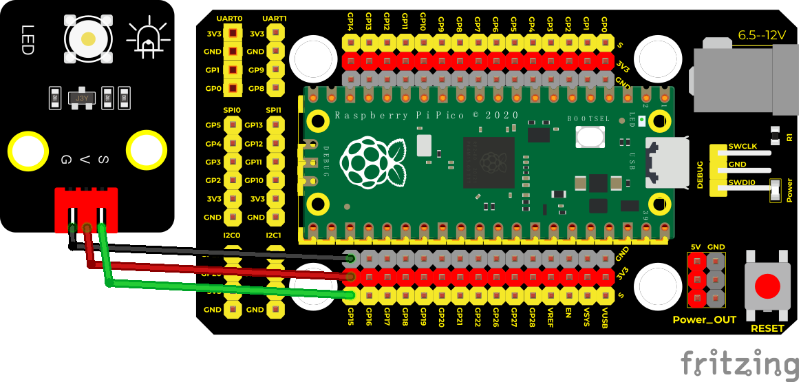

## 实验二十五 呼吸灯

****

### 🌟 项目简介  
你有没有见过手机通知灯像呼吸一样缓缓变亮、再慢慢变暗？这种柔和的灯光效果就叫“呼吸灯”。它不是简单地开关，而是让LED亮度连续变化，模拟人呼吸的节奏——轻柔、自然、有生命力！本课将用 Raspberry Pi Pico 和 MicroPython，亲手做出一个会“呼吸”的LED灯。

---

### ⚙️ 工作原理  
LED 的亮度，其实是由流过它的电流大小决定的。电流大，就亮；电流小，就暗。  
但我们不能直接给LED加“一半电压”——那样可能损坏元件，也不稳定。  
✅ 正确方法是：**用PWM（脉宽调制）技术**！  
Pico 的 PWM 功能可以快速开关引脚（每秒上千次），通过改变“开”的时间占比（即占空比），让人眼感觉亮度在变化。  
💡 小知识：`duty_u16()` 接收的数值范围是 **0 ~ 65535**（16位），但本课代码用 `duty * duty` 的方式，让亮度变化更符合人眼感知——开头暗得慢、中间亮得缓、结尾暗得柔，呼吸感更强！

---

### 🧰 所需材料  

|  |  |  |  |  |
|--------------------------------------------------------------------------|------------------------------------------------------------------|-------------------------------------------------------|----------------------------------------------------------------------|------------------------------------------------------|
| Raspberry Pi Pico板 ×1                                                   | Raspberry Pi Pico扩展板 ×1                                       | Keyes DIY电子积木 白色LED模块 ×1                      | 防反插3Pin杜邦线（公对公）×1                                         | MicroUSB数据线 ×1                                    |

> ✅ 提示：LED模块已内置限流电阻，可直接使用，无需额外接电阻！

---

### 🔌 接线图  

****  

📌 **接线说明（请务必对照图连接）：**  
- LED模块的 **S（信号）引脚** → Pico 的 **GP15（即引脚15）**  
- LED模块的 **+（正极）引脚** → Pico 的 **3.3V 引脚**  
- LED模块的 **–（负极）引脚** → Pico 的 **GND（接地）引脚**  

✅ 小贴士：白色LED模块上标有“+”“–”“S”，请按标识接线；防反插线能避免插错方向！

---

### 💻 示例代码（MicroPython）  

```python
# Keyes Starter Kit for Raspberry Pi Pico
# 实验25：呼吸灯（Breath LED）
# 使用GP15引脚输出PWM信号控制LED亮度

import machine
import time

# 创建PWM对象，连接到GP15引脚
pwm = machine.PWM(machine.Pin(15))
# 设置PWM频率为1000Hz（人眼看不到闪烁，亮度变化更平滑）
pwm.freq(1000)

# 初始化亮度值和变化方向（1=变亮，-1=变暗）
duty = 0
direction = 1

while True:
    duty += direction  # 每次调整亮度步进
    
    # 到达最亮（255）时，开始变暗
    if duty > 255:
        duty = 255
        direction = -1
    # 到达最暗（0）时，开始变亮
    elif duty < 0:
        duty = 0
        direction = 1
    
    # 关键！用 duty * duty 实现“呼吸感”亮度曲线
    # 例如：duty=0→0，duty=128→16384，duty=255→65025（接近最大值65535）
    pwm.duty_u16(duty * duty)
    
    # 每次调整后暂停10毫秒，控制呼吸节奏
    time.sleep(0.01)
```

---

### 📚 代码解析  

| 代码行 | 说明 |
|--------|------|
| `pwm = machine.PWM(machine.Pin(15))` | 创建一个PWM控制器，绑定到Pico的第15号GPIO引脚（GP15） |
| `pwm.freq(1000)` | 设定PWM开关频率为1000次/秒——足够快，人眼只看到亮度变化，不会察觉闪烁 |
| `duty * duty` | 不是简单线性变化！用平方关系让亮度变化“开头慢、中间快、结尾慢”，更像真实呼吸 |
| `time.sleep(0.01)` | 每次亮度微调后等待10毫秒，整个呼吸周期约5秒（256步 × 2 × 0.01s） |

> ✅ 试试改一改？  
> - 把 `time.sleep(0.01)` 改成 `0.005` → 呼吸更快；改成 `0.02` → 呼吸更悠长  
> - 把 `direction = 1` 改成 `2` → 亮度跳变更大，节奏更明显（但可能不够柔和）

---

### 🌈 实验现象  
下载并运行代码后：  
✅ LED会从完全熄灭开始，**缓慢变亮**，达到最亮后，再**缓慢变暗**，然后重新开始……  
✅ 整个过程循环往复，柔和自然，就像一盏在安静呼吸的小灯 🌙  

****

---

### ⚠️ 注意事项  
- 🔌 **务必确认接线正确**：LED模块的“S”接GP15，“+”接3.3V，“–”接GND。接反可能导致LED不亮或损坏模块。  
- 🐍 **代码中不要删掉 `import time`** ——否则 `time.sleep()` 会报错！  
- 💡 如果LED完全不亮：先检查USB线是否通电（Pico板上的绿色电源灯是否亮）；再检查接线是否松动；最后确认代码是否成功下载到Pico（Thonny底部状态栏应显示“Running”）。  
- 🌡️ Pico工作温度安全，请勿长时间覆盖散热孔或置于高温环境。

---

### 🧠 扩展思维  
在本课 LED 呼吸效果的基础上，如果想让呼吸节奏随环境光线强弱自动变化（比如天黑时呼吸变慢、天亮时变快），你觉得需要增加什么硬件？又该如何修改代码逻辑？