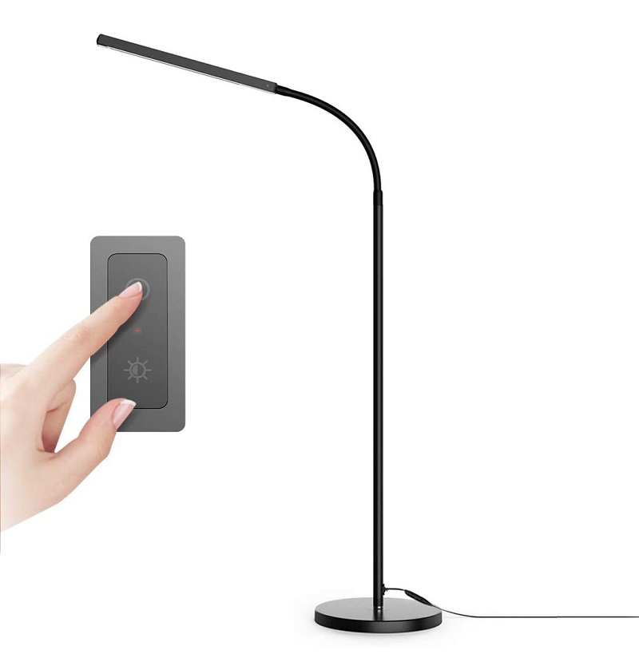
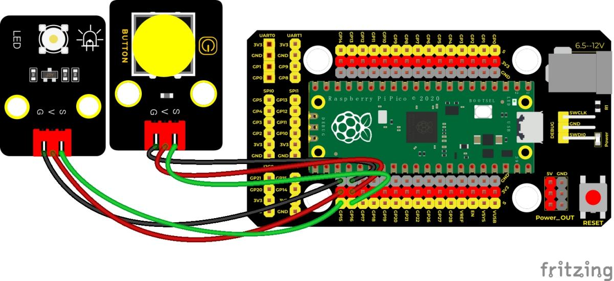
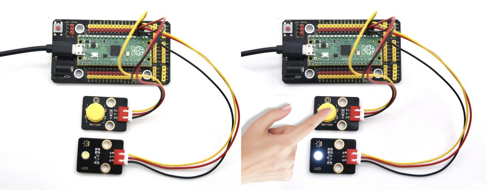

## 实验二十六 按键控制LED灯



### 🌟 项目简介  
本实验带你用一个按键“遥控”LED灯的亮与灭！和之前简单的“按着就亮、松开就灭”不同，这次我们使用**中断技术**，实现“按一下亮、再按一下灭、再按又亮……”的智能切换效果。就像家里的电灯开关一样，轻轻一按就能切换状态，既实用又酷炫！

---

### ⚙️ 工作原理  
- 按键模块默认输出高电平（相当于“没按下”），按下时变为低电平（相当于“被按下”）。  
- 我们让Pico在**检测到按键从高变低的瞬间（下降沿）** 触发一次中断，并执行一个“翻转开关”的动作：  
  - 如果LED当前是灭的 → 变成亮；  
  - 如果LED当前是亮的 → 变成灭。  
- 这样，每次按键动作只响应一次，不受按住时间长短影响，操作更精准、体验更流畅！

---

### 🧰 所需材料  

|  |  |  |  |  |  |
|--------------------------------------------------------------------------|------------------------------------------------------------------|-------------------------------------------------------|-------------------------------------------------------|----------------------------------------------------------------------|------------------------------------------------------|
| Raspberry Pi Pico板 ×1                                                   | Raspberry Pi Pico扩展板 ×1                                       | Keyes 白色LED模块 ×1                                  | Keyes 单路按键模块 ×1                                 | 防反插3Pin杜邦线 ×2                                                  | MicroUSB数据线 ×1                                    |

> ✅ 小提示：所有模块都采用标准3Pin接口（VCC-GND-SIG），接线时注意颜色对应（红-VCC、黑-GND、黄/SIG-信号脚）。

---

### 🔌 接线图  



**接线说明（请对照图确认）：**  
- **LED模块**：  
  - VCC → Pico 的 **VSYS 或 3.3V 引脚**（推荐 VSYS，供电更稳）  
  - GND → Pico 的 **GND 引脚**  
  - SIG → Pico 的 **GPIO15 引脚**  
- **按键模块**：  
  - VCC → Pico 的 **VSYS 或 3.3V 引脚**  
  - GND → Pico 的 **GND 引脚**  
  - SIG → Pico 的 **GPIO16 引脚**  

> ⚠️ 注意：不要把按键接到 GPIO16 的上拉/下拉模式未配置引脚！本实验依赖硬件中断，GPIO16 支持外部中断，无需额外启用上拉——模块内部已自带上拉电阻，可直接使用。

---

### 💻 示例代码（MicroPython）

```python
# Keyes Starter Kit for Raspberry Pi Pico
# 实验二十六：按键控制LED灯（中断切换式）
# 作者：Keyes创客教育团队

from machine import Pin
import time

# 定义按键和LED引脚
button = Pin(16, Pin.IN)   # 按键接GPIO16，输入模式
LED = Pin(15, Pin.OUT)     # LED接GPIO15，输出模式

# 全局变量：记录LED当前状态（False=灭，True=亮）
led_state = False

# 中断服务函数：每次按键按下（下降沿）就翻转LED状态
def toggle_led(pin):
    global led_state
    led_state = not led_state  # 取反：True↔False

# 设置GPIO16为下降沿中断（仅在按键按下瞬间触发）
button.irq(trigger=Pin.IRQ_FALLING, handler=toggle_led)

# 主循环：持续更新LED状态（即使不按键也保持当前状态）
while True:
    LED.value(led_state)
    time.sleep(0.01)  # 轻微延时，避免空循环过快（非必需，但更友好）
```

---

### 📝 代码解析  

| 代码行 | 说明 |
|--------|------|
| `button = Pin(16, Pin.IN)` | 将GPIO16设置为**输入引脚**，用于读取按键信号 |
| `LED = Pin(15, Pin.OUT)` | 将GPIO15设置为**输出引脚**，用于控制LED亮灭 |
| `led_state = False` | 初始化LED为“熄灭”状态（值为False） |
| `def toggle_led(pin):`<br>` global led_state`<br>` led_state = not led_state` | 定义中断响应函数：每次触发时，把LED状态取反（亮↔灭） |
| `button.irq(trigger=Pin.IRQ_FALLING, handler=toggle_led)` | 关键一步！告诉Pico：“当GPIO16检测到**高→低跳变**（即按键按下）时，请立刻运行 `toggle_led` 函数！” |
| `LED.value(led_state)` | 主循环中持续将LED设为当前状态，保证显示同步 |

✅ 小知识：`Pin.IRQ_FALLING` 是“下降沿触发”，比轮询检测更省电、更及时，是真实电子设备中常用的交互方式！

---

### 🌈 实验现象  

下载并运行程序后：  
- 初始状态：LED **熄灭**；  
- **第一次按下按键** → LED **点亮**；  
- **第二次按下按键** → LED **熄灭**；  
- **第三次按下按键** → LED **再次点亮**……  
如此循环，每一次按键都是“切换”，干净利落，毫无拖沓！



---

### ⚠️ 注意事项  

1. **接线务必准确**：特别是按键的 SIG 脚一定要接在 **GPIO16**（只有它支持该中断模式），LED 的 SIG 脚接 **GPIO15**；  
2. **不要短接VCC和GND**：接线前检查杜邦线是否破损，避免电源短路烧毁Pico；  
3. **首次运行前请确认Pico已成功连接电脑并识别为U盘**（RPI-RP2），再拖入 `.py` 文件；  
4. **若LED无反应**：先检查USB线是否为**数据线**（部分充电线无法传数据）；再用 `print(button.value())` 在Shell中手动测试按键是否正常返回 `1`（松开）和 `0`（按下）；  
5. **中断函数中尽量简洁**：本例只做状态翻转，不建议在 `toggle_led()` 中加入 `time.sleep()` 或复杂运算，否则可能丢失后续中断。

---

### 🧠 扩展思维  
如果想让LED在切换亮灭时，加上“呼吸灯”式的渐亮渐暗效果，该怎样修改程序？（提示：需要用到PWM和延时控制亮度）