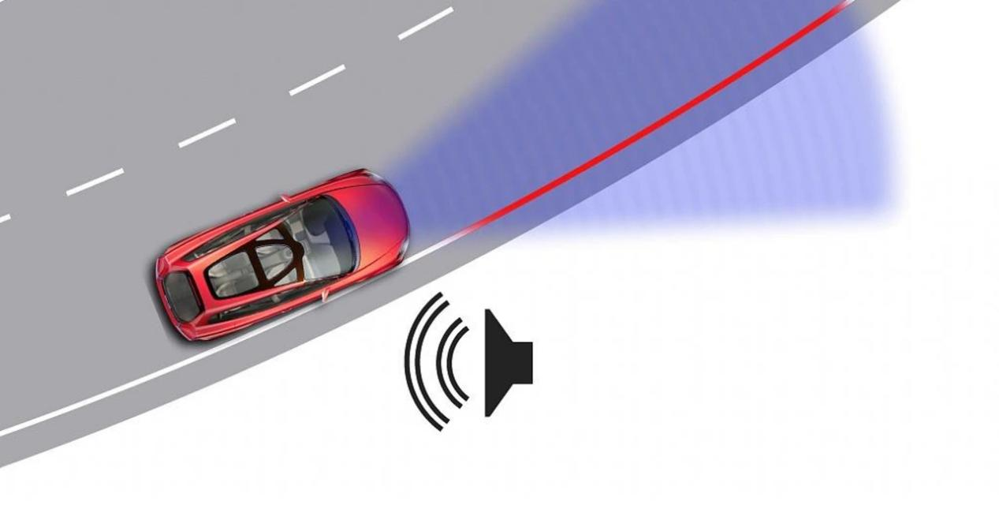
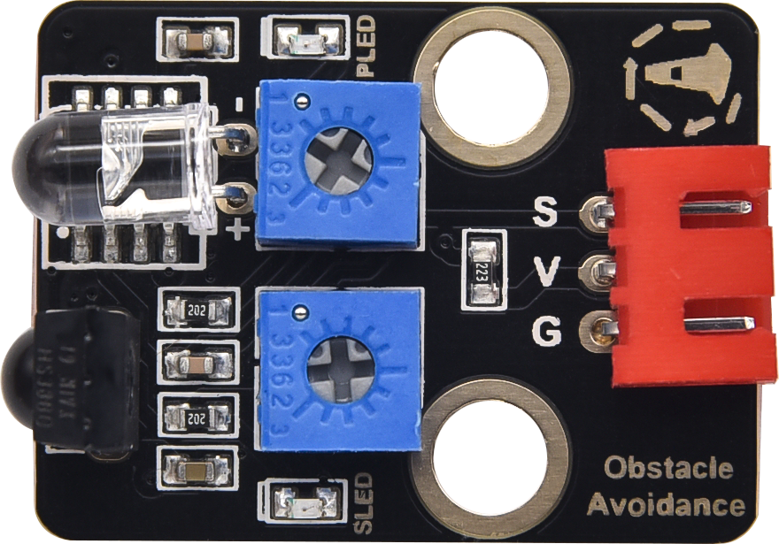
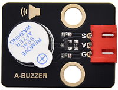
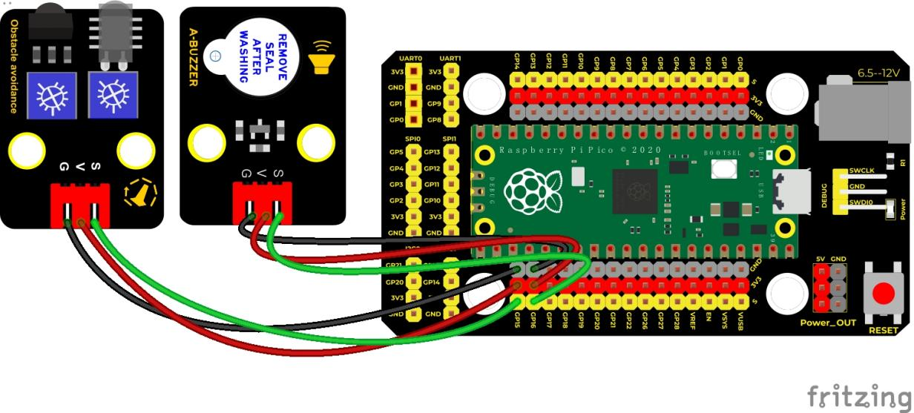
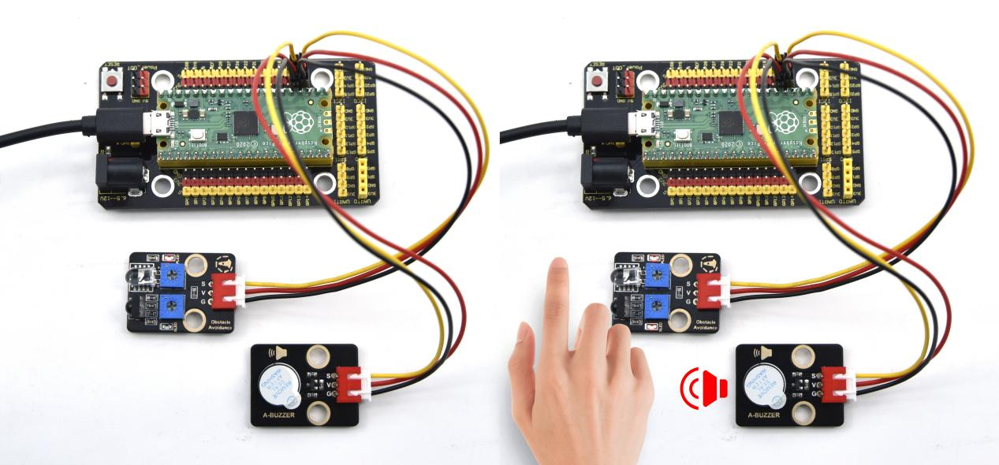

## 实验二十七 障碍物报警实验



### 🌟 项目简介  
本实验通过避障传感器实时检测前方是否有障碍物，一旦检测到，立即驱动有源蜂鸣器发出“嘀——”的报警声。这是一个典型的“感知→判断→响应”智能小系统，就像汽车倒车雷达、自动门感应器一样简单又实用！

---

### ⚙️ 工作原理  
- **避障传感器（红外反射式）**：发射红外光，遇到障碍物会反射回来，内部电路判断后输出**低电平（0）表示检测到障碍物**，**高电平（1）表示无障碍**。  
- **有源蜂鸣器**：内部自带振荡电路，只需给它**高电平（3.3V）就响，低电平（0V）就停**。  
- 所以我们把传感器的信号“取反”后直接送给蜂鸣器——  
  ✅ 有障碍 → 传感器输出 `0` → `not(0)` = `1` → 蜂鸣器响  
  ❌ 无障碍 → 传感器输出 `1` → `not(1)` = `0` → 蜂鸣器停  

---

### 🧰 所需材料  

|  |  |  |  |  |  |
|--------------------------------------------------------------------------|------------------------------------------------------------------|-------------------------------------------------------|-------------------------------------------------------|----------------------------------------------------------------------|------------------------------------------------------|
| Raspberry Pi Pico板 ×1                                                   | Raspberry Pi Pico扩展板 ×1                                       | Keyes 避障传感器模块 ×1                               | Keyes 有源蜂鸣器模块 ×1                               | 防反插3Pin杜邦线 ×2                                                  | Micro USB数据线 ×1                                  |

> 💡 小贴士：所有模块都使用标准3Pin接口（VCC-GND-SIG），接线时注意“红（VCC）-黑（GND）-黄/白（SIG）”顺序，防反插设计让你不怕插错！

---

### 🔌 接线图  

  

✅ **正确接法（务必对照图检查）：**  
- 避障传感器 → Pico扩展板  
  - VCC（红）→ 3.3V（或 VSYS，推荐3.3V更稳定）  
  - GND（黑）→ GND  
  - SIG（黄）→ GP15（即 Pin 15）  
- 有源蜂鸣器 → Pico扩展板  
  - VCC（红）→ 3.3V  
  - GND（黑）→ GND  
  - SIG（白）→ GP16（即 Pin 16）  

⚠️ 注意：不要把蜂鸣器接到5V！Pico的IO口最大耐压为3.3V，接5V可能损坏引脚。

---

### 💻 示例代码（MicroPython）

```python
# Keyes Starter Kit for Raspberry Pi Pico
# 实验二十七：障碍物报警实验
# 功能：检测到障碍物时，蜂鸣器响起；移开后停止

from machine import Pin
import time

# 定义引脚
buzzer = Pin(16, Pin.OUT)   # GP16 控制蜂鸣器（有源）
sensor = Pin(15, Pin.IN)     # GP15 接收避障传感器信号

# 主循环：持续检测并响应
while True:
    # 传感器检测到障碍物时输出低电平（0），取反后让蜂鸣器得高电平而发声
    buzzer.value(not sensor.value())
    time.sleep(0.01)  # 每10毫秒检测一次，反应快又不占资源
```

---

### 📝 代码解析  

| 代码行 | 中文说明 |
|--------|----------|
| `buzzer = Pin(16, Pin.OUT)` | 把GP16设置为**输出模式**，用来控制蜂鸣器开关 |
| `sensor = Pin(15, Pin.IN)` | 把GP15设置为**输入模式**，用来读取避障传感器的状态 |
| `not sensor.value()` | `sensor.value()` 返回 `0`（有障碍）或 `1`（无障碍）；`not` 运算把它变成 `1` 或 `0`，正好匹配蜂鸣器“高电平响”的特性 |
| `time.sleep(0.01)` | 短暂等待10毫秒，既保证响应灵敏，又避免程序跑得太快占用全部CPU |

> ✅ 小实验：试着把 `0.01` 改成 `0.5`，你会发现蜂鸣器变成“嘀…嘀…嘀…”慢节奏报警声哦！

---

### 🎯 实验现象  

✅ 正确接线并运行代码后：  
- 将手或书本靠近避障传感器前端（约2~5cm），蜂鸣器立即发出清晰响声；  
- 移开障碍物，声音立刻停止；  
- 反复靠近/移开，蜂鸣器同步响应，像一个聪明的小哨兵 👮‍♂️  



---

### ⚠️ 注意事项  

1. **电源安全第一**：所有模块VCC请统一接Pico的**3.3V引脚**（不是VSYS或5V），避免烧坏Pico或模块；  
2. **传感器校准**：避障传感器底部有个小电位器，顺时针旋转可**增大检测距离**，逆时针减小；初次使用建议调至中间位置；  
3. **接线再三确认**：特别注意SIG线别和VCC/GND接反，否则传感器可能不工作或输出异常；  
4. **蜂鸣器类型确认**：本实验必须使用**有源蜂鸣器（Active Buzzer）**，不是无源蜂鸣器（Passive）——有源蜂鸣器背面通常标有“A”或“ACTIVE”，通电就响；无源的需要程序发不同频率方波才能响，本课不适用；  
5. **USB供电足够吗？** 如果蜂鸣器声音微弱或时响时不响，可能是USB供电不足，请换用带电源适配器的USB充电头（≥500mA）供电。

---

### 🧠 扩展思维  
如果想让蜂鸣器在检测到障碍物时“嘀嘀嘀”快速连响3声，而不是一直长响，代码中该怎样修改？