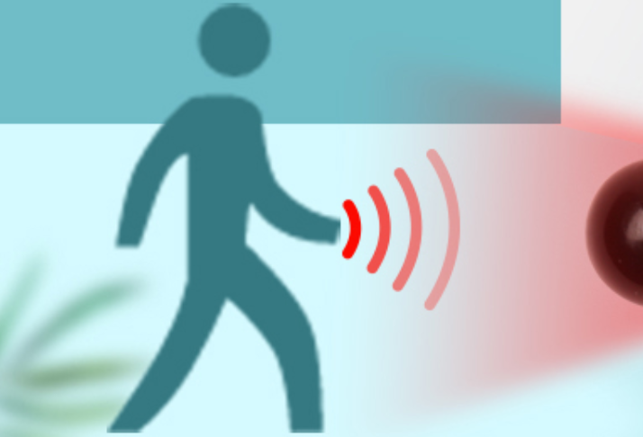
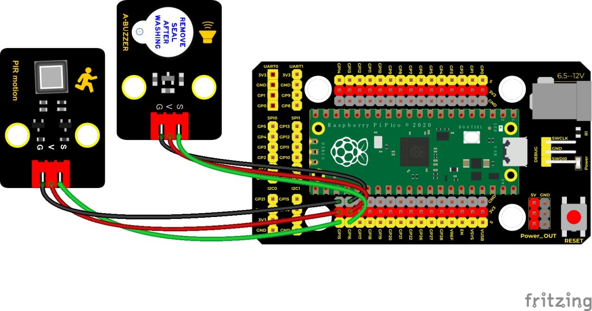
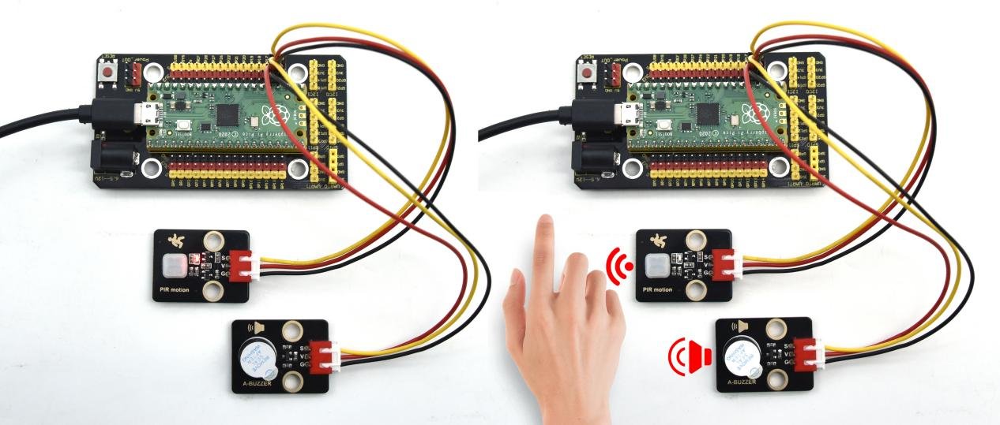

## 实验二十八 pico入侵检测报警器



### 🌟 项目简介  
本实验将用 Raspberry Pi Pico 制作一个简易的「入侵检测报警器」：当有人经过人体红外热释传感器（PIR）前方时，系统会立刻触发警报——蜂鸣器“嘀嘀”鸣响，同时板载LED快速闪烁，发出明显警示！整个过程无需持续轮询，而是通过**硬件中断**高效响应，既省电又灵敏。

---

### ⚙️ 工作原理  
- **人体红外热释传感器（PIR）**：能感应人体散发的微弱红外热量变化。当有人进入其探测范围（约3–5米），模块输出引脚会由**低电平（0V）跳变为高电平（3.3V）**，这个“从0到1”的跳变称为**上升沿信号**。  
- **中断机制**：我们让Pico在检测到这个上升沿时，立刻暂停主程序，执行专门的报警动作（叫蜂鸣器+闪LED），处理完再回到原来的任务——这样反应更快、更可靠！  
- **有源蜂鸣器**：通电就响（不需要自己生成频率），接高电平发声，接低电平静音。  
- **板载LED**：Pico 的 LED 在 GPIO25 上，亮/灭直接由 `led.value(1)` 或 `led.value(0)` 控制。

---

### 🧰 所需材料  

|  |  |  |  |  |  |
|--------------------------------------------------------------------------|------------------------------------------------------------------|-------------------------------------------------------|-------------------------------------------------------|----------------------------------------------------------------------|------------------------------------------------------|
| Raspberry Pi Pico板 ×1                                                   | Raspberry Pi Pico扩展板 ×1                                       | Keyes 人体红外热释传感器 ×1                           | Keyes 有源蜂鸣器模块 ×1                               | 防反插3Pin杜邦线 ×2                                                  | MicroUSB数据线 ×1                                    |

> ✅ 小提示：所有模块都带防反插接口，插错方向无法插入，新手也能轻松上手！

---

### 🔌 接线图  

  

📌 **接线说明（对照图连接，务必准确）：**  
| 传感器/模块       | 连接到 Pico 引脚 | 说明                     |  
|-------------------|------------------|--------------------------|  
| PIR传感器 VCC     | VSYS 或 3V3      | 供电（推荐用 VSYS，更稳定） |  
| PIR传感器 GND     | GND              | 公共地                   |  
| PIR传感器 OUT     | GP15             | 信号输入（触发中断）      |  
| 有源蜂鸣器 VCC    | GP16             | 控制端（高电平=响）       |  
| 有源蜂鸣器 GND    | GND              | 公共地                   |  
| （板载LED已内置，无需外接） | —                | 使用 GP25                 |  

> ⚠️ 注意：PIR传感器刚上电后需要约60秒“预热”，期间可能误触发，属正常现象，请耐心等待。

---

### 💻 示例代码（MicroPython）

```python
# Keyes Starter Kit for Raspberry Pi Pico
# 实验二十八：PIR入侵检测报警器
# 功能：有人靠近时，蜂鸣器鸣响 + 板载LED快速闪烁

import machine
import utime

# 定义引脚
sensor_pir = machine.Pin(15, machine.Pin.IN, machine.Pin.PULL_DOWN)  # PIR信号接入GP15
led = machine.Pin(25, machine.Pin.OUT)                                # 板载LED（GP25）
buzzer = machine.Pin(16, machine.Pin.OUT)                             # 蜂鸣器控制引脚GP16

# 中断服务函数：当PIR检测到人时执行
def pir_handler(pin):
    utime.sleep_ms(100)  # 短暂延时，消除可能的信号抖动
    if pin.value() == 1:  # 确认是高电平（真正有人）
        print("警告！检测到入侵！")
        buzzer.value(1)   # 蜂鸣器开启
        # LED快速闪烁20次（每次亮/灭各100ms，共2秒）
        for i in range(20):
            led.toggle()
            utime.sleep_ms(100)

# 设置GP15为上升沿中断（低→高时触发）
sensor_pir.irq(trigger=machine.Pin.IRQ_RISING, handler=pir_handler)

# 主循环：LED慢闪 + 蜂鸣器保持关闭
while True:
    led.toggle()     # 板载LED每2秒切换一次状态（慢闪，表示系统待机中）
    buzzer.value(0)  # 确保蜂鸣器默认静音
    utime.sleep(2)
```

---

### 📖 代码解析  

| 代码片段 | 作用说明 |  
|----------|----------|  
| `machine.Pin(15, machine.Pin.IN, machine.Pin.PULL_DOWN)` | 将GP15设为**输入模式**，并启用内部下拉电阻——确保没信号时引脚稳定为低电平，避免误触发 |  
| `sensor_pir.irq(...)` | 开启硬件中断：只在GP15从“0”变成“1”时才调用 `pir_handler`，不占用CPU轮询时间 |  
| `utime.sleep_ms(100)` | 加100毫秒延时，过滤掉PIR模块通电或环境干扰引起的瞬间抖动，提高可靠性 |  
| `led.toggle()` | 让LED在“亮”和“灭”之间自动切换，比写 `led.value(1)` / `led.value(0)` 更简洁 |  
| `buzzer.value(1)` 和 `buzzer.value(0)` | 有源蜂鸣器：高电平响，低电平停；无需复杂频率控制 |  

---

### 🎯 实验现象  

✅ 程序运行后：  
- 板载LED以**约2秒周期缓慢闪烁**（一亮一灭），表示系统已启动、正在待机监听；  
- PIR传感器指示灯（如模块上有）可能常亮或微闪（不同型号略有差异），请勿遮挡；  
- 当你**缓慢走近传感器前方1–3米处**（避开直射阳光/暖气片等热源），  
  → 立刻听到“嘀——嘀——嘀——”连续短促蜂鸣声，  
  → 同时LED进入**快速闪烁模式（约10Hz）持续2秒**，  
  → 屏幕串口打印：`⚠️ 警告！检测到入侵！`  
- 报警结束后，LED自动恢复慢闪，等待下一次触发。



---

### ⚠️ 注意事项  

1. **PIR需要“预热”**：首次上电后，等待约60秒再测试，否则易受初始校准影响而误报；  
2. **避免干扰源**：不要将PIR放在空调出风口、暖气旁、阳光直射窗边，这些会导致温度突变误触发；  
3. **检测角度**：PIR通常呈扇形探测（约110°水平角），正对人行走方向效果最佳；  
4. **蜂鸣器类型确认**：本实验使用的是**有源蜂鸣器**（通电即响），若误用无源蜂鸣器（需PWM驱动）则不会发声；  
5. **USB供电足够**：Pico通过MicroUSB供电可稳定驱动PIR+蜂鸣器，无需额外电源；  
6. **中断去抖必要**：代码中 `sleep_ms(100)` 是关键，跳过PIR输出的初始不稳定脉冲，大幅提升稳定性。

---

### 🧠 扩展思维  
如果想让报警器在第一次检测到人后，**持续报警10秒（而不是只响2秒）**，并在报警期间不再响应新的人体移动，该怎样修改代码？