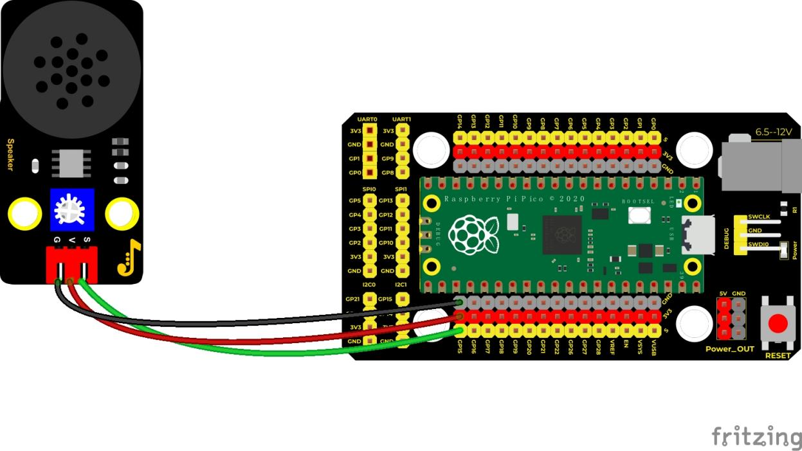
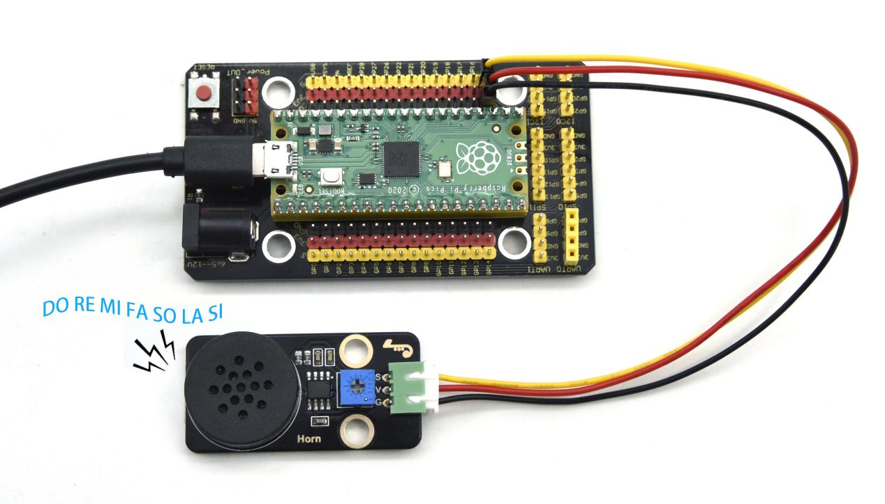

## 实验二十九 音乐播放


### 🎵 项目简介  
本实验将带你用 Raspberry Pi Pico 控制 8002B 功放喇叭模块，播放经典儿歌《生日快乐》！你将学会：  
✅ 把音符（如“D5”“M3”）转换成对应频率  
✅ 用不同持续时间（节拍）控制节奏，让音乐有“呼吸感”  
✅ 用 PWM（脉宽调制）驱动蜂鸣器发出清晰、响亮的声音  

> 💡 小知识：我们听到的“声音”，本质是空气快速振动——振动越快（频率越高），音调越高；振动时间越长，声音就越“拖长”。一首歌，就是一连串精准控制的频率 + 时间！

---

### ⚙️ 工作原理  
- **8002B 喇叭模块** 是一个带功放芯片的小型音频输出设备，它需要一个**方波信号**（高低电平交替）来驱动喇叭发声。  
- **Pico 的 PWM 引脚**（如 GPIO15）可以生成指定频率和占空比的方波，正好用来“指挥”喇叭振动。  
- 我们把每个音符映射为一个频率（单位：Hz），再配上它的演奏时长（如 0.25 秒 = 四分之一拍），就能还原出旋律啦！

---

### 🧰 所需材料  

|  |  |  |  |  |
|--------------------------------------------------------------------------|------------------------------------------------------------------|-------------------------------------------------------|----------------------------------------------------------------------|------------------------------------------------------|
| Raspberry Pi Pico 主控板 ×1                                               | Pico 专用扩展板（方便插接）×1                                     | Keyes 8002B 功放喇叭模块 ×1                            | 防反插 3Pin 杜邦线（红/黑/黄）×1                                      | Micro-USB 数据线 ×1                                 |

> ✅ 提示：扩展板不是必须的，但强烈推荐使用——它把 Pico 引脚有序引出，避免接错、短路，特别适合初学者！

---

### 🔌 接线说明  

  

| 喇叭模块端口 | 连接到 Pico 引脚 | 说明                     |
|--------------|------------------|--------------------------|
| **VCC**      | **VSYS 或 5V**   | 供电（扩展板上标有 5V）   |
| **GND**      | **GND**          | 公共地线                 |
| **IN**       | **GPIO15**       | 音频信号输入（PWM 输出）  |

> ⚠️ 注意事项：  
> - **务必确认喇叭模块的 IN 脚接的是 GPIO15**（不是其他引脚）；  
> - VCC 不要接成 3.3V —— 8002B 需要 4.5–6V 才能正常驱动喇叭，Pico 的 VSYS 引脚可直接提供约 5V（来自 USB 供电）；  
> - 接线前请断开 USB 线，接好后再通电，避免误短路！

---

### 💻 示例代码（MicroPython）

```python
# 实验二十九：音乐播放 —— 《生日快乐》
# 使用 Pico GPIO15 驱动 8002B 喇叭模块

from machine import Pin, PWM
from utime import sleep

# 初始化 PWM 蜂鸣器引脚（GPIO15）
buzzer = PWM(Pin(15))
buzzer.freq(440)  # 初始设为中音 A，避免上电杂音
buzzer.duty_u16(0)  # 初始静音

# 定义常用音符频率（单位：Hz）——按「低音 D」「中音 M」「高音 H」分类
tones = {
    "D1": 262, "D2": 293, "D3": 329, "D4": 349, "D5": 392, "D6": 440, "D7": 494,
    "M1": 523, "M2": 586, "M3": 658, "M4": 697, "M5": 783, "M6": 879, "M7": 987,
    "H1": 1045, "H2": 1171, "H3": 1316, "H4": 1393, "H5": 1563, "H6": 1755, "H7": 1971
}

# 《生日快乐》简谱（音符序列）
song = [
    "D5", "D5", "D6", "D5", "M1", "D7",
    "D5", "D5", "D6", "D5", "M2", "M1",
    "D5", "D5", "M5", "M3", "M1", "D7", "D6",
    "M4", "M4", "M3", "M1", "M2", "M1"
]

# 对应每个音符的时长（以“拍”为单位，1 拍 ≈ 0.5 秒）
durt = [
    0.25, 0.25, 0.5, 0.5, 0.5, 1,
    0.25, 0.25, 0.5, 0.5, 0.5, 1,
    0.25, 0.25, 0.5, 0.5, 0.5, 0.5, 0.5,
    0.25, 0.25, 0.5, 0.5, 0.5, 1
]

# 播放单个音符
def playtone(frequency):
    buzzer.duty_u16(1000)  # 开启发声（占空比约 1.5%，足够响亮又不烧模块）
    buzzer.freq(frequency)  # 设置振动频率

# 关闭发声
def bequiet():
    buzzer.duty_u16(0)  # 彻底静音

# 播放整首歌
def playsong(mysong):
    for i in range(len(mysong)):
        note = mysong[i]
        if note in tones:  # 安全检查：确保音符存在
            playtone(tones[note])
            sleep(durt[i] * 0.5)  # 1 拍 = 0.5 秒（可自由调整快慢！）
            bequiet()
            sleep(0.05)  # 音符间加微小间隔，更自然（可删减试试效果）

# 开始播放！
playsong(song)
```

---

### 📝 代码解析（小学生也能懂！）

| 代码片段 | 说明 |
|----------|------|
| `buzzer = PWM(Pin(15))` | 告诉 Pico：“我要用 15 号引脚发声音！” |
| `tones = { ... }` | 像查字典一样：输入 `"M5"`，立刻知道要振动 **783 次/秒** |
| `song = ["D5","D5",...]` | 把《生日快乐》写成“音符密码”，一行就是一句歌词的音调 |
| `durt = [0.25,0.25,...]` | 给每个音符配“计时器”：0.25 秒 = 快速“哒”，1 秒 = 拉长“～～～” |
| `sleep(durt[i] * 0.5)` | 把“拍数”换算成真实时间（例如：0.5 拍 × 0.5 秒/拍 = 0.25 秒） |
| `if note in tones:` | 加一层保护：万一打错音符（比如写成 `"X9"`），程序不会报错崩溃 |

> ✅ 小技巧：想让歌变慢？把 `* 0.5` 改成 `* 0.8`；想变快？改成 `* 0.3` —— 动手试试吧！

---

### 🎧 实验现象  
✅ 正确接线后，给 Pico 上电并运行代码，你会听到清脆悦耳的《生日快乐》旋律！  
✅ 每个音符清晰可辨，强弱节奏分明，结尾干净利落。  
✅ 若无声，请依次检查：USB 是否插稳、喇叭模块开关是否打开（如有）、IN 线是否接在 GPIO15、代码是否完整复制无误。

---

### ⚠️ 安全与注意事项  
- 🔌 **切勿将喇叭模块 VCC 接到 Pico 的 3.3V 引脚！** 会导致模块无法驱动或损坏；请务必接 VSYS 或扩展板标注的 **5V**。  
- 📉 **音量过大可能损伤听力**：首次测试建议先调低音量（可用小音量试听），儿童请在成人陪同下操作。  
- 🧼 **避免长时间连续播放**：模块持续工作会发热，每次播放后休息 10 秒更安全。  
- ❌ **不要用手触摸喇叭金属振膜**：会影响发声，甚至造成短路。

---

### 🧠 扩展思维  
在本课《生日快乐》的基础上，如果想让每个音符播放时**音量由小渐大、再由大渐小**（即“淡入淡出”效果），该怎样修改 `playtone()` 和 `bequiet()` 函数？

