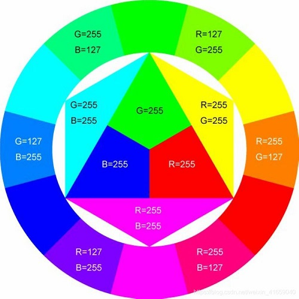
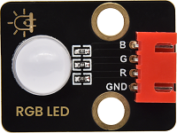
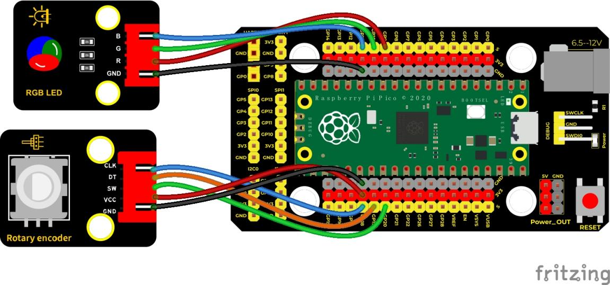
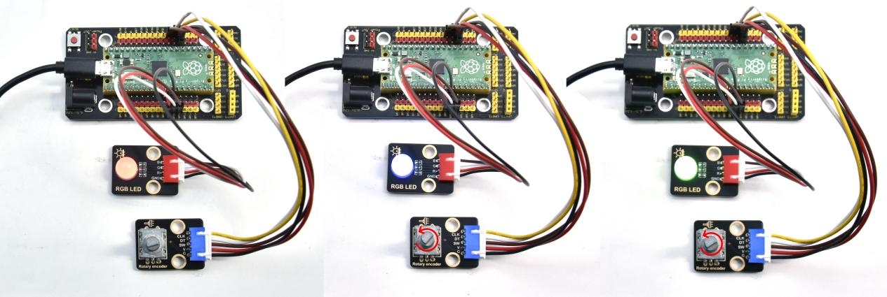
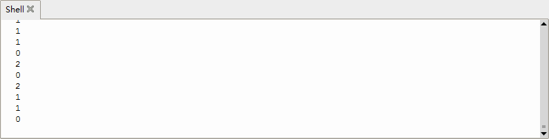

## 实验三十 旋转编码器模块控制RGB模块

****

### 🌟 项目简介  
本实验将旋转编码器的转动变化转化为数字信号，并用它来循环切换RGB LED的颜色（红→绿→蓝→红……）。每转一下编码器，LED就换一种颜色，像一个“手动调色盘”，既直观又有趣！

---

### ⚙️ 工作原理  
- 旋转编码器每转动一小格，内部会产生一个脉冲信号，MicroPython通过`RotaryIRQ`库实时读取当前累计转动值（`r.value()`）；  
- 我们对这个数值做「除以3取余数」运算（`val % 3`），结果只能是 `0`、`1` 或 `2`；  
- 根据余数决定点亮哪一种颜色：  
  - `余数 0` → 红光（R=65535, G=0, B=0）  
  - `余数 1` → 绿光（R=0, G=65535, B=0）  
  - `余数 2` → 蓝光（R=0, G=0, B=65535）  
- RGB模块使用的是**共阴极**接法（三个LED负极连在一起接地），所以高电平（PWM输出）才能点亮对应颜色。

> 💡 小知识：`duty_u16(65535)` 表示满亮度（16位PWM最大值），`duty_u16(0)` 表示完全熄灭。

---

### 🧰 所需材料  

|  |      |  |  |
|--------------------------------------------------------------------------|----------------------------------------------------------------------|-------------------------------------------------------|-------------------------------------------------------|
| Raspberry Pi Pico板 ×1                                                   | Raspberry Pi Pico扩展板 ×1                                           | Keyes 共阴RGB模块 ×1                                  | Keyes 旋转编码器模块 ×1                               |
|      |  |   |                                                       |
| 防反插5Pin排线 ×1                                                        | 防反插4Pin排线 ×1                                                    | MicroUSB数据线 ×1                                     |                                                       |

---

### 🔌 接线图  

****  

📌 **接线说明（请对照图仔细连接）：**  
| 模块         | Pico引脚 | 说明                     |
|--------------|----------|--------------------------|
| RGB模块 R（红） | GP9      | PWM输出，控制红色亮度     |
| RGB模块 G（绿） | GP10     | PWM输出，控制绿色亮度     |
| RGB模块 B（蓝） | GP11     | PWM输出，控制蓝色亮度     |
| 编码器 CLK    | GP18     | 时钟信号引脚              |
| 编码器 DT     | GP19     | 数据信号引脚              |
| 编码器 SW     | GP20     | 按键开关（本实验未使用，可悬空或接上拉） |
| RGB模块 GND   | GND      | 共阴极必须接地！          |
| 编码器 VCC    | VSYS 或 3V3 | 建议用 VSYS（约5V）更稳定 |
| 编码器 GND    | GND      |                          |

✅ 温馨提示：  
- RGB模块务必确认是**共阴极（Common Cathode）**，接错会导致不亮或颜色异常；  
- 若RGB灯不亮，请先检查GND是否接牢，再确认Pico供电是否正常（USB线要能传数据+供电）。

---

### 💻 示例代码（MicroPython）

```python
# Keyes Starter Kit for Raspberry Pi Pico
# 实验30：旋转编码器控制RGB LED颜色切换
# 使用RotaryIRQ库（需提前将rotary_irq_rp2.py放入Pico中）

import time
from rotary_irq_rp2 import RotaryIRQ
from machine import Pin, PWM

# 初始化RGB三色PWM引脚（GP9红、GP10绿、GP11蓝）
pwm_r = PWM(Pin(9))
pwm_g = PWM(Pin(10))
pwm_b = PWM(Pin(11))

# 设置PWM频率为1kHz（适合LED调光，太低会闪烁，太高可能响应慢）
pwm_r.freq(1000)
pwm_g.freq(1000)
pwm_b.freq(1000)

# 定义light()函数：一键设置RGB亮度（0~65535）
def light(red, green, blue):
    pwm_r.duty_u16(red)
    pwm_g.duty_u16(green)
    pwm_b.duty_u16(blue)

# 初始化旋转编码器（CLK=GP18，DT=GP19，无限制范围）
r = RotaryIRQ(
    pin_num_clk=18,
    pin_num_dt=19,
    min_val=0,
    reverse=False,
    range_mode=RotaryIRQ.RANGE_UNBOUNDED
)

# 【可选】编码器按键（SW），本实验未使用，但保留引脚定义便于拓展
SW = Pin(20, Pin.IN, Pin.PULL_UP)

# 主循环：持续读取编码器值，按余数切换颜色
while True:
    val = r.value()           # 获取当前旋转计数值
    remainder = val % 3       # 计算除以3的余数（0、1、2）
    print("当前余数:", remainder)  # 在Shell中显示，方便调试
    
    if remainder == 0:
        light(65535, 0, 0)    # 红色
    elif remainder == 1:
        light(0, 65535, 0)    # 绿色
    elif remainder == 2:
        light(0, 0, 65535)    # 蓝色
    
    time.sleep(0.1)  # 小延时，避免刷新太快看不清，也减轻CPU负担
```

---

### 📚 代码解析  

| 代码段 | 说明 |
|--------|------|
| `from rotary_irq_rp2 import RotaryIRQ` | 导入专为RP2040优化的旋转编码器中断库（需提前复制到Pico） |
| `pwm_r.duty_u16(65535)` | `duty_u16()` 设置16位PWM占空比，`65535` = 100%亮度，`0` = 完全熄灭 |
| `val % 3` | 取模运算，确保结果永远在 `0, 1, 2` 中循环，实现三色轮换 |
| `time.sleep(0.1)` | 每0.1秒检测一次，防止抖动误判，也避免串口打印刷屏 |

🔧 **如何安装 `rotary_irq_rp2.py`？**  
1. 下载该库文件（官网或Keyes套件资料包中提供）；  
2. 用Thonny或uPyCraft等工具，将其拖入Pico设备根目录；  
3. 重启Pico或重新运行程序即可识别。

---

### ✅ 实验现象  

- 接线完成后，给Pico通电（USB连接电脑）；  
- 运行代码，在Thonny下方的**Shell窗口**中会持续打印类似：  
  ```
  当前余数: 0  
  当前余数: 0  
  当前余数: 1  
  当前余数: 1  
  当前余数: 2  
  ```  
- 同时观察RGB模块：  
  - 初始状态常亮**红色**；  
  - 顺时针轻转编码器一格 → 变为**绿色**；  
  - 再转一格 → 变为**蓝色**；  
  - 再转一格 → 回到**红色**，循环往复；  
- 逆时针旋转则计数值减小，同样按 `...2→1→0→2→1...` 循环切换。

  


---

### ⚠️ 注意事项  

- 🔌 **电源安全**：RGB模块工作电流较大，建议使用带稳压的USB电源（如电脑USB口或优质充电头），避免Pico因供电不足重启；  
- 🧩 **模块方向**：接线前看清RGB模块丝印标注（R/G/B标识），接反会导致颜色错乱；  
- 📡 **干扰排查**：若旋转时颜色跳变异常（如转1格却跳2种颜色），可能是接触不良或编码器质量差，可尝试加`time.sleep(0.05)`或检查排线是否插紧；  
- 📦 **库文件缺失**：若报错 `ImportError: cannot import name RotaryIRQ`，说明`rotary_irq_rp2.py`未正确放入Pico，请重新上传并重启。

---

### 🧠 扩展思维  
如果想让RGB灯随着旋转速度**渐变颜色**（比如转得越快，颜色过渡越流畅），而不是“跳变”三色，你打算怎么修改代码？