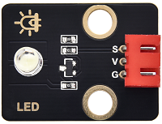
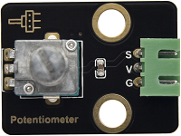
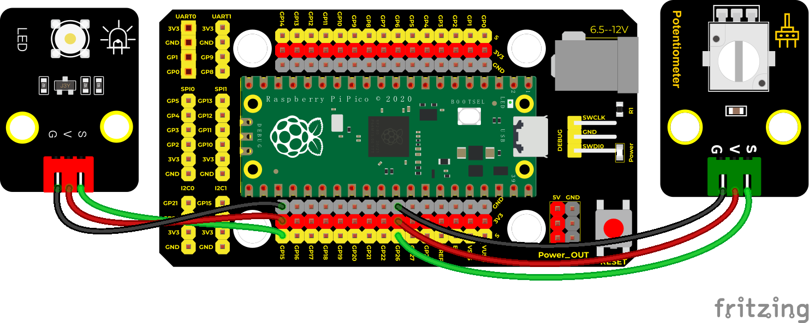

## 实验三十一 电位器调节灯光亮度


### 🌟 项目简介  
本实验将“呼吸灯”的渐变亮度效果与“按键控制”的输入思维结合起来，用一个**旋转电位器**像音量旋钮一样，**手动调节LED灯的亮暗程度**。不用编程改变数值，只要轻轻一转，亮度立刻变化——这就是模拟信号的魅力！

---

### ⚙️ 工作原理  
- 电位器是一个可调电阻，旋转时会输出**连续变化的电压值**（0V～3.3V），Pico 的 ADC（模数转换器）能把它变成数字信号：**0～65535**。  
- LED 亮度不能靠“开关”控制，要用 **PWM（脉宽调制）**：快速开关 LED，通过“开的时间占比”来模拟明暗。Pico 的 PWM 值范围也是 **0～65535**。  
- 所以我们直接把电位器读到的数值，原封不动地传给 PWM → 数值越大，LED 越亮；数值越小，LED 越暗。简单又巧妙！

---

### 🧰 所需材料  

|  |  |  |  |  |  |
|--------------------------------------------------------------------------|------------------------------------------------------------------|-------------------------------------------------------|-------------------------------------------------------|----------------------------------------------------------------------|------------------------------------------------------|
| Raspberry Pi Pico板 ×1                                                   | Raspberry Pi Pico扩展板 ×1                                       | Keyes 白色LED模块 ×1                                  | Keyes 旋转电位器传感器 ×1                             | 防反插3Pin杜邦线 ×2                                                  | Micro USB数据线 ×1                                   |

> ✅ 小提示：所有模块都带防反插设计，插错方向是插不进去的，新手也能安心操作！

---

### 🔌 接线说明  

****  

按图连接（对应引脚已标出）：
- **LED模块**：  
  - `S`（信号）→ Pico **GP15**（即 Pin 15）  
  - `+`（电源）→ Pico **3.3V**  
  - `-`（地）→ Pico **GND**  
- **电位器模块**：  
  - `S`（信号）→ Pico **GP26**（即 ADC0，唯一支持ADC的引脚之一）  
  - `+` → Pico **3.3V**  
  - `-` → Pico **GND**  

⚠️ 注意：电位器必须接 **3.3V 和 GND** 才能正常输出模拟电压；若误接 5V 可能损坏 Pico！

---

### 💻 示例代码（MicroPython）

```python
# Keyes Starter Kit for Raspberry Pi Pico
# 实验31：电位器调节LED亮度
import machine
import utime

# 创建ADC对象：读取电位器在GP26上的模拟电压
potentiometer = machine.ADC(26)

# 创建PWM对象：控制GP15引脚输出可变占空比信号
pwm = machine.PWM(machine.Pin(15))
pwm.freq(1000)  # 设置PWM频率为1000Hz（人眼看不到闪烁）

while True:
    pot_value = potentiometer.read_u16()  # 读取电位器值（0~65535）
    pwm.duty_u16(pot_value)               # 直接赋值给PWM，控制LED亮度
    utime.sleep(0.1)                      # 稍作等待，让程序更稳定
```

---

### 📚 代码解析  

| 代码行 | 说明 |
|--------|------|
| `machine.ADC(26)` | 告诉Pico：我要从 **GP26引脚** 读取模拟电压信号（电位器输出） |
| `machine.PWM(machine.Pin(15))` | 告诉Pico：我要用 **GP15引脚** 输出PWM信号（驱动LED） |
| `pwm.freq(1000)` | 设定PWM“开关速度”为每秒1000次——太快人眼看不见闪烁，太慢会感觉明显闪烁 |
| `potentiometer.read_u16()` | 读取一次电位器值，返回 **0～65535 的整数**（u16 = unsigned 16-bit） |
| `pwm.duty_u16(pot_value)` | 把刚读到的数值，直接设为PWM“开启时间占比”，0=完全熄灭，65535=最亮 |

✅ 小发现：ADC 和 PWM 都用 **16位数值（0–65535）**，所以无需换算，直连即可！这就是MicroPython为创客设计的贴心之处。

---

### ✅ 实验现象  

下载并运行代码后：  
- LED 模块初始亮度由电位器当前角度决定；  
- **顺时针旋转电位器** → LED **越来越亮**；  
- **逆时针旋转电位器** → LED **越来越暗**，直至完全熄灭；  
- 整个过程平滑、无断点，就像调节台灯亮度一样自然！


---

### ⚠️ 注意事项  

- 🔌 务必确认电位器的 `+` 接 **Pico 的 3.3V**，不是 VSYS 或 5V！否则可能烧坏Pico的ADC电路。  
- 🧩 LED模块和电位器模块的 `S/+/-` 顺序不能接反（模块背面有丝印标注）。  
- 🐞 如果LED不亮或始终最亮/最暗，请检查：  
  - USB线是否插稳、Pico是否被电脑识别；  
  - 代码是否成功下载（Thonny左下角显示“Running”）；  
  - 接线是否与图中完全一致（特别是GP26和GP15）。  
- 🌡️ 电位器是机械元件，偶尔接触不良属正常，多旋转几次即可恢复。

---

### 🧠 扩展思维  
在本课 LED 亮度随电位器线性变化的基础上，如果想让它**转动一点点就明显变亮，再转一点就很快达到最亮**（即实现“非线性调节”），该怎样修改代码？