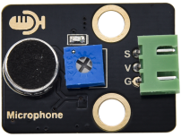
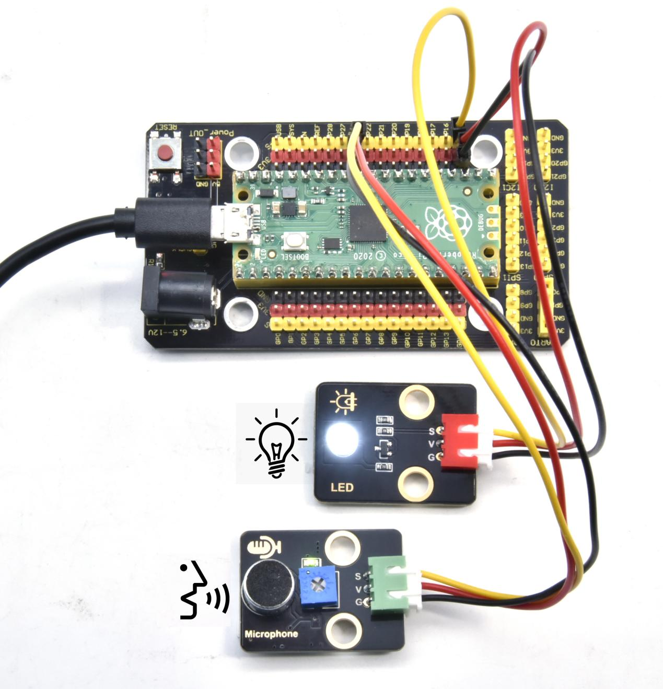
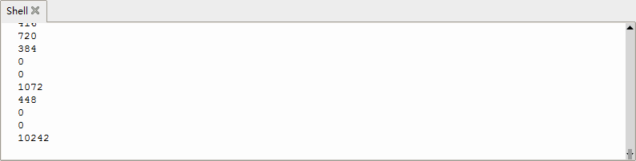

## 实验三十二 声控灯


### 🌟 项目简介  
你有没有见过一拍手灯就亮、再拍一下就灭的“魔法灯”？本实验将带你用 Raspberry Pi Pico 制作一个**简易声控灯**！它不需要遥控器，也不用手动开关——只要发出“啪！”一声（比如拍手、跺脚或喊话），LED 就会自动点亮；安静几秒后，又自动熄灭。这是智能家居中常见的基础交互方式，也是理解“传感器→判断→执行”这一智能控制逻辑的第一步！

---

### 🔍 工作原理  
声音传感器内部有一个微型麦克风和信号放大电路，能将周围声音的**振动强度**转换成**模拟电压信号**（数值越大，表示声音越响）。  
Pico 的 ADC（模数转换器）读取这个电压，并转换为 0–65535 范围内的数字值（`read_u16()`）。  
我们设定一个“声音门槛”（阈值）：  
✅ 当检测值 **＞5000** → 判定为“有声音”，点亮 LED；  
❌ 当检测值 **≤5000** → 判定为“安静”，熄灭 LED。  
再配合 `time.sleep(3)`，让灯亮起后保持 3 秒，避免频繁闪烁，体验更自然。

> 💡 小知识：为什么不是“有声音就一直亮”？——因为真实环境中总有微小噪音（风扇声、呼吸声），设置延时+阈值可有效防止误触发！

---

### 🧰 所需材料  

|  |  |  |  |  |  |
|--------------------------------------------------------------------------|------------------------------------------------------------------|-------------------------------------------------------|-------------------------------------------------------|----------------------------------------------------------------------|------------------------------------------------------|
| Raspberry Pi Pico板 ×1                                                   | Raspberry Pi Pico扩展板 ×1                                       | Keyes 声音传感器模块 ×1                               | Keyes 白色LED模块 ×1                                  | 防反插3Pin杜邦线 ×2                                                  | Micro-USB 数据线 ×1                                 |

---

### ⚙️ 接线说明  

****  

| 模块         | 连接引脚（Pico） | 说明                     |
|--------------|------------------|--------------------------|
| 声音传感器   | GP26（ADC0）     | 传感器信号输出 → Pico ADC通道 |
|              | GND              | 公共地                   |
|              | 3V3              | 供电（注意：勿接 5V！）    |
| 白色LED模块  | GP15             | 控制引脚（数字输出）       |
|              | GND              | 公共地                   |

✅ **关键提醒**：  
- 声音传感器必须接 **3V3**（不是 VSYS 或 5V），否则可能损坏或读数异常；  
- 所有 GND 必须连在一起，形成统一参考地；  
- 杜邦线使用防反插3Pin线，确保红（VCC）、黑（GND）、黄/白（SIG）对应插入，不接反。

---

### 💻 示例代码（MicroPython）

```python
# Keyes Starter Kit for Raspberry Pi Pico
# 实验32：声控灯
# 功能：拍手/发声时LED亮起，3秒后自动熄灭

import machine
import time

# 初始化：声音传感器接GP26（ADC通道0），LED接GP15
mic = machine.ADC(26)        # 创建ADC对象，读取声音传感器模拟值
led = machine.Pin(15, machine.Pin.OUT)

print("声控灯已启动！请拍手或发出声音试试～")

while True:
    value = mic.read_u16()   # 读取0–65535范围的模拟值
    print("当前音量值：", value)  # 在Shell中实时显示，方便调试阈值
    
    if value > 5000:         # 如果声音足够大（可自行调整此数值）
        led.value(1)         # 点亮LED
        print("✅ 检测到声音！LED已点亮")
        time.sleep(3)        # 保持亮灯3秒
    else:
        led.value(0)         # 无声音时熄灭LED
        time.sleep(0.1)      # 短暂等待，减少CPU占用
```

---

### 📖 代码解析  

| 代码行 | 说明 |
|--------|------|
| `mic = machine.ADC(26)` | 告诉Pico：“我要用GP26引脚来读取声音传感器的模拟信号” |
| `value = mic.read_u16()` | 读取一次声音强度，返回一个0–65535的整数（数值越大=声音越强） |
| `if value > 5000:` | 设置“声音门槛”：5000是经验值，太低易误触发（风吹草动都亮），太高又不灵敏（拍手都不亮） |
| `time.sleep(3)` | 让LED亮着等3秒，给人明确反馈；之后自动熄灭，无需手动关 |
| `print(...)` | 在Thonny或串口终端中显示数值，方便你边测试边调阈值！ |

🔧 **小技巧：如何找到最适合你的阈值？**  
👉 先运行代码，在Thonny下方的Shell窗口观察静音时的数值（比如2000–3500），再拍手看飙升到多少（比如8000–12000）。把阈值设在两者中间（如5000）最稳妥！

---

### ✅ 实验现象  

运行代码后：  
- Thonny下方Shell窗口会持续打印类似 `当前音量值： 2845` 的数字；  
- 安静时数值较低（约1000–4000），LED保持熄灭；  
- 拍手、弹指或短促喊“哈！”时，数值瞬间跳至 **6000以上**，LED立即点亮并持续3秒；  
- 3秒后自动熄灭，等待下一次触发。





---

### ⚠️ 注意事项  

1. **电源安全第一**：声音传感器务必接 **3V3 引脚**，不可误接 VSYS（标有“VSYS”的引脚输出约5V），否则可能烧毁传感器！  
2. **接线前断电**：每次修改线路前，请先拔掉USB线，接好再插回；  
3. **环境干扰**：避免靠近风扇、空调出风口或电脑散热口，这些会产生持续底噪，影响识别；  
4. **阈值可调**：若拍手不亮，尝试把 `5000` 改小（如 `4000`）；若常误亮，改大（如 `6000`）；  
5. **LED方向别插反**：白色LED模块有正负极（长脚为正），但Keyes积木已内置限流电阻和防反接设计，放心使用。

---

### 🧠 扩展思维  
如果想让这个声控灯变成“双击开关”（第一次拍手开灯，第二次拍手才关灯），而不是“有声就开、无声就关”，代码逻辑该怎么改？