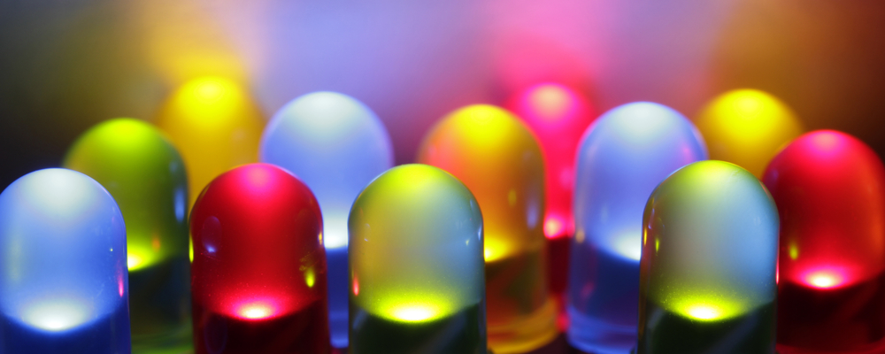
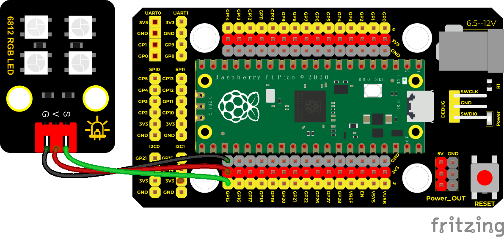

## 实验三十三 6812花样彩灯



### 🌟 项目简介  
夜晚的城市霓虹、节日的炫彩灯带、舞台上的流动光效……这些让人眼前一亮的灯光效果，其实用一块 Raspberry Pi Pico 和一个小小的 6812 RGB 灯珠模块就能轻松实现！本实验将带你用 MicroPython 编程，让 4 颗 LED 灯珠“跳起灯光舞”——先按顺序点亮不同颜色（黑→红→黄→绿→青→蓝→紫→白），再自动切换成梦幻彩虹滚动效果。既复习了 SK6812 的驱动原理，又体验了编程控制光影的魅力！

> ⚠️ 温馨提醒：LED 亮度较高，请勿长时间直视灯珠，保护视力哦！

---

### 💡 工作原理  
SK6812 是一种智能 RGB LED，内置驱动芯片，只需**一根数据线（GPIO15）** 就能控制多个灯珠的每种颜色（红、绿、蓝）和亮度。它使用类似 WS2812 的单线归零码通信协议，但兼容性更好、色彩更均匀。  
本实验通过 Pico 的 **PIO（可编程 I/O）** 硬件模块，精准生成微秒级时序信号，稳定驱动灯珠——比软件模拟更可靠，不卡顿、不闪屏！

---

### 🧰 所需材料  

|  |  |  |  |  |
|--------------------------------------------------------------------------|------------------------------------------------------------------|-------------------------------------------------------|----------------------------------------------------------------------|------------------------------------------------------|
| Raspberry Pi Pico 主控板 ×1                                              | Raspberry Pi Pico 扩展板（面包板转接板）×1                          | Keyes DIY 电子积木 SK6812 RGB 模块 ×1                  | 防反插 3Pin 连接线（黑=GND，红=VCC，白/黄=DATA）×1                     | Micro USB 数据线 ×1                                 |

✅ 小贴士：模块背面标有 “+ - D”，对应接线为：  
- `+` → 扩展板 5V 或 VBUS（Pico 最大可提供约 300mA，4 颗灯珠足够）  
- `-` → GND  
- `D` → GPIO15（Pico 引脚编号，不是物理序号！）

---

### 🔌 接线图  

  

📌 **关键确认点**：  
- SK6812 模块的 `D` 引脚 → Pico 的 **GP15（即 Pin 15）**  
- `+` 接 **3V3** (供电)
- `-` 接 **GND**（与 Pico 共地）  
- USB 线连接电脑，用于供电 + 下载代码  

---

### 💻 示例代码（MicroPython，已优化注释）

```python
# 实验三十三：6812花样彩灯（MicroPython for Raspberry Pi Pico）
# 功能：流水单色跑马灯 + 全彩彩虹循环动画
# 注意：请确保Pico已安装最新MicroPython固件（含rp2支持）

import array, time
from machine import Pin
import rp2

# ✅ 参数设置（可自由修改）
NUM_LEDS = 4          # 灯珠数量（当前模块为4颗）
PIN_NUM = 15            # 控制引脚：GPIO15（物理引脚第20号）
brightness = 0.2        # 整体亮度（0.0~1.0，建议0.1~0.3护眼）

# 🔧 PIO程序：精准生成SK6812通信时序（无需手动延时）
@rp2.asm_pio(sideset_init=rp2.PIO.OUT_LOW, out_shiftdir=rp2.PIO.SHIFT_LEFT, autopull=True, pull_thresh=24)
def ws2812():
    T1 = 2
    T2 = 5
    T3 = 3
    wrap_target()
    label("bitloop")
    out(x, 1)               .side(0) [T3 - 1]
    jmp(not_x, "do_zero")   .side(1) [T1 - 1]
    jmp("bitloop")          .side(1) [T2 - 1]
    label("do_zero")
    nop()                   .side(0) [T2 - 1]
    wrap()

# 🚀 初始化PIO状态机（频率8MHz，严格匹配SK6812要求）
sm = rp2.StateMachine(0, ws2812, freq=8_000_000, sideset_base=Pin(PIN_NUM))
sm.active(1)

# 🎨 创建LED颜色数组（I型：32位无符号整数，格式：0x00RRGGBB）
ar = array.array("I", [0 for _ in range(NUM_LEDS)])

# 🌈 辅助函数：显示当前颜色数组（带亮度调节）
def pixels_show():
    dimmer_ar = array.array("I", [0 for _ in range(NUM_LEDS)])
    for i, c in enumerate(ar):
        r = int(((c >> 8) & 0xFF) * brightness)  # 提取R分量并调亮
        g = int(((c >> 16) & 0xFF) * brightness) # 提取G分量并调亮
        b = int((c & 0xFF) * brightness)         # 提取B分量并调亮
        dimmer_ar[i] = (g << 16) + (r << 8) + b  # 重排为GRB格式（SK6812要求）
    sm.put(dimmer_ar, 8)  # 发送至PIO FIFO
    time.sleep_ms(10)     # 短暂等待刷新完成

# 🎯 设置第i颗灯珠颜色（输入格式：(R, G, B)元组）
def pixels_set(i, color):
    ar[i] = (color[1] << 16) + (color[0] << 8) + color[2]  # GRB顺序存入

# ➡️ 流水灯效果：逐个点亮指定颜色
def color_chase(color, wait):
    for i in range(NUM_LEDS):
        pixels_set(i, color)
        pixels_show()
        time.sleep(wait)

# 🌈 彩虹轮盘函数：输入0~255，输出(R,G,B)元组
def wheel(pos):
    if pos < 0 or pos > 255:
        return (0, 0, 0)
    if pos < 85:
        return (255 - pos * 3, pos * 3, 0)      # 红→绿
    if pos < 170:
        pos -= 85
        return (0, 255 - pos * 3, pos * 3)      # 绿→蓝
    pos -= 170
    return (pos * 3, 0, 255 - pos * 3)          # 蓝→红

# 🌈🌈 彩虹循环动画：所有灯珠同步滚动彩虹色
def rainbow_cycle(wait):
    for j in range(255):
        for i in range(NUM_LEDS):
            rc_index = (i * 256 // NUM_LEDS) + j
            pixels_set(i, wheel(rc_index & 255))
        pixels_show()
        time.sleep(wait)

# 🎨 预设常用颜色（R,G,B格式）
BLACK = (0, 0, 0)
RED = (255, 0, 0)
YELLOW = (255, 150, 0)
GREEN = (0, 255, 0)
CYAN = (0, 255, 255)
BLUE = (0, 0, 255)
PURPLE = (180, 0, 255)
WHITE = (255, 255, 255)
COLORS = (BLACK, RED, YELLOW, GREEN, CYAN, BLUE, PURPLE, WHITE)

# ▶️ 主程序：先跑马灯，再彩虹循环
print("✨ 开始灯光秀：单色流水灯...")
for color in COLORS:
    color_chase(color, 0.05)

print("切换至彩虹循环模式...")
rainbow_cycle(0.01)  # 数值越小，滚动越快（0.01=流畅，0.05=舒缓）
```

---

### 📚 代码解析（小学生也能懂！）  
- `@rp2.asm_pio(...)`：这是 Pico 的“硬件加速器”，像一位不用休息的灯光指挥官，自动发出精确信号，不占用主CPU。  
- `pixels_set(i, color)`：告诉第 `i` 颗灯珠“你要变成什么颜色”。  
- `color_chase()`：像排队报数一样，一颗一颗点亮同一种颜色，形成“水流”效果。  
- `wheel()`：一个魔法函数！输入数字0~255，就吐出红→绿→蓝→红的渐变色，是彩虹的基础。  
- `rainbow_cycle()`：让每颗灯珠的“轮盘数字”错开一点，看起来就像彩虹在滚动～  

---

### 🌟 实验现象  
接线无误、代码下载成功后：  
1. 先看到 4 颗灯珠依次亮起：黑→红→黄→绿→青→蓝→紫→白（每种颜色停留约0.05秒）；  
2. 然后全部进入彩虹模式：灯光如波浪般从左到右连续滚动，色彩平滑过渡，绚丽不停歇！  
3. 如果灯珠不亮或乱色，请检查：✅ 5V供电是否接对？✅ DATA线是否连到GP15？✅ 代码是否复制完整？

---

### ⚠️ 注意事项  
- ❗ 必须使用 **5V 供电给 SK6812 模块**（不可用 Pico 的 3.3V 引脚！否则通信失败）；  
- ❗ 模块 `+ - D` 标识方向不能接反，防反插线已帮你规避风险；  
- ❗ 首次运行若全灭，尝试重启 Pico（拔插 USB）或检查 `NUM_LEDS` 是否与实际灯珠数一致；  
- ❗ 如需增加灯珠数量，只需修改 `NUM_LEDS` 并确保电源功率足够（每颗约 60mA 满亮）；  
- 👁️ 亮度调低更护眼：把 `brightness = 0.2` 改成 `0.1` 试试看！

---

### 🧠 扩展思维  
如果想让这串彩灯“呼吸”起来（亮度慢慢变亮又变暗），而不是固定亮度，你可以在 `pixels_show()` 函数中，让 `brightness` 的值随时间动态变化，该怎么做？

