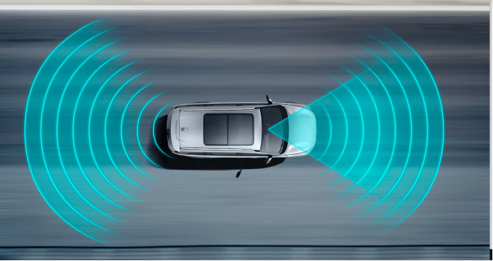
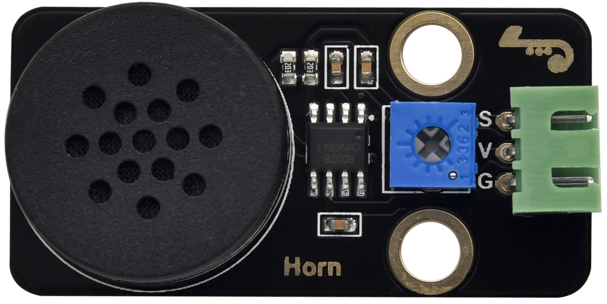
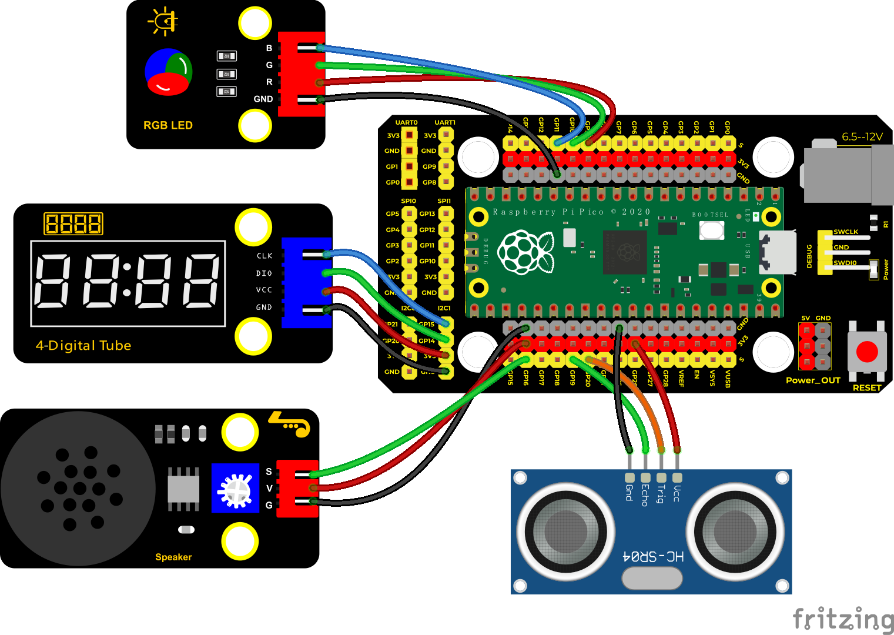
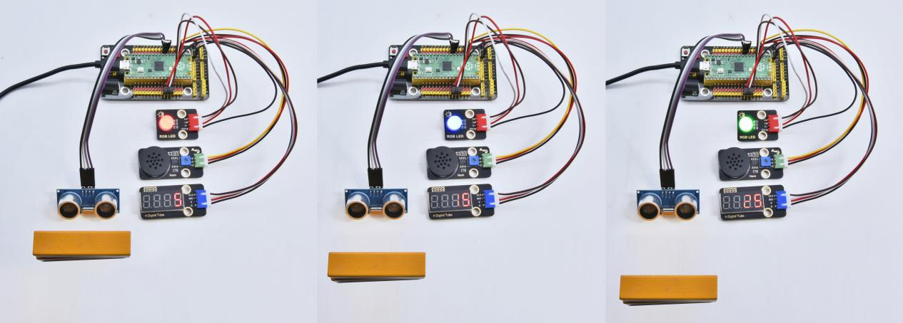

## 实验三十四 超声波雷达



### 🌟 项目简介  
你有没有想过，蝙蝠是怎么在黑夜中飞来飞去还不撞墙的？它们靠的是“回声定位”——发出超声波，再听它反弹回来的时间，就能知道前面有没有东西、有多远！  
本实验就带你用 Raspberry Pi Pico 搭建一个迷你版“超声波雷达”：  
✅ 用 HC-SR04 测出前方障碍物的距离（单位：厘米）  
✅ 用四位数码管实时显示这个距离数字  
✅ 用 RGB 灯根据距离变颜色（近→红，中→蓝，远→绿）  
✅ 用喇叭发出不同音调的声音（越近声音越高，像警报一样！）  

就像真正的雷达一样，看得见、听得着、还亮得清清楚楚！

---

### 🔍 工作原理  
- **超声波传感器（HC-SR04）**：  
  - Trigger 引脚发出一个持续 10 微秒的高电平脉冲 → 传感器发射一串人耳听不见的超声波  
  - Echo 引脚等待回波返回 → 高电平持续时间 = 声波来回飞行的时间  
  - 声速 ≈ 343 米/秒 → 每微秒约 0.0343 厘米 → 距离 = 时间 × 0.0343 ÷ 2（除以2是因为是“来回”路程）  

- **TM1650 四位数码管**：  
  - 通过 I²C 类似协议（CLK + DIO 两根线）控制，不用复杂接线，轻松显示 0–9999  

- **RGB 模块（共阴）**：  
  - 红、绿、蓝三个 LED 共用一个负极（GND），正极分别接 Pico 的 PWM 引脚  
  - 用 `duty_u16(65535)` 表示最亮，`0` 表示熄灭  

- **喇叭模块（带功放）**：  
  - 用 PWM 控制频率（如 532Hz、880Hz）发出不同音调，音量由 `duty_u16(1000)` 控制（适中不刺耳）

  
我们知道，蝙蝠飞行与获取猎物是通过回声定位的。在现实生活中有种在水里专用的电子设备：声呐，一种声学探测设备，由于 电磁波在水中衰减的速率非常的高，无法做为侦测的讯号来源，因此以声波探测水面下的人造物体成为运用最广泛的手段在水中进行观察和测量，具有得天独厚条件的只有声波。这是由于其他探测手段的作用距离都很短，光在水中的穿透能力很有限，即使在最清澈的海水中，人们也只能看到十几米到几十米内的物体； 电磁波在水中也衰减太快，而且波长越短，损失越大，即使用大功率的低频电磁波，也只能传播几十米。然而，声波在水中传播的衰减就小得多，在[深海声道](https://baike.sogou.com/lemma/ShowInnerLink.htm?lemmaId=73004794&ss_c=ssc.citiao.link)中爆炸一个几公斤的炸弹，在两万公里外还可以收到 信号，低频的声波还可以穿透海底几千米的地层，并且得到地层中的信息。在水中进行测量和观察，至今还没有发现比声波更有效的手段。

在前面实验中，我们学会了控制RGB模块发出彩色光；也学会了利用功放喇叭模块发出不同频率的声音及播放音乐，我们也学会了利用超声波传感器检测前方障碍物的距离，也会用四位数码管来显示检测数据；如果说，我们把这几个模块结合起来呢？我们利用距离大小控制功放喇叭模块模块响起对应频率的声音和RGB亮起对应颜色，然后把这个距离显示在四位数码管上。这就搭建好了一个简易的超声波雷达系统。

---

### 🧰 所需材料  

|  |      |                       |  |  |
|--------------------------------------------------------------------------|----------------------------------------------------------------------|----------------------------------------------------------------------|-------------------------------------------------------|-------------------------------------------------------|
| Raspberry Pi Pico板 ×1                                                   | Raspberry Pi Pico扩展板 ×1                                           | HC-SR04超声波传感器 ×1                                               | keyes DIY电子积木 8002b功放 喇叭模块 ×1               | keyes DIY电子积木 共阴RGB模块 ×1                      |
|                     |  |  |   |                                                       |
| keyes DIY电子积木 TM1650四位数码管模块 ×1                                | 防反插4Pin ×3                                                        | 防反插3Pin ×1                                                        | MicroUSB线 ×1                                         |                                                       |

> ✅ 小提示：所有模块都带防反插接口，插错方向是插不进去的，安全又省心！

---

### 🔌 接线图  

  

📌 **接线说明（请对照图仔细连接）：**  
| 模块             | 连接到 Pico 引脚 | 说明                     |
|------------------|------------------|--------------------------|
| HC-SR04 Trigger  | GP20             | 发送超声波信号            |
| HC-SR04 Echo     | GP19             | 接收回波信号              |
| TM1650 CLK       | GP15             | 数码管时钟线              |
| TM1650 DIO       | GP14             | 数码管数据线              |
| RGB Red          | GP9              | 红色通道（PWM）           |
| RGB Green        | GP10             | 绿色通道（PWM）           |
| RGB Blue         | GP11             | 蓝色通道（PWM）           |
| 喇叭模块 IN      | GP16             | 输入音频信号（PWM）       |
| 所有模块 GND     | Pico GND         | 共地，非常重要！          |
| 所有模块 VCC     | Pico VSYS 或 5V  | 注意：TM1650 和 HC-SR04 用 5V 更稳定（扩展板已引出） |

> ⚠️ 安全提醒：  
> - HC-SR04 的 VCC 请务必接 **5V**（不是 3.3V），否则测距不准或没反应！  
> - RGB 是**共阴**类型，GND 接 Pico GND，不要接反！  
> - 插线前请断开 USB 线，接完再插上运行程序。

---

### 💻 示例代码（MicroPython）  

```python
# Keyes Starter Kit for Raspberry Pi Pico
# 课程34：超声波雷达
# 功能：测距 → 显示 → 变色 → 发声

from machine import Pin, PWM
import utime

# ========== TM1650 四位数码管驱动 ==========
ADDR_DIS = 0x48  # 显示模式命令
ADDR_KEY = 0x49  # 读按键命令（本实验不用）
BRIGHT_TYPICAL = 2  # 亮度等级：0~7，2为适中
on = 1
off = 0

# 数字0~9的段码（共阴，对应a~g+dp）
NUM = [0x3f, 0x06, 0x5b, 0x4f, 0x66, 0x6d, 0x7d, 0x07, 0x7f, 0x6f]
# 四位数码管地址（从左到右：千、百、十、个）→ 注意顺序是反的！
DIG = [0x6e, 0x6c, 0x6a, 0x68]  # 对应第4、3、2、1位
DOT = [0, 0, 0, 0]  # 小数点，默认全关

clkPin = 15
dioPin = 14
clk = Pin(clkPin, Pin.OUT)
dio = Pin(dioPin, Pin.OUT)

DisplayCommand = 0

def writeByte(wr_data):
    global clk, dio
    for i in range(8):
        if wr_data & 0x80:
            dio.value(1)
        else:
            dio.value(0)
        clk.value(0)
        utime.sleep_us(1)
        clk.value(1)
        utime.sleep_us(1)
        clk.value(0)
        wr_data <<= 1

def start():
    global clk, dio
    dio.value(1)
    clk.value(1)
    utime.sleep_us(1)
    dio.value(0)

def ack():
    global clk, dio
    clk.value(0)
    utime.sleep_us(1)
    dio = Pin(dioPin, Pin.IN)
    # 等待应答（低电平）
    for _ in range(5000):
        if dio.value() == 0:
            break
        utime.sleep_us(1)
    clk.value(1)
    utime.sleep_us(1)
    clk.value(0)
    dio = Pin(dioPin, Pin.OUT)

def stop():
    global clk, dio
    dio.value(0)
    clk.value(1)
    utime.sleep_us(1)
    dio.value(1)

def displayBit(bit, num):
    # bit: 1~4（个、十、百、千位），num: 0~9
    if num > 9 or bit < 1 or bit > 4:
        return
    start()
    writeByte(ADDR_DIS)
    ack()
    writeByte(DisplayCommand)
    ack()
    stop()

    start()
    writeByte(DIG[bit-1])  # 位选
    ack()
    if DOT[bit-1]:
        writeByte(NUM[num] | 0x80)  # 加小数点
    else:
        writeByte(NUM[num])
    ack()
    stop()

def clearBit(bit):
    if bit < 1 or bit > 4:
        return
    start()
    writeByte(ADDR_DIS)
    ack()
    writeByte(DisplayCommand)
    ack()
    stop()

    start()
    writeByte(DIG[bit-1])
    ack()
    writeByte(0x00)  # 全灭
    ack()
    stop()

def setBrightness(b=BRIGHT_TYPICAL):
    global DisplayCommand
    DisplayCommand = (DisplayCommand & 0x0f) | (b << 4)

def setMode(segment=0):
    global DisplayCommand
    DisplayCommand = (DisplayCommand & 0xf7) | (segment << 3)

def displayOnOFF(OnOff=1):
    global DisplayCommand
    DisplayCommand = (DisplayCommand & 0xfe) | OnOff

def displayDot(bit, OnOff):
    if 1 <= bit <= 4:
        DOT[bit-1] = 1 if OnOff else 0

def InitDigitalTube():
    setBrightness(2)
    setMode(0)
    displayOnOFF(1)
    for i in range(4):
        clearBit(i+1)

def ShowNum(num):
    # 显示0~9999，自动补零（如 5 显示为 "   5"）
    if num < 0:
        num = 0
    if num > 9999:
        num = 9999
    d1 = num % 10        # 个位
    d2 = (num // 10) % 10  # 十位
    d3 = (num // 100) % 10 # 百位
    d4 = num // 1000       # 千位

    displayBit(1, d1)  # 个位（最右边）
    if num < 10:
        clearBit(2)
        clearBit(3)
        clearBit(4)
    elif num < 100:
        displayBit(2, d2)
        clearBit(3)
        clearBit(4)
    elif num < 1000:
        displayBit(2, d2)
        displayBit(3, d3)
        clearBit(4)
    else:
        displayBit(2, d2)
        displayBit(3, d3)
        displayBit(4, d4)

# ========== RGB 灯控制 ==========
pwm_r = PWM(Pin(9))
pwm_g = PWM(Pin(10))
pwm_b = PWM(Pin(11))
pwm_r.freq(1000)
pwm_g.freq(1000)
pwm_b.freq(1000)

def light(red, green, blue):
    # red/green/blue 范围：0 ~ 65535（0=灭，65535=最亮）
    pwm_r.duty_u16(red)
    pwm_g.duty_u16(green)
    pwm_b.duty_u16(blue)

# ========== 超声波测距函数 ==========
def getDistance(trigger, echo):
    # 发出10us触发脉冲
    trigger.low()
    utime.sleep_us(2)
    trigger.high()
    utime.sleep_us(10)
    trigger.low()

    # 等待Echo变高 → 开始计时
    while echo.value() == 0:
        start_time = utime.ticks_us()
    
    # 等待Echo变低 → 停止计时
    while echo.value() == 1:
        end_time = utime.ticks_us()
    
    # 计算距离（单位：厘米）
    duration = end_time - start_time
    distance_cm = duration * 0.0343 / 2  # 声速343m/s = 0.0343cm/us
    return distance_cm

# ========== 喇叭发声函数 ==========
trigger = Pin(20, Pin.OUT)
echo = Pin(19, Pin.IN)
buzzer = PWM(Pin(16))

def playtone(frequency):
    buzzer.duty_u16(1000)  # 音量适中
    buzzer.freq(frequency)

def bequiet():
    buzzer.duty_u16(0)  # 完全静音

# ========== 主程序开始 ==========
InitDigitalTube()

print("超声波雷达启动！请在前方移动手或书本...")
utime.sleep(1)

while True:
    try:
        dist = getDistance(trigger, echo)
        distance = int(dist) if dist > 0 and dist < 400 else 0
        
        # 在数码管显示距离
        ShowNum(distance)
        
        # 根据距离控制灯光和声音
        if distance <= 5:
            playtone(880)    # 高音 A5（警报级！）
            utime.sleep(0.1)
            bequiet()
            light(65535, 0, 0)  # 红色：危险距离！
        elif distance <= 15:
            playtone(532)    # 中音 C5
            utime.sleep(0.2)
            bequiet()
            light(0, 0, 65535)  # 蓝色：注意距离
        else:
            light(0, 65535, 0)  # 绿色：安全距离
            
        utime.sleep(0.3)  # 每0.3秒刷新一次，避免太快闪烁
        
    except Exception as e:
        print("测距出错：", e)
        light(65535, 65535, 0)  # 黄色闪烁提示错误
        utime.sleep(0.5)
```

---

### 📚 代码解析（小学生也能懂！）  

| 代码片段 | 解释说明 |
|----------|----------|
| `displayBit(1, d1)` | 把数字 `d1`（个位）显示在数码管**最右边一位**上 |
| `clearBit(2)` | 把**第二位**（十位）清空，变成黑的，不显示任何数字 |
| `light(65535, 0, 0)` | 红灯最亮（65535），绿灯蓝灯全关 → 整体发**纯红色** |
| `playtone(880)` | 让喇叭发出频率为 880 Hz 的声音 → 是钢琴上的 A5 音，尖锐响亮！ |
| `duration * 0.0343 / 2` | 超声波走的是“来回路”，所以要除以2；0.0343 是每微秒走多少厘米（343 m/s ÷ 1,000,000） |

✅ 小技巧：想让声音更“雷达感”？可以试试改成 `playtone(440)`（A4）、`playtone(660)`（E5）等，组成简单旋律！

---

### ✅ 实验现象  

接好线、烧录代码后，你会看到：  
🔹 数码管一开始显示 `0000`（或乱码，稍等1秒后自动清零）  
🔹 把手慢慢靠近超声波传感器（距离 < 5 cm）→ 数码管显示实际距离（如 `0008`），同时：  
　　🔸 喇叭“嘀！”一声高音（880Hz），RGB 灯亮起**红色**  
🔹 手移远一点（5–15 cm）→ 喇叭“嘟～”一声中音（532Hz），RGB 灯变成**蓝色**  
🔹 手再远些（>15 cm）→ 喇叭不响，RGB 灯保持**绿色**  
🔹 移开手或距离太远（>400 cm）→ 显示 `0000`，绿灯常亮  

🎉 恭喜！你已经拥有自己的第一台“掌上雷达”啦！



---

### ⚠️ 注意事项（安全 & 成功率翻倍！）  

- ✅ **必须用 5V 给 HC-SR04 供电！**（扩展板上的 `5V` 接口）  
- ✅ 所有 GND 必须连在一起（Pico GND、传感器 GND、数码管 GND、RGB GND、喇叭 GND）  
- ✅ HC-SR04 不要对着吸音材料（厚窗帘、毛绒玩具）测试，会收不到回波 → 改用书本、手掌、墙壁  
- ✅ 如果数码管不亮：检查 `setBrightness(2)` 是否生效；拔掉 USB 重插一次  
- ✅ 如果喇叭无声：确认 `buzzer.duty_u16(1000)` 不是 0；换根杜邦线测试  
- ✅ 如果测距总是 0 或很大（如 9999）：检查 Trigger/Echo 是否接反；用万用表测电压是否正常  

---

### 🧠 扩展思维  
如果想让 RGB 灯的颜色随着距离**连续渐变**（比如从红→橙→黄→绿），而不是只在三个档位跳变，该怎样修改 `light(...)` 这一行代码？