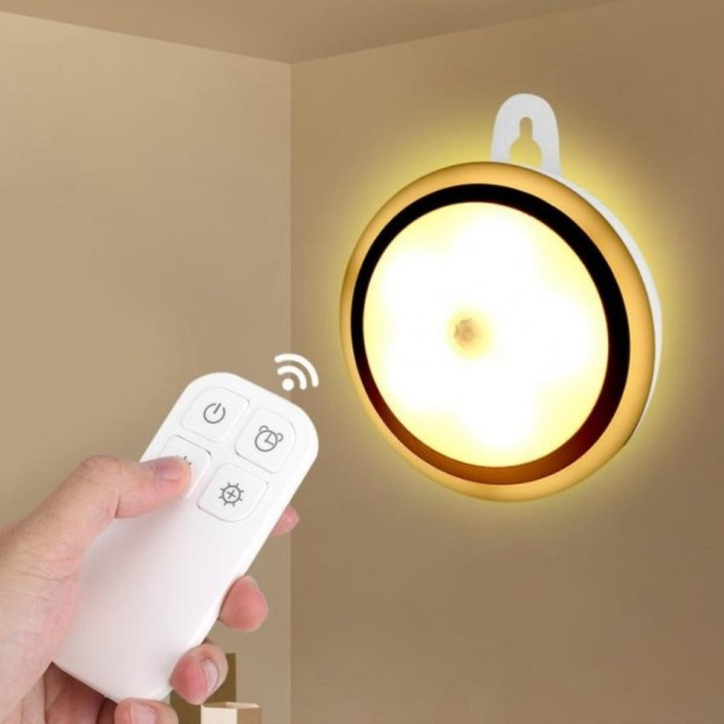
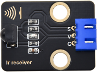
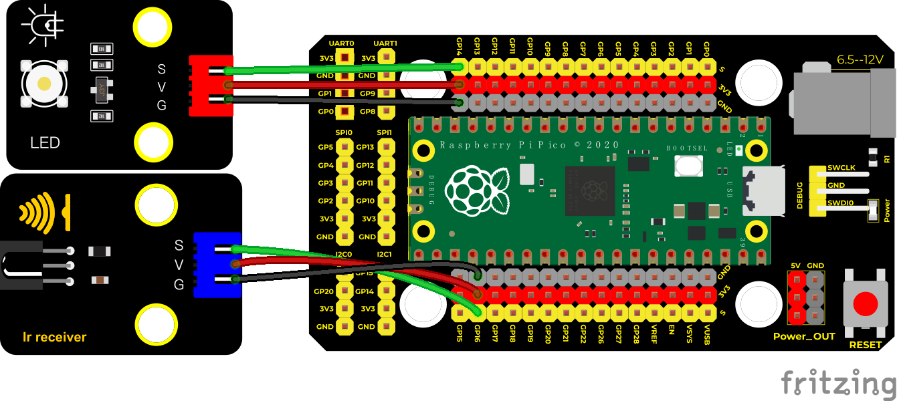
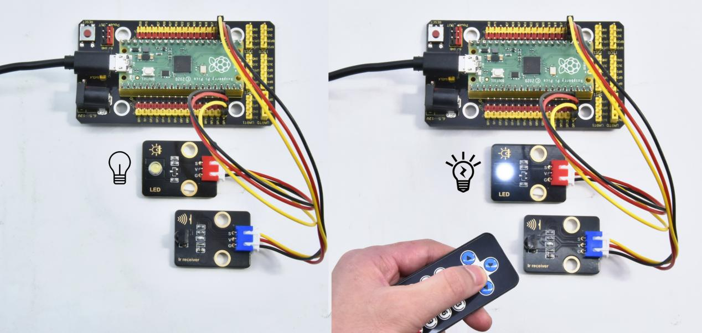

## 实验三十五 红外遥控灯



### 🌟 项目简介  
你有没有试过躺在床上，眼睛都快闭上了，却发现灯还亮着？跑去关灯又得爬起来……太麻烦啦！  
这节课，我们就用**红外遥控器**像控制电视一样控制LED灯——按一下“OK”键，灯亮；再按一下，“啪”，灯灭！还能用数字键（1~9）调节亮度哦～是不是很酷？✨  
前面我们学过点亮LED、用PWM调光，也学会了用红外接收模块读取遥控信号。今天，就把它们“串”起来，做一个真正实用的小发明！

---

### ⚙️ 工作原理  
- 红外遥控器按下按键时，会发出一串**特定时长的红外脉冲信号**（像摩斯电码），被红外接收模块（KE4036）接收并转换成高低电平序列。  
- Pico通过GPIO16读取这串信号，并用程序**识别出是哪个按键**（比如“Ok”“1”“2”等）。  
- 我们用一个**布尔变量 `flag`** 记住LED当前状态（亮 or 灭）：  
  - 按一次“Ok” → `flag` 切换 → LED状态翻转（亮↔灭）  
- 用数字键“1”~“9”和“0”控制LED亮度（0%~100%，共10档），通过**PWM（脉宽调制）** 实现——数值越大，灯越亮！

> 💡 小知识：PWM就像“快速开关灯”，人眼看不见闪烁，只感觉亮度变化。Pico的Pin(14)支持PWM输出，所以我们改用 `PWM` 类来控制亮度，比单纯开关更智能！

---

### 🧰 所需材料  

|  |  |                 |  |
|--------------------------------------------------------------------------|------------------------------------------------------------------|----------------------------------------------------------------------|-------------------------------------------------------|
| Raspberry Pi Pico板 ×1                                                   | Raspberry Pi Pico扩展板 ×1                                       | Keyes 白色LED模块 ×1                                                 | Keyes 红外接收模块 ×1                                 |
|                      |                   |  |                                                       |
| Micro-USB数据线 ×1                                                       | 普通红外遥控器（带数字键和OK键）×1                               | 防反插3Pin杜邦线 ×2                                                  |                                                       |

✅ **小提示**：遥控器建议使用配套的Keyes遥控器（图中所示），或常见空调/电视遥控器（部分按键编码可能不同，可先用实验二十一验证是否能识别）。

---

### 🔌 接线图  

  

📌 **接线说明（请对照图检查）：**  
- **LED模块**：  
  - VCC → 扩展板 `5V`（或Pico的 `VSYS`）  
  - GND → 扩展板 `GND`  
  - SIG → Pico 的 `GP14`（即物理引脚第19脚）  
- **红外接收模块（KE4036）**：  
  - VCC → 扩展板 `5V`  
  - GND → 扩展板 `GND`  
  - OUT → Pico 的 `GP16`（即物理引脚第21脚）  

⚠️ 注意：红外接收模块背面有标记 `VCC GND OUT`，务必按顺序连接，接反可能烧坏模块！

---

### 💻 示例代码（MicroPython）  

```python
# Keyes Starter Kit for Raspberry Pi Pico
# 实验35：红外遥控灯（支持开关 + 10档亮度调节）
# 作者：Keyes创客教育团队｜适配MicroPython（Raspberry Pi Pico）

from machine import Pin, PWM
import time

# === 初始化硬件 ===
led = PWM(Pin(14))      # GP14 支持PWM，用于调光
led.freq(1000)          # 设置PWM频率为1kHz（人眼无频闪感）
led.duty_u16(0)         # 初始关闭LED（占空比0）

ird = Pin(16, Pin.IN)   # 红外接收信号接GP16

# === 遥控按键编码表（Keyes配套遥控器）===
# 格式：按键名 → 32位二进制码字符串（L=低电平，H=高电平）
act = {
    "1": "LLLLLLLLHHHHHHHHLHHLHLLLHLLHLHHH",
    "2": "LLLLLLLLHHHHHHHHHLLHHLLLLHHLLHHH",
    "3": "LLLLLLLLHHHHHHHHHLHHLLLLLHLLHHHH",
    "4": "LLLLLLLLHHHHHHHHLLHHLLLLHHLLHHHH",
    "5": "LLLLLLLLHHHHHHHHLLLHHLLLHHHLLHHH",
    "6": "LLLLLLLLHHHHHHHHLHHHHLHLHLLLLHLH",
    "7": "LLLLLLLLHHHHHHHHLLLHLLLLHHHLHHHH",
    "8": "LLLLLLLLHHHHHHHHLLHHHLLLHHLLLHHH",
    "9": "LLLLLLLLHHHHHHHHLHLHHLHLHLHLLHLH",
    "0": "LLLLLLLLHHHHHHHHLHLLHLHLHLHHLHLH",
    "Up": "LLLLLLLLHHHHHHHHLHHLLLHLHLLHHHLH",
    "Down": "LLLLLLLLHHHHHHHHHLHLHLLLLHLHLHHH",
    "Left": "LLLLLLLLHHHHHHHHLLHLLLHLHHLHHHLH",
    "Right": "LLLLLLLLHHHHHHHHHHLLLLHLLLHHHHLH",
    "Ok": "LLLLLLLLHHHHHHHHLLLLLLHLHHHHHHLH",
    "*": "LLLLLLLLHHHHHHHHLHLLLLHLHLHHHHLH",
    "#": "LLLLLLLLHHHHHHHHLHLHLLHLHLHLHHLH"
}

# === 红外信号解码函数 ===
def read_ircode(ird):
    wait = 1
    complete = 0
    seq0 = []
    seq1 = []
    
    # 等待信号起始低电平（下降沿）
    while wait == 1:
        if ird.value() == 0:
            wait = 0
    
    # 记录后续高低电平持续时间（单位：微秒）
    while wait == 0 and complete == 0:
        start = time.ticks_us()
        # 记录低电平时间
        while ird.value() == 0:
            ms1 = time.ticks_us()
            diff = time.ticks_diff(ms1, start)
            seq0.append(diff)
        
        # 记录高电平时间
        while ird.value() == 1 and complete == 0:
            ms2 = time.ticks_us()
            diff = time.ticks_diff(ms2, ms1)
            if diff > 10000:  # 超过10ms认为是信号结束
                complete = 1
            seq1.append(diff)
    
    # 将时间序列转换为L/H字符串（简化判断）
    code = ""
    for val in seq1:
        if val < 700:
            code += "L"  # 极短脉冲 → L
        elif val < 2000:
            code += "H"  # 中等脉冲 → H
        # 其他忽略（噪声或起始引导码）
    
    # 匹配按键
    command = ""
    for k, v in act.items():
        if code == v:
            command = k
            break
    
    return command if command else "UNKNOWN"

# === 主程序 ===
flag = False  # LED开关状态：False=灭，True=亮
brightness = 0  # 当前亮度档位（0~9，对应0%~100%）

print("红外遥控灯已启动！")
print("按 OK 键切换开关；按 0~9 键调节亮度（0=最暗，9=最亮）")

while True:
    cmd = read_ircode(ird)
    
    if cmd != "UNKNOWN":
        print(f"📡 收到指令：{cmd}")
    
    # 【开关控制】按 OK 键翻转LED状态
    if cmd == "Ok":
        flag = not flag
        if flag:
            led.duty_u16(65535)  # 最亮（100%）
            print("LED 已开启")
        else:
            led.duty_u16(0)      # 完全关闭
            print("LED 已关闭")
    
    # 【亮度调节】按数字键设置亮度档位（0~9）
    elif cmd in "0123456789":
        brightness = int(cmd)
        # 映射为0~65535的PWM值（0→0，9→65535）
        pwm_val = int(brightness * 65535 / 9)
        led.duty_u16(pwm_val)
        print(f"亮度设为 {brightness}/9（{int(pwm_val/65535*100)}%）")
    
    time.sleep(0.2)  # 防抖，避免重复触发
```

---

### 📚 代码解析（小学生也能懂！）  

| 代码片段 | 说明 |
|----------|------|
| `led = PWM(Pin(14))` | 告诉Pico：“我要用14号引脚做‘调光师’，不是简单开关！” |
| `led.duty_u16(65535)` | 把LED亮度调到**最亮**（65535是MicroPython中PWM的最大值） |
| `flag = not flag` | “not”就是“取反”：如果原来是`True`，就变`False`；原来是`False`，就变`True`——这就是“按一下开，再按一下关”的魔法！ |
| `brightness = int(cmd)` | 把收到的字符“5”变成数字5，方便计算亮度值 |
| `pwm_val = int(brightness * 65535 / 9)` | 把0~9档均匀分配到0~65535之间，让亮度变化更平滑 |

✅ **为什么加 `time.sleep(0.2)`？**  
遥控器按键时会有“抖动”，就像按开关时手抖了一下，可能被误读成按了两次。加个小暂停，让Pico“缓一缓”，就能准确识别每一次按键啦！

---

### ✅ 实验现象  

1. 接好线路，上传代码，打开Thonny的Shell窗口（或串口监视器）。  
2. 屏幕会显示：`🔴 红外遥控灯已启动！`  
3. 对准红外接收头，按下遥控器任意键：  
   - Shell显示 `📡 收到指令：1`、`📡 收到指令：Ok` 等；  
   - 按 `Ok` 键：LED灯立即亮起或熄灭；  
   - 按 `1`~`9` 或 `0`：LED亮度实时变化（`0`最暗，几乎不亮；`9`最亮）；  
4. 如果按了没反应？别急！检查：  
   - 遥控器电池是否有电？对准接收头（距离≤5米，避开强光直射）；  
   - 接线是否松动？特别是红外模块的 `OUT` 是否接在 `GP16`；  
   - Shell里是否出现 `UNKNOWN`？说明遥控器编码不在表中，可先运行实验二十一打印原始码，再补充到 `act` 字典里。

---

### ⚠️ 注意事项  

- 🔋 **安全第一**：Pico板请使用**5V/1A以上稳压电源**或电脑USB供电，勿用劣质充电宝！  
- 🌞 **避光安装**：红外接收模块怕阳光、日光灯直射，实验时尽量拉上窗帘或关灯；  
- 🔌 **防反插提醒**：所有模块都有防反插设计（凸点对凹槽），强行硬插会损坏针脚！  
- 🧩 **扩展板兼容性**：本课使用Keyes KS3017扩展板（带5V稳压），若用其他扩展板，请确认是否提供5V输出（红外模块和LED需5V工作）；  
- 🐞 **调试小技巧**：把代码中 `print(f"📡 收到指令：{cmd}")` 前面的 `#` 去掉，就能实时看到接收到的原始码，方便匹配新遥控器！

---

### 🧠 扩展思维  
在本课 LED 亮度可调的基础上，如果想让它实现“呼吸灯”效果（灯光缓慢渐亮再渐暗，循环往复），该怎样修改代码？


