## 实验三十六 综合实验

****

### 🌟 项目简介  
前面我们已经完成了多个独立小实验（如LED闪烁、红外遥控、超声波测距等），每次都要单独上传代码，操作比较麻烦。那能不能把它们“打包”在一起，用一个按键就能切换不同功能呢？  
**当然可以！** 本实验就是这样一个“多功能集成器”：  
✅ 按一次键 → 切换一个功能  
✅ 循环切换 → 6812彩灯 / 红外接收 / 摇杆读取 / 电位器调光 / 超声波测距  
✅ 所有功能共用同一块Pico板和同一份代码，无需反复烧录！

---

### 🔧 工作原理  
我们利用**按键中断**来统计按下次数，再用 `keys % 5` 计算余数（0、1、2、3、4），每个余数对应一个实验功能：  
- `余数 0` → 随机颜色循环点亮 4 颗 6812 RGB 灯  
- `余数 1` → 等待红外遥控信号，并在串口打印按键编码（如“Up”“OK”）  
- `余数 2` → 实时读取摇杆的 X/Y 轴模拟值 + 按键 Z 值，并打印到串口  
- `余数 3` → 旋转电位器调节白色LED亮度（PWM控制）  
- `余数 4` → 触发超声波模块，测量前方距离（单位：厘米）  

所有传感器/模块共用 Pico 的 GPIO 引脚，通过程序逻辑分时控制，互不干扰。

---

### 📦 所需材料  

|  |      |                 | 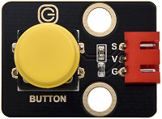 |  |
|--------------------------------------------------------------------------|----------------------------------------------------------------------|----------------------------------------------------------------------|-------------------------------------------------------|-------------------------------------------------------|
| Raspberry Pi Pico板 ×1                                                   | Raspberry Pi Pico扩展板 ×1                                           | keyes DIY电子积木 白色LED模块 ×1                                     | keyes DIY电子积木 单路按键模块 ×1                     | keyes DIY电子积木 旋转电位器模块 ×1                   |
|                     | 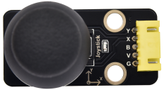                |                       |  |   |
| keyes DIY电子积木 红外接收模块 ×1                                        | keyes DIY电子积木 摇杆模块 ×1                                        | keyes brick HC-SR04超声波传感器 ×1                                   | Keyes DIY电子积木 6812 RGB模块 ×1                     | MicroUSB线 ×1                                         |
|      |  | 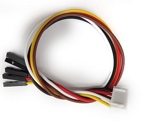 |        |                                                       |
| 防反插3Pin ×5                                                            | 防反插4Pin ×1                                                        | 防反插5Pin ×1                                                        | 遥控器 ×1                                             |                                                       |

> 💡 小提示：所有模块都使用标准防反插接口，插错方向无法插入，接线更安全、更省心！

---

### 🔌 接线图  

**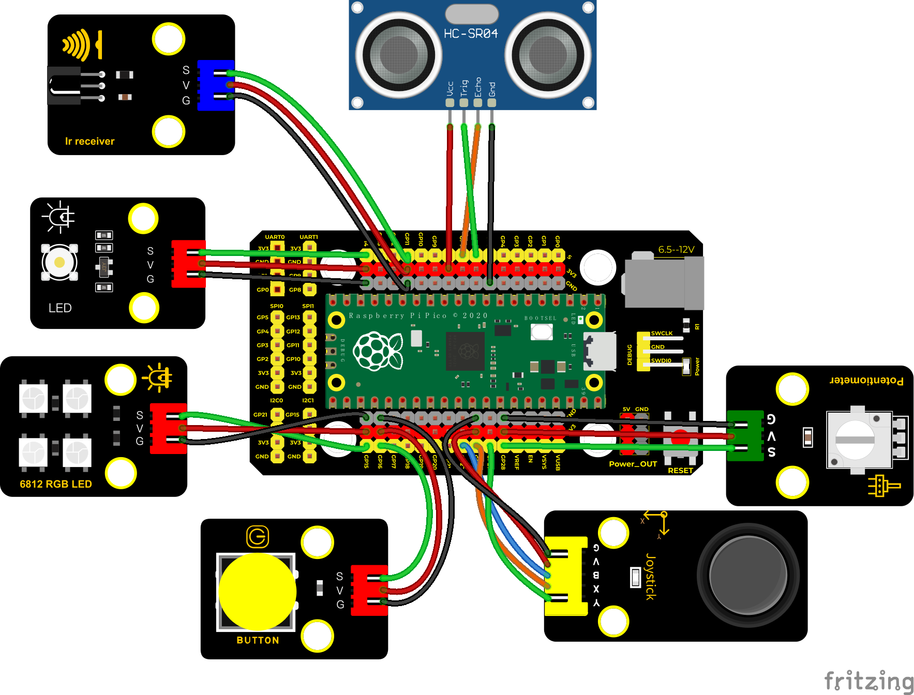**

📌 **关键引脚对照表（请务必按此连接）：**  
| 模块名称         | 连接引脚（Pico端） | 说明                     |
|------------------|--------------------|--------------------------|
| 白色LED模块      | GP14               | PWM输出，控制亮度        |
| 单路按键模块     | GP16               | 下降沿触发中断           |
| 旋转电位器模块   | ADC28（GP28）      | 模拟输入，读取旋钮位置   |
| 红外接收模块     | GP11               | 数字输入，接收红外信号   |
| 摇杆模块（Z键）  | GP22               | 数字输入，检测是否按下   |
| 摇杆模块（X轴）  | ADC26（GP26）      | 模拟输入，X方向电压      |
| 摇杆模块（Y轴）  | ADC27（GP27）      | 模拟输入，Y方向电压      |
| 超声波模块（Trig）| GP6                | 输出触发脉冲             |
| 超声波模块（Echo）| GP7                | 输入回波信号             |
| 6812 RGB模块     | GP15               | PIO高速驱动，单线协议    |

> ✅ 接线完成后，请再次核对——尤其注意 **GP15（RGB）、GP11（红外）、GP6/GP7（超声波）** 这几组不能接错！

---

### 💻 示例代码（MicroPython）

```python
# Keyes Starter Kit for Raspberry Pi Pico
# 课程 36
# Comprehensive experiment

from machine import Pin, PWM, ADC
import array, time
import random
import rp2

# 初始化各传感器
potentiometer = ADC(28)           # 电位器 → GP28
button = Pin(16, Pin.IN, Pin.PULL_UP)  # 按键 → GP16（上拉，按下为低电平）
led = PWM(Pin(14))                # 白色LED → GP14
led.freq(1000)

ird = Pin(11, Pin.IN)             # 红外接收 → GP11
B = Pin(22, Pin.IN, Pin.PULL_UP) # 摇杆Z键 → GP22（上拉）
X = ADC(26)                       # 摇杆X轴 → GP26
Y = ADC(27)                       # 摇杆Y轴 → GP27

# 超声波模块
trigger = Pin(6, Pin.OUT)
echo = Pin(7, Pin.IN)

# 6812 RGB灯配置
NUM_LEDS = 4
PIN_NUM = 15
brightness = 0.2

# 红外遥控指令码库（Keyes遥控器常用按键）
act = {
    "1": "LLLLLLLLHHHHHHHHLHHLHLLLHLLHLHHH",
    "2": "LLLLLLLLHHHHHHHHHLLHHLLLLHHLLHHH",
    "3": "LLLLLLLLHHHHHHHHHLHHLLLLLHLLHHHH",
    "4": "LLLLLLLLHHHHHHHHLLHHLLLLHHLLHHHH",
    "5": "LLLLLLLLHHHHHHHHLLLHHLLLHHHLLHHH",
    "6": "LLLLLLLLHHHHHHHHLHHHHLHLHLLLLHLH",
    "7": "LLLLLLLLHHHHHHHHLLLHLLLLHHHLHHHH",
    "8": "LLLLLLLLHHHHHHHHLLHHHLLLHHLLLHHH",
    "9": "LLLLLLLLHHHHHHHHLHLHHLHLHLHLLHLH",
    "0": "LLLLLLLLHHHHHHHHLHLLHLHLHLHHLHLH",
    "Up": "LLLLLLLLHHHHHHHHLHHLLLHLHLLHHHLH",
    "Down": "LLLLLLLLHHHHHHHHHLHLHLLLLHLHLHHH",
    "Left": "LLLLLLLLHHHHHHHHLLHLLLHLHHLHHHLH",
    "Right": "LLLLLLLLHHHHHHHHHHLLLLHLLLHHHHLH",
    "Ok": "LLLLLLLLHHHHHHHHLLLLLLHLHHHHHHLH",
    "*": "LLLLLLLLHHHHHHHHLHLLLLHLHLHHHHLH",
    "#": "LLLLLLLLHHHHHHHHLHLHLLHLHLHLHHLH"
}

#红外解码函数（读取一次完整信号）
def read_ircode(ird):
    wait = 1
    complete = 0
    seq0 = []
    seq1 = []
    
    while wait == 1:
        if ird.value() == 0:
            wait = 0
    
    while wait == 0 and complete == 0:
        start = time.ticks_us()
        while ird.value() == 0:
            ms1 = time.ticks_us()
            diff = time.ticks_diff(ms1, start)
            seq0.append(diff)
        
        while ird.value() == 1 and complete == 0:
            ms2 = time.ticks_us()
            diff = time.ticks_diff(ms2, ms1)
            if diff > 10000:
                complete = 1
            seq1.append(diff)
    
    # 解析高/低电平时间，生成"H"/"L"字符串
    code = ""
    for val in seq1:
        if val < 2000:
            if val < 700:
                code += "L"
            else:
                code += "H"
    
    # 匹配预设指令
    command = ""
    for k, v in act.items():
        if code == v:
            command = k
            break
    return command if command else "Unknown"

#PIO程序：驱动6812 RGB灯（底层高速时序）
@rp2.asm_pio(sideset_init=rp2.PIO.OUT_LOW, out_shiftdir=rp2.PIO.SHIFT_LEFT, autopull=True, pull_thresh=24)
def sk6812():
    T1 = 2
    T2 = 5
    T3 = 3
    wrap_target()
    label("bitloop")
    out(x, 1) .side(0) [T3 - 1]
    jmp(not_x, "do_zero") .side(1) [T1 - 1]
    jmp("bitloop") .side(1) [T2 - 1]
    label("do_zero")
    nop() .side(0) [T2 - 1]
    wrap()

# 初始化PIO状态机（驱动GP15）
sm = rp2.StateMachine(0, sk6812, freq=8_000_000, sideset_base=Pin(PIN_NUM))
sm.active(1)

# RGB灯显示缓冲区
ar = array.array("I", [0 for _ in range(NUM_LEDS)])

def pixels_show():
    dimmer_ar = array.array("I", [0 for _ in range(NUM_LEDS)])
    for i, c in enumerate(ar):
        r = int(((c >> 8) & 0xFF) * brightness)
        g = int(((c >> 16) & 0xFF) * brightness)
        b = int((c & 0xFF) * brightness)
        dimmer_ar[i] = (g << 16) + (r << 8) + b
    sm.put(dimmer_ar, 8)
    time.sleep_ms(10)

def pixels_set(i, color):
    ar[i] = (color[1] << 16) + (color[0] << 8) + color[2]

#超声波测距函数（单位：厘米）
def getDistance(trigger, echo):
    trigger.low()
    time.sleep_us(2)
    trigger.high()
    time.sleep_us(10)
    trigger.low()
    
    while echo.value() == 0:
        start = time.ticks_us()
    while echo.value() == 1:
        end = time.ticks_us()
    
    d = (end - start) * 0.0343 / 2  # 声速0.0343 cm/us，除以2得单程距离
    return d

# 全局变量：记录按键次数
keys = 0

#按键中断回调函数（每按一次，keys+1）
def toggle_handle(pin):
    global keys
    time.sleep_ms(20)  # 消抖
    if pin.value() == 0:  # 确保是按下动作（低电平）
        keys += 1

# 绑定中断（下降沿触发）
button.irq(trigger=Pin.IRQ_FALLING, handler=toggle_handle)

#各功能函数
def show6812():
    R = random.randint(0, 255)
    G = random.randint(0, 255)
    B = random.randint(0, 255)
    for i in range(NUM_LEDS):
        pixels_set(i, (R, G, B))
    pixels_show()
    time.sleep(0.3)

def IRreceive():
    command = read_ircode(ird)
    print("IR Command:", command)

def showJoystick():
    B_value = B.value()
    X_value = X.read_u16()
    Y_value = Y.read_u16()
    print(f"Joystick → Button:{B_value}, X:{X_value}, Y:{Y_value}")
    time.sleep(0.1)

def adjustLight():
    pot_value = potentiometer.read_u16()
    led.duty_u16(pot_value)  # 0~65535 映射亮度
    print(f"Potentiometer: {pot_value}")

def showDistance():
    try:
        distance = getDistance(trigger, echo)
        print(f"Distance: {distance:.2f} cm")
    except:
        print("Distance: Error")
    time.sleep(0.1)

#主循环：根据按键次数切换功能
while True:
    nums = keys % 5
    print(f"Mode: {nums}")
    
    if nums == 0:
        show6812()
    elif nums == 1:
        IRreceive()
    elif nums == 2:
        showJoystick()
    elif nums == 3:
        adjustLight()
    elif nums == 4:
        showDistance()
```

---

### 📚 代码解析（小学生也能懂！）

| 代码片段 | 是什么意思？ | 小贴士 |
|----------|--------------|--------|
| `button.irq(...)` | 告诉Pico：“只要按键一按下去，立刻执行 `toggle_handle` 函数！” | 中断就像“电话铃响”，不用一直盯着看，来了就处理 |
| `keys % 5` | “用按键次数除以5，只看余数是多少” → 0→1→2→3→4→0→1…永远循环 | `%` 叫“取余运算符”，是循环切换的核心！ |
| `pixels_set(i, (R,G,B))` | 给第 `i` 颗RGB灯设置红(R)、绿(G)、蓝(B)的亮度（0~255） | 三原色混合，就能变出任何颜色！🌈 |
| `led.duty_u16(pot_value)` | 把电位器读到的数字（0~65535），直接变成LED的亮度 | 数字越大，灯越亮；0就是完全熄灭 |
| `getDistance(...)` | 发个“滴”声波出去，听它弹回来用了多久，算出有多远 | 就像蝙蝠用回声定位！🦇 |

---

### ✅ 实验现象（按顺序观察）

**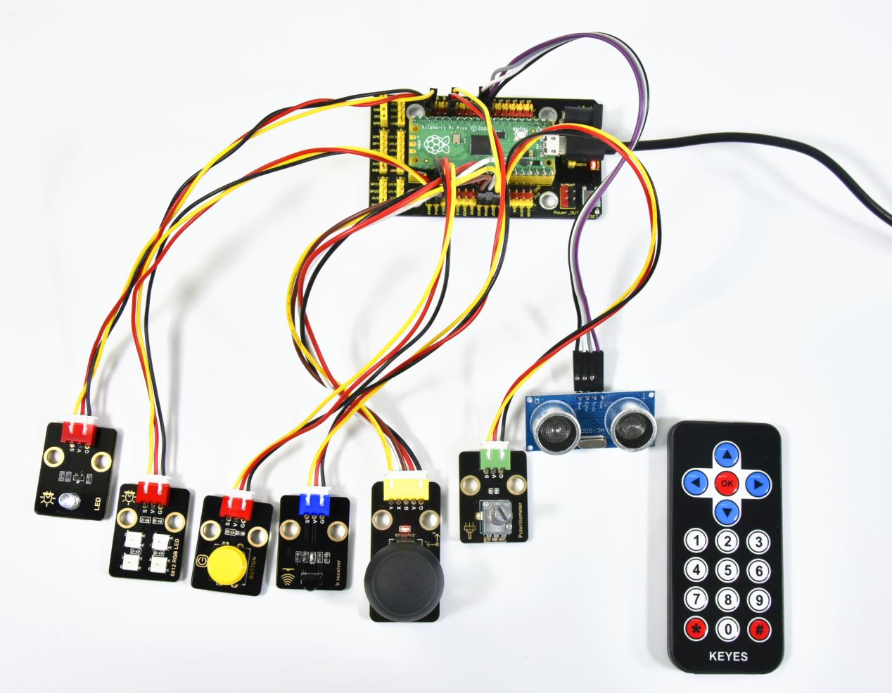**  
接好线，用USB线给Pico通电，打开Thonny或串口工具（波特率115200），看到如下效果：

1. **初始状态（按键0次 → 余数0）**  
   → 四颗6812灯珠开始随机变色，每0.3秒换一次颜色！  
   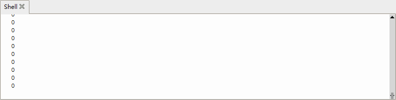

2. **按第1下 → 余数1**  
   → 彩灯停止，串口等待红外信号。拿起遥控器对准接收头，按任意键 → 显示 `"IR Command: Up"` 或 `"Ok"` 等。  
   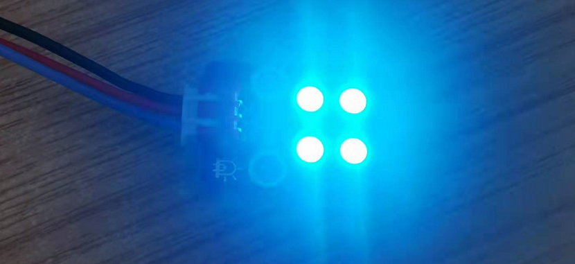

3. **按第2下 → 余数2**  
   → 串口开始快速打印摇杆数据，例如：`Joystick → Button:1, X:32768, Y:65535`（Z没按是1，X居中约32768）  
   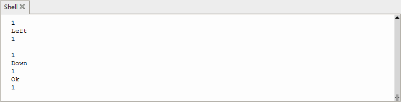

4. **按第3下 → 余数3**  
   → 白色LED亮度随电位器旋转实时变化，串口同步显示数值（0最暗，65535最亮）  
   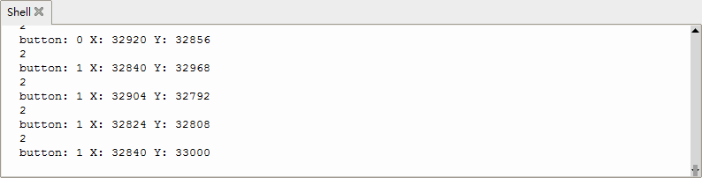

5. **按第4下 → 余数4**  
   → 串口每0.1秒打印一次距离，如 `Distance: 12.45 cm`（手靠近/远离会变化）  
   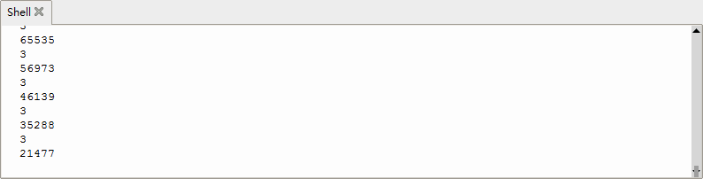

6. **按第5下 → 余数0**  
   → 回到第一步，彩灯再次闪烁！从此无限循环 ✅  

---

### ⚠️ 注意事项（安全又成功的关键！）

- 🔌 **务必使用防反插杜邦线**，插错方向可能烧毁模块！  
- 🔋 **Pico仅靠USB供电即可**，不要额外接电源，避免电压冲突。  
- 📡 **红外接收头要正对遥控器发射头**（黑色小圆点），距离建议10~30cm。  
- 📏 **超声波模块前方保持空旷**，避免斜面/吸音材料（如毛衣、海绵）影响测距。  
- 🐞 **如果串口无反应**：检查Thonny是否选对端口、波特率是否为115200、USB线是否支持数据传输（有些充电线不行）。  
- 🔄 **按键失灵？** 多按几次，或重启Pico（拔插USB），可能是接触不良或消抖未生效。

---

### 🧠 扩展思维  
在本课 6812 彩灯随机闪烁的基础上，如果想让它实现「呼吸灯」效果（渐亮→渐暗→循环），该在 `show6812()` 函数中怎样修改？

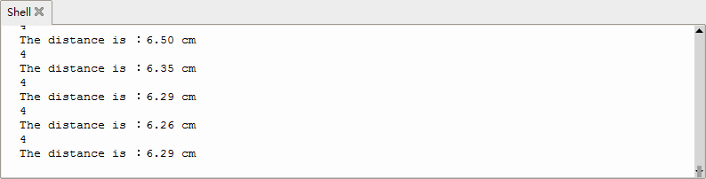