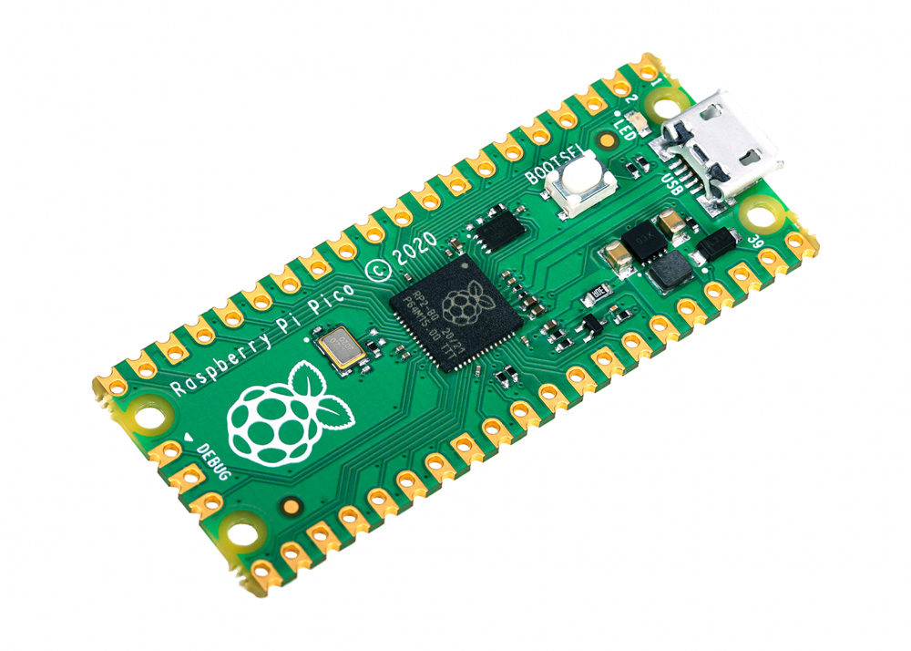
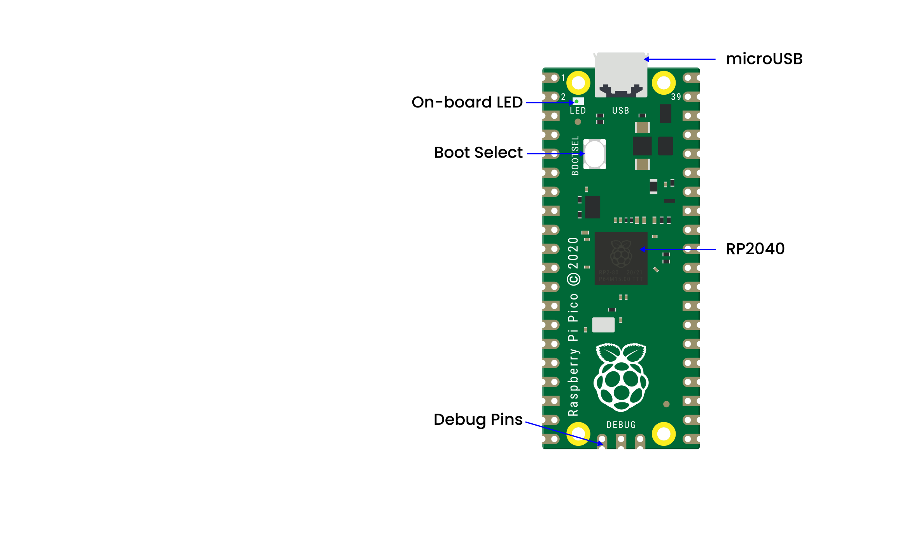

## 第1小节 Raspberry Pi Pico简介

2021年1月底，树莓派基金会发布了一款全新产品——**Raspberry Pi Pico**（简称“Pico”），正式进军微控制器领域！它性能强大、价格亲民，立刻成为全球创客和教育爱好者的热门选择。接下来，我们就一起来认识这位小巧又聪明的“新朋友”。

---

### 🌟 一块“小身材、大能量”的开发板

Pico 是一块非常小巧的电路板，尺寸只有 **21mm × 51mm**，和常见的 Arduino Nano 差不多大，却藏着一颗强劲的“心脏”。

---

### 🧠 Pico 的核心：RP2040 微控制器芯片

Pico 的核心是树莓派自主研发的 **RP2040 芯片**，它不是简单的单核芯片，而是一颗“双核小超人”：

- ✅ **双核 32 位 ARM Cortex-M0+ 处理器**  
- ✅ **最高主频 133 MHz**（默认运行在 125 MHz，可稳定超频）  
- ✅ **264 KB 高速片内 SRAM**（比很多同类芯片都多！）  
- ✅ **2 MB 板载闪存**（用于存储 MicroPython 固件和你的程序）  
- ✅ **26 个多功能 GPIO 引脚**（全部引出，方便连接各种传感器和模块）  
- ✅ **8 个可编程 I/O（PIO）状态机**——这是 Pico 的“独门绝技”，能自定义硬件外设行为，比如模拟串口、LED 灯带协议等！  
- ✅ **支持 USB 1.1 主机与设备模式**（插电脑就能当键盘、鼠标、U盘用！）  
- ✅ **内置 USB 启动模式（UF2）**——不用装驱动，插上 USB 就像 U 盘一样，拖拽代码文件即可烧录，小学生也能轻松上手！

> 💡 小知识：MicroPython 是专为微控制器设计的 Python 精简版，语法和 Python 几乎一样，学过一次，就能在 Pico、ESP32、micro:bit 等多种开发板上通用！

---

### 🔌 外观结构详解（看图识板）

- 这是一块**裸板（无焊接排针）**，出厂时不带针脚，需要自己焊接（或使用面包板夹子直接夹住焊盘）。  
- 板子做工精良，也支持表面贴装（SMD），可直接焊接进自己的电路板中。

我们来一起认一认 Pico 板上的几个关键部件：

- **MicroUSB 接口**：位于板子一端，既是供电口，也是通信口（上传代码、打印调试信息都靠它）  
- **板载 LED（绿色）**：紧挨着 USB 接口，内部连接到 **GPIO25**，是 Pico 上唯一的“自带灯”，常用来测试程序是否运行成功（比如让它闪烁）  
- **BOOTSEL 按钮（开机按钮）**：在 LED 下方一点。按住它再接 USB，Pico 就会进入“U 盘模式”，此时电脑会识别出一个名为 `RPI-RP2` 的 U 盘，你可以把 MicroPython 固件拖进去安装！  
- **Debug 接点（底部三个小圆点）**：标有 `GND`、`TX`、`RX`，是串口调试接口，初学者暂时不用管，高级玩家可用它连接逻辑分析仪或串口调试器  
- **RP2040 芯片（中央长方形黑块）**：这就是 Pico 的“大脑”，上面印着 “RP2040”，旁边还有晶振（小银色方块）为其提供精准时钟  

> ⚠️ 注意：虽然 RP2040 芯片本身支持最多 **16MB 外部闪存**，但标准版 Pico 只焊接了 **2MB**（不是 4MB，请以实物或官网参数为准）。

---

### ⚡ 电源与电压说明（安全第一！）

Pico 是一款 **3.3V 逻辑电平** 的开发板，但它非常“贴心”，支持多种供电方式：

| 引脚名   | 作用说明 |
|----------|----------|
| **GND**  | 共 **8 个接地引脚**（含 Debug 接点中的 1 个），形状为方形焊盘，便于区分 |
| **VBUS** | 来自 microUSB 的 **5V 电源输入**（仅当通过 USB 供电时才有电压） |
| **VSYS** | 主供电输入口，支持 **2V–5V 宽压输入**（比如用电池、充电宝、稳压模块供电），板载稳压器会自动转为 3.3V |
| **3V3**  | 板载稳压器输出的 **3.3V 电源**，最大可提供 **300mA 电流**，可为小功率传感器、LED 等外部设备供电 |
| **3V3_EN** | 使能引脚：拉低（接地）可**关闭整个 Pico 的 3.3V 输出**（连带关断自身供电），适合低功耗项目 |
| **RUN**  | 复位控制引脚：拉低可**重启 RP2040 芯片**（类似按复位键），也可用于深度睡眠唤醒 |

✅ 温馨提示：给 Pico 供电时，请**不要同时从 VBUS 和 VSYS 输入高电压**（比如一边插 USB，一边接 5V 电池），可能损坏电路！

---

### 📡 GPIO 引脚功能一览

Pico 共有 **30 个 GPIO 引脚**，其中 **26 个引出到两侧排针**（GP0–GP22、GP26–GP28），另外 4 个（GP23–GP25、ADC_VREF）被内部使用或保留。

- ✅ 所有 GPIO 都支持数字输入/输出  
- ✅ 最多 **16 个引脚可配置为 PWM 输出**（用于调光、调速等）  
- ✅ 支持 **2 组 UART、2 组 SPI、2 组 I²C**（可灵活分配到不同引脚）  
- ✅ 内置 **3 路 12 位 ADC（模数转换器）**：  
  - `ADC0 → GP26`  
  - `ADC1 → GP27`  
  - `ADC2 → GP28`  
  - `ADC_VREF → 内部温度传感器`（还可外接精密参考电压）  
- ✅ ADC 实际分辨率为 **12 位（0–4095）**，但 MicroPython 为方便计算，**自动映射为 16 位范围（0–65535）**  
  - 即：`0 = 0V`，`65535 = 3.3V`，中间值线性对应（如 32768 ≈ 1.65V）

> 🔍 小贴士：`GP23`–`GP25` 虽未引出，但 `GP25` 就是板载 LED 所在引脚；`ADC_GND`（第 33 脚）是 ADC 专用接地，对高精度测量很重要。

---

### 📋 Pico 核心参数速查表

| 项目 | 参数说明 |
|------|----------|
| 处理器 | 双核 Arm Cortex-M0+ @ 133 MHz |
| 内存 | 264 KB 片内 SRAM |
| 存储 | 2 MB 板载闪存（支持 UF2 拖拽烧录） |
| 接口 | 2×UART、2×SPI、2×I²C、16×PWM、8×PIO 状态机 |
| GPIO | 30 个通用 IO，其中 26 个引出；4 路 12 位 ADC（3 个外部 + 1 个内部温度） |
| USB | USB 1.1 设备/主机双模，支持大容量存储启动（UF2） |
| 供电 | 支持 VBUS（5V）、VSYS（2–5V）、3V3 输出（≤300mA） |
| 编程方式 | C/C++ SDK 或 MicroPython（本教程采用 MicroPython） |

---

### 📚 官方资源推荐

树莓派官方为 Pico 准备了非常丰富的学习资料：

- 📘 免费电子书《[Get Started with MicroPython on Raspberry Pi Pico](https://datasheets.raspberrypi.com/pico/getting-started-with-pico.pdf)》（中英文 PDF 均可下载）  
- 🌐 官网技术文档中心：https://www.raspberrypi.com/documentation/microcontrollers/  
- 🛒 官方产品页（含规格、引脚图、原理图下载）：https://www.raspberrypi.com/products/raspberry-pi-pico/

> ✅ 提示：所有资料均为免费开源，适合自学、教学、创客项目长期参考！

---

**完整引脚图：**

