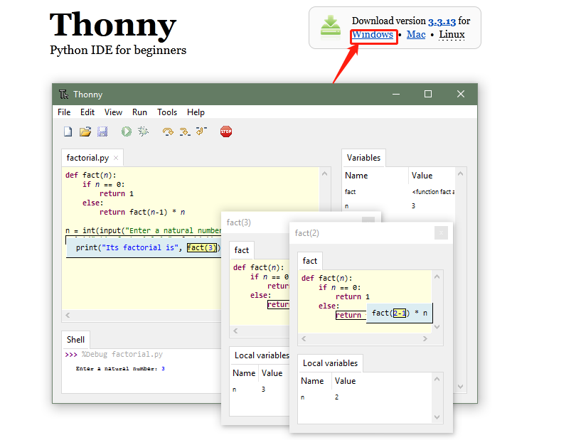
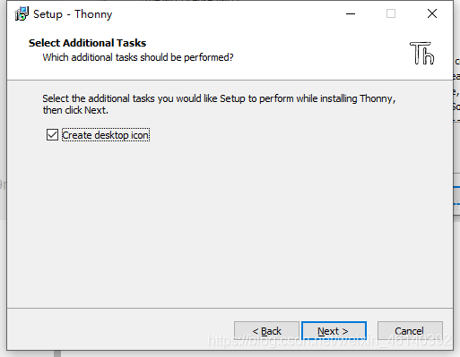
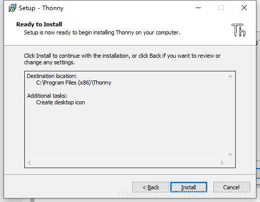
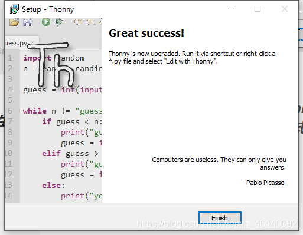
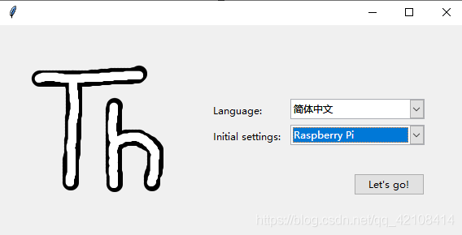
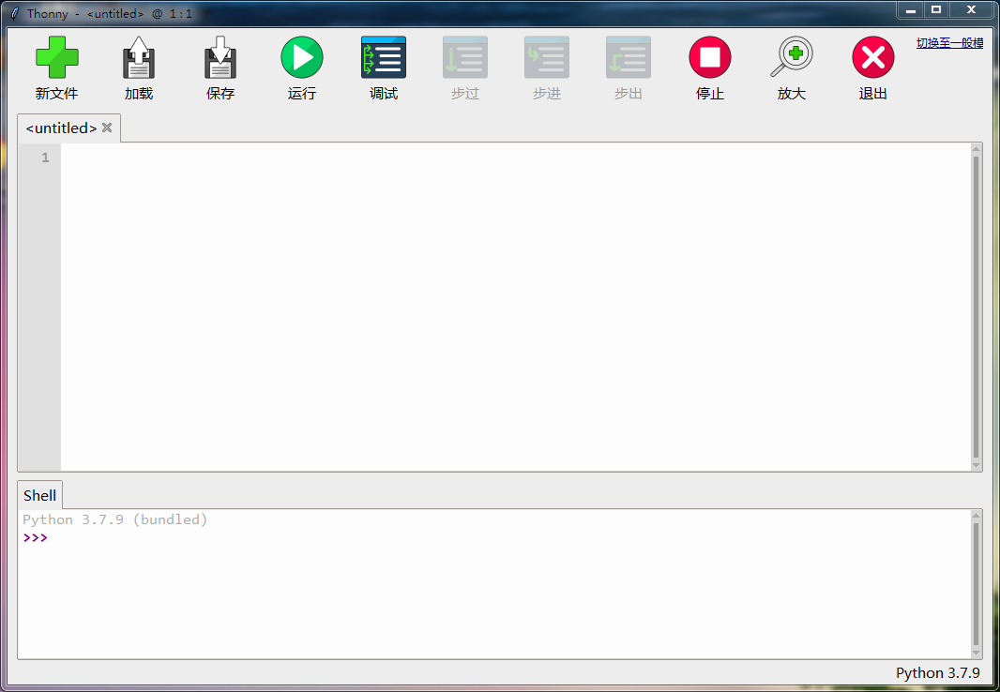
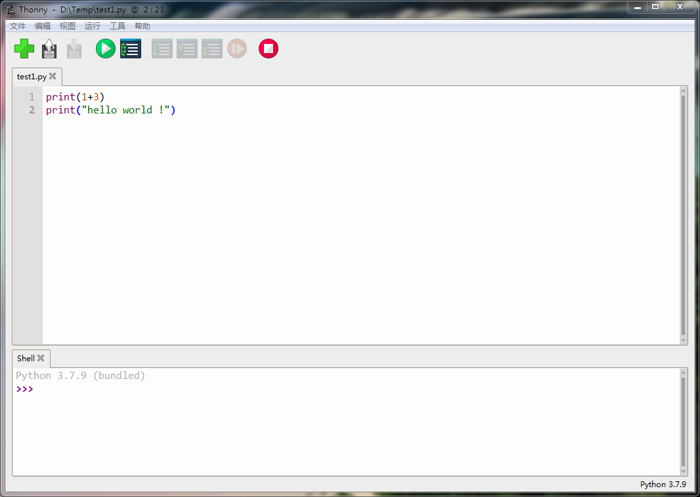
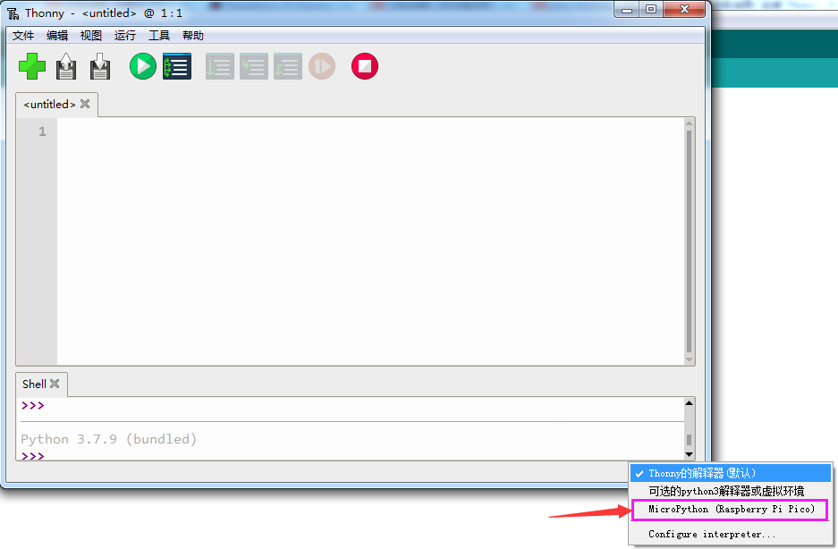
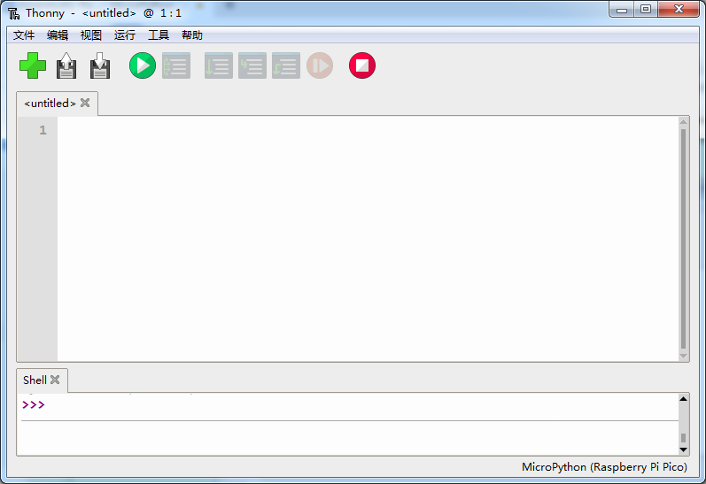

## 第2小节 MicroPython IDE——Thonny

> 🌟 **本节目标**：学会为 Raspberry Pi Pico 安装 MicroPython 固件，并配置适合初学者的编程环境 Thonny IDE。

---

### 🧩 什么是 MicroPython 和 Thonny？

Raspberry Pi Pico 支持两种主流编程方式：**C/C++**（适合有嵌入式经验的用户）和 **MicroPython**（专为微控制器优化的 Python 简化版）。  
MicroPython 让编程像写普通 Python 一样简单，特别适合小学生、初中生入门学习硬件编程！

而 **Thonny** 是树莓派官方推荐的 MicroPython 开发工具，它被称作 *“专为初学者设计的 Python IDE”*。界面简洁、操作直观，自带串口调试、代码自动补全和错误提示功能，支持 Windows、macOS 和 Linux 系统，也预装在树莓派操作系统中。

---

### 🔧 2.1 给 Pico 烧录 MicroPython 固件（UF2 文件）

✅ **第一步：下载 MicroPython 固件**

访问树莓派官方 MicroPython 入门页面：  
👉 [https://www.raspberrypi.com/documentation/microcontrollers/](https://www.raspberrypi.com/documentation/microcontrollers/#getting-started-with-micropython)  
向下滚动到 “Getting started with MicroPython” 区域，点击 **Download the latest MicroPython UF2 file for Raspberry Pi Pico** 下载按钮。

我们下载的是适用于 Pico 的 `.uf2` 格式固件文件（例如 `pico-micropython-xxxxxx.uf2`），它就像一个“系统安装包”，把 MicroPython 运行环境装进 Pico 的芯片里。

✅ **第二步：进入 Pico 的“U盘模式”（Bootloader 模式）**

1. 按住 Pico 板上的 **BOOTSEL 按钮**不松开；  
2. 用 USB 数据线将 Pico 插入电脑（Windows/macOS/Linux 均可）；  
3. 等待约 1–2 秒后松开 BOOTSEL 按钮；  
4. 此时电脑会识别出一个名为 **RPI-RP2** 的可移动磁盘（就像插了一个 U 盘）。

✅ **第三步：拖入固件，自动完成烧录**

把刚才下载好的 `.uf2` 文件，直接拖拽（或复制粘贴）到 **RPI-RP2** 磁盘中。  
你会看到磁盘图标闪烁一下，然后自动弹出（或消失）——说明烧录成功！Pico 已经重启并运行 MicroPython 了 ✅

📌 **小提示**：如果没看到 RPI-RP2 盘符，请检查 USB 线是否支持数据传输（有些充电线只能供电）、是否按住了 BOOTSEL 再插线、以及是否松手太早。

---

### 💻 2.2 安装 Thonny IDE（图形化编程工具）

✅ **第一步：下载 Thonny**

前往 Thonny 官网：👉 [https://thonny.org/](https://thonny.org/)  
点击首页绿色大按钮 **Download Thonny**，选择与你电脑匹配的版本（推荐 Windows 用户下载 `.exe` 安装包）。

✅ **第二步：安装 Thonny（Windows 示例）**

双击下载好的安装包，按以下步骤操作：

1. 点击 **Next**；  
2. 勾选 **I accept the agreement** → 点击 **Next**；  
3. 选择安装路径（默认即可）→ 点击 **Next**；  
4. 勾选 **Create desktop icon**（可在桌面快速打开 Thonny）→ 点击 **Next**；  

5. 点击 **Install** 开始安装（安装过程会自动下载配套的 Python 解释器）；  

6. 安装完成后，勾选 **Run Thonny** → 点击 **Finish** 启动软件。

✅ **第三步：首次启动设置**

首次打开 Thonny 时，会出现欢迎向导：

- **Language（语言）**：选择 **中文（简体）**；  
- **Initial settings（初始设置）**：选择 **Raspberry Pi**（此选项已为 Pico 优化）；  
- 点击 **Let’s go!** 进入主界面。

✅ **第四步：切换到“一般模式”**

刚启动时，Thonny 默认是“教育模式”（带教学提示）。我们点击右上角的 👉 **切换至一般模式**，让界面更简洁清爽，更适合动手编程。

→ 点击后，界面将变为标准开发界面：

✅ **第五步：连接 Pico 并选择 MicroPython 解释器**

1. 确保 Pico 已通过 USB 连接电脑（无需按 BOOTSEL，正常通电即可）；  
2. 点击 Thonny 右下角显示的 **Python 3.x**（或类似文字）；  
3. 在弹出菜单中选择：  
   ➤ **MicroPython (Raspberry Pi Pico)**  

✅ **重要提醒**：  
如果你使用的是较老版本的 Thonny（如 v3.3 或更早），可能没有 “MicroPython (Raspberry Pi Pico)” 这个选项。请务必升级到 **Thonny v4.0 或更高版本**（官网下载最新版），才能正确识别和连接 Pico！

选择成功后，右下角会显示：  
✅ **MicroPython (Raspberry Pi Pico) — COMx / dev/ttyACM0**（具体端口号因电脑而异）

🎉 恭喜！你的 Pico 已成功接入 Thonny，接下来就可以开始编写第一行 MicroPython 程序啦！

---

### ⚠️ 注意事项（安全 & 顺利运行小贴士）

| 项目 | 说明 |
|------|------|
| 🔌 USB 线 | 务必使用**带数据传输功能**的 USB 线（可手机传文件的那种），纯充电线无法识别设备！ |
| 🧩 BOOTSEL 操作 | 烧录固件时一定要**先按住 BOOTSEL，再插 USB，再松手**，顺序不能错。 |
| 🌐 网络环境 | Thonny 安装过程中需联网下载 Python 核心组件，请保持网络畅通。 |
| 🖥️ 中文显示 | 若菜单/提示显示为乱码，请在 Thonny 菜单栏：`Tools → Options → General → Language` 中确认已设为中文。 |
| 🔄 连接失败？ | 尝试重新插拔 Pico；检查设备管理器（Windows）是否出现 `Raspberry Pi RP2` 或 `CMSIS-DAP` 设备；重启 Thonny。 |

---  
✅ 本节完成！你已成功搭建好 MicroPython 编程环境。下一节，我们将用 Thonny 控制 Pico 上的 LED 灯，点亮你的第一个硬件程序！