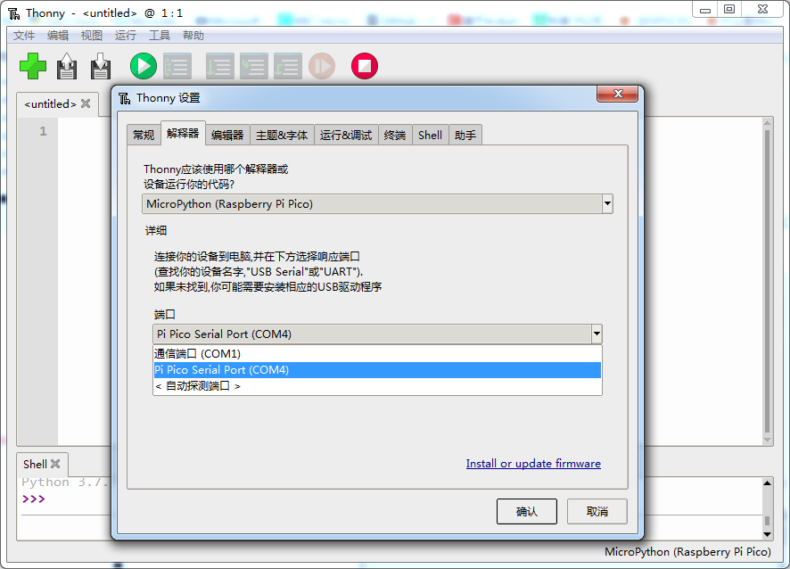
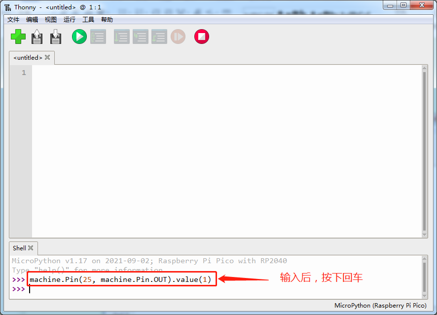
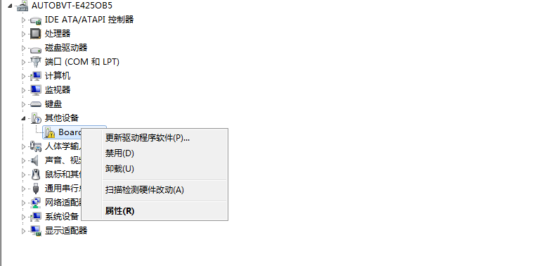
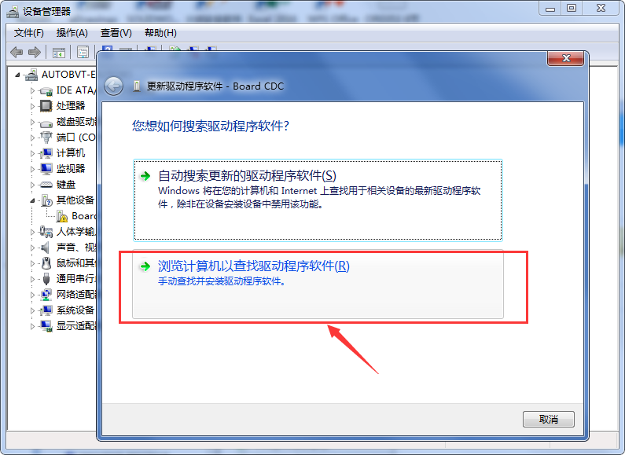
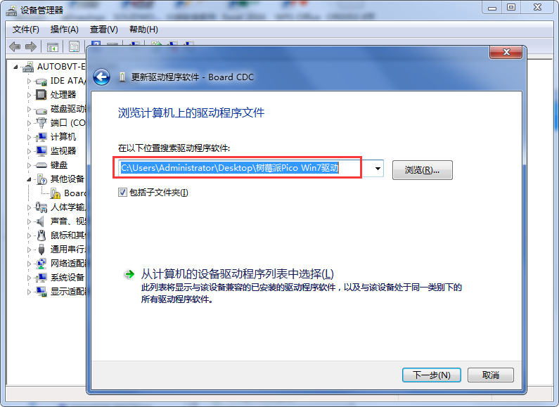
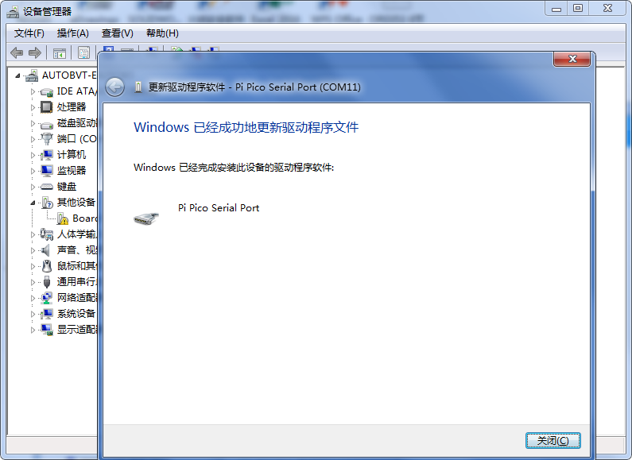
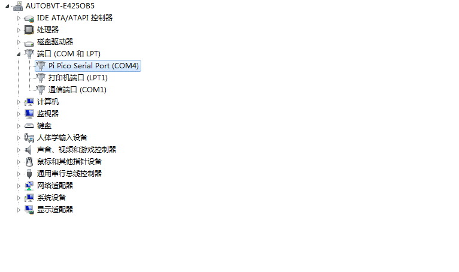
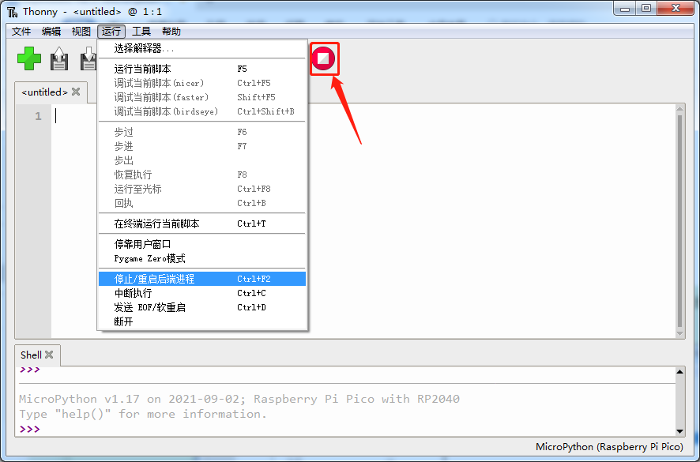

## 第3小节 驱动的安装方法

将 Raspberry Pi Pico 通过 MicroUSB 数据线连接到电脑的 USB 接口。  
✅ **小提示**：首次连接时，Pico 默认处于“U盘模式”（会显示为一个名为 `RPI-RP2` 的可移动磁盘），此时它**还没有运行 MicroPython**，也**尚未建立串口通信**。只有成功烧录 MicroPython 固件后，再重新插入（或按住 BOOTSEL 键后插入），才会进入串口模式，被电脑识别为“Pi Pico Serial Port”。

> ⚠️ 注意：本小节讲解的是 **Pico 运行 MicroPython 后所需的 CDC 串口驱动安装方法**，不是固件烧录步骤。请确保你已按前序章节完成 MicroPython 固件烧录（即把 `.uf2` 文件拖入 `RPI-RP2` 盘符）。

当 Pico 成功运行 MicroPython 并连接电脑后，系统需要正确识别其虚拟串口（CDC 类设备），才能通过 Thonny、PuTTY 等工具与它通信。不同 Windows 版本的处理方式略有不同：

---

### 3.1 Windows 10（及 Windows 11）

Windows 10/11 系统内置了对 CDC 类设备的良好支持。插入已烧录 MicroPython 的 Pico 后（无需按 BOOTSEL 键，正常插入即可），系统通常会**自动识别并安装驱动**，几秒内即可在【设备管理器】→【端口（COM 和 LPT）】中看到类似 `USB Serial Device (COM4)` 或 `Pi Pico Serial Port (COMx)` 的条目。

🔍 **如何确认？**  
1. 右键「此电脑」→「管理」→「设备管理器」→ 展开「端口（COM 和 LPT）」；  
2. 查找名称中含 “Pico”、“RP2” 或 “USB Serial” 的设备，记录其 COM 编号（如 `COM4`）；  
3. 打开 Thonny（推荐初学者使用），点击右下角状态栏的解释器图标 → 选择「MicroPython (Raspberry Pi Pico)」→ 在「端口」下拉菜单中选择对应的 COM 口（如 `COM4`）。

连接成功后，Thonny 的 Shell 窗口会显示类似以下欢迎信息：

```
MicroPython v1.17 on 2021-09-02; Raspberry Pi Pico with RP2040  
Type "help()" for more information.
>>>
```

✅ **快速验证环境是否正常：**  
在 `>>>` 提示符后输入以下命令（注意大小写和括号），然后按回车：

```python
machine.Pin(25, machine.Pin.OUT).value(1)
```

💡 这条命令的作用是：将 Pico 板载 LED（GPIO25）设置为输出模式，并输出高电平（点亮）。  
👉 如果你看到 Pico 板上那颗小小的绿色 LED 灯亮起，说明：  
✔️ 驱动安装成功  
✔️ MicroPython 正常运行  
✔️ Thonny 与 Pico 通信畅通  
✔️ 你的开发环境已经准备就绪！





---

### 3.2 Windows 7（需手动安装驱动）

Windows 7 系统较老，**无法自动识别 Pico 的 CDC 串口设备**。插入 Pico 后，设备管理器中可能出现带黄色感叹号的未知设备，名称可能是：  
🔸 `Board CDC`  
🔸 `USB Serial Device`（未识别）  
🔸 `Other devices` 下的未知 USB 设备  

这时我们需要**手动安装官方兼容驱动**。

#### ✅ 步骤一：准备驱动文件（.inf）
1. 新建一个记事本文件（`.txt`）；  
2. 将下方完整内容**一字不差地复制粘贴**进去（注意保留所有空格、分号、换行）；  
3. 点击「文件」→「另存为」→ 在「保存类型」中选择 **「所有文件」** → 输入文件名：  
   **`pico_cdc_driver.inf`**（⚠️ 一定要以 `.inf` 结尾！不要变成 `pico_cdc_driver.inf.txt`）；  
4. 建议保存到桌面，方便后续查找。

```ini
; Windows 2000, XP, Vista, 7 and 8 (x32 and x64) setup file for Atmel CDC Devices

; Copyright (c) 2000-2013 ATMEL, Inc.

[Version]

Signature = "$Windows NT$"

Class = Ports

ClassGuid = {4D36E978-E325-11CE-BFC1-08002BE10318}

Provider = %Manufacturer%

LayoutFile = layout.inf

CatalogFile = atmel_devices_cdc.cat

DriverVer = 01/08/2013,6.0.0.0

;----------------------------------------------------------

; Targets

;----------------------------------------------------------

[Manufacturer]

%Manufacturer%=DeviceList, NTAMD64, NTIA64, NT

[DeviceList]

%PI_CDC_PICO%=DriverInstall, USB\VID_2E8A&PID_0005&MI_00

[DeviceList.NTAMD64]

%PI_CDC_PICO%=DriverInstall, USB\VID_2E8A&PID_0005&MI_00

[DeviceList.NTIA64]

%PI_CDC_PICO%=DriverInstall, USB\VID_2E8A&PID_0005&MI_00

[DeviceList.NT]

%PI_CDC_PICO%=DriverInstall, USB\VID_2E8A&PID_0005&MI_00

;----------------------------------------------------------

; Windows 2000, XP, Vista, Windows 7, Windows 8 - 32bit

;----------------------------------------------------------

[Reader_Install.NTx86]

[DestinationDirs]

DefaultDestDir=12

DriverInstall.NT.Copy=12

[DriverInstall.NT]

include=mdmcpq.inf

CopyFiles=DriverInstall.NT.Copy

AddReg=DriverInstall.NT.AddReg

[DriverInstall.NT.Copy]

usbser.sys

[DriverInstall.NT.AddReg]

HKR,,DevLoader,,*ntkern

HKR,,NTMPDriver,,usbser.sys

HKR,,EnumPropPages32,,"MsPorts.dll,SerialPortPropPageProvider"

[DriverInstall.NT.Services]

AddService = usbser, 0x00000002, DriverService.NT

[DriverService.NT]

DisplayName = %Serial.SvcDesc%

ServiceType = 1 ; SERVICE_KERNEL_DRIVER

StartType = 3 ; SERVICE_DEMAND_START

ErrorControl = 1 ; SERVICE_ERROR_NORMAL

ServiceBinary = %12%\usbser.sys

LoadOrderGroup = Base

;----------------------------------------------------------

; Windows XP, Vista, Windows 7, Windows 8 - 64bit

;----------------------------------------------------------

[DriverInstall.NTamd64]

include=mdmcpq.inf

CopyFiles=DriverCopyFiles.NTamd64

AddReg=DriverInstall.NTamd64.AddReg

[DriverCopyFiles.NTamd64]

usbser.sys,,,0x20

[DriverInstall.NTamd64.AddReg]

HKR,,DevLoader,,*ntkern

HKR,,NTMPDriver,,usbser.sys

HKR,,EnumPropPages32,,"MsPorts.dll,SerialPortPropPageProvider"

[DriverInstall.NTamd64.Services]

AddService=usbser, 0x00000002, DriverService.NTamd64

[DriverService.NTamd64]

DisplayName=%Serial.SvcDesc%

ServiceType=1

StartType=3

ErrorControl=1

ServiceBinary=%12%\usbser.sys

;----------------------------------------------------------

; String

;----------------------------------------------------------

[Strings]

Manufacturer = "ATMEL, Inc."

PI_CDC_PICO = "Pi Pico Serial Port"

Serial.SvcDesc = "Pi Pico Serial Driver"
```

> 💡 小知识：这个 `.inf` 文件告诉 Windows “这个 USB 设备（VID_2E8A&PID_0005）应该用系统自带的 `usbser.sys` 驱动来管理”，从而启用串口功能。

#### ✅ 步骤二：手动更新驱动

1. 打开【设备管理器】（可通过右键「计算机」→「属性」→「设备管理器」）；  

2. 找到带黄色感叹号的未知设备（通常在「其他设备」或「端口」下）；  

3. 右键该设备 → 选择「更新驱动程序」；  

   

4. 选择「浏览我的计算机以查找驱动程序软件」；  

   

5. 选择「让我从计算机上的可用驱动程序列表中选取」；  

6. 点击「从磁盘安装」→「浏览」→ 找到你刚刚保存的 `pico_cdc_driver.inf` 文件 → 打开；  

   

7. 在弹出的硬件列表中，选择 **`Pi Pico Serial Port`** → 点击「确定」；  

   

8. 点击「下一步」，等待安装完成。



安装成功后，设备管理器中该设备会移至「端口（COM 和 LPT）」下，并显示为：  
✅ `Pi Pico Serial Port (COMx)`  

此时你就可以在 Thonny 中选择该 COM 口，开始编程啦！


---

### 🛑 安全拔出小贴士（重要！）

每次断开 Pico 前，请务必先在 Thonny 中执行以下任一操作：  
🔹 点击顶部菜单栏「Run」→「Disconnect」  
🔹 或点击界面右下角红色方形按钮（断开连接）  

✅ 这样做可以安全关闭串口连接，避免数据传输中断或端口占用异常。  
❌ 切勿直接拔掉 USB 线！否则下次可能无法识别，需重启 Thonny 或电脑。



