## 第4小节 Thonny界面简介

我们已经成功安装了Thonny IDE和Pico驱动，现在来熟悉Thonny的主界面。打开Thonny后，最顶部是一排功能菜单栏：**文件、编辑、视图、运行、工具、帮助**。这些菜单是我们日常编写、调试和上传MicroPython程序的核心入口。

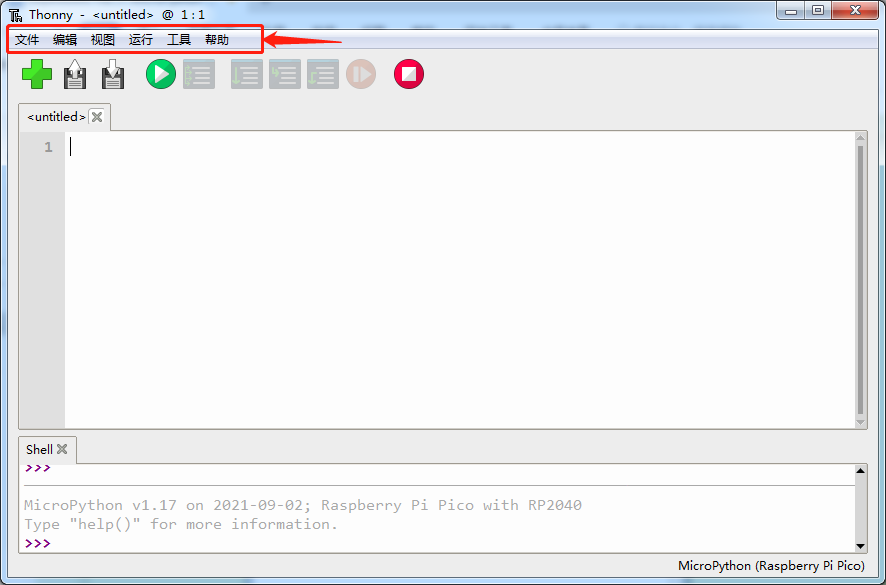

### 📁 文件菜单  
点击「文件」，会弹出下拉菜单，提供新建空白文件、打开已有代码、保存当前程序、另存为等基础操作。这是管理我们程序文件的起点。

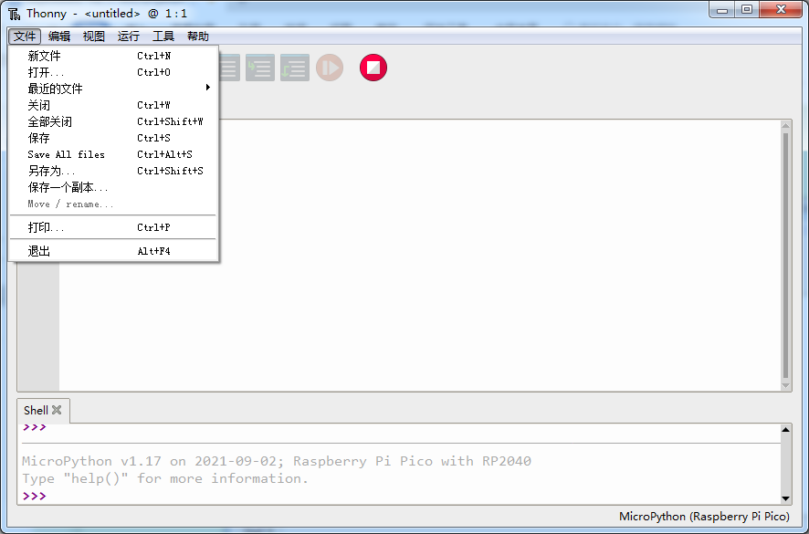

### ✏️ 编辑菜单  
「编辑」菜单包含复制、剪切、粘贴、撤销、重做、查找与替换等功能，帮助我们高效修改代码内容，就像在记事本中编辑文字一样简单。

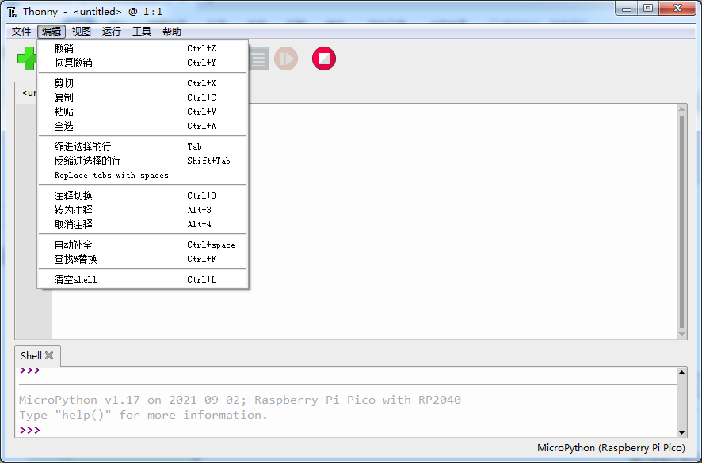

### 👀 视图菜单  
「视图」菜单控制界面中各类辅助窗口的显示与隐藏：
- **Shell（终端）**：是Pico的“命令行窗口”，可直接输入并执行单行代码，查看运行结果或错误提示；如果不勾选，下方区域将不显示Shell。
- **文件浏览器**：勾选后，左侧会显示当前电脑中打开的文件列表，方便快速切换多个.py文件。
- 还可选择显示「助手」（代码自动补全提示）、「变量」（实时查看变量值）等实用工具。

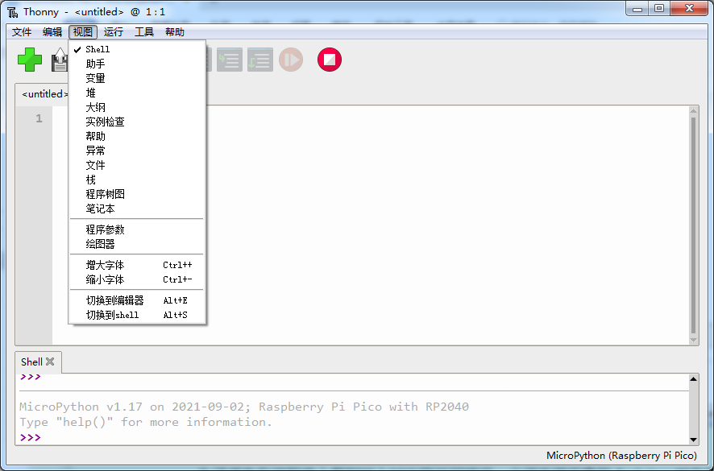

### ▶️ 运行菜单  
「运行」菜单不仅提供「运行当前脚本」功能，还支持：
- 切换解释器（如选择“MicroPython (Raspberry Pi Pico)”）
- 停止正在运行的程序（相当于按 `Ctrl+C`）
- 中断执行（强制退出卡死的代码）
- 同时也标注了常用快捷键（如F5运行、Ctrl+C停止），建议熟记以提升效率。

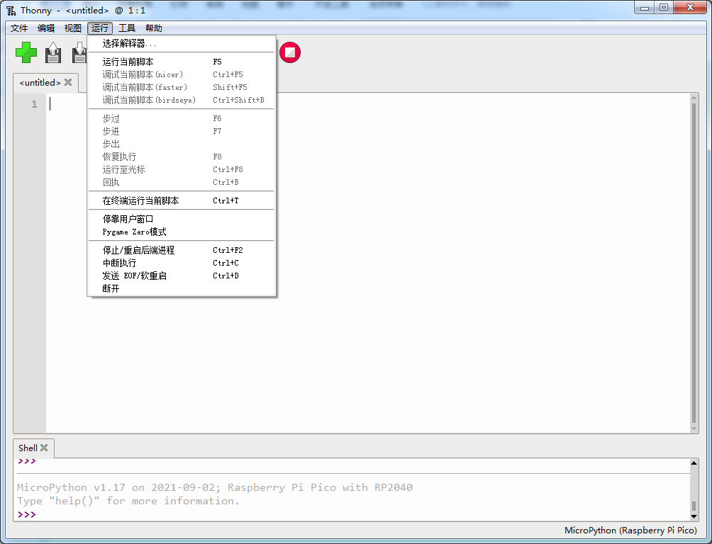

### ⚙️ 工具菜单  
「工具」菜单是Thonny的设置中心：
- 「选项」→「解释器」：我们之前配置Pico连接就在这里完成；
- 「管理包」：可一键安装第三方MicroPython库（如`ssd1306`、`umqtt.simple`等），无需手动下载上传；
- 「首选项」→「字体」：可调整代码编辑区的字体大小和样式，保护眼睛更友好。

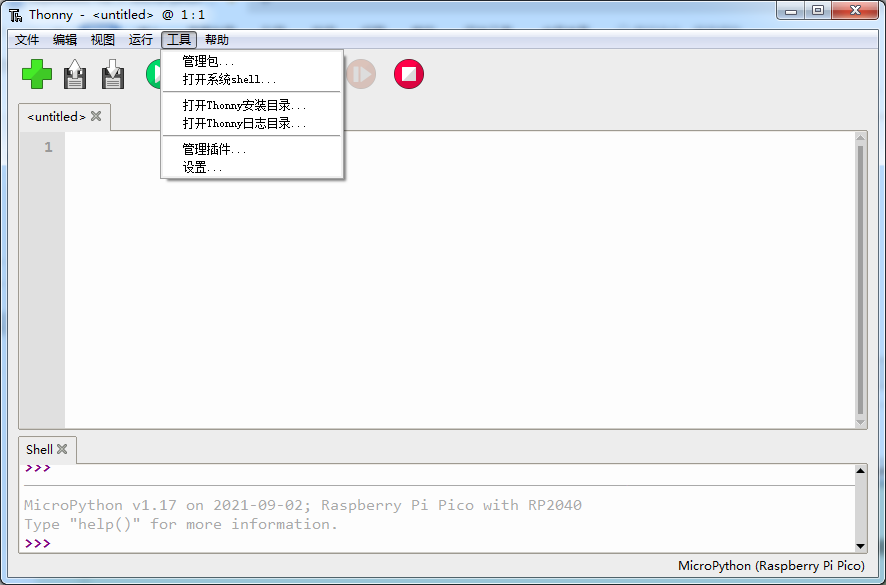  
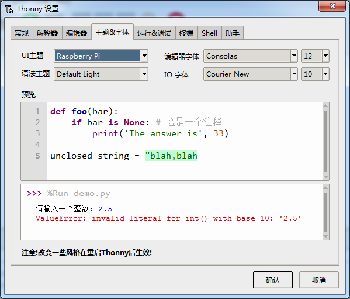

### ❓ 帮助菜单  
「帮助」菜单提供Thonny官方文档、版本信息、更新检查及社区支持链接，遇到问题时可随时查阅。

---

### 🎯 快捷图标区（界面下方工具栏）

为了让初学者更快上手，Thonny在窗口顶部下方设计了一排大图标按钮，它们对应上面菜单中的高频操作：

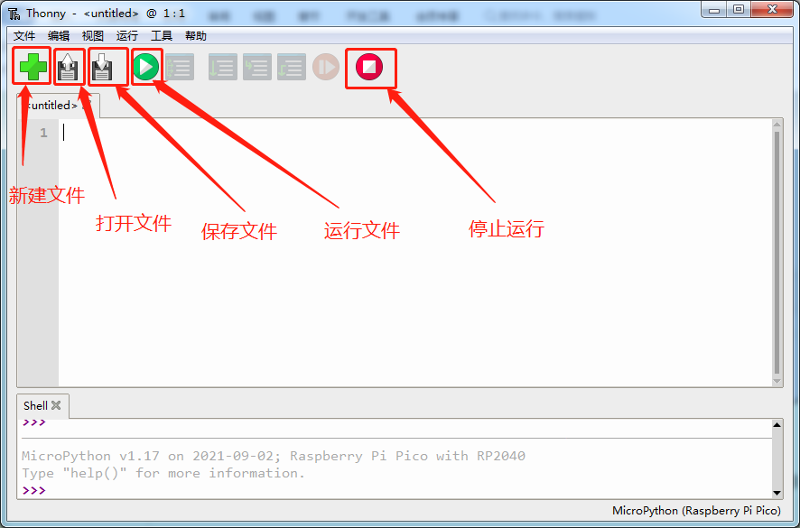

从左到右依次是：  
🔹 新建文件｜🔹 打开文件｜🔹 保存文件｜🔹 运行当前脚本｜🔹 停止运行｜🔹 打开Shell｜🔹 切换解释器  

> 💡 小提示：鼠标悬停在图标上会显示功能名称，非常适合小朋友记忆和操作！

---

### 📂 文件保存小技巧  

点击「打开」或「另存为」时，会弹出系统级文件选择框：

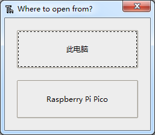  
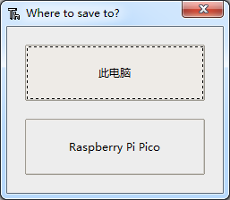

你可以自由选择：
- ✅ 保存在**电脑本地**（如桌面、文档夹）——适合编辑和备份；
- ✅ 保存在**Pico开发板**（设备名通常显示为 `RPI-RP2` 或 `CIRCUITPY`）——让程序开机自动运行！

---

### 💡 实验：让Pico板载LED闪烁起来！

请将以下代码复制粘贴到Thonny编辑区，并**先保存在电脑上**，命名为 `test.py`：

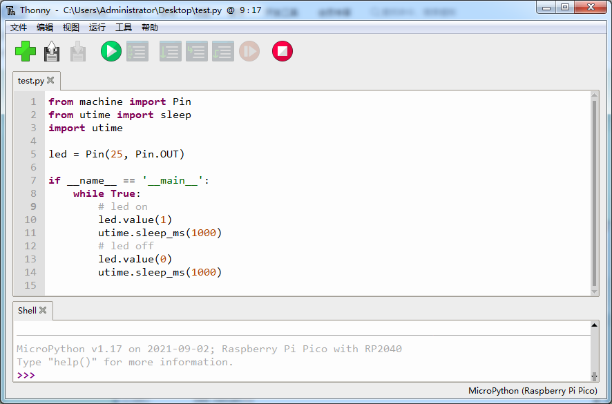

然后点击运行按钮（或按 `F5`）：  
  

✅ 你会看到Pico板上的红色LED灯开始**每秒闪烁一次**！  
🛑 再点击停止按钮：  
  
LED立即熄灭。

⚠️ 注意：此时如果拔掉USB线再重新插上电，LED**不会自动亮起**——因为程序只存在电脑里，还没“搬进”Pico！

---

### ✅ 让程序开机自启：保存为 `main.py`

要让Pico一通电就自动运行我们的程序，请这样做：

1. 点击菜单栏【文件】→【另存为】  
2. 在弹出窗口中，左侧选择设备：`RPI-RP2`（即你的Pico）  
3. 文件名输入：`main.py`（⚠️ 必须带 `.py` 后缀！）  
4. 点击「保存」

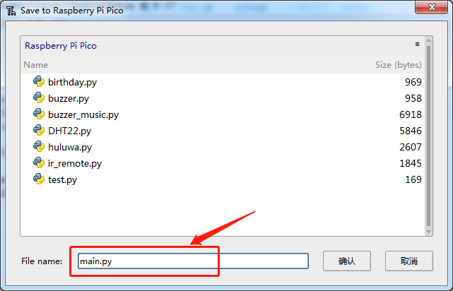

✅ 保存成功后，再次拔下USB线，稍等2秒再重新插入——你会发现：**LED立刻开始规律闪烁！**  
这是因为MicroPython固件规定：只要检测到根目录下有 `main.py`，就会在启动时自动运行它。

🎉 恭喜你，已掌握Thonny核心操作与Pico自动运行的关键技巧！