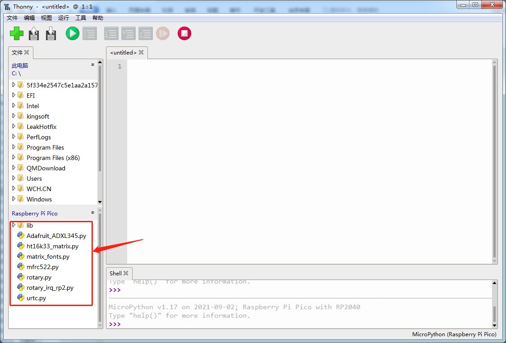

## 第5小节 Pico模块（库）的加载

Python之所以好学又好用，一个重要原因就是它有丰富的“工具箱”——我们叫它**模块（Module）**。就像搭积木一样，不用从头造轮子，直接把别人写好的、经过测试的“功能积木”（比如控制LED、读取温度、驱动屏幕等）拿过来用，就能快速做出有趣的作品！

在树莓派Pico上使用MicroPython时，我们也可以使用模块来简化编程。这些模块可以是：
- MicroPython系统自带的（如 `machine`、`time`、`utime`）；
- 官方提供的（如 `ssd1306` 驱动OLED屏幕）；
- 或者老师/课程为你准备好的**专用传感器模块**（如 `dht11.py`、`hcsr04.py` 等），它们把复杂的硬件操作封装成简单易懂的函数。

---

### ✅ 怎样把模块“装”到Pico上？

Pico本身没有硬盘，但它的闪存（Flash）可以像U盘一样被电脑识别为一个名为 **RPI-RP2** 的磁盘。我们可以把模块文件（通常是 `.py` 结尾的文本文件）直接复制进去，就像往U盘里存照片一样。

#### 🔧 操作步骤（以Thonny编辑器为例）：

1. 打开 Thonny（确保Pico已通过USB连接并被识别）；
2. 点击菜单栏：**视图（View）→ 文件浏览器（Files）**；  
   → 左侧会显示两个区域：  
   - 上方是你的**电脑文件夹**（本地）；  
   - 下方是Pico的根目录（显示为 `RPI-RP2` 或 `Pico`）；  



3. 找到你电脑里的模块文件（例如 `dht11.py`），**右键 → “另存为…” → 选择下方的 `RPI-RP2` 目录 → 点击“保存”**；  
   ✅ 成功后，该文件就会出现在Pico的文件列表中；  
   ❌ 如果想删除某个模块，直接在Pico文件列表中**右键该文件 → 删除**即可。

> 💡 小提示：模块文件必须放在Pico的**根目录**（即最上面一层），不能放在子文件夹里，否则 `import` 时可能找不到！

---

### 📦 怎样在程序里使用模块？

只要模块文件已经成功保存在Pico上，就可以在代码里用 `import` 语句轻松调用啦！例如：

```python
import dht11        # 导入DHT11温湿度传感器模块
import time

sensor = dht11.DHT11(pin=2)  # 创建传感器对象，接在GP2引脚

while True:
    sensor.read()             # 读取一次数据
    print("温度:", sensor.temperature, "°C")
    print("湿度:", sensor.humidity, "%")
    time.sleep(2)
```

运行前，请确保：
- `dht11.py` 已保存在Pico根目录；
- 代码中 `import dht11` 这一行**没有拼写错误**（大小写、下划线都要一致）；
- 模块名和文件名完全相同（比如文件叫 `hcsr04.py`，就写 `import hcsr04`）。


---

### ⚠️ 注意事项（安全又顺利的小贴士）

- 🌐 **不要改模块文件名**：比如 `DHT11.py` 和 `dht11.py` 在Windows里看起来一样，但在Pico（Linux系统）里是**完全不同**的两个文件！请统一用小写字母+下划线命名（如 `dht11.py`）；
- 📁 **不支持子文件夹导入**：目前MicroPython for Pico默认不支持从子文件夹中 `import` 模块（如 `lib/dht11.py`），所有模块请直接放在Pico根目录；
- 🧹 **定期清理不用的模块**：太多文件会让Pico变慢，也容易混淆。右键删除不需要的 `.py` 文件即可；
- 🔁 **修改模块后要重新上传**：如果你自己修改了 `xxx.py` 的内容，记得再次“另存为”到Pico，覆盖旧版本，否则程序仍运行旧代码；
- ❗ **首次运行报错 `ImportError: no module named 'xxx'`？**  
  → 先检查：文件是否真的在Pico根目录？名字是否拼对？是否多打了空格或中文标点？

---  
✅ 学会加载和使用模块，你就掌握了MicroPython项目开发的关键一步！下一节我们将用真实传感器动手实验 🌟