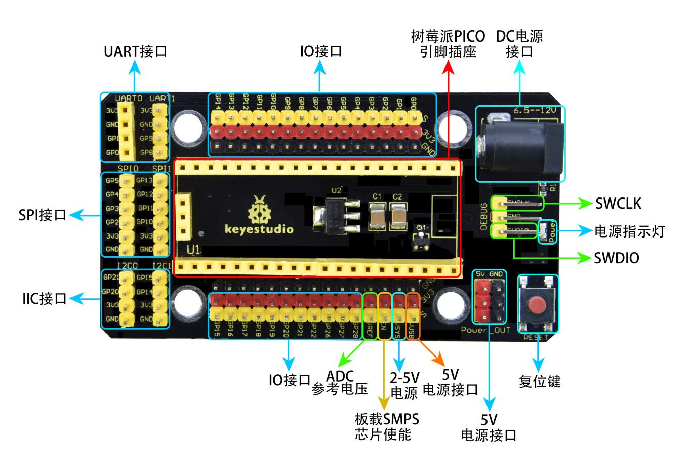
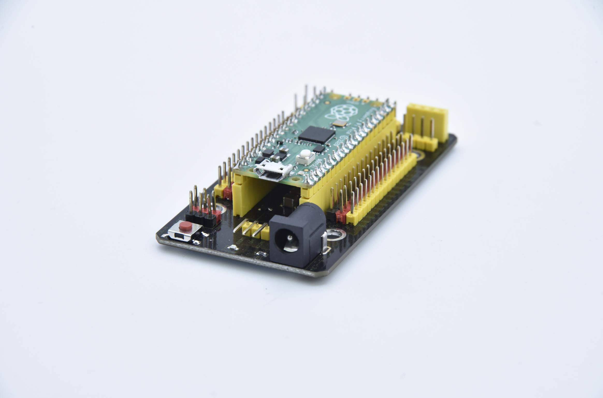

## 第6小节 Keyes Raspberry Pi Pico IO 扩展板

### 🌟 项目简介  
Keyes Raspberry Pi Pico IO 扩展板是一款专为树莓派Pico（Raspberry Pi Pico）设计的即插即用型开发扩展板。它无需焊接，所有Pico引脚均完整引出，并在接口旁清晰标注丝印，极大简化了接线与实验搭建过程，特别适合初学者和创客课堂使用。

---

### ⚙️ 工作原理  
扩展板通过底部标准2.54mm排母，与Pico主板的排针**完全对齐堆叠连接**，实现电气导通。所有IO口、电源、通信总线（I²C / UART / SPI）及复位功能均直接映射到Pico芯片对应引脚，不经过额外电平转换或逻辑处理，确保信号原生、稳定、低延迟。

板载1个复位按键（RESET）可随时重启Pico；1个电源指示灯（PWR）亮起表示供电正常；4个标准乐高定位孔方便固定在创客底板或乐高结构上，提升实验稳定性。

---

### 📦 所需材料  
- Raspberry Pi Pico 主板（已刷写 MicroPython 固件）  
- Keyes Pico IO 扩展板（KS3017 型号）  
- micro-USB 数据线（用于供电与编程）  
- （可选）面包板、杜邦线（用于外接传感器/LED等模块）

---

### 🔌 接口说明（图文对照）

扩展板采用统一丝印规范，便于快速识别：

- **3pin 接口（如GVS）**：  
  - `G` → GND（接地）  
  - `V` → VCC（提供 3.3V 电源，由 Pico 输出）  
  - `S` → Signal（信号引脚，对应上方标注的 GPIO 编号，如 GP0、GP26 等）  

- **4pin / 6pin 接口（如 I²C、UART、SPI）**：  
  - 左侧丝印标明功能（如 `I2C0`、`UART1`、`SPI1`），右侧依次为对应引脚（SCL/SDA、TX/RX、SCK/MOSI/MISO/CS 等）  

- **电源接口**：  
  - `DC IN`：支持 6.5–12V 直流输入（经板载稳压后为 Pico 提供稳定 5V/3.3V）  
  - `5V OUT`：可对外部模块供电（最大输出电流 ≤500mA）  
  - `3V3`：Pico 的 3.3V 输出引脚（不可作为输入！）  

- **其他标识**：  
  - `RESET`：复位按键，按下后重启 Pico  
  - `PWR`：电源指示灯（红色），亮起表示供电正常  
  - `LEGO`：4个直径5mm乐高定位孔（兼容标准乐高底板）

  
*图：Keyes Pico 扩展板原理图（含引脚定义与电路连接关系）*

  
*图：KS3017 Pico 扩展板实物接口标注详解*

---

### 🧩 使用方法（三步搞定）

**✅ 第一步：对齐堆叠**  
将 Raspberry Pi Pico **正面向上、USB口朝外**，垂直插入扩展板底部的2.54mm排母中，确保所有引脚完全插入、无歪斜、无悬空。

**✅ 第二步：检查固定**  
轻按Pico顶部，确认其稳固卡入排母；观察 `PWR` 指示灯是否亮起（若不亮，请检查Pico是否接触良好、micro-USB是否供电）。

**✅ 第三步：开始实验**  
此时Pico所有GPIO均已通过扩展板引出——  
- 数字IO：共13路（如 GP0～GP2、GP5～GP10、GP14～GP16、GP18～GP22、GP26～GP28）  
- 模拟IO：3路（GP26、GP27、GP28，支持ADC采集）  
- 通信接口：I²C×2、UART×2、SPI×2（具体引脚见原理图与实物丝印）

  
*图：Raspberry Pi Pico 正确堆叠在 Keyes 扩展板上的实拍效果*

---

### ⚠️ 注意事项（安全第一！）  
- ❗ **切勿将 5V 或 DC IN 电源同时接入多个接口**，避免短路或烧毁Pico！  
- ❗ `3V3` 引脚仅作**输出使用**，严禁反向接入外部5V/12V电源，否则将永久损坏Pico！  
- ❗ 使用 `DC IN`（6.5–12V）供电时，**请勿再通过 micro-USB 口供电**，二者不可并联！推荐优先使用 micro-USB 供电（更安全稳定）。  
- ❗ 堆叠前请确认Pico排针无弯曲、无氧化；若插入困难，请勿强行按压，应先检查方向与引脚状态。  
- ❗ 实验中若发现 `PWR` 灯不亮、Pico无法识别、串口无响应，请先断电，重新拔插Pico并检查接触状态。

---

### 📏 规格参数速查表  

| 项目 | 参数 |
|------|------|
| 输出电流能力 | ≤ 500 mA（5V 输出） |
| DC 输入电压范围 | 6.5 V – 12 V（带反接保护） |
| 板载输出电压 | 5 V（稳压）、3.3 V（Pico 原生） |
| 工作温度范围 | -10 °C ～ +50 °C |
| 板子尺寸 | 45.339 mm × 83.617 mm |
| 排针间距 | 标准 2.54 mm（兼容通用杜邦线与面包板） |
| 定位孔 | 4 × 标准乐高孔（Φ5 mm） |