# Raspberry Pi

## 前期准备

### 树莓派系统需要的工具：

1.所需的硬件：

（1）树莓派4B/3B/2B （2）16G以上的TFT内存卡 （3）读卡器
（4）常用的电脑及配件

2.需要在常用电脑上安装的软件工具：

Windows用户：

（1）先安装putty

下载链接：[<u>https://www.chiark.greenend.org.uk/~sgtatham/putty/</u>](https://www.chiark.greenend.org.uk/~sgtatham/putty/)

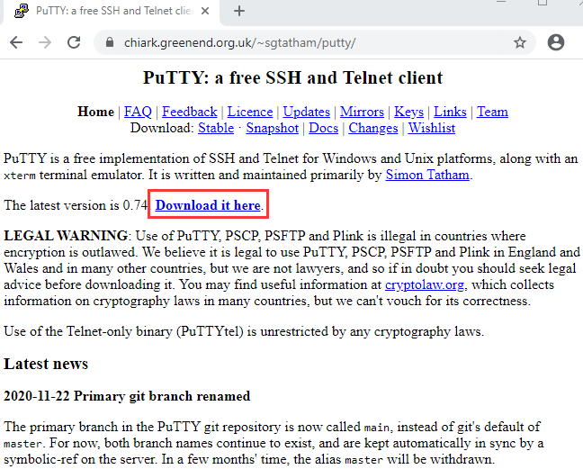

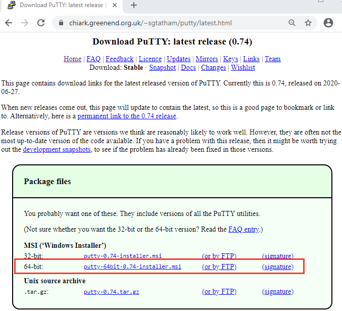

1.  下载好了putty驱动文件后，鼠标左键双击putty驱动文件，再点击“Next”。

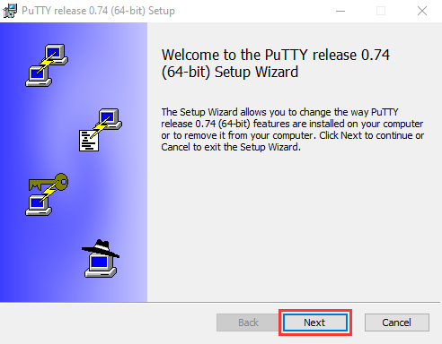

2.  点击“Next”。

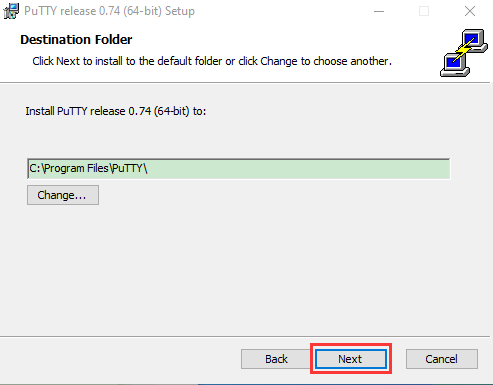

3.  选中“Install Putty files”后，再点击“Install”。

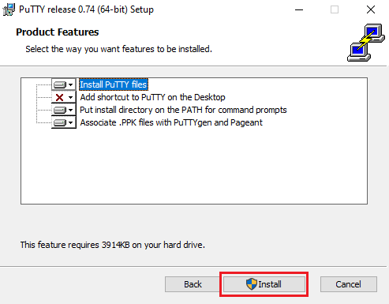

4.  几秒钟之后，安装就完成了，点击“Finish”就可以了。

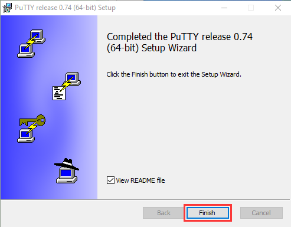

（2）SSH远程登录软件 WinSCP

下载链接：[<u>https://winscp.net/eng/download.php</u>](https://winscp.net/eng/download.php)

a.下载好WinSCP软件文件后，鼠标左键双击WinSCP软件文件，再左键点击。

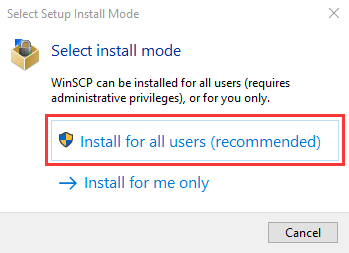

b\. 点击“Accept”，然后选中对应的选项且点击“Next”，再点击“Install”。

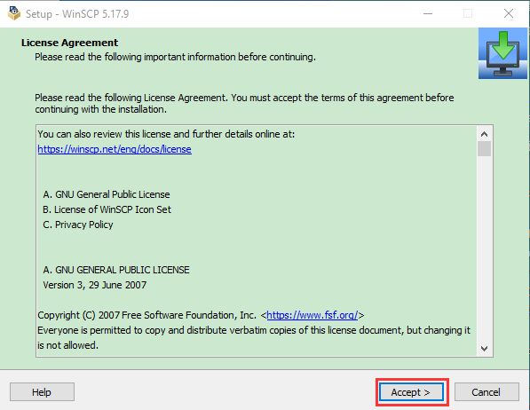

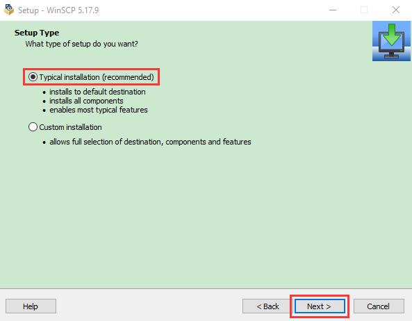

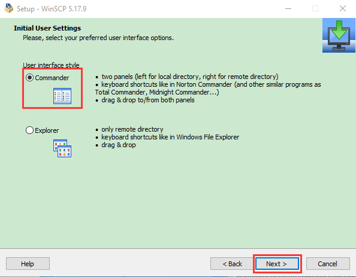

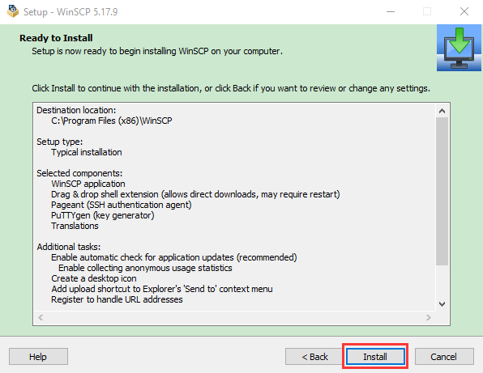

c\. 几秒钟之后，安装就完成了，点击“Finish”就可以了。

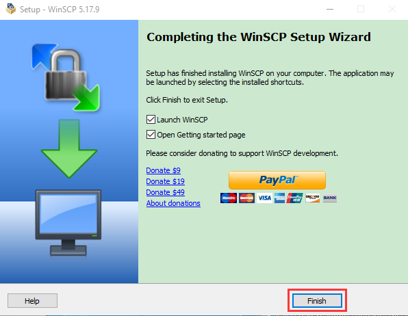

（3）格式化TFT卡工具 SD Card Formatter

下载链接：

[<u>http://www.canadiancontent.net/tech/download/SD_Card_Formatter.html</u>](http://www.canadiancontent.net/tech/download/SD_Card_Formatter.html)

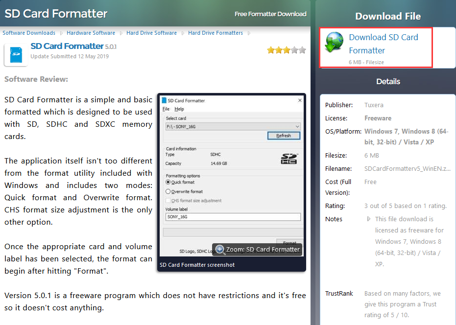

1.  将下载好的SDCardFormatterv5_WinEN压缩包解压，鼠标左键双击SD Card     Formatter文件，运行此文件。

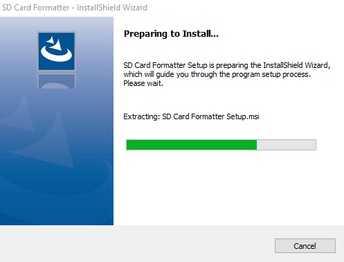

2.  点击“Next”，再选择“”并点击“Next”。

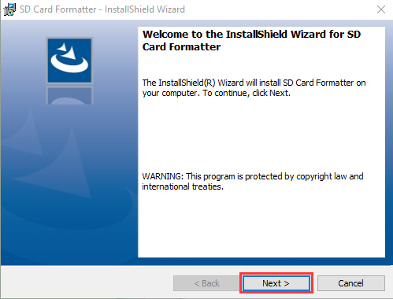

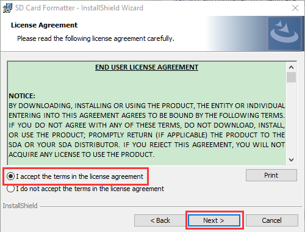

3.  又点击“Next”，然后再点击“Install”。

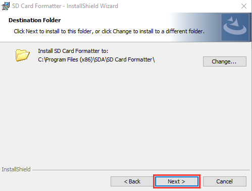

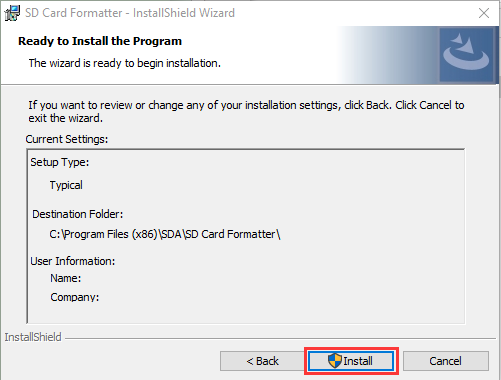

d\. 几秒钟之后，安装就完成了，点击“Finish”就可以了。

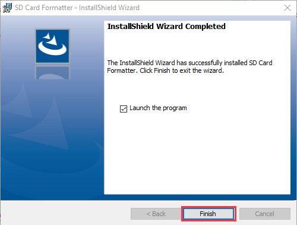

（4）烧录镜像系统软件工具 Win32DiskImager

下载链接：[<u>https://sourceforge.net/projects/win32diskimager/</u>](https://sourceforge.net/projects/win32diskimager/)

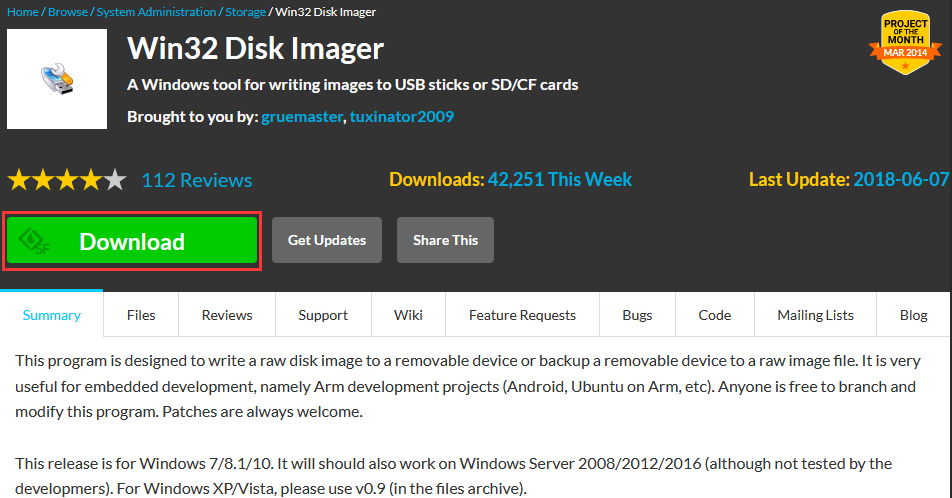

1.  下载好Win32DiskImager软件文件之后，鼠标左键双击Win32DiskImager软件文件，然后点击“Run”。

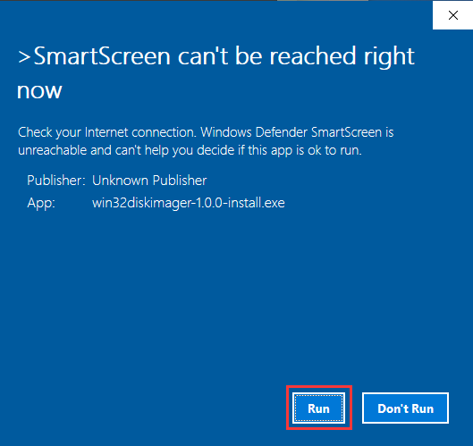

2.  选择之后，再点击“Next”。

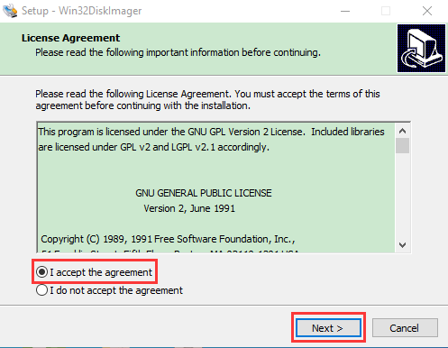

3.  点击“Browse...”，选择Win32DiskImager文件安装的位置，再点击“Next”。

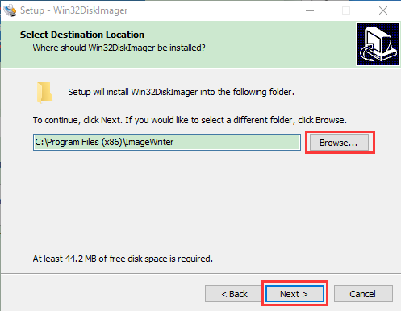

4.  点击“Browse...”选择Win32DiskImager文件安装的位置，再点击“Next”。

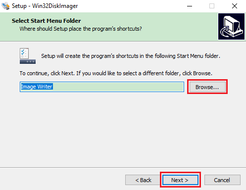

5.  选中后再点击“Next”，然后又点击“Install”。

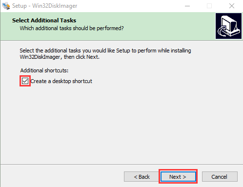

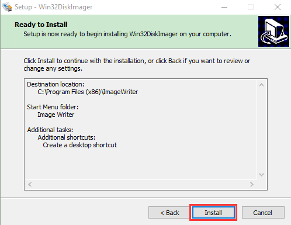

d\. 几秒钟之后，安装就完成了，点击“Finish”就可以了。

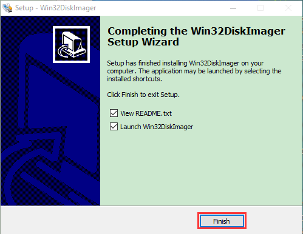

（5）扫描查找ip地址软件工具WNetWatcher

下载链接：http://www.nirsoft.net/utils/wnetwatcher.zip

树莓派的镜像系统

最新版本系统下载链接：[<u>https://www.raspberrypi.org/downloads/raspberry-pi-os/</u>](https://www.raspberrypi.org/downloads/raspberry-pi-os/)

旧版本系统下载链接：

- Raspbian：https://downloads.raspberrypi.org/raspbian/images/

- Raspbian full：https://downloads.raspberrypi.org/raspbian_full/images/

- Raspbian lite：https://downloads.raspberrypi.org/raspbian_lite/images/

本教程使用2020.08.20版本系统：（由于树莓派官方版本升级，可能导致部分系统功能与此教程使用有些冲突，所以我们这里推荐使用本教程版本）

(下载有桌面并自带些常用软件的版本)

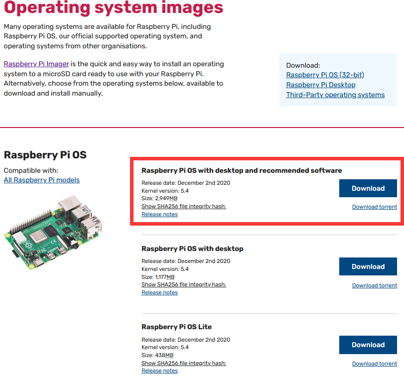

### 给树莓派安装Raspberry Pi OS系统

1.TFT内存卡插到读卡器上，读卡器插到电脑的USB端口

2.使用SD Card Formatter软件工具将TFT内存卡格式化，如下图所示：

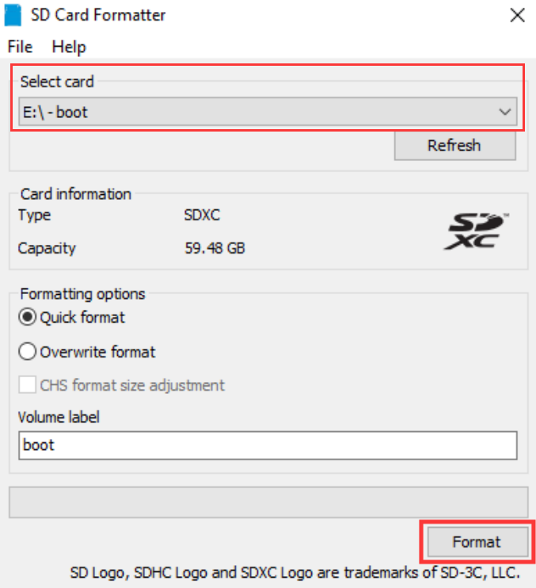

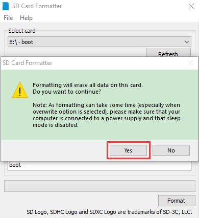

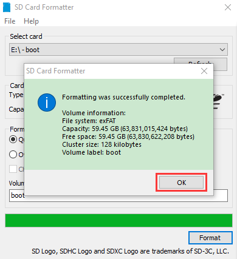

3.烧录系统

（1）使用Win32DiskImager 软件，将树莓派官方的系统（Raspberry Pi OS）镜像烧录到TFT内存卡上。

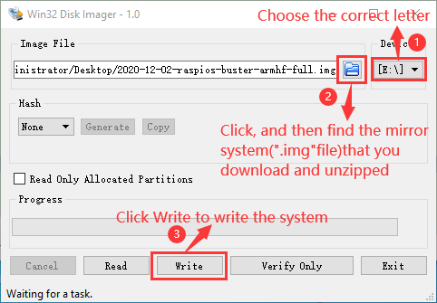

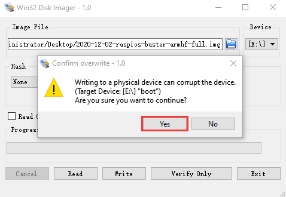

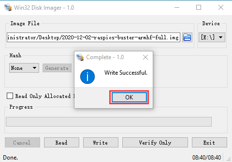

（2）镜像系统烧录完成后，先不要把读卡器拔出，使用记事本新建一个文件命名为SSH，把.txt删掉，然后复制到TFT卡的boot目录下，这样就可以打开SSH登录功能了，如下图所示：

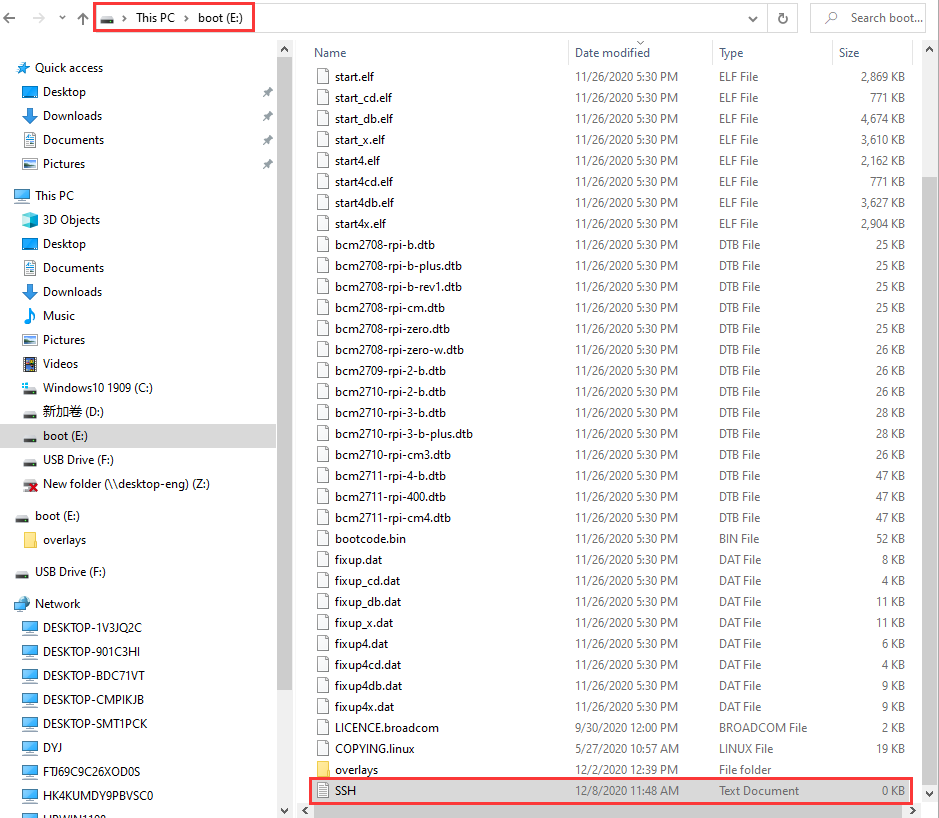

（3）拔出读卡器。

4.登录系统（以下操作要求raspberry与PC电脑在同一局域网内）

（1）将烧录好的TFT内存卡插到树莓派，接好网线，接好电源并打开电源。

如果有屏幕和树莓派的HDMI线，连接好屏幕，就可以看到Raspberry Pi OS系统的开机画面了。

如果没有树莓派的HDMI线，也没事，可以使用软件WinSCP来进行SSH远程登录，也可以使用xrdp登录树莓派系统的桌面。

（2）远程登录

使用WinSCP，通过树莓派系统的默认名称、默认用户名、默认密码，来登录。注意这就要求同一个网络里只能接入一个树莓派。

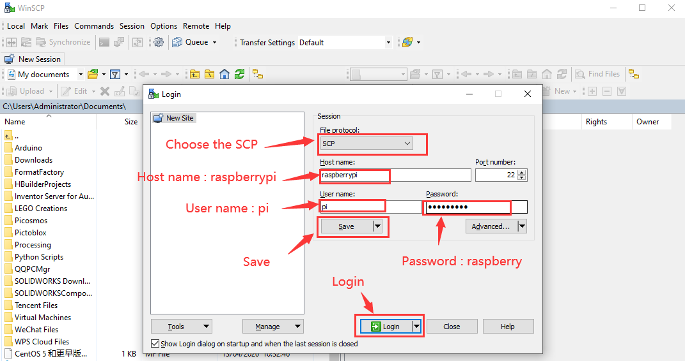

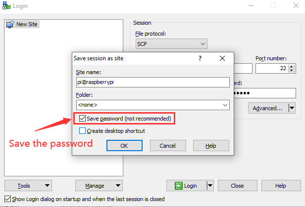

（3）查看ip地址和mac地址

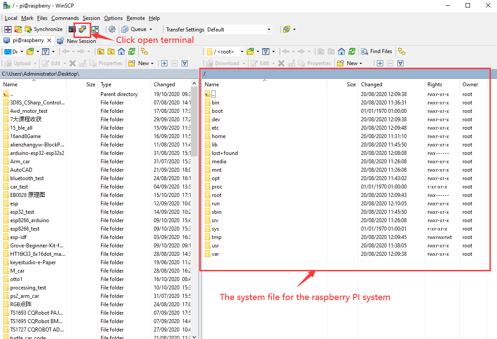

点击打开终端之后，还需要再次输入密码：raspberry ，再按下键盘 Enter 。

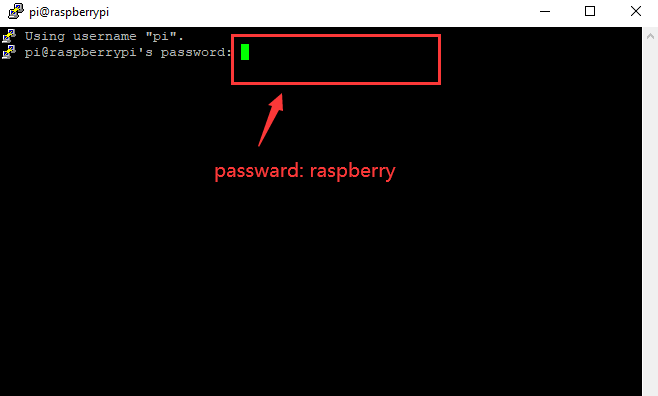

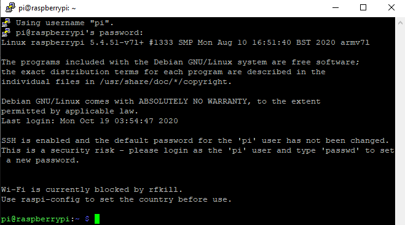

登录成功后，打开终端，输入ip a 后再按下键盘
Enter就可以查看ip和mac地址

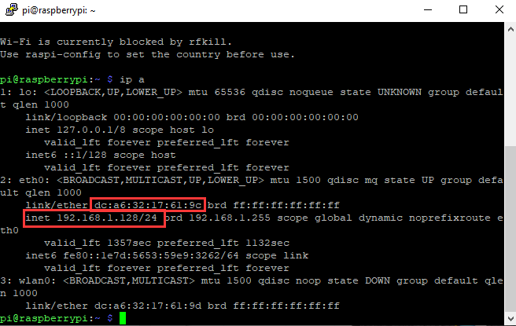

从上图圈出来的可以看出，我这块树莓派的mac地址为：a6:32:17:61:9c，ip地址为：192.168.1.128，后面使用xrdp远程登录树莓派系统桌面时使用到ip地址。

mac地址是不会变的，当不确定哪个ip时，可以通过mac地址来确认。

（4）固定树莓派的ip地址

由于ip地址是会变动的，第二天很可能ip地址就不一样了，就需要再次查看ip地址，所以为了更方便使用，需要固定树莓派的ip地址。

操作步骤如下：

切换到root用户

如果还没设置root的用户密码

①设置root密码

终端里输入：sudo passwd root

接着设置密码就可以了

②然后切换到root用户

su root

③固定ip地址的配置文件

先改好下面配置文件的ip

（#更改的ip地址：address 192.168.1.99）

然后将修改好ip的配置文件复制粘贴到终端，回车，就配置好了。

配置文件：

echo -e '

auto eth0

iface eth0 inet static

\#Change IP address

address 192.168.1.99

netmask 255.255.255.0

gateway 192.168.1.1

network 192.168.1.0

broadcast 192.168.1.255

dns-domain 119.29.29.29

dns-nameservers 119.29.29.29

metric 0

mtu 1492

'\>/etc/network/interfaces.d/eth0

操作示例图，如下：

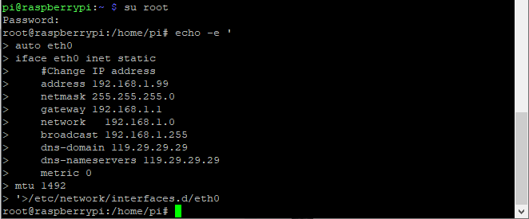

④重启系统，使配置文件生效

终端输入重启命令：sudo reboot

这之后就可以使用树莓派的固定ip来登录了。

⑤再次查看ip，确保已经固定好ip地址

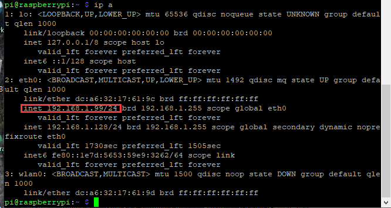

（5）无线登录树莓派系统的桌面

如果我们没有连接显示屏的HDMI高清线，能不能在windows桌面上无线登录树莓派系统的桌面呢？是可以的，方法还挺多，目前比较常用的是使用VNC和Xrdp。

现在就教使用Xrdp在windows桌面上无线登录树莓派系统的桌面

①在终端里安装Xrdp服务

安装命令：

切换到root用户 ：su root

安装命令 ：apt-get install xrdp

根据提示，输入y ，再回车就行。

操作图如下：

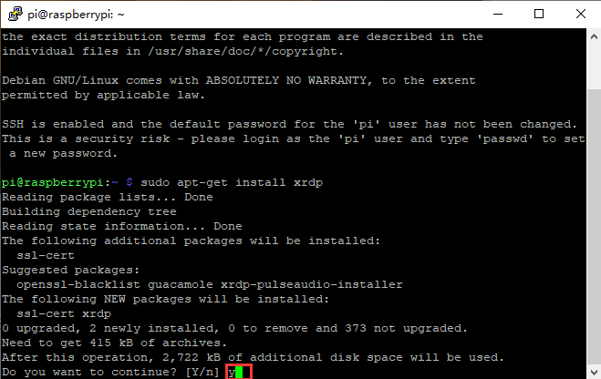

②打开Windows的远程桌面连接

按下键盘 WIN+R 然后输入：mstsc.exe

操作图如下：

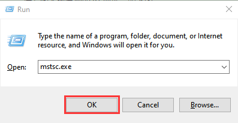

接着输入树莓派的ip地址，如下图，点击“Connect”后再次点击“Connect”。

192.168.1.99是我上面固定树莓派ip地址的步骤里固定的ip，改为你的树莓派ip就好了。

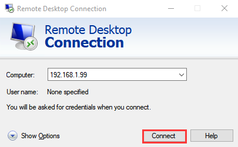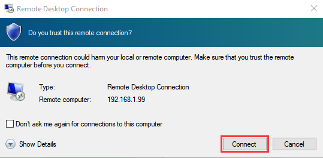

接着会出现个提示，点击 “Yes”就行了。

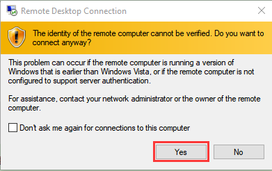

接着输入用户名：pi ，默认密码：raspberry，如下图所示：

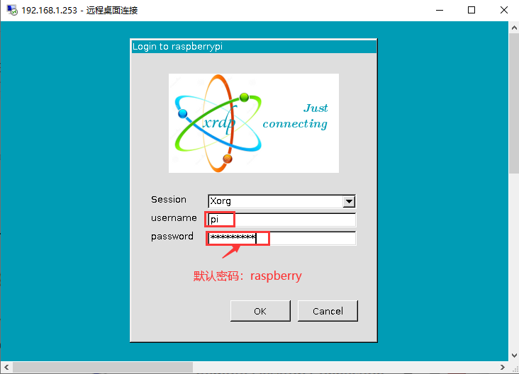

点击OK或者 Enter键，就会出现树莓派系统Raspberry Pi OS的桌面了，如下图所示：

到这里为止，完成了树莓派系统Raspberry Pi OS的基本配置。

### Raspberry Pi Pico简介

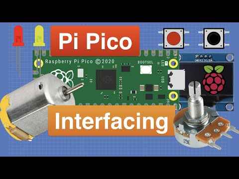

2021年1月底的时候，树莓派基金会发布了一个重磅消息，推出了进军微控制器领域的树莓派Pico。功能强劲，价格便宜的特性让Pico受到了全世界创客们的关注，下面就来给大家介绍一下Pico这个小玩意儿。

Pico是一块小小的板子，大小和Arduino Nano差不多，为21mm × 51mm。

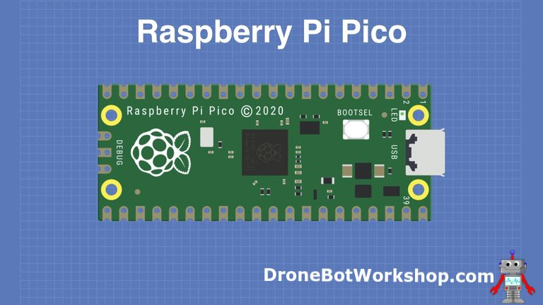

Raspberry Pi Pico是具有灵活数字接口的低成本高性能微控制器板。它集成了Raspberry Pi自己的RP2040微控制器芯片，运行速度高达133 MHz的双核Arm Cortex M0
+处理器，嵌入式264KB SRAM和2MB板载闪存以及26个多功能GPIO引脚。对于软件开发，可以使用Raspberry Pi的C/C++SDK或MicroPython，这个教程中我们使用MicroPython。

裸板不带针脚，需要自己焊。这是一块做工精良的电路板，也可以作为SMD元件，直接焊接到印刷电路板上。

板上最主要的功能是一端的microUSB连接器。它既用于通信，也用于给Pico供电。

在microUSB连接器旁边安装了一个板载LED，它内部连接到GPIO针脚25，这是整个Pico板上唯一的LED。

开机按钮安装在离LED稍低一点的地方，它可以让你改变Pico的启动模式，这样你就可以在上面加载MicroPython，进行拖拽式编程。

在板子的底部，你会看到三个连接点，这些连接点是用于串行Debug选项的，我们今天是入门，暂时不探讨这个问题，高级开发者会比较感兴趣。

在板子的中央是整个板子的“大脑”——RP2040 MCU，RP2040能够支持高达16MB的片外闪存，不过在Pico中只有4MB。

– 双核32位ARM Cortex -M0+处理器  
– 运行在48MHz，但可以超频到133MHz。  
– 30个GPIO引脚(26个暴露)  
– 可支持USB主机或设备模式  
– 8 可编程I/O（PIO）状态机

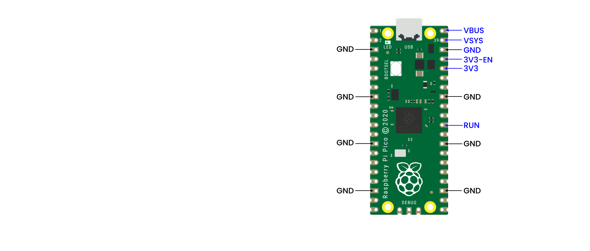

Pico是一个3.3V的逻辑器件，但由于内置了电压转换器和稳压器，它可以用一系列电源供电。

GND–––地线，8个地线加上3针Debug连接器上的一个附加地线，是方形的，而不是像其他连接的圆形。

VBUS–––这是来自 microUSB 总线的电源，5 V。如果Pico不是由microUSB连接器供电，那么这里将没有输出。  
VSYS–––这是输入电压，范围为 2 至 5 V。板载电压转换器将为 Pico
将其改为 3.3 V。  
3V3–––这是 Pico 内部调节器的 3.3 伏输出。只要将负载保持在 300ma
以下，它就可用于为其他组件供电。

3V3_EN–––你可以使用此输入禁用 Pico 的内部电压调节器，从而关闭 Pico
和由其供电的任何组件。  
RUN–––可以启用或禁用 RP2040 微控制器，也可以将其复位。

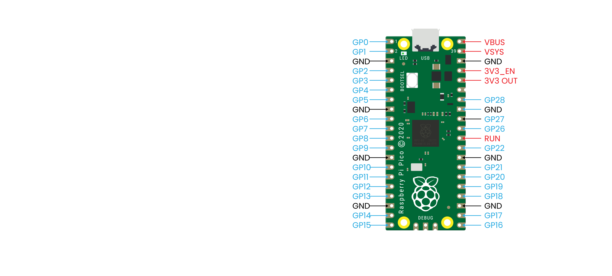

树莓派
Pico板上有26个裸露的GPIO连接，它们的排列顺序很好，在GP22和GP26之间有“空隙”（这些“缺失”的引脚在内部使用）。这些引脚都有多种功能，你可以为PWM配置多达16个引脚。有两个I2C总线，两个UART和两个SPI总线，这些可以配置使用多种GPIO引脚。

Pico有三个模数转换器分别为ADC0-GP26、ADC1-GP27、ADC2-GP28还有一个内部用于板载温度传感器的转换器ADC-VREF。注意：ADC的分辨率为12位。但MicroPython把范围映射到16位，也就是从0到65535，微处理器的工作电压是3.3V，也就是说0对应着0V，65535对应着3.3V。

你也可以在ADC_VREF引脚上提供一个外部精密电压参考。其中一个接地点，即33脚上的ADC_GND被用作该参考点的接地点。

|树莓派 PICO配置|
|-|
|双核 Arm Cortex-M0 + @ 133MHz|
|2 个 UART、2 个 SPI 控制器和 2 个 I2C 控制器|
|芯片内置 264KB SRAM 和 2MB 的板载闪存|
|16 个 PWM 通道|
|通过专用 QSPI 总线支持最高 16MB 的片外闪存|
|USB 1.1 主机和设备支持|
|DMA 控制器|
|8 个树莓派可编程 I/O（PIO）状态机，用于自定义外围设备支持|
|30 个 GPIO 引脚，其中 4 个可用作模拟输入|
|支持 UF2 的 USB 大容量存储启动模式，用于拖放式编程|

完整引脚图：

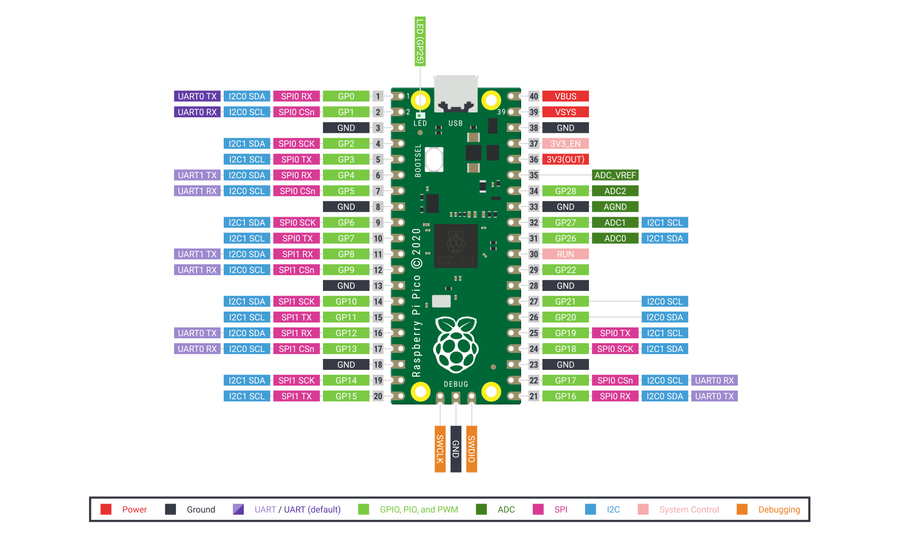

树莓派也在官网发布了一大堆技术文档，还有一本名为《Get Started with MicroPython on Raspberry Pi Pico》的说明书。它有纸质版，也有PDF版下载。

更多详情请了解树莓派官方网站：

https://www.raspberrypi.com/products/raspberry-pi-pico/

### 使用MicroPython

MicroPython是Python 3编程语言的一种精简而高效的实现，它包含了Python标准库的一个小子集，并针对在微控制器和受限环境中运行进行了优化。MicroPython充满了高级功能，如交互式提示、任意精度整数、闭包、列表理解、生成器、异常处理等。然而，它足够紧凑，只需要256k的代码空间和16k的内存就可以安装和运行。
MicroPython的目标是尽可能与普通Python兼容，让您能够轻松地将代码从桌面传输到微控制器或嵌入式系统。

更多microPython详情点击官网查看：https://micropython.org/

对Pico进行编程：您可以使用两种编程语言C/C++或者MicroPython，MicroPython是一种专门为微控制器制作的解释语言。C/C++为许多微控制器用户都熟悉C++，因为它被用于Arduino和ESP32板上。本教程使用树莓派推荐的MicroPython IDE---Thonny。Thonny自称是 “Python IDE for Beginners”，它适用于Windows、Mac OSX和Linux。它也是树莓派操作系统(以前的Raspbian)的一部分。

启动和安装MicroPython：我们需要做的第一件事是将MicroPython安装到Pico上。

1.下载烧录固件：进入官网下载UF2文件

https://www.raspberrypi.com/documentation/microcontrollers/#getting-started-with-micropython，我下载的为。下载完成后我们进行烧录：

按住BOOTSEL按钮不松开，然后将 Pico 插入 Raspberry Pi 或其他计算机的 USB
端口。连接Pico后松开 BOOTSEL按钮。
它将安装为名为RPI-RP2的大容量存储设备。

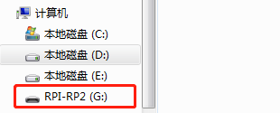

把刚刚下载的UF2文件拖拽到文件夹中，树莓派
PICO将会自动重启，此时，固件烧录完成。

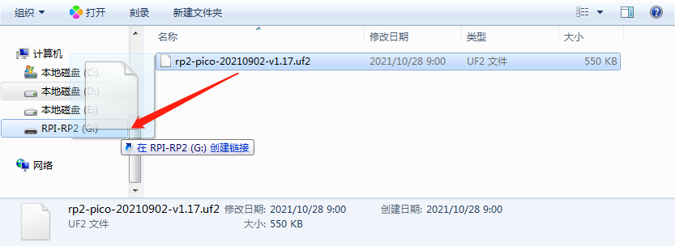

2.通过USB从Raspberry Pi 连接 pico

MicroPython固件配备了一个虚拟USB串口，可通过Raspberry Pi Pico上的microUSB线访问该串口。您的计算机应该注意到这个串行端口并将其列为字符设备，很可能是
/dev/ttyACM0。

输入指令ls
/dev/tty\*可以列出所有的串口。可能有很多，但MicroPython的USB串口将以/dev/ttyACM开头。
如果有疑问，请拔下微型USB连接器，看看哪个消失了。如果你没有看到任何东西，你可以尝试重启你的树莓派。

输入以下指令安装串口minicom：

sudo apt install minicom

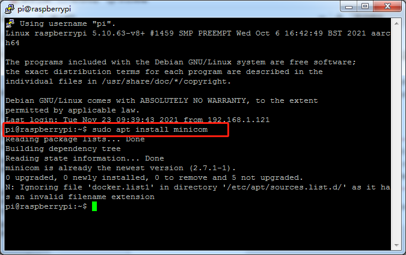

输入以下指令打开串口minicom：

minicom -o -D /dev/ttyACM0

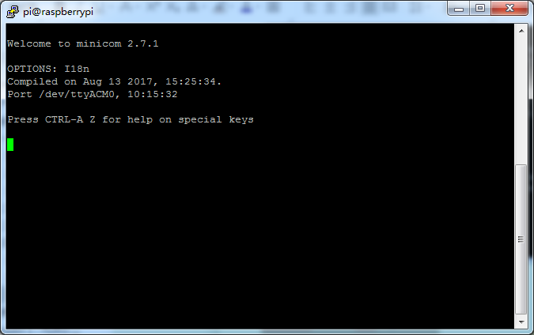

按下 Ctrl + B

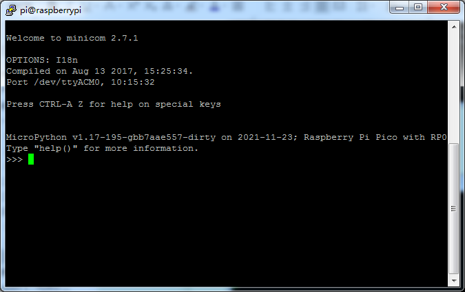

输入print("hello world")，将看到打印hello world

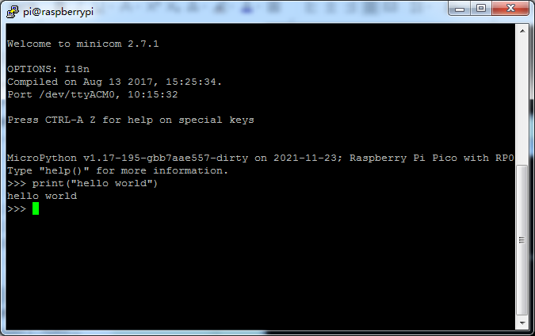

我们再来试试，点亮pico板载的LED，这个板载LED连接到GPIO25：machine模块用于控制片上硬件。这是所有MicroPython端口的标准，在这里，我们使用它来控制GPIO，因此我们可以将其驱动为高电平和低电平。如果你输入这个,点亮LED：

from machine import Pin

led = Pin(25, Pin.OUT)

led.value(1)

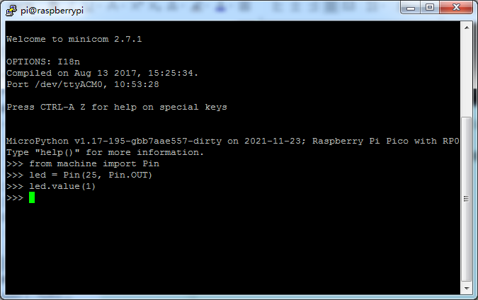

输入以下，熄灭LED：

led.value(0)

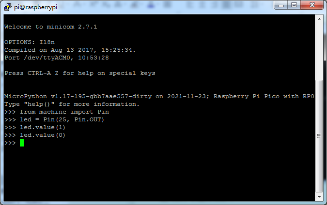

这样我们已经成功从raspberry pi通过USB连接了Pico。

3.安装IDE---Thonny

我们前面推荐下载的树莓派镜像系统是带有一些常用软件的，Thonny也在其中：

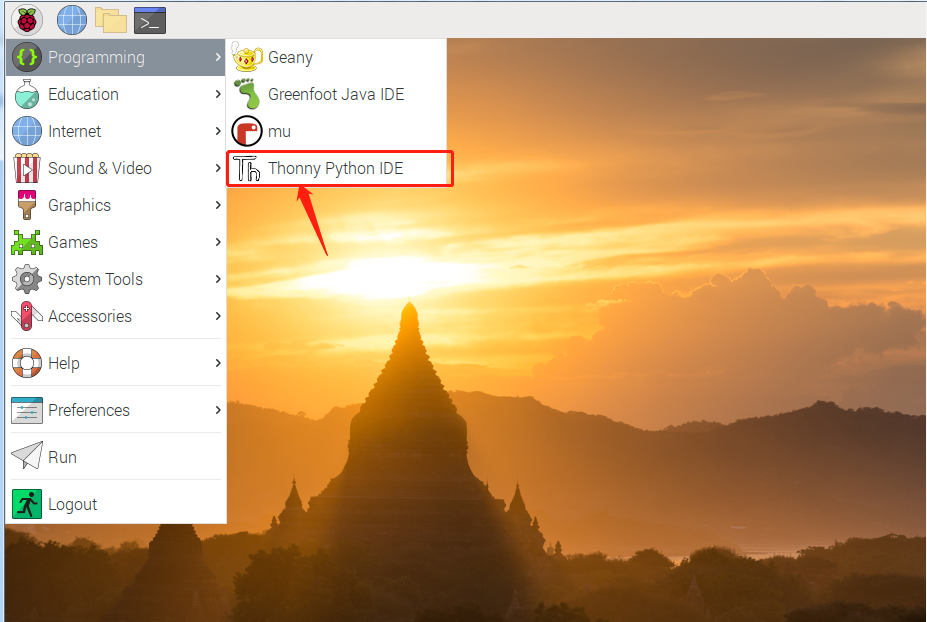

但是如果我们没有自带这个软件的话，就需要自己手动下载，在终端输入以下指令，下载安装Thonny：

sudo apt install thonny

安装完成后，打开Thonny，第一次打开，点击右上角，选择切换到常规模式，然后我们重新打开Thonny：

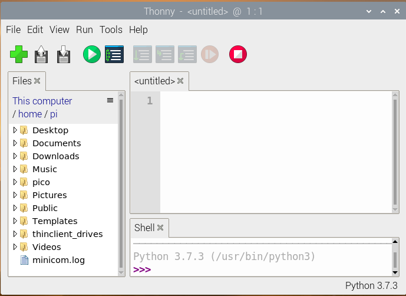

右下角我们选择raspberry pi pico

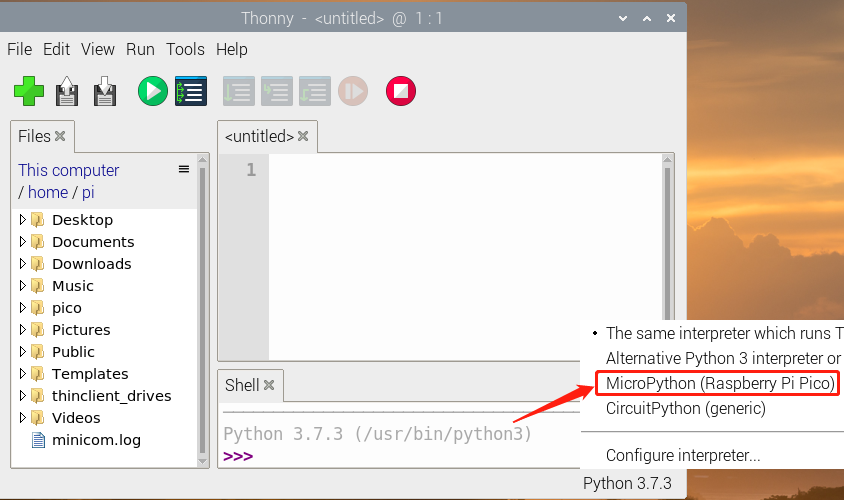

然后点击Tools-Options：

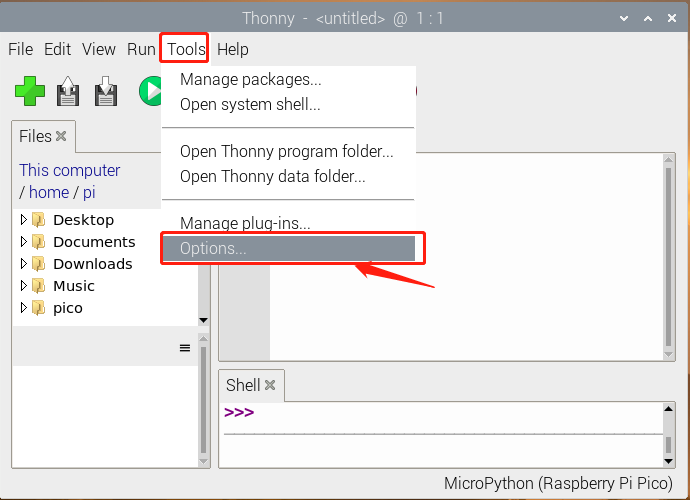

找到Interpreter,选择MicroPython(Raspberry Pi Pico) 设备和串口：

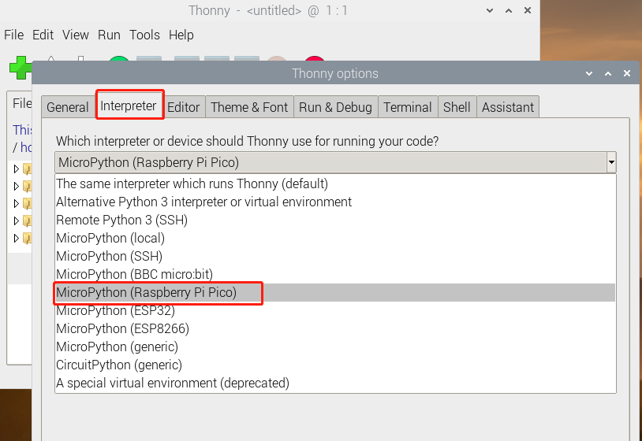

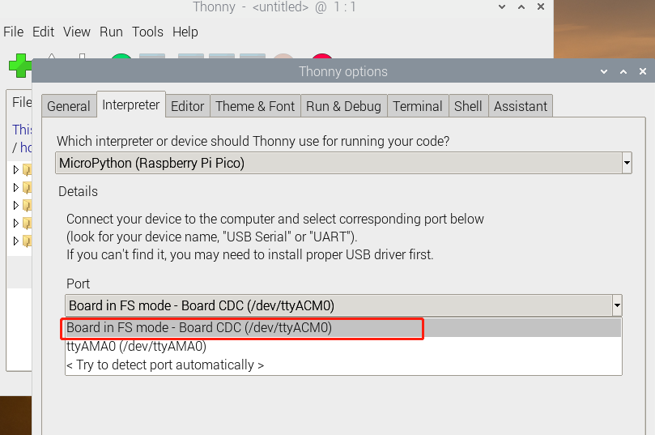

或者选择MicroPython (generic)：

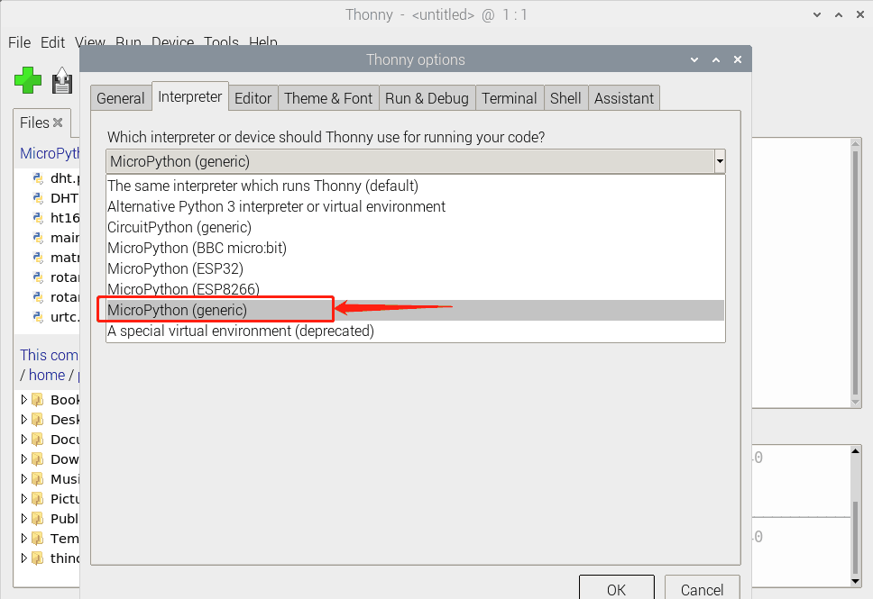

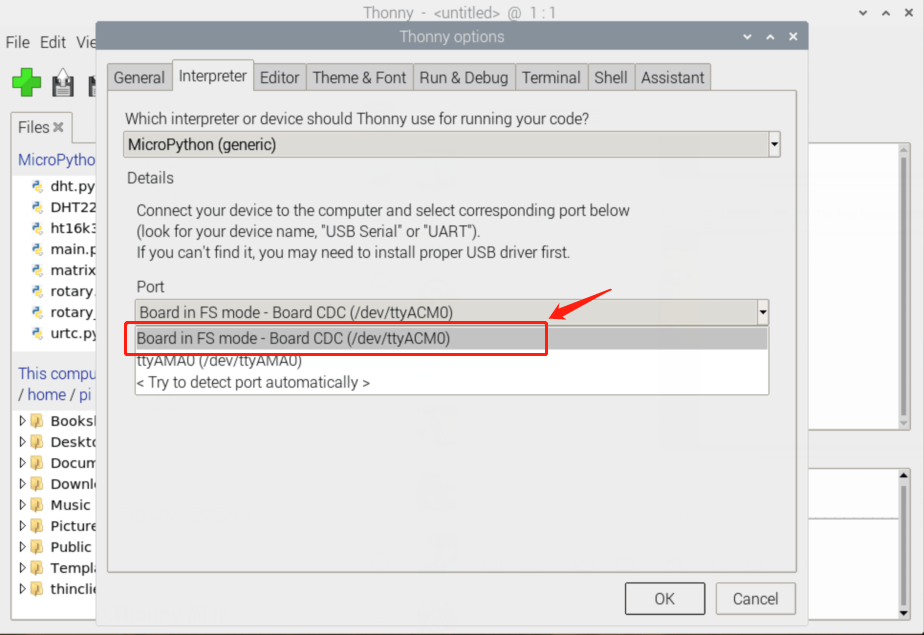

点击OK，就完成了。

4.Thonny简介

我们下面要了解Thonny的使用了，打开Thonny：在最上面我们可以看有：File、Edit、View、Run、Tools、Help。

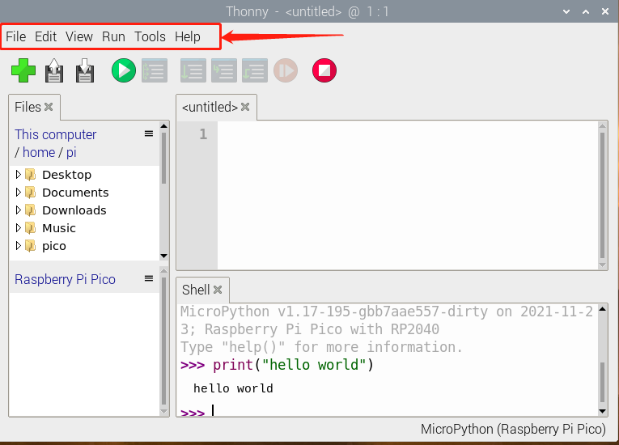

点击File，显示下拉的选项是对文件的一些新建、打开和保存之类的操作：

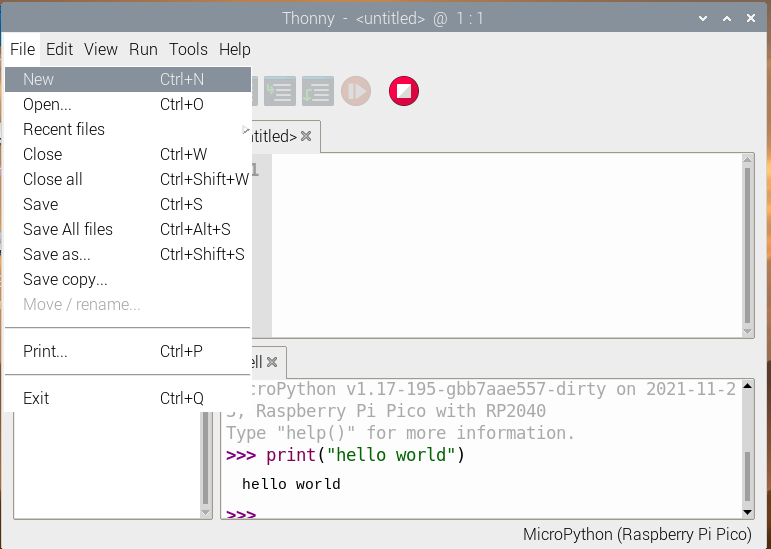

点击Edit，我们可以看到下拉选项是对文件代码内容的复制、剪切、粘贴、撤销的一些编辑操作

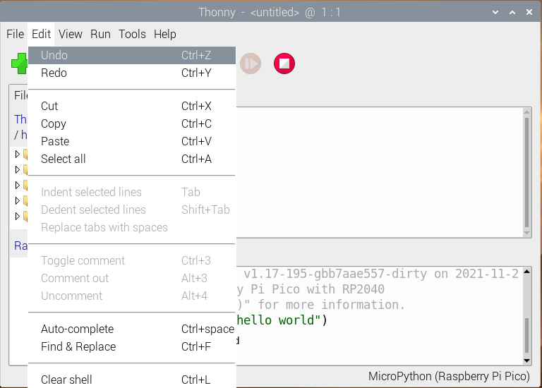

点击View，下拉选项是一些助手类工具，比如我们不勾选Shell（Shell是Pico的
“命令行”，你可以直接在这里执行代码），那么在界面下饭就不会显示出我们的编译结果；点击文件，那么在左边就会显示出来我们保存的代码文件；我们也可以点击勾选助手、变量之类的我们想要用到的工具

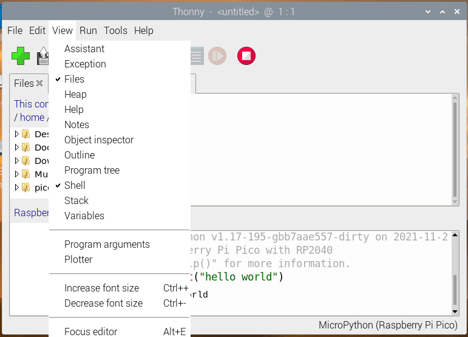

点击Run，我们这里也可以选择解释器，它也告诉我们一些运行代码和停止进程及中断执行的一些快捷键

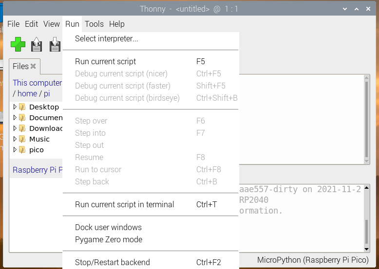

点击Tools，这里我们前面就用到里面的设置-解释器了，我们还可以在里面设置字体格式，点击下拉选项的管理包，我们可以在里面下载我们需要的模块：

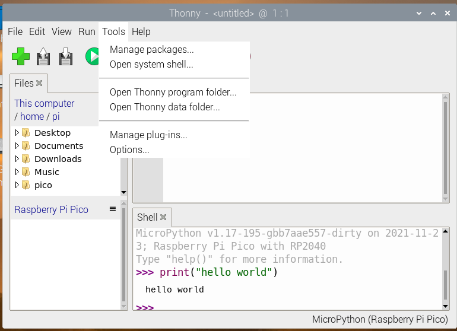

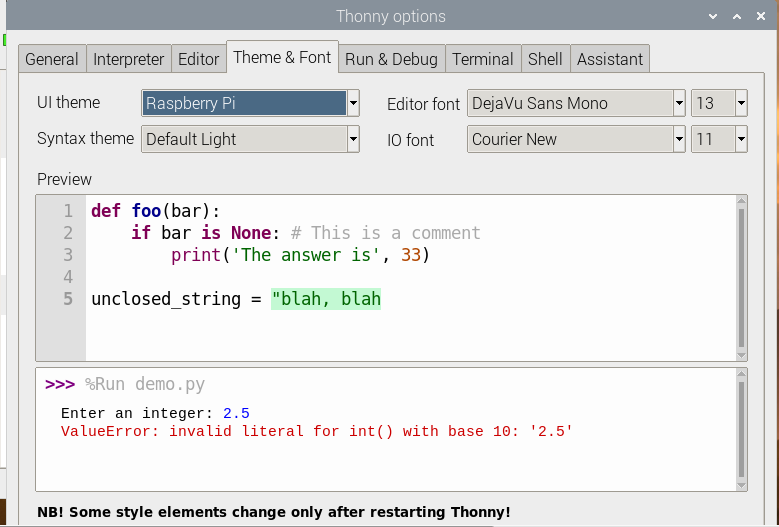

点击Help，就是一些Thonny的版本更新内容了。

Thonny为了简化使用，已经用一些大的快捷图标帮我们创建了上面讲的一些经常使用到工具：

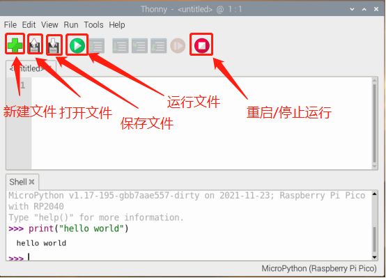

我们点击打开文件或者保存时，会出现一个小的提示框：

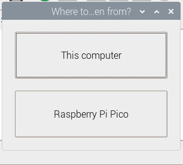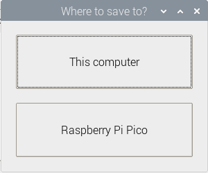

(注意！如果我们前面选择了“MicroPython(generic)”，我们这里显示的就是“MicroPython Device”而不是“Raspberry Pi Pico”了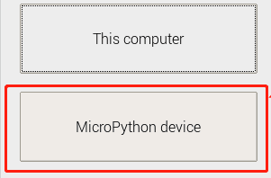)

我们可以选择打开保存在我们树莓派电脑上的或者保存在Pico上的程序，也可以选择将程序保存到我们电脑上或者Pico上。

我们将下面一段代码复制到Tonny上来，并保存在pico上，名为test.py

from machine import Pin, Timer

led = Pin(25, Pin.OUT)

tim = Timer()

def tick(timer):

global led

led.toggle()

tim.init(freq=2.5, mode=Timer.PERIODIC, callback=tick)

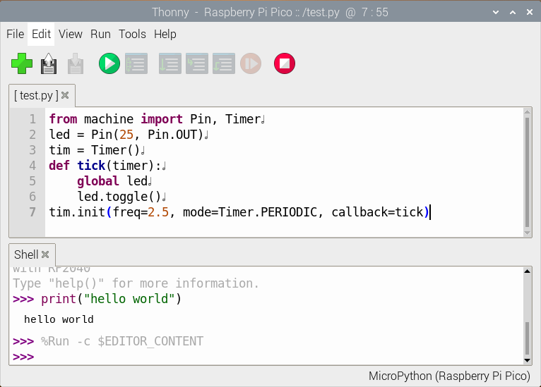

然后我们点击运行这段代码，我们将发现我们板载的LED灯将闪烁，然后我们点击停止进程，板载LED将停止闪烁。如果我们此时拔掉MicroUSB线，再重新插上，上电后LED也不会继续闪烁，这是因为我们没有把这个文件命名为main.py并保存在Pico上。我们点击文件-另存为，然后选择Pico，文件名为main.py(一定要加后缀.py)，点击确认保存后，再次运行，LED继续闪烁：

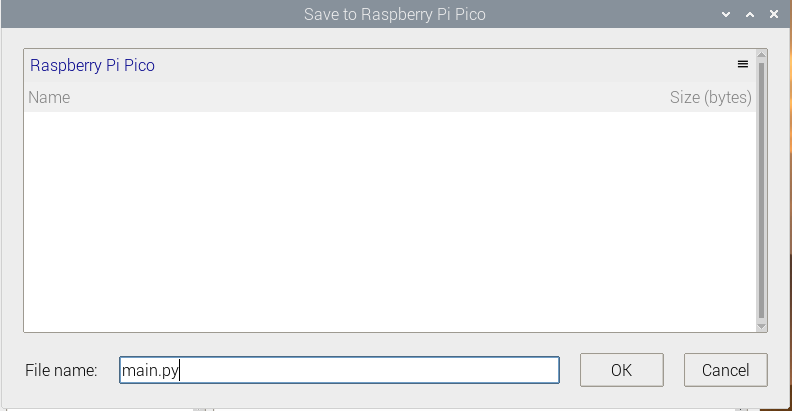

然后我们再次拔下MicroUSB线，然后重新插上上电，我们会发现，板载LED继续闪烁，因为下次树莓派PICO通电时便会自动运行main.py中的程序。

5.Pico模块（库）的加载

Python的强大来源于模块，Python 具有脚本语言中最丰富和强大的类库，足以支持绝大多数日常应用。我们把一些稍微复杂的传感器通过导入模块的方式，这样可以使我们学习更加简单。

方法很简单，只要将我们需要用的模块文件保存在Pico上就可以导入调用了，或者打开保存在我们电脑上的文件，选择文件-另存为，然后选择另存为到Pico板上即可（鼠标右键可以选择删除）。例如我的Pico上保存了一些本课程需要的库文件：点击视图-文件，在界面的左边会显示出来：

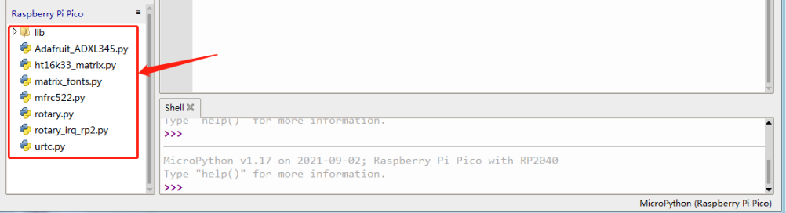

在使用对应传感器时，直接import 导入对应模块就可以使用了:

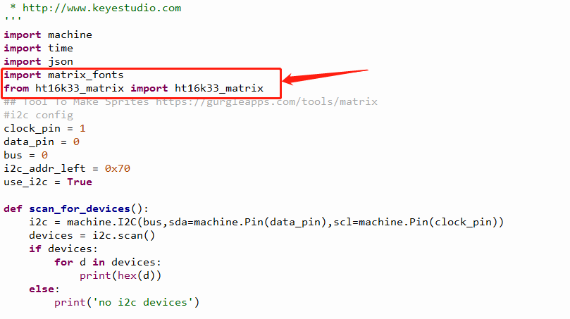

我们把课程中所有的代码，都先保存到树莓派上来，方便我们后续使用。打开终端，在/home/pi建立一个pico文件夹：

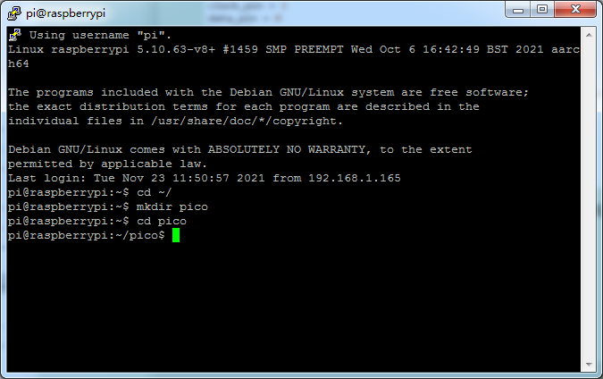

然后把我们的代码复制到这个文件夹下之后：输入ls，即可看到：

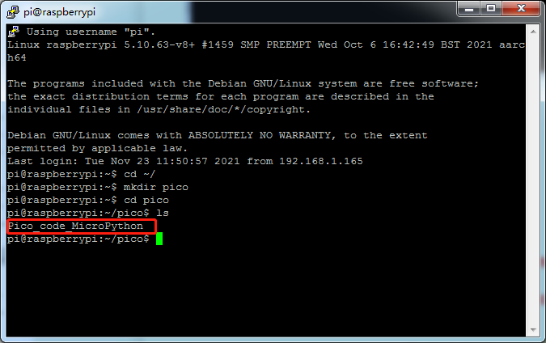

下次我们就可以使用Thonny打开这个路径，直接找到我们保存的代码了。

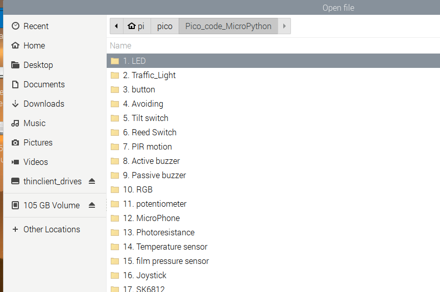

### Keyes raspberry pico IO 扩展板

1.概述

Keyes raspberry pico IO 扩展板是专为Raspberry Pi Pico开发的扩展板，无需焊接，全引脚引出。为方便接线，扩展板上接口都带有丝印。3pin接口丝印一般为G V
S，其中扩展板上所有的G代表GND，V代表VCC（3.3V）接口，S代表接口上方的数字口/模拟口。4pin/6pin接口左面都有对应接口丝印。扩展板上自带间距为2.54mm的排母接口，接线顺序和Pico板的排母接口的线序一致。同时扩展板上自带一个复位按键，1个电源指示灯PWR。同时扩展板自带4个标准乐高定位孔。

该扩展板提供各种通信接口包括2 x I2C、2 x UART、2 x SPI、3 x 模拟IO和13 x
数字IO，并提供6.5-12V的电源接口为原型开发提供最简单的连接方式。

2.规格参数：

输出电流：≦500mA

DC输入电压：6.5 - 12V

输出电压：DC3.3V\5V

推荐环境温度：-10°C ~ 50°C

产品尺寸：45.339MM \*83.617MM

排针间距：2.54mm

3.原理图

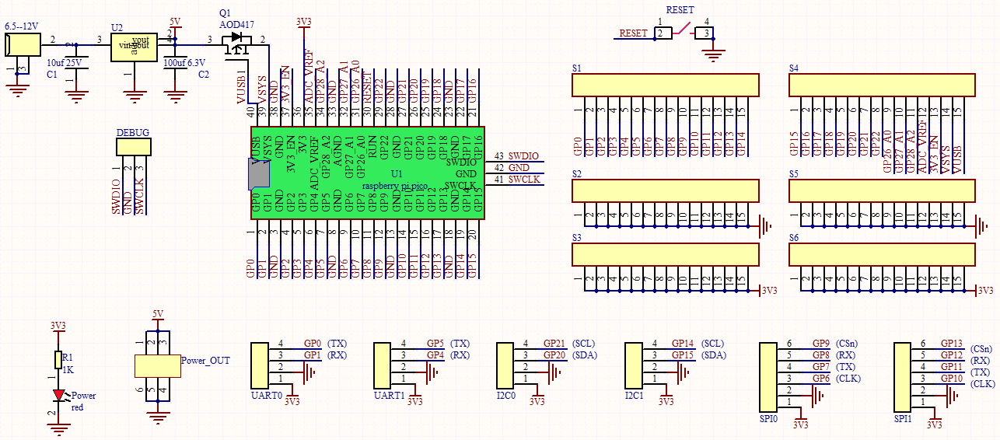

4.接口说明

5.使用方法

将Raspberry Pi Pico堆叠在扩展板上即可使用，如下图

## 课程

前24个实验我们将24款传感器利用我们套件中的杜邦线，单独连接在Raspberry Pi Pico板和Raspberry Pi Pico扩展板。然后运行对应的测试代码，单独测试各个传感器的功能。

后12个实验将多个传感器/模块搭配使用，组合出各种各样的功能。传感器/模块种类比较多，我们只是选择几款比较经典的组合实验。你们也可以根据自己的想法，自己设置代码，组合出你想要的特别的功能。

我们下面的课程是先从简单到复杂学习单个模块/传感器的原理，后面再学习一些传感器的扩展应用以巩固加深我们对该套件的理解。

特别注意：实验种模块/传感器连接线材时，必须按照资料里的接线方法及位置，电源与信号引脚不能错接，否则可能会没有实验现象或损坏模块/传感器。

### 实验1：点亮LED

实验介绍：

在我们前面的准备工作中，知道我们Pico板上有个板载LED，而且我们已经知道这个LED是连接在Pico的GP25的，我们还让这个LED点亮和闪烁了。下面我们就用同样的方法点亮一个外接的LED模块。

在这个套件中，我们有一个Keyes DIY电子积木
白色LED模块。它的控制方法非常简单，要想点亮LED，只要让它两端有一定的电压就可以。

实验中，我们通过编程控制信号端S的高低电平，从而控制LED的亮灭。我们提供两个测试代码，分别控制LED模块上实现点亮和闪烁的效果。

实验原理：

下面附了两个电路原理图，左边我们直接把LED串联一个电阻，负极接地，正极接到单片机的IO口，理论上来说当我们把信号端S输出高电平(3.3V)，LED两端就会有电压，LED就会被点亮，那么我们为什么说这么接不合理呢？原因就是我们Pico IO口输出电流的能力有限(最大12mA)，虽然输出了高电平，但是可能达不到控制LED的电流，此时LED可能比较暗。

右边的接法：控制时，GND和VCC上电后，如果信号端S为高电平，那么三极管Q1就会导通，则LED有电流流过，LED即会亮起(注意：此时电流是由VCC电源端流经LED和电阻R3到GND，而不是直接从单片机IO口输出，此时输出电流的能力就比较强)，S端为低电平时三极管Q1截止，那么就没有电流流过LED，那么LED就会熄灭。也就是说，我们这里的三极管Q1相当于一个开关作用，而电阻R1,R3都是一个限流电阻，顾名思义就是限制电流的大小，以免烧坏电子元器件。

实验元件：

|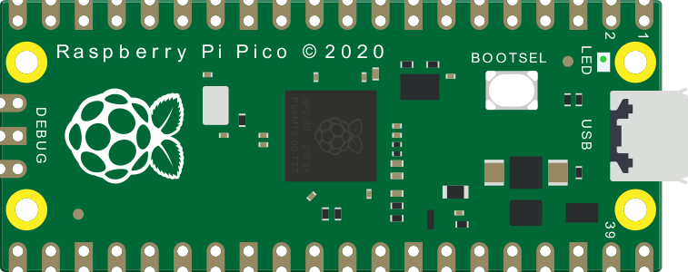|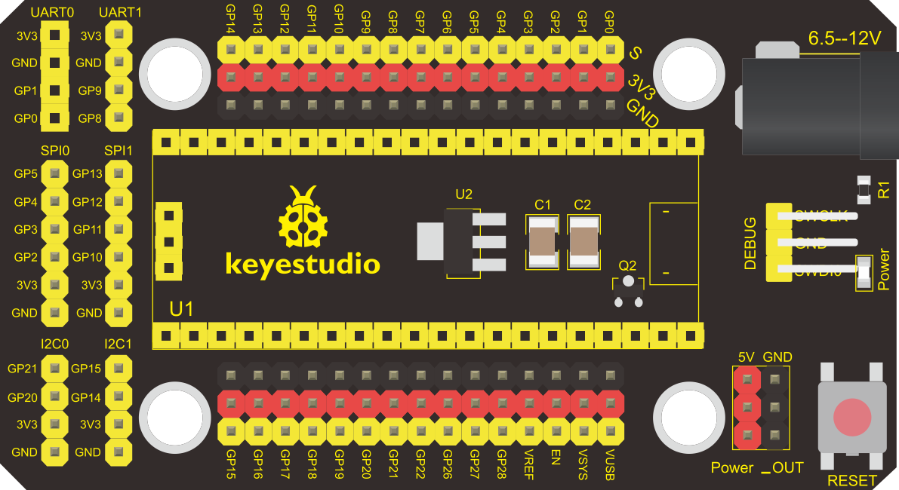|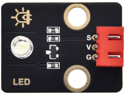|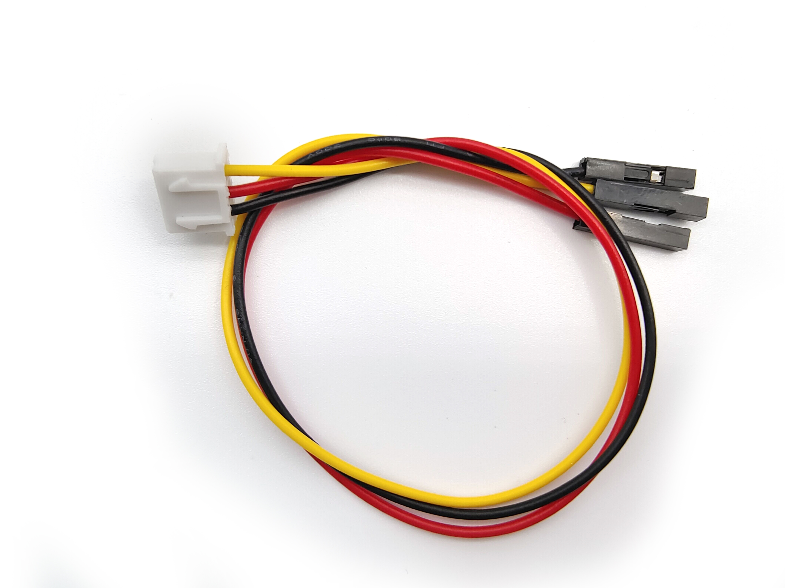||
|-|-|-|-|-|
|Raspberry Pi Pico板*1|Raspberry Pi Pico扩展板*1|Keyes DIY电子积木 白色LED模块*1|防反插3Pin*1|MicroUSB线*1|

(注意：这里microUSB线是通过树莓派连接到pico，实验元件我们没有列出树莓了，还有杜邦线3p指的是从我们40P的杜邦线撕下一个3P下来，下面的实验也是如此。)

实验接线图：

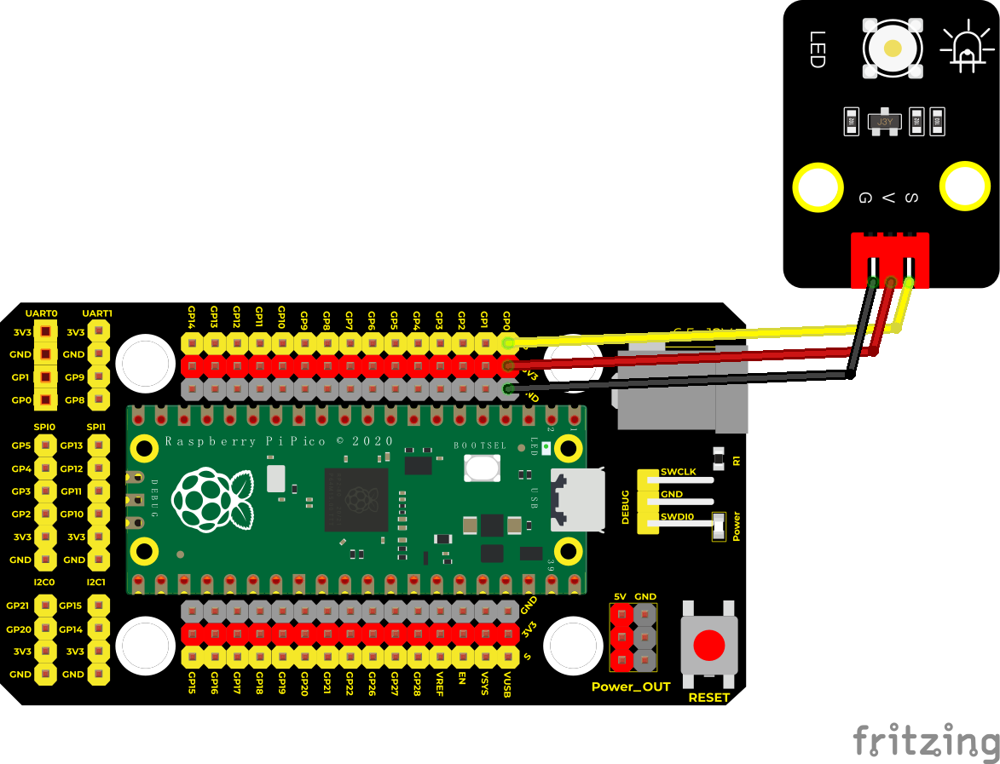

运行示例代码：

打开Thonny，连上pico之后，我们点击View然后勾选File，然后我们就可以在左侧看见保存在树莓派上的代码还有pico上的代码：

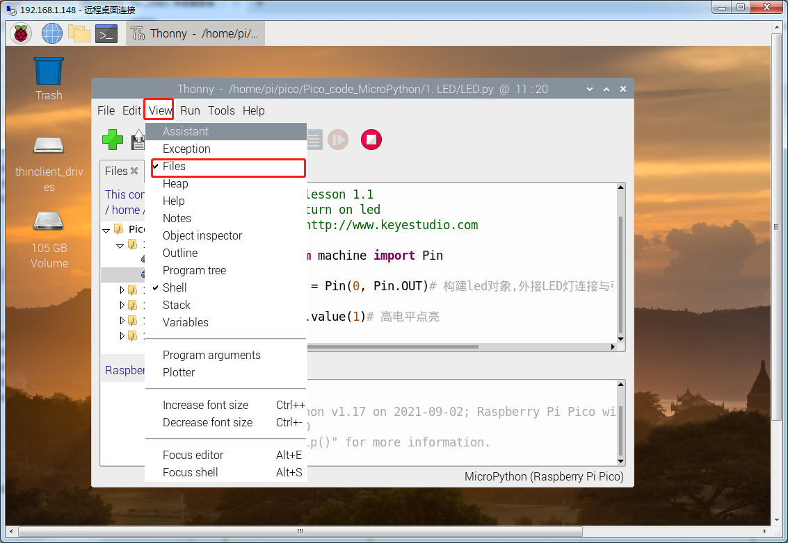

找到LED.py和Bink.py，因为我们前面已经把代码保存在树莓派了，然后双击打开代码，再点击运行代码，如果点击运行无效，我们可以尝试点击停止运行，然后再次点击运行，也可以按下我们pico扩展板上的复位按钮，然后再点击，然后再运行：

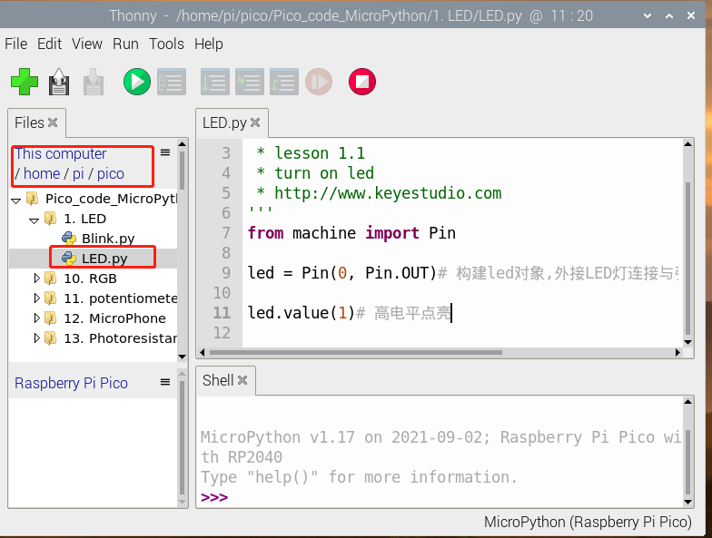

代码说明：

1.  machine模块是一定要的，我们使用microPython对pico进行编程时，必须import     machine或者from machine     import...，这个模块里面对pico的一些配置等等已经设置好了，我们只需导入它，然后调用。

2.  time模块主要是用于时间延迟设置time.sleep()，括号里的值为延时的秒数，如果我们使用小数，如time.sleep(0.01)，即延时10ms。我们后面也会看到from     time import     sleep，Python的from语句让你从模块中导入一个指定的部分到当前命名空间中，我们这里即导入延时部分，这个声明不会把整个time模块导入到当前的命名空间中，它只会将time里的sleep函数引入进来，我们延时1秒时，使用sleep(1)即可。

3.  led = Pin(0,     Pin.OUT)，构建一个引脚类实例，我们将其命名为led，0表示我们连接的引脚为GP0，Pin.OUT表示引脚0为输出模式，即可以使用.value()方法输出高电平(3.3V)led.value(1)或者低电平(0V)led.value(0)。我们后面也会看到前面模块导入是直接使用import     machine，那么我们在创建管脚类实例时，就要改为led =
machine.Pin(0, machine.Pin.OUT)也就是在前面多了个machine.。

4.  最后while     True为循环函数，在此函数下面的语句循环运行，除非True变False，我们上面的while函数中，首先led.value(1),给管脚0输出高电平，LED点亮，然后使用延时函数time.sleep(1)等待1秒，然后led.value(0),给管脚0输出低电平，LED熄灭，再次使用延时函数time.sleep(1)等待1秒，这样反复运行，LED就形成了1秒反复闪烁了。

实验结果：

代码一：运行测试代码一成功后，模块上白色LED点亮

代码二：运行测试代码二成功后，白色LED亮1秒灭一秒，循环交替闪烁。

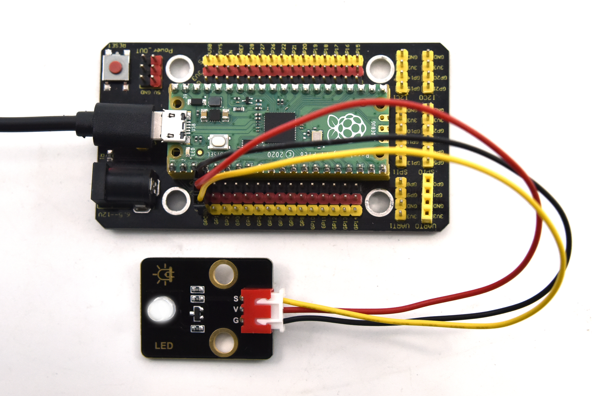

注意：键盘按下停止运行

8.示例代码：

| ''' * Keyes Starter Kit for Raspberry Pi Pico * lesson 1.1 * turn on led ''' from machine import Pin led = Pin(0, Pin.OUT)#构建led对象,外接LED灯连接与引脚0相连，并设置引脚0为输出模式 led.value(1)# 高电平点亮 |
|-|
| ''' * Keyes Starter Kit for Raspberry Pi Pico * lesson 1.2 * Blink ''' from machine import Pin import time led = Pin(0, Pin.OUT)#构建led对象,外接LED灯连接与引脚0相连，并设置引脚0为输出模式 while True: led.value(1)# led点亮 time.sleep(1)# 等待1秒 led.value(0)# led熄灭 time.sleep(1)# 等待1秒 |

### 实验2：交通灯

实验介绍：

我想大家都看见过交通灯，就是马路上十字路口的红绿灯。如果您开过车，我想您一定仔细观察过交通灯，如果您还没有驾驶过车，您是否仔细观察过交通灯呢？在我们这个套件中，就包含一个交通灯模块。我们经常会用红绿黄3个LED外接电路来模拟路边的红绿黄灯闪烁。因此我们特别设计了这款模块，模块上自带了红黄绿3个LED灯，我们这个实验就做一个模拟交通灯。

实验原理：

前面第一课我们就学习了如何控制一个LED，由原理图容易得知，控制这个模块就好比分别控制3个独立的LED灯(我们这个灯可直接由单片机IO口驱动)，给对应颜色灯高电平就亮起对应的颜色。比如，我们给信号“R”输出高电平，也就是3.3V，则红色LED点亮。

实验元件：

|||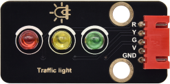|||
|-|-|-|-|-|
|Raspberry Pi Pico板*1|Raspberry Pi Pico扩展板*1|keyes DIY电子积木 交通灯模块*1|防反插5Pin*1|MicroUSB线*1|

接线图

运行示例代码：

找到Traffic_Light.py，然后双击打开代码，再点击运行代码

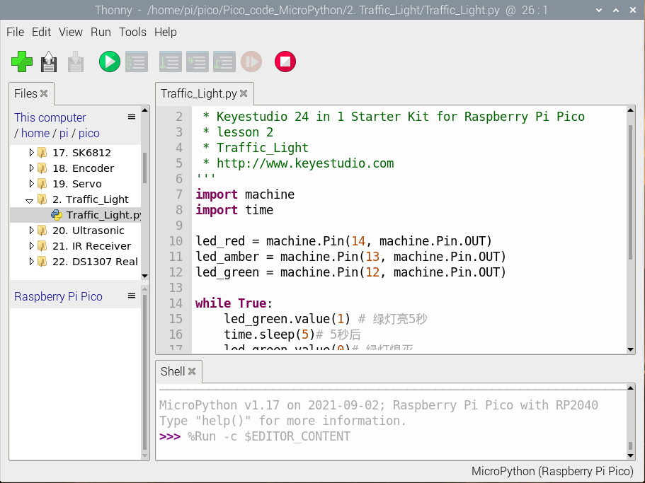

代码说明：

1.  创建管脚类接口，设置引脚模式，延时函数，输出高低电平参考实验一说明，这里就不多说了。

2.  这里我们还用到了for循环：最简单形式为for i in     range()，我们上面用到了range(3)，表示变量i从0开始，每次自加1，到小于3的最大整数，也就是2。即第一次i为0，第二次i为1，第三次i为2，再加i就为3了，此时跳出for循环，所以for循环下面的语句执行三次，每一次都是黄灯亮0.5秒，灭0.5秒，即闪烁3次。

3.  for循环我们还可用for x in     lists:，每次运行x遍历lists列表，直到遍历完列表所有的值，当然也可遍历元组，字典，字符串等等。

实验结果：

运行测试代码，模块上绿色LED亮5秒然后熄灭，黄色LED闪烁3秒然后熄灭，再然后红色LED亮5秒，然后熄灭，模块上3个LED自动模拟交通灯循环运行。

### 实验3：按键传感器

实验介绍：

在这个套件中，有一个Keyes DIY电子积木
单路按键模块，它主要采用1个轻触开关，自带1个黄色按键帽。前面我们学习了怎么让我们单片机的引脚输出一个高电平或者低电平，这节实验我们就来学习怎么读取引脚是高电平（3.3V）还是低电平（0V）。

实验中，我们通过读取传感器上S端高低电平，判断传感器上按键是否按下；并且，我们在shell显示测试结果。

实验原理：

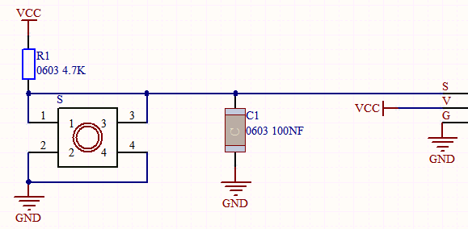附原理图，按键有四个引脚，其中1和3是相连的，2和4是相连的，在我们未按下按键时，13与24是断开的，信号端S读取的是被4.7K的上拉电阻R1所拉高的高电平，而当我们按下按键时，13和24连通。信号端S连接到了GND，此时读取到的电平为低电平，即按下按键，传感器信号端为低电平；松开按键时，信号端为高电平。

实验元件:

|||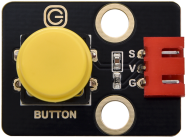|||
|-|-|-|-|-|
|Raspberry Pi Pico板*1|Raspberry Pi Pico扩展板*1|keyes DIY电子积木 单路按键模块*1|防反插3Pin*1|MicroUSB线*1|

实验接线图：

运行示例代码：

找到button.py，然后双击打开代码，再点击运行代码

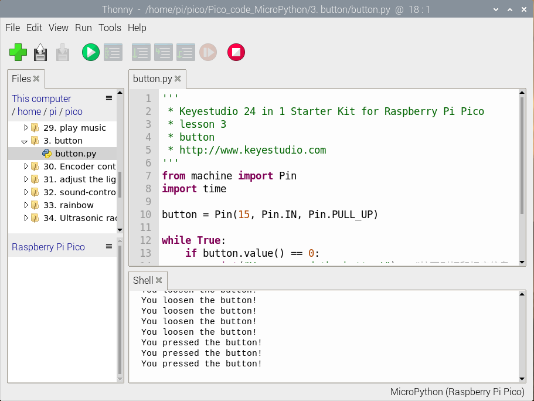

代码说明：

1.  button = Pin(15, Pin.IN,     Pin.PULL_UP)，由前面实验一学过的知识我们知道，在这里我们定义按键管脚为GP15，设置为输入上拉模式。我们也可使用button     = Pin(15,     Pin.IN)设置为输入模式而不使用输入上拉，此时引脚处于高阻抗状态，从而导致不可预测的电平结果。为了确保开关断开时的读数正确，推荐使用上拉或下拉电阻（我们的模块已经使用上拉电阻R1，所以我们可以不设置输入上拉）。该电阻的目的是在开关断开时将引脚拉至已知状态。通常选择一个4.7K/10     K欧姆的电阻，因为它的阻值足够低，可以可靠地防止输入悬空，同时，该阻值也要足够高，以使开关闭合时不会消耗太多电流。如果使用下拉电阻，则当开关断开时，输入引脚将为低电平；当开关闭合时，输入引脚将为高电平。如果使用上拉电阻，则当开关断开时，输入引脚将为高电平；当开关闭合时，输入引脚将为低电平。

2.  button.value()，读取按键的数字电平，函数返回高(HIGH)或者低(LOW)。

3.  if..else..语句，当if后面的逻辑判断为True时，执行if下缩进的代码；否则执行else下缩进的代码，我们知道python代码是严格使用缩进的。

4.  代码逻辑是pico检测到按键按下时，信号端为低电平，即GP15为低电平，即button.value()
为0。否则（pico检测到按键松开时），button.value()
为1，此时执行else语句。

实验结果：

运行测试代码成功，观察Shell。显示对应字符。当传感器按下按键时，打印显示“You pressed the button!”字符；松开按键时显示“You loosen the button!”字符。

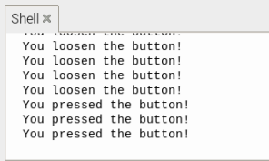

### 实验4：避障传感器

