# Raspberry Pi

## 前期准备：

### 树莓派系统需要的工具：

1.所需的硬件：

（1）树莓派4B/3B/2B （2）16G以上的TFT内存卡 （3）读卡器
（4）常用的电脑及配件

2.需要在常用电脑上安装的软件工具：

Windows用户：

（1）先安装putty

下载链接：[<u>https://www.chiark.greenend.org.uk/~sgtatham/putty/</u>](https://www.chiark.greenend.org.uk/~sgtatham/putty/)

1.  下载好了putty驱动文件后，鼠标左键双击putty驱动文件，再点击“Next”。

2.  点击“Next”。

3.  选中“Install Putty files”后，再点击“Install”。

4.  几秒钟之后，安装就完成了，点击“Finish”就可以了。

（2）SSH远程登录软件 WinSCP

下载链接：[<u>https://winscp.net/eng/download.php</u>](https://winscp.net/eng/download.php)

a.下载好WinSCP软件文件后，鼠标左键双击WinSCP软件文件，再左键点击。

b\. 点击“Accept”，然后选中对应的选项且点击“Next”，再点击“Install”。

c\. 几秒钟之后，安装就完成了，点击“Finish”就可以了。

（3）格式化TFT卡工具 SD Card Formatter

下载链接：

[<u>http://www.canadiancontent.net/tech/download/SD_Card_Formatter.html</u>](http://www.canadiancontent.net/tech/download/SD_Card_Formatter.html)

1.  将下载好的SDCardFormatterv5_WinEN压缩包解压，鼠标左键双击SD Card     Formatter文件，运行此文件。

2.  点击“Next”，再选择“”并点击“Next”。

3.  又点击“Next”，然后再点击“Install”。

d\. 几秒钟之后，安装就完成了，点击“Finish”就可以了。

（4）烧录镜像系统软件工具 Win32DiskImager

下载链接：[<u>https://sourceforge.net/projects/win32diskimager/</u>](https://sourceforge.net/projects/win32diskimager/)

1.  下载好Win32DiskImager软件文件之后，鼠标左键双击Win32DiskImager软件文件，然后点击“Run”。

2.  选择之后，再点击“Next”。

3.  点击“Browse...”，选择Win32DiskImager文件安装的位置，再点击“Next”。

4.  点击“Browse...”选择Win32DiskImager文件安装的位置，再点击“Next”。

5.  选中后再点击“Next”，然后又点击“Install”。

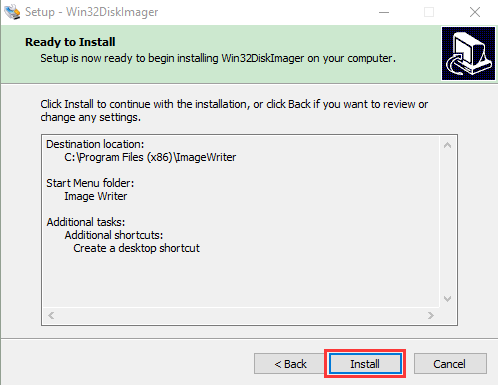

d\. 几秒钟之后，安装就完成了，点击“Finish”就可以了。

（5）扫描查找ip地址软件工具WNetWatcher

下载链接：http://www.nirsoft.net/utils/wnetwatcher.zip

树莓派的镜像系统

最新版本系统下载链接：[<u>https://www.raspberrypi.org/downloads/raspberry-pi-os/</u>](https://www.raspberrypi.org/downloads/raspberry-pi-os/)

旧版本系统下载链接：

- Raspbian：https://downloads.raspberrypi.org/raspbian/images/

- Raspbian full：https://downloads.raspberrypi.org/raspbian_full/images/

- Raspbian lite：https://downloads.raspberrypi.org/raspbian_lite/images/

本教程使用2020.08.20版本系统：（由于树莓派官方版本升级，可能导致部分系统功能与此教程使用有些冲突，所以我们这里推荐使用本教程版本）

(下载有桌面并自带些常用软件的版本)

### 给树莓派安装Raspberry Pi OS系统

1.TFT内存卡插到读卡器上，读卡器插到电脑的USB端口

2.使用SD Card Formatter软件工具将TFT内存卡格式化，如下图所示：

3.烧录系统

（1）使用Win32DiskImager 软件，将树莓派官方的系统（Raspberry Pi OS）镜像烧录到TFT内存卡上。

（2）镜像系统烧录完成后，先不要把读卡器拔出，使用记事本新建一个文件命名为SSH，把.txt删掉，然后复制到TFT卡的boot目录下，这样就可以打开SSH登录功能了，如下图所示：

（3）拔出读卡器。

4.登录系统（以下操作要求raspberry与PC电脑在同一局域网内）

（1）将烧录好的TFT内存卡插到树莓派，接好网线，接好电源并打开电源。

如果有屏幕和树莓派的HDMI线，连接好屏幕，就可以看到Raspberry Pi OS系统的开机画面了。

如果没有树莓派的HDMI线，也没事，可以使用软件WinSCP来进行SSH远程登录，也可以使用xrdp登录树莓派系统的桌面。

（2）远程登录

使用WinSCP，通过树莓派系统的默认名称、默认用户名、默认密码，来登录。注意这就要求同一个网络里只能接入一个树莓派。

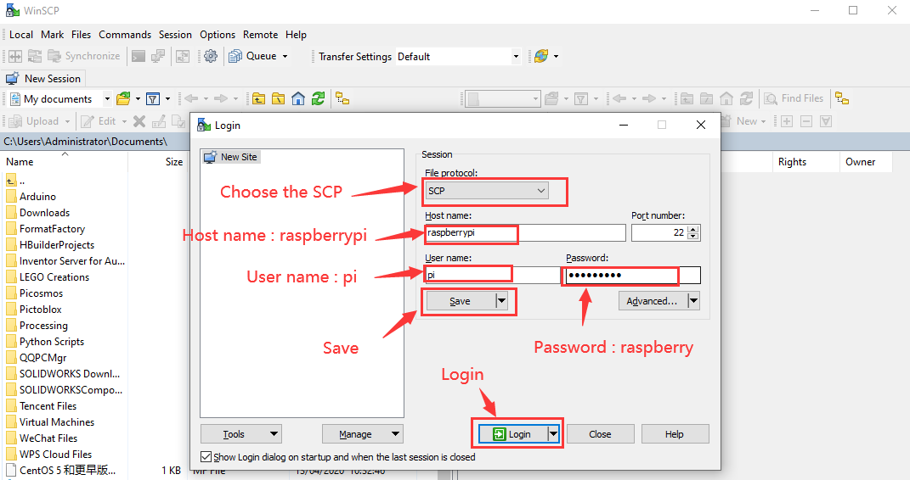

（3）查看ip地址和mac地址

点击打开终端之后，还需要再次输入密码：raspberry ，再按下键盘 Enter 。

登录成功后，打开终端，输入ip a 后再按下键盘
Enter就可以查看ip和mac地址

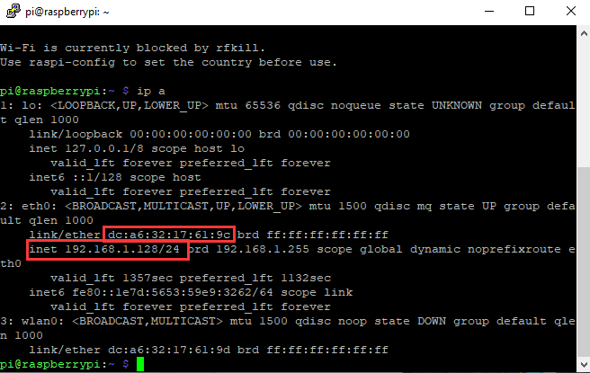

从上图圈出来的可以看出，我这块树莓派的mac地址为：a6:32:17:61:9c，ip地址为：192.168.1.128，后面使用xrdp远程登录树莓派系统桌面时使用到ip地址。

mac地址是不会变的，当不确定哪个ip时，可以通过mac地址来确认。

（4）固定树莓派的ip地址

由于ip地址是会变动的，第二天很可能ip地址就不一样了，就需要再次查看ip地址，所以为了更方便使用，需要固定树莓派的ip地址。

操作步骤如下：

切换到root用户

如果还没设置root的用户密码

①设置root密码

终端里输入：sudo passwd root

接着设置密码就可以了

②然后切换到root用户

su root

③固定ip地址的配置文件

先改好下面配置文件的ip

（#更改的ip地址：address 192.168.1.99）

然后将修改好ip的配置文件复制粘贴到终端，回车，就配置好了。

配置文件：

echo -e '

auto eth0

iface eth0 inet static

\#Change IP address

address 192.168.1.99

netmask 255.255.255.0

gateway 192.168.1.1

network 192.168.1.0

broadcast 192.168.1.255

dns-domain 119.29.29.29

dns-nameservers 119.29.29.29

metric 0

mtu 1492

'\>/etc/network/interfaces.d/eth0

操作示例图，如下：

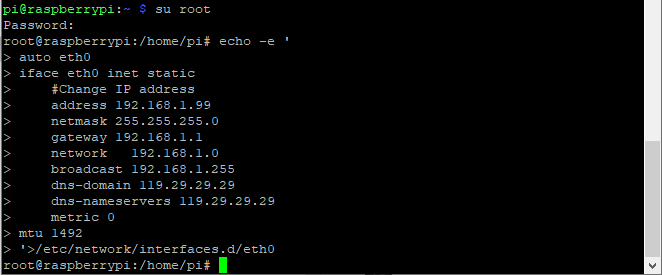

④重启系统，使配置文件生效

终端输入重启命令：sudo reboot

这之后就可以使用树莓派的固定ip来登录了。

⑤再次查看ip，确保已经固定好ip地址

（5）无线登录树莓派系统的桌面

如果我们没有连接显示屏的HDMI高清线，能不能在windows桌面上无线登录树莓派系统的桌面呢？是可以的，方法还挺多，目前比较常用的是使用VNC和Xrdp。

现在就教使用Xrdp在windows桌面上无线登录树莓派系统的桌面

①在终端里安装Xrdp服务

安装命令：

切换到root用户 ：su root

安装命令 ：apt-get install xrdp

根据提示，输入y ，再回车就行。

操作图如下：

②打开Windows的远程桌面连接

按下键盘 WIN+R 然后输入：mstsc.exe

操作图如下：

接着输入树莓派的ip地址，如下图，点击“Connect”后再次点击“Connect”。

192.168.1.99是我上面固定树莓派ip地址的步骤里固定的ip，改为你的树莓派ip就好了。

接着会出现个提示，点击 “Yes”就行了。

接着输入用户名：pi ，默认密码：raspberry，如下图所示：

点击OK或者 Enter键，就会出现树莓派系统Raspberry Pi OS的桌面了，如下图所示：

到这里为止，完成了树莓派系统Raspberry Pi OS的基本配置。

### Raspberry Pi Pico简介

2021年1月底的时候，树莓派基金会发布了一个重磅消息，推出了进军微控制器领域的树莓派Pico。功能强劲，价格便宜的特性让Pico受到了全世界创客们的关注，下面就来给大家介绍一下Pico这个小玩意儿。

Pico是一块小小的板子，大小和Arduino Nano差不多，为21mm × 51mm。

Raspberry Pi Pico是具有灵活数字接口的低成本高性能微控制器板。它集成了Raspberry Pi自己的RP2040微控制器芯片，运行速度高达133 MHz的双核Arm Cortex M0
+处理器，嵌入式264KB SRAM和2MB板载闪存以及26个多功能GPIO引脚。对于软件开发，可以使用Raspberry Pi的C/C++SDK或MicroPython，这个教程中我们使用MicroPython。

裸板不带针脚，需要自己焊。这是一块做工精良的电路板，也可以作为SMD元件，直接焊接到印刷电路板上。

板上最主要的功能是一端的microUSB连接器。它既用于通信，也用于给Pico供电。

在microUSB连接器旁边安装了一个板载LED，它内部连接到GPIO针脚25，这是整个Pico板上唯一的LED。

开机按钮安装在离LED稍低一点的地方，它可以让你改变Pico的启动模式，这样你就可以在上面加载MicroPython，进行拖拽式编程。

在板子的底部，你会看到三个连接点，这些连接点是用于串行Debug选项的，我们今天是入门，暂时不探讨这个问题，高级开发者会比较感兴趣。

在板子的中央是整个板子的“大脑”——RP2040 MCU，RP2040能够支持高达16MB的片外闪存，不过在Pico中只有4MB。

– 双核32位ARM Cortex -M0+处理器

– 运行在48MHz，但可以超频到133MHz。

– 30个GPIO引脚(26个暴露)

– 可支持USB主机或设备模式

– 8 可编程I/O（PIO）状态机

Pico是一个3.3V的逻辑器件，但由于内置了电压转换器和稳压器，它可以用一系列电源供电。

GND–––地线，8个地线加上3针Debug连接器上的一个附加地线，是方形的，而不是像其他连接的圆形。

VBUS–––这是来自 microUSB 总线的电源，5 V。如果Pico不是由microUSB连接器供电，那么这里将没有输出。

VSYS–––这是输入电压，范围为 2 至 5 V。板载电压转换器将为 Pico
将其改为 3.3 V。

3V3–––这是 Pico 内部调节器的 3.3 伏输出。只要将负载保持在 300ma
以下，它就可用于为其他组件供电。

3V3_EN–––你可以使用此输入禁用 Pico 的内部电压调节器，从而关闭 Pico
和由其供电的任何组件。

RUN–––可以启用或禁用 RP2040 微控制器，也可以将其复位。

树莓派
Pico板上有26个裸露的GPIO连接，它们的排列顺序很好，在GP22和GP26之间有“空隙”（这些“缺失”的引脚在内部使用）。这些引脚都有多种功能，你可以为PWM配置多达16个引脚。有两个I2C总线，两个UART和两个SPI总线，这些可以配置使用多种GPIO引脚。

Pico有三个模数转换器分别为ADC0-GP26、ADC1-GP27、ADC2-GP28还有一个内部用于板载温度传感器的转换器ADC-VREF。注意：ADC的分辨率为12位。但MicroPython把范围映射到16位，也就是从0到65535，微处理器的工作电压是3.3V，也就是说0对应着0V，65535对应着3.3V。

你也可以在ADC_VREF引脚上提供一个外部精密电压参考。其中一个接地点，即33脚上的ADC_GND被用作该参考点的接地点。

|树莓派 PICO配置|
|-|
|双核 Arm Cortex-M0 + @ 133MHz|
|2 个 UART、2 个 SPI 控制器和 2 个 I2C 控制器|
|芯片内置 264KB SRAM 和 2MB 的板载闪存|
|16 个 PWM 通道|
|通过专用 QSPI 总线支持最高 16MB 的片外闪存|
|USB 1.1 主机和设备支持|
|DMA 控制器|
|8 个树莓派可编程 I/O（PIO）状态机，用于自定义外围设备支持|
|30 个 GPIO 引脚，其中 4 个可用作模拟输入|
|支持 UF2 的 USB 大容量存储启动模式，用于拖放式编程|

完整引脚图：

树莓派也在官网发布了一大堆技术文档，还有一本名为《Get Started with MicroPython on Raspberry Pi Pico》的说明书。它有纸质版，也有PDF版下载。

更多详情请了解树莓派官方网站：

https://www.raspberrypi.com/products/raspberry-pi-pico/

### 使用MicroPython

MicroPython是Python 3编程语言的一种精简而高效的实现，它包含了Python标准库的一个小子集，并针对在微控制器和受限环境中运行进行了优化。MicroPython充满了高级功能，如交互式提示、任意精度整数、闭包、列表理解、生成器、异常处理等。然而，它足够紧凑，只需要256k的代码空间和16k的内存就可以安装和运行。
MicroPython的目标是尽可能与普通Python兼容，让您能够轻松地将代码从桌面传输到微控制器或嵌入式系统。

更多microPython详情点击官网查看：https://micropython.org/

对Pico进行编程：您可以使用两种编程语言C/C++或者MicroPython，MicroPython是一种专门为微控制器制作的解释语言。C/C++为许多微控制器用户都熟悉C++，因为它被用于Arduino和ESP32板上。本教程使用树莓派推荐的MicroPython IDE---Thonny。Thonny自称是 “Python IDE for Beginners”，它适用于Windows、Mac OSX和Linux。它也是树莓派操作系统(以前的Raspbian)的一部分。

启动和安装MicroPython：我们需要做的第一件事是将MicroPython安装到Pico上。

1.下载烧录固件：进入官网下载UF2文件

https://www.raspberrypi.com/documentation/microcontrollers/#getting-started-with-micropython，我下载的为。下载完成后我们进行烧录：

按住BOOTSEL按钮不松开，然后将 Pico 插入 Raspberry Pi 或其他计算机的 USB
端口。连接Pico后松开 BOOTSEL按钮。
它将安装为名为RPI-RP2的大容量存储设备。

把刚刚下载的UF2文件拖拽到文件夹中，树莓派
PICO将会自动重启，此时，固件烧录完成。

2.通过USB从Raspberry Pi 连接 pico

MicroPython固件配备了一个虚拟USB串口，可通过Raspberry Pi Pico上的microUSB线访问该串口。您的计算机应该注意到这个串行端口并将其列为字符设备，很可能是
/dev/ttyACM0。

输入指令ls
/dev/tty\*可以列出所有的串口。可能有很多，但MicroPython的USB串口将以/dev/ttyACM开头。
如果有疑问，请拔下微型USB连接器，看看哪个消失了。如果你没有看到任何东西，你可以尝试重启你的树莓派。

输入以下指令安装串口minicom：

sudo apt install minicom

输入以下指令打开串口minicom：

minicom -o -D /dev/ttyACM0

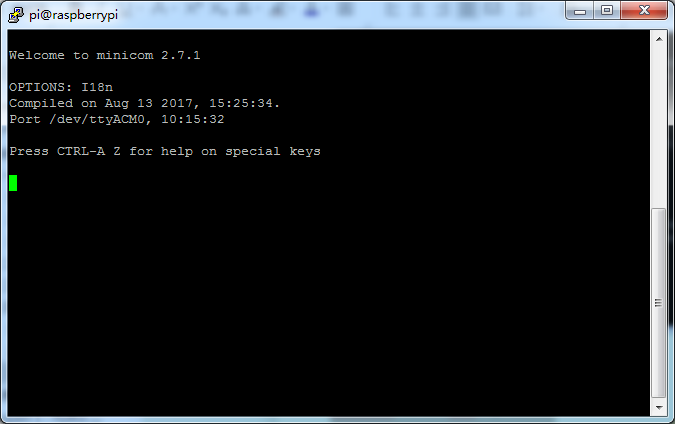

按下 Ctrl + B

输入print("hello world")，将看到打印hello world

我们再来试试，点亮pico板载的LED，这个板载LED连接到GPIO25：machine模块用于控制片上硬件。这是所有MicroPython端口的标准，在这里，我们使用它来控制GPIO，因此我们可以将其驱动为高电平和低电平。如果你输入这个,点亮LED：

from machine import Pin

led = Pin(25, Pin.OUT)

led.value(1)

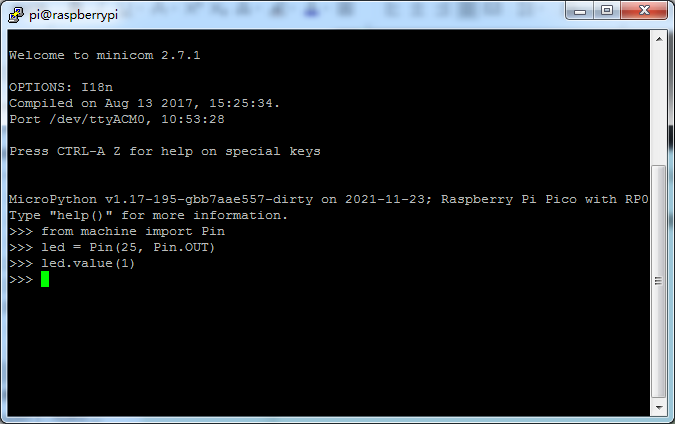

输入以下，熄灭LED：

led.value(0)

这样我们已经成功从raspberry pi通过USB连接了Pico。

3.安装IDE---Thonny

我们前面推荐下载的树莓派镜像系统是带有一些常用软件的，Thonny也在其中：

但是如果我们没有自带这个软件的话，就需要自己手动下载，在终端输入以下指令，下载安装Thonny：

sudo apt install thonny

安装完成后，打开Thonny，第一次打开，点击右上角，选择切换到常规模式，然后我们重新打开Thonny：

右下角我们选择raspberry pi pico

然后点击Tools-Options：

找到Interpreter,选择MicroPython(Raspberry Pi Pico) 设备和串口：

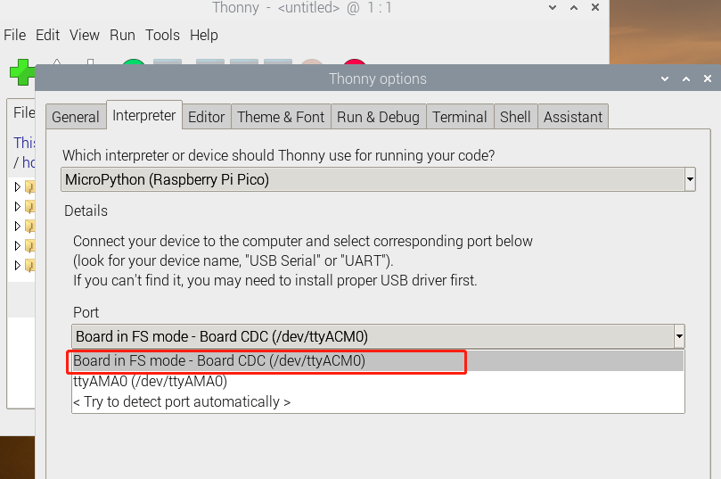

或者选择MicroPython (generic)：

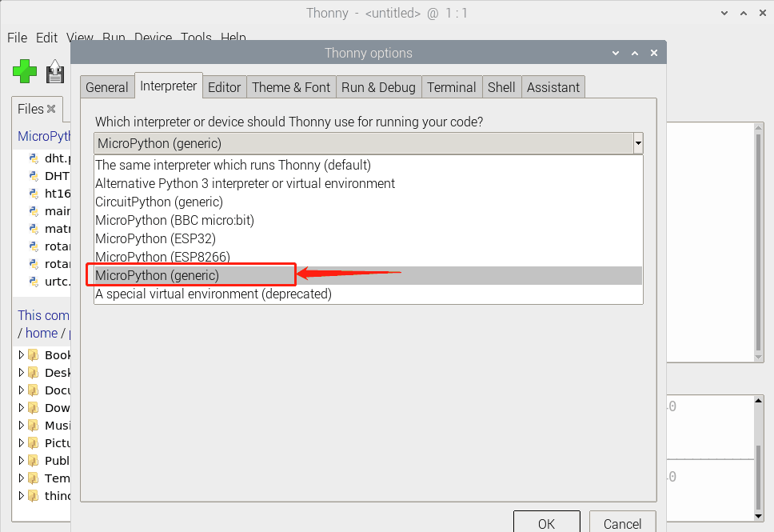

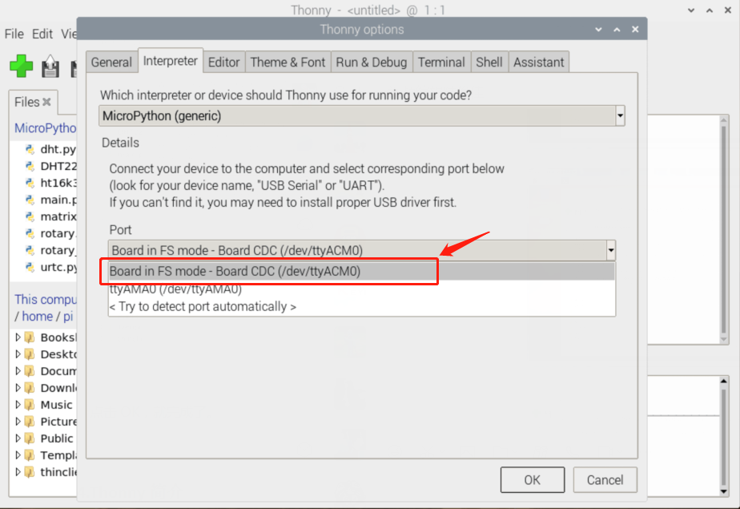

点击OK，就完成了。

4.Thonny简介

我们下面要了解Thonny的使用了，打开Thonny：在最上面我们可以看有：File、Edit、View、Run、Tools、Help。

点击File，显示下拉的选项是对文件的一些新建、打开和保存之类的操作：

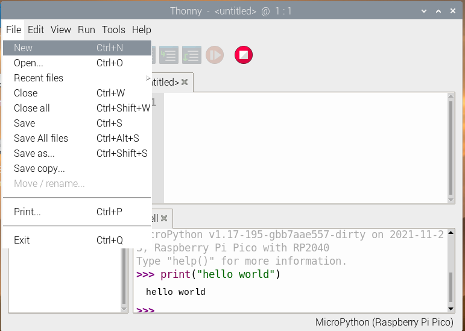

点击Edit，我们可以看到下拉选项是对文件代码内容的复制、剪切、粘贴、撤销的一些编辑操作

点击View，下拉选项是一些助手类工具，比如我们不勾选Shell（Shell是Pico的
“命令行”，你可以直接在这里执行代码），那么在界面下饭就不会显示出我们的编译结果；点击文件，那么在左边就会显示出来我们保存的代码文件；我们也可以点击勾选助手、变量之类的我们想要用到的工具

点击Run，我们这里也可以选择解释器，它也告诉我们一些运行代码和停止进程及中断执行的一些快捷键

点击Tools，这里我们前面就用到里面的设置-解释器了，我们还可以在里面设置字体格式，点击下拉选项的管理包，我们可以在里面下载我们需要的模块：

点击Help，就是一些Thonny的版本更新内容了。

Thonny为了简化使用，已经用一些大的快捷图标帮我们创建了上面讲的一些经常使用到工具：

我们点击打开文件或者保存时，会出现一个小的提示框：

(注意！如果我们前面选择了“MicroPython(generic)”，我们这里显示的就是“MicroPython Device”而不是“Raspberry Pi Pico”了)

我们可以选择打开保存在我们树莓派电脑上的或者保存在Pico上的程序，也可以选择将程序保存到我们电脑上或者Pico上。

我们将下面一段代码复制到Tonny上来，并保存在pico上，名为test.py

from machine import Pin, Timer

led = Pin(25, Pin.OUT)

tim = Timer()

def tick(timer):

global led

led.toggle()

tim.init(freq=2.5, mode=Timer.PERIODIC, callback=tick)

然后我们点击运行这段代码，我们将发现我们板载的LED灯将闪烁，然后我们点击停止进程，板载LED将停止闪烁。如果我们此时拔掉MicroUSB线，再重新插上，上电后LED也不会继续闪烁，这是因为我们没有把这个文件命名为main.py并保存在Pico上。我们点击文件-另存为，然后选择Pico，文件名为main.py(一定要加后缀.py)，点击确认保存后，再次运行，LED继续闪烁：

然后我们再次拔下MicroUSB线，然后重新插上上电，我们会发现，板载LED继续闪烁，因为下次树莓派PICO通电时便会自动运行main.py中的程序。

5.Pico模块（库）的加载

Python的强大来源于模块，Python 具有脚本语言中最丰富和强大的类库，足以支持绝大多数日常应用。我们把一些稍微复杂的传感器通过导入模块的方式，这样可以使我们学习更加简单。

方法很简单，只要将我们需要用的模块文件保存在Pico上就可以导入调用了，或者打开保存在我们电脑上的文件，选择文件-另存为，然后选择另存为到Pico板上即可（鼠标右键可以选择删除）。例如我的Pico上保存了一些本课程需要的库文件：点击视图-文件，在界面的左边会显示出来：

在使用对应传感器时，直接import 导入对应模块就可以使用了:

我们把课程中所有的代码，都先保存到树莓派上来，方便我们后续使用。打开终端，在/home/pi建立一个pico文件夹：

然后把我们的代码复制到这个文件夹下之后：输入ls，即可看到：

下次我们就可以使用Thonny打开这个路径，直接找到我们保存的代码了。

### keyes raspberry pico IO 扩展板

1.概述

keyes raspberry pico IO 扩展板是专为Raspberry Pi Pico开发的扩展板，无需焊接，全引脚引出。为方便接线，扩展板上接口都带有丝印。3pin接口丝印一般为G V
S，其中扩展板上所有的G代表GND，V代表VCC（3.3V）接口，S代表接口上方的数字口/模拟口。4pin/6pin接口左面都有对应接口丝印。扩展板上自带间距为2.54mm的排母接口，接线顺序和Pico板的排母接口的线序一致。同时扩展板上自带一个复位按键，1个电源指示灯PWR。同时扩展板自带4个标准乐高定位孔。

该扩展板提供各种通信接口包括2 x I2C、2 x UART、2 x SPI、3 x 模拟IO和13 x
数字IO，并提供6.5-12V的电源接口为原型开发提供最简单的连接方式。

2.规格参数：

输出电流：≦500mA

DC输入电压：6.5 - 12V

输出电压：DC3.3V\5V

推荐环境温度：-10°C ~ 50°C

产品尺寸：45.339MM \*83.617MM

排针间距：2.54mm

3.原理图

4.接口说明

5.使用方法

将Raspberry Pi Pico堆叠在扩展板上即可使用，如下图

## 课程

前24个实验我们将24款传感器利用我们套件中的杜邦线，单独连接在Raspberry Pi Pico板和Raspberry Pi Pico扩展板。然后运行对应的测试代码，单独测试各个传感器的功能。

后12个实验将多个传感器/模块搭配使用，组合出各种各样的功能。传感器/模块种类比较多，我们只是选择几款比较经典的组合实验。你们也可以根据自己的想法，自己设置代码，组合出你想要的特别的功能。

我们下面的课程是先从简单到复杂学习单个模块/传感器的原理，后面再学习一些传感器的扩展应用以巩固加深我们对该套件的理解。

特别注意：实验种模块/传感器连接线材时，必须按照资料里的接线方法及位置，电源与信号引脚不能错接，否则可能会没有实验现象或损坏模块/传感器。

### 实验1：点亮LED

实验介绍：

在我们前面的准备工作中，知道我们Pico板上有个板载LED，而且我们已经知道这个LED是连接在Pico的GP25的，我们还让这个LED点亮和闪烁了。下面我们就用同样的方法点亮一个外接的LED模块。

在这个套件中，我们有一个Keyes DIY电子积木
白色LED模块。它的控制方法非常简单，要想点亮LED，只要让它两端有一定的电压就可以。

实验中，我们通过编程控制信号端S的高低电平，从而控制LED的亮灭。我们提供两个测试代码，分别控制LED模块上实现点亮和闪烁的效果。

实验原理：

下面附了两个电路原理图，左边我们直接把LED串联一个电阻，负极接地，正极接到单片机的IO口，理论上来说当我们把信号端S输出高电平(3.3V)，LED两端就会有电压，LED就会被点亮，那么我们为什么说这么接不合理呢？原因就是我们Pico IO口输出电流的能力有限(最大12mA)，虽然输出了高电平，但是可能达不到控制LED的电流，此时LED可能比较暗。

右边的接法：控制时，GND和VCC上电后，如果信号端S为高电平，那么三极管Q1就会导通，则LED有电流流过，LED即会亮起(注意：此时电流是由VCC电源端流经LED和电阻R3到GND，而不是直接从单片机IO口输出，此时输出电流的能力就比较强)，S端为低电平时三极管Q1截止，那么就没有电流流过LED，那么LED就会熄灭。也就是说，我们这里的三极管Q1相当于一个开关作用，而电阻R1,R3都是一个限流电阻，顾名思义就是限制电流的大小，以免烧坏电子元器件。

实验元件：

||||||
|-|-|-|-|-|
|Raspberry Pi Pico板*1|Raspberry Pi Pico扩展板*1|Keyes DIY电子积木 白色LED模块*1|防反插3Pin*1|MicroUSB线*1|

(注意：这里microUSB线是通过树莓派连接到pico，实验元件我们没有列出树莓了，还有杜邦线3p指的是从我们40P的杜邦线撕下一个3P下来，下面的实验也是如此。)

实验接线图：

运行示例代码：

打开Thonny，连上pico之后，我们点击View然后勾选File，然后我们就可以在左侧看见保存在树莓派上的代码还有pico上的代码：

找到LED.py和Bink.py，因为我们前面已经把代码保存在树莓派了，然后双击打开代码，再点击运行代码，如果点击运行无效，我们可以尝试点击停止运行，然后再次点击运行，也可以按下我们pico扩展板上的复位按钮，然后再点击，然后再运行：

代码说明：

1.  machine模块是一定要的，我们使用microPython对pico进行编程时，必须import     machine或者from machine     import...，这个模块里面对pico的一些配置等等已经设置好了，我们只需导入它，然后调用。

2.  time模块主要是用于时间延迟设置time.sleep()，括号里的值为延时的秒数，如果我们使用小数，如time.sleep(0.01)，即延时10ms。我们后面也会看到from     time import     sleep，Python的from语句让你从模块中导入一个指定的部分到当前命名空间中，我们这里即导入延时部分，这个声明不会把整个time模块导入到当前的命名空间中，它只会将time里的sleep函数引入进来，我们延时1秒时，使用sleep(1)即可。

3.  led = Pin(0,     Pin.OUT)，构建一个引脚类实例，我们将其命名为led，0表示我们连接的引脚为GP0，Pin.OUT表示引脚0为输出模式，即可以使用.value()方法输出高电平(3.3V)led.value(1)或者低电平(0V)led.value(0)。我们后面也会看到前面模块导入是直接使用import     machine，那么我们在创建管脚类实例时，就要改为led =
machine.Pin(0, machine.Pin.OUT)也就是在前面多了个machine.。

4.  最后while     True为循环函数，在此函数下面的语句循环运行，除非True变False，我们上面的while函数中，首先led.value(1),给管脚0输出高电平，LED点亮，然后使用延时函数time.sleep(1)等待1秒，然后led.value(0),给管脚0输出低电平，LED熄灭，再次使用延时函数time.sleep(1)等待1秒，这样反复运行，LED就形成了1秒反复闪烁了。

实验结果：

代码一：运行测试代码一成功后，模块上白色LED点亮

代码二：运行测试代码二成功后，白色LED亮1秒灭一秒，循环交替闪烁。

注意：键盘按下停止运行

8.示例代码：

| ''' * Keyes Starter Kit for Raspberry Pi Pico * lesson 1.1 * turn on led ''' from machine import Pin led = Pin(0, Pin.OUT)#构建led对象,外接LED灯连接与引脚0相连，并设置引脚0为输出模式 led.value(1)# 高电平点亮 |
|-|
| ''' * Keyes Starter Kit for Raspberry Pi Pico * lesson 1.2 * Blink ''' from machine import Pin import time led = Pin(0, Pin.OUT)#构建led对象,外接LED灯连接与引脚0相连，并设置引脚0为输出模式 while True: led.value(1)# led点亮 time.sleep(1)# 等待1秒 led.value(0)# led熄灭 time.sleep(1)# 等待1秒 |

### 实验2：交通灯

实验介绍：

我想大家都看见过交通灯，就是马路上十字路口的红绿灯。如果您开过车，我想您一定仔细观察过交通灯，如果您还没有驾驶过车，您是否仔细观察过交通灯呢？在我们这个套件中，就包含一个交通灯模块。我们经常会用红绿黄3个LED外接电路来模拟路边的红绿黄灯闪烁。因此我们特别设计了这款模块，模块上自带了红黄绿3个LED灯，我们这个实验就做一个模拟交通灯。

实验原理：

前面第一课我们就学习了如何控制一个LED，由原理图容易得知，控制这个模块就好比分别控制3个独立的LED灯(我们这个灯可直接由单片机IO口驱动)，给对应颜色灯高电平就亮起对应的颜色。比如，我们给信号“R”输出高电平，也就是3.3V，则红色LED点亮。

实验元件：

||||||
|-|-|-|-|-|
|Raspberry Pi Pico板*1|Raspberry Pi Pico扩展板*1|keyes DIY电子积木 交通灯模块*1|防反插5Pin*1|MicroUSB线*1|

接线图

运行示例代码：

找到Traffic_Light.py，然后双击打开代码，再点击运行代码

代码说明：

1.  创建管脚类接口，设置引脚模式，延时函数，输出高低电平参考实验一说明，这里就不多说了。

2.  这里我们还用到了for循环：最简单形式为for i in     range()，我们上面用到了range(3)，表示变量i从0开始，每次自加1，到小于3的最大整数，也就是2。即第一次i为0，第二次i为1，第三次i为2，再加i就为3了，此时跳出for循环，所以for循环下面的语句执行三次，每一次都是黄灯亮0.5秒，灭0.5秒，即闪烁3次。

3.  for循环我们还可用for x in     lists:，每次运行x遍历lists列表，直到遍历完列表所有的值，当然也可遍历元组，字典，字符串等等。

实验结果：

运行测试代码，模块上绿色LED亮5秒然后熄灭，黄色LED闪烁3秒然后熄灭，再然后红色LED亮5秒，然后熄灭，模块上3个LED自动模拟交通灯循环运行。

### 实验3：按键传感器

实验介绍：

在这个套件中，有一个Keyes DIY电子积木
单路按键模块，它主要采用1个轻触开关，自带1个黄色按键帽。前面我们学习了怎么让我们单片机的引脚输出一个高电平或者低电平，这节实验我们就来学习怎么读取引脚是高电平（3.3V）还是低电平（0V）。

实验中，我们通过读取传感器上S端高低电平，判断传感器上按键是否按下；并且，我们在shell显示测试结果。

实验原理：

附原理图，按键有四个引脚，其中1和3是相连的，2和4是相连的，在我们未按下按键时，13与24是断开的，信号端S读取的是被4.7K的上拉电阻R1所拉高的高电平，而当我们按下按键时，13和24连通。信号端S连接到了GND，此时读取到的电平为低电平，即按下按键，传感器信号端为低电平；松开按键时，信号端为高电平。

实验元件:

||||||
|-|-|-|-|-|
|Raspberry Pi Pico板*1|Raspberry Pi Pico扩展板*1|keyes DIY电子积木 单路按键模块*1|防反插3Pin*1|MicroUSB线*1|

实验接线图：

运行示例代码：

找到button.py，然后双击打开代码，再点击运行代码

代码说明：

1.  button = Pin(15, Pin.IN,     Pin.PULL_UP)，由前面实验一学过的知识我们知道，在这里我们定义按键管脚为GP15，设置为输入上拉模式。我们也可使用button     = Pin(15,     Pin.IN)设置为输入模式而不使用输入上拉，此时引脚处于高阻抗状态，从而导致不可预测的电平结果。为了确保开关断开时的读数正确，推荐使用上拉或下拉电阻（我们的模块已经使用上拉电阻R1，所以我们可以不设置输入上拉）。该电阻的目的是在开关断开时将引脚拉至已知状态。通常选择一个4.7K/10     K欧姆的电阻，因为它的阻值足够低，可以可靠地防止输入悬空，同时，该阻值也要足够高，以使开关闭合时不会消耗太多电流。如果使用下拉电阻，则当开关断开时，输入引脚将为低电平；当开关闭合时，输入引脚将为高电平。如果使用上拉电阻，则当开关断开时，输入引脚将为高电平；当开关闭合时，输入引脚将为低电平。

2.  button.value()，读取按键的数字电平，函数返回高(HIGH)或者低(LOW)。

3.  if..else..语句，当if后面的逻辑判断为True时，执行if下缩进的代码；否则执行else下缩进的代码，我们知道python代码是严格使用缩进的。

4.  代码逻辑是pico检测到按键按下时，信号端为低电平，即GP15为低电平，即button.value()
为0。否则（pico检测到按键松开时），button.value()
为1，此时执行else语句。

实验结果：

运行测试代码成功，观察Shell。显示对应字符。当传感器按下按键时，打印显示“You pressed the button!”字符；松开按键时显示“You loosen the button!”字符。

### 实验4：避障传感器

实验介绍：

在这个套件中，有一个Keyes DIY电子积木
避障传感器，它主要采用一对红外线发射与接收管元件。实验中，我们通过读取传感器上S端高低电平，判断是否存在障碍物；并且，我们在shell显示测试结果。

实验原理：

原理就是NE555时基电路提供发射管TX发射出一定频率的红外信号，红外信号会随着传送距离的加大逐渐衰减，如果遇到障碍物，就会形成红外反射。当检测方向RX遇到反射回来的信号比较弱时，接收检测引脚输出高电平，说明障碍物比较远；当反射回来的信号比较强，接收检测引脚输出低电平，说明障碍物比较近了，此时指示灯亮起。传感器上有两个电位器，一个用于调节发送功率，一个用于调节接收频率，通过调节2个电位器，我们可以调节它的有效距离。

实验元件：

||||||
|-|-|-|-|-|
|Raspberry Pi Pico板*1|Raspberry Pi Pico扩展板*1|keyes DIY电子积木 避障传感器*1|防反插3Pin*1|MicroUSB线*1|

实验接线图：

运行示例代码：

找到Avoid.py，然后双击打开代码，再点击运行代码

代码说明：

运行测试代码，我们开始调节两个电位器调节感应距离。

1.调节发射功率调节电位器，先将电位器顺时针到尽头，然后回调一些，使传感器上P LED介于不亮与亮之间的零界点。

2.调节接收频率调节电位器，顺时针调节时，频率增大。调节使它产生38KHz频率的方波，调节时，也观察传感器上S LED，使它介于不亮与亮之间的零界点。

实验结果：

运行测试代码，观察Shell。显示对应字符。实验中，当传感器检测到障碍物时，sensor.value()为0，显示“There are obstacles”字符；没有检测到障碍物时，sensor.value()为1，显示“All going well”字符。

### 实验5：倾斜模块

实验介绍：

在这个套件中，有一个Keyes DIY电子积木
倾斜传感器，倾斜开关可以依据模块是否倾斜而输出不同电平信号。其内部带有一颗滚珠，因此可以监测倾斜情况。当开关高于水平位置倾斜时开关导通，低于水平位置时开关断开。倾斜模块可用于倾斜检测、报警器制作或者其他检测。

实验中我们用shell显示信号端检测到的数字电平信号和一些提示信息。

实验原理：

它的原理非常简单，附原理图，主要是利用滚珠在开关内随不同倾斜角度的发化使滚珠开关P1的引脚1和2导通或者不导通，当1和2导通时，因为1教接GND，所以信号端S为低电平，此时红色LED形成回路，将会点亮；当1和2不导通时，引脚2被4.7K的上拉电阻R1拉高而使信号端S为高电平，模块上的LED将熄灭。

实验元件：

||||||
|-|-|-|-|-|
|Raspberry Pi Pico板*1|Raspberry Pi Pico扩展板*1|keyes DIY电子积木 倾斜传感器*1|防反插3Pin*1|MicroUSB线*1|

实验接线图：

运行示例代码：

找到Tilt switch.py，然后双击打开代码，再点击运行代码

代码说明：

代码设置与实验三相同，详情请看代码注释与实验三代码说明。

实验结果：

运行测试代码成功，观察下方Shell。将倾斜模块倾斜一边，模块上的红色LED不亮，打印数字电平信号“1 The switch is turned off”；将倾斜模块倾斜另一边，模块上的红色LED点亮，打印数字电平信号“0 The switch is turned on”。

### 实验6：干簧管模块

实验介绍：

在这个套件中，有一个Keyes DIY电子积木 干簧管模块，它主要采用MKA10110
绿色磁簧元件元件。簧管是干式舌簧管的简称，是一种有触点的无源电子开关元件，具有结构简单，体积小便于控制等优点。它的外壳是一根密封的玻璃管，管中装有两个铁质的弹性簧片电板，还灌有一种惰性气体。

实验中，我们通过读取模块上S端高低电平，判断模块附近是否存在磁场；并且，我们在shell打印测试结果。

实验原理：

平常状态下，玻璃管中的两个由特殊材料制成的簧片是分开的，此时信号端S被R2拉为高电平，LED熄灭。当有磁性物质靠近玻璃管时，在磁场磁力线的作用下，管内的两个簧片被磁化而互相吸引接触，簧片就会吸合在一起，使结点所接的电路连通，即信号端S连通GND，此时LED点亮。外磁力消失后，两个簧片由于本身的弹性而分开，线路也就断开了。该传感器就是利用元件这一特性，搭建电路将磁场信号转换为高低电平变换信号。

实验元件：

||||||
|-|-|-|-|-|
|Raspberry Pi Pico板*1|Raspberry Pi Pico扩展板*1|keyes DIY电子积木 干簧管模块*1|防反插3Pin*1|MicroUSB线*1|

实验接线图：

运行示例代码：

找到Reed Switch.py，然后双击打开代码，再点击运行代码

代码说明：

设置方法和前面实验相同，需要区分的是，这里是检测磁场

实验结果：

运行测试代码，观察软件下方Shell。显示对应数据和字符。实验中，当传感器检测到磁场时，val为0且模块红色LED点亮，显示“0 A magnetic field”字符；没有检测到磁场时，val为1，模块上LED熄灭，显示“1 There is no magnetic field”字符。

### 实验7：人体红外热传感器

实验介绍：

在这个套件中，有一个Keyes DIY电子积木
人体红外热释传感器，它主要采用RE200B-P传感器元件。它是一款基于热释电效应的人体热释运动传感器，能检测到人体或动物身上发出的红外线，配合菲涅尔透镜能使传感器探测范围更远更广。

实验中，我们通过读取模块上S端高低电平，判断附近是否有人在运动；并且，我们在shell打印测试结果。

实验原理：

这个原理图可能较前面的模块稍复杂，我们一个个来看。左上角那部分是电压转换，VCC转3.3V，因为我们模块上用到的传感器工作电压为3.3V，不能直接用5V供电，所以需要一个电压转换电路，所以这个模块我们也可以在5V的单片机使用，如Arduino。当传感器附近没有检测到人即没有接收到红外信号时，传感器1脚输出低电平，此时模块上LED两端有电压就会点亮，此时MOS管Q1导通，信号端S检测到低电平。当传感器附近检测到人即接收到红外信号时，传感器1脚输出高电平，此时模块上LED两端没有电压就会熄灭，此时MOS管Q1不导通，信号端S则检测到被10K上拉电阻R5拉高的高电平。

实验元件：

||||||
|-|-|-|-|-|
|Raspberry Pi Pico板*1|Raspberry Pi Pico扩展板*1|keyes DIY电子积木 人体红外热释传感器*1|防反插3Pin*1|MicroUSB线*1|

实验接线图：

运行示例代码：

找到PIR motion.py，然后双击打开代码，再点击运行代码

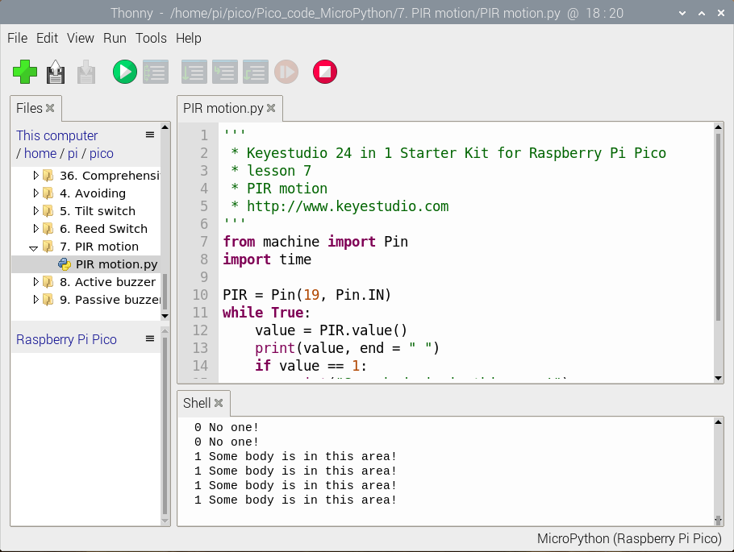

代码说明：

设置方法和实验三类似，这里就不多做介绍了。

实验结果：

运行测试代码，观察软件下方Shell。显示对应数据和字符。实验中，传感器检测到附近有人在运动时，value为1，模块上LED熄灭，打印“1 Somebody is in this area!”字符；没有检测到人运动时，value为0，模块上LED点亮，打印“0 No one!”字符。

### 实验8：有缘蜂鸣器

实验介绍：

在这个套件中，包含一个有源蜂鸣器模块，一个功放模块（原理相当于无源蜂鸣器）。这个实验中，我们控制有源蜂鸣器发出声音。有源蜂鸣器元件内部自带震荡电路，控制时，我们只需要给蜂鸣器元件足够的电压，蜂鸣器就自动响起。

实验中，我们只是控制这个模块上有源蜂鸣器的循环响起声音。

实验原理：

从原理图中可以看出来在，蜂鸣器一端通过串联一个电阻R2连接到电压正极，另一端通过一个NPN三极管Q1连接到GND，所以只要导通这个三极管，让蜂鸣器一端连通GND，有缘蜂鸣器就会响起来。三极管控制端基极也就是连接到R1电阻一端为高电平，三极管Q1就导通了，三极管基极被下拉电阻R3拉低，所以常态为不导通，当我们用单片机IO口输出一个高电平到基极三极管就导通了。

即S信号端设置为高电平时，三极管导通，模块上蜂鸣器响起；设置为低电平时，三极管不导通，模块上蜂鸣器没有声音。

实验元件：

||||||
|-|-|-|-|-|
|Raspberry Pi Pico板*1|Raspberry Pi Pico扩展板*1|keyes DIY电子积木 有源蜂鸣器模块*1|防反插3Pin*1|MicroUSB线*1|

实验接线图：

运行示例代码：

找到A-buzzer.py，然后双击打开代码，再点击运行代码

代码说明：

在实验中，我们把管脚设置为20，设置为高时，模块上有源蜂鸣器响起；设置为低时，模块上有源蜂鸣器关闭声音。

实验结果：

运行测试代码成功，上电后，模块上有源蜂鸣器响起1秒，关闭1秒，循环交替。

示例代码：

'''

\* Keyes Starter Kit for Raspberry Pi Pico

\* lesson 8

\* Active buzzer

'''

from machine import Pin

import time

buzzer = Pin(20, Pin.OUT)

while True:

buzzer.value(1)

time.sleep(1)

buzzer.value(0)

time.sleep(1)

### 实验9：8002b功放 喇叭模块

实验介绍：

在这个套件中，有一个Keyes DIY电子积木 8002b功放
喇叭模块，这个模块主要的元件有一个可调电位器，一个喇叭，一个音频放大芯片；前面课程中我们介绍了套件中的有源蜂鸣器模块的使用方法。在这里我们介绍下套件中的8002b功放
喇叭模块，这个模块主要功能是：可以对输出的小音频信号进行放大，大概放大倍数为8.5倍，并且可以通过自带的小功率喇叭播放出来，也可以用来播放音乐，作为一些音乐播放设备的外接扩音设备。

实验中，我们利用8002b功放 喇叭模块上发出各种频率的声音。

实验原理：

其实它就类似于于一个无源蜂鸣器，前面我们介绍过，有缘蜂鸣器自带振荡源，只要我们给它足够的电压就能响起来，而无源蜂鸣器元件内部不带震荡电路，控制时我们需要在元件正极输入不同频率的方波，负极接地，从而控制蜂鸣器响起不同频率的声音。

实验元件：

||||||
|-|-|-|-|-|
|Raspberry Pi Pico板*1|Raspberry Pi Pico扩展板*1|keyes DIY电子积木 8002b功放 喇叭模块*1|防反插3Pin*1|MicroUSB线*1|

实验接线图：

运行示例代码：

找到Horn.py，然后双击打开代码，再点击运行代码

代码说明：

1.  在本实验中，我们用到了machine模块的PWM类，buzzer =
PWM(Pin(21))为创建一个PWM类实例，蜂鸣器引脚连接GP21。buzzer.duty_u16(1000)方法为设置占空比，占空比为1000/65535，这个值越大蜂鸣器越响，设置为0时蜂鸣器不响。buzzer.freq()为频率设置方法，我们知道声音的音调取决于频率，设置好频率，我们就可以设置音调。

PWM又叫是脉宽调制，脉宽调制(PWM)是指用微处理器的数字输出来对模拟电路进行控制，是一种对模拟信号电平进行数字编码的方法。其采用数字引脚发送一定频率的方波，即高电平和低电平交替输出一段时间。每组高电平和低电平的总时间通常是固定的，称为周期。高电平输出的时间一般称为脉宽，脉宽的百分比称为占空比。高电平持续时间越长，模拟信号的占空比越大，对应的电压也越大。下图脉宽占了50%，那么输出的电压就是3.3     \* 50% = 1.65V。

2\.
我们再来看程序就简单多了，首先我们设置占空比为1000/65535，然后一次设置DO,RE,MI,FA,SO,LA,SI的频率，让这几个音调轮流想起0.5秒，然后关闭蜂鸣器。

实验结果：

当我们运行测试代码，功放喇叭模块循环播放对应频率对应节拍的声音：DO，Re，Mi，Fa，So，La，Si各响半秒。

### 实验10：插件RGB

实验介绍：

在这个套件中，有一个Keyes DIY电子积木
共阴RGB模块，它采用F10-全彩RGB雾状共阴LED元件。控制时，我们需要将模块R G B连接单片机PWM口，剩下那个管脚接GND（共阳RGB的话剩下那个管脚接VCC）。那么什么是PWM呢？在上一课我们粗略地使用了一下占空比和频率设置。PWM是使用数字手段来控制模拟输出的一种手段。使用数字控制产生占空比不同的方波（一个不停在高电平与低电平之间切换的信号)来控制模拟输出。一般来说端口的输入电压只有两个0V与3.3V，也就是低电平和高电平。如果想要改变灯的亮度怎么办呢个？有同学说串联电阻，对，这个方法是正确的。但是，如果想要得到不同的亮度，且在不同亮度之间来回变动怎么办呢？不可能不停地切换电阻吧。这种情况下就需要使用PWM了，那它是怎么控制的呢？

数字端口电压输出只有LOW与HIGH两个，对应的就是0V与3.3V的电压输出，可以把LOW定义为0，HIGH定义为1，1秒内让单片机输出500个0或者1的信号。如果这500个全部为1，那就是完整的3.3V，如果全部为0，那就是0V。如果010101010101这样输出，刚好一半，端口输出的平均电压就为1.65V了。这个和放映电影是一个道理，咱们所看的电影并不是完全连续的，它其实是每秒输出25张图片。在这种情况下，人的肉眼是分辨不出来的，看上去就是连续的了。PWM也是同样的道理，如果想要不同的电压，就控制0与1的输出比例控制就可以了。当然这和真实的连续输出还是有差别的，单位时间内输出的0,1信号越多，控制的就越精确。

实验中，我们通过测试代码，控制模块上RGB LED显示几个常用颜色。

实验原理：

那么我们这个实验就是要通过调节3个PWM值，控制LED元件显示红光、绿光和蓝光的比例，从而控制RGB模块上LED显示不同颜色灯光。当设置的PWM值越大，对应显示的颜色比例越重。理论上来说，通过调节这3中颜色光的混合比例，可以模拟出所有颜色的灯光。

实验元件：

||||||
|-|-|-|-|-|
|Raspberry Pi Pico板*1|Raspberry Pi Pico扩展板*1|keyes DIY电子积木 共阴RGB模块*1|防反插4Pin*1|MicroUSB线*1|

实验接线图：

运行示例代码：

找到rgb1.py和rgb2.py，然后双击打开代码，再点击运行代码

代码说明：

代码1说明：

1.  代码1中，red 、green、blue代表控制模块上
LED对应的红绿蓝3种颜色对应的端口，根据接线图我们接到了GP9 GP10     GP11，设置为9 10 11，设置GRB     LED中红绿蓝3个灯是否会亮，设置为.value(1)（对应数字口为高电平），对应的颜色就亮。

2.  现在观察代码，这个代码非常简单，只是简单的控制模块上RGB     LED显示红色1秒、

绿色1秒、蓝色1秒，循环交替。

代码2说明：

1.代码2中，我们使用到了PWM输出，频率我们设置为.freq(1000)。.duty_u16()后面设置数据代表设置模块上LED     红绿蓝颜色的比例，设置的占空比数据越大（对应的PWM值越大），设置该颜色的比例越大。

2.实验中我们通过设置对应数值，调节RGB     LED上红绿蓝颜色比例，从而控制RGB     LED显示对应颜色。所以理论上来说可以设置的颜色有256\*256\*256种（详细可参考下面常用RGB颜色表）。

注意：我们上面设置的占空比最多为.duty_u16(65535)，这个数值为256\*256 -
1，即0~65535，我们在下面对照颜色表时，只需将下面的值乘以256即可。

常用RGB颜色表

| |R|G|B| |R|G|B| |R|G|B|
|-|-|-|-|-|-|-|-|-|-|-|-|
|黑色|0|0|0|黄色|255|255|0|浅灰蓝色|176|224|230|
|象牙黑|41|36|33|香蕉色|227|207|87|品蓝|65|105|225|
|灰色|192|192|192|镉黄|255|153|18|石板蓝|106|90|205|
|冷灰|128|138|135|dougello|235|124|85|天蓝|135|206|235|
|石板灰|112|128|105|forum gold|255|227|132|||||
|暖灰色|128|128|105|金黄色|255|215|0|青色|0|255|255|
|||||黄花色|218|165|105|绿土|56|94|15|
|白色|255|255|255|瓜色|227|168|105|靛青|8|46|84|
|古董白|250|235|215|橙色|255|97|0|碧绿色|127|255|212|
|天蓝色|240|255|255|镉橙|255|97|3|青绿色|64|224|208|
|白烟|245|245|245|胡萝卜色|237|145|33|绿色|0|255|0|
|白杏仁|255|235|205|桔黄|255|128|0|黄绿色|127|255|0|
|cornsilk|255|248|220|淡黄色|245|222|179|钴绿色|61|145|64|
|蛋壳色|252|230|201|||||翠绿色|0|201|87|
|花白|255|250|240|棕色|128|24|24|森林绿|34|139|34|
|gainsboro|220|220|220|米色|163|148|128|草地绿|124|252|0|
|ghostWhite|248|248|255|锻浓黄土色|138|54|15|酸橙绿|50|205|50|
|蜜露橙|240|255|240|锻棕土色|135|51|36|薄荷色|189|252|201|
|象牙白|250|255|240|巧克力色|210|105|30|草绿色|107|124|35|
|亚麻色|250|240|230|肉色|255|125|64|暗绿色|48|128|20|
|navajoWhite|255|222|173|黄褐色|240|230|140|海绿色|46|139|87|
|old lace|253|245|230|玫瑰红|188|143|143|嫩绿色|0|255|127|
|海贝壳色|255|245|238|肖贡土色|199|97|20|||||
|雪白|255|250|250|标土棕|115|74|18|紫色|160|32|240|
|||||乌贼墨棕|94|38|18|紫罗蓝色|138|43|226|
|红色|255|0|0|赫色|160|82|45|jasoa|160|102|211|
|砖红|156|102|31|马棕色|139|69|19|湖紫色|153|51|250|
|镉红|227|23|13|沙棕色|244|164|96|淡紫色|218|112|214|
|珊瑚色|255|127|80|棕褐色|210|180|140|梅红色|221|160|221|
|耐火砖红|178|34|34||||| ||||
|印度红|176|23|31|蓝色|0|0|255| ||||
|栗色|176|48|96|钴色|61|89|171| ||||
|粉红|255|192|203|dodger blue|30|144|255| ||||
|草莓色|135|38|87|jackie blue|11|23|70| ||||
|橙红色|250|128|114|锰蓝|3|168|158| ||||
|蕃茄红|255|99|71|深蓝色|25|25|112| ||||
|桔红|255|69|0|孔雀蓝|51|161|201| ||||
|深红色|255|0|255|土耳其玉色|0|199|140|||||

实验结果：

运行测试代码1，模块上RGB LED循环显示红绿蓝3种颜色，间隔时间为1秒。运行测试代码2，模块上RGB LED显示红橙黄绿蓝青紫白7种颜色，循环不止，间隔时间为1秒。

### 实验11：旋转电位器 

实验介绍：

前面我们学习过的传感器，都是数字传感器，在这个套件中，有一个Keyes DIY电子积木
旋转电位器传感器，它与我们前面学到的传感器不同，它是一个模拟传感器，意思是例如我们前面学习的按键模块，当按键没有按下去时，我们读取到高电平（3.3V），当按键按下去时，我们读取到低电平（0V），而在0~3.3V中间的电压值，我们数字IO口无法读取到，当然按键模块也只能输出高低电平。而模拟传感器就可以通过我们pico板上的ADC模拟口（GP26~GP28）读取。

实验中，我们利用这个模块测试对应的模拟值；并且，我们在shell显示测试结果。

实验原理：

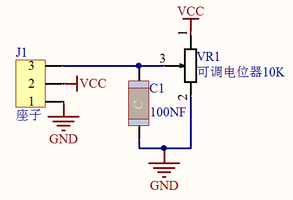我们学过滑动变阻器的就很好理解，随着滑动变阻器上的滑片移动，滑片上的电压随着改变。我们的旋转电位器原理也是如此，它主要采用一个10K可调电阻。通过旋转电位器，我们可以改变电阻大小，信号端S检测到电压变化（0~3.3V），而这个电压变化是一个连续变化的模拟量，也就是在0~3.3V内可以取任意值，我们必须先对这个模拟量进行ADC采集，来测量连续的这些模拟量，A/D
是模拟量到数字量的转换，依靠的是模数转换器(Analog to Digital Converter)，简称ADC。我们的pico板已经集成了ADC采集，我们直接使用就可以。

我们pico板ADC位数是12位，前面我们说了MicroPython把范围映射到16位，一个 n
位的 ADC 表示这个 ADC 共有 2 的 n 次方个刻度。16 位的
ADC，输出的是从0～65535一共65536个数字量，也就是 2 的 16
次方个数据刻度，那么每个刻度就是3.3V/65536=0.00005V，这个也叫分辨率。

实验元件：

||||||
|-|-|-|-|-|
|Raspberry Pi Pico板*1|Raspberry Pi Pico扩展板*1|keyes DIY电子积木 旋转电位器传感器*1|防反插3Pin*1|MicroUSB线*1|

实验接线图：

运行示例代码：

找到potentiometer.py，然后双击打开代码，再点击运行代码

代码说明：

1.  在实验中，我们首先创建ADC类实例，连接GP26即ADC(26)，也是0通道即ADC(0)。

2.  .read_u16()这个方法为读取模拟值，范围为0~65535，那么potentiometer.read_u16()即读取ADC(26)引脚输入的模拟值，然后赋给名为pot_value的变量。

3.  utime.sleep()延时函数与time.sleep()作用是一样的。

实验结果：

运行测试代码，观察下方Shell显示对应模拟值。实验中，顺时针旋转电位器，模拟值增大，逆时针旋转电位器，模拟值减小，范围为65535，如下图。

### 实验12：声音传感器

实验介绍：

在这个套件中，有一个Keyes DIY电子积木
声音传感器，实验中，我们利用这个传感器测试当前环境中的声音大小对应的模拟值，声音越大，模拟值越大；并且，我们在shell显示测试结果。

实验原理：

它主要采用一个高感度麦克风元件和LM386芯片。高感度麦克风元件用于检测外界的声音。利用LM386芯片搭建合适的电路，我们对高感度麦克风检测到的声音进行放大，最大倍数为200倍。使用时我们可以通过旋转传感器上电位器，调节声音的放大倍数。调节时，顺时针调节电位器到尽头，放大倍数最大。

实验元件：

||||||
|-|-|-|-|-|
|Raspberry Pi Pico板*1|Raspberry Pi Pico扩展板*1|keyes DIY电子积木 声音传感器*1|防反插3Pin*1|MicroUSB线*1|

实验接线图： 

运行示例代码：

找到MicroPhone.py，然后双击打开代码，再点击运行代码

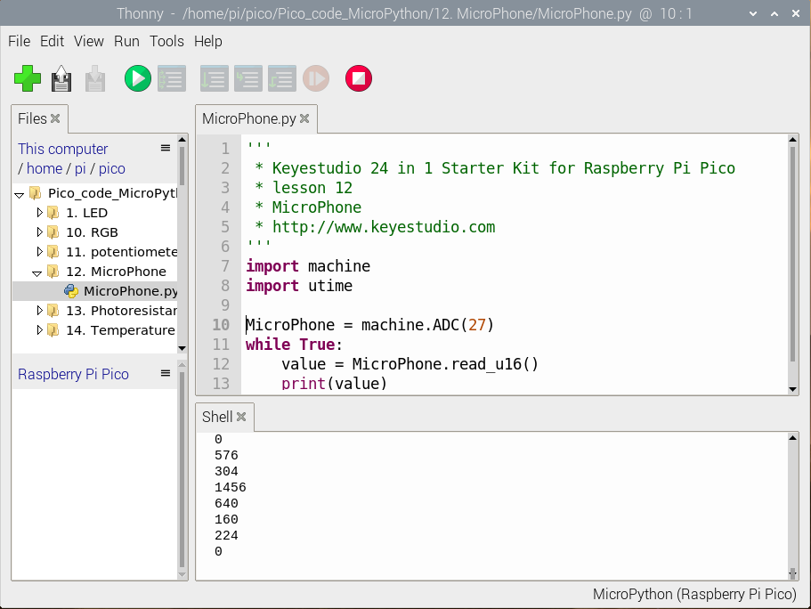

代码说明：

设置方法和实验十一类似，这里用到ADC(27)即通道1：ADC(1)。

实验结果：

运行测试代码成功，观察下方Shell显示对应模拟值。实验中，我们顺时针旋转电位器和对准MIC头大声说话，可以看到模拟值数据变大。

### 实验13：光敏电阻传感器

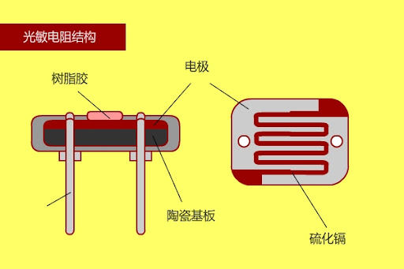

实验介绍：

在这个套件中，有一个Keyes DIY电子积木
光敏电阻传感器，这是一个常用的光敏电阻传感器，它主要采用光敏电阻元件。该电阻元件电阻大小随着光照强度的变化而变化，该传感器就是利用光敏电阻元件这一特性，搭建电路将电阻变化转换为电压变化。光敏电阻传感器可以模拟人对环境光线的强度的判断，从而方便做出与人友好互动的应用。

接线时，我们将传感器信号端(S端)输入到pico模拟口，感知模拟值的变化，并在shell显示出对应的模拟值。

实验原理：

当没有亮光时，电阻大小为0.2MΩ，信号端（2点）检测的电压接近0，当随着光照抢度增大，光线传感器的电阻值越来越小，所以信号端检测的电压越来越小。

实验元件：

||||||
|-|-|-|-|-|
|Raspberry Pi Pico板*1|Raspberry Pi Pico扩展板*1|keyes DIY电子积木 光敏电阻传感器*1|防反插3Pin*1|MicroUSB线*1|

实验接线图：

运行示例代码：

找到photoresistance.py，然后双击打开代码，再点击运行代码

代码说明：

设置方法和实验十一类似，这里用到ADC(28)即通道2：ADC(2)。这里就不多做介绍了。

实验结果：

按照接线图连接好线，烧录好测试代码，观察下方Shell打印的信息。我们可以看到对应光照强度的模拟值，光照越强，模拟值越大。

### 实验14：模拟温度传感器 

实验介绍：

在这个套件中，有一个Keyes DIY电子积木
NTC-MF52AT模拟温度传感器，它的原理像光敏电阻传感器，只是感应的器件不同，实验中，我们将传感器信号端接到Raspberry Pi Pico板模拟口，读出对应的模拟值。我们可以利用模拟值，通过特定公式，计算出当前环境的温度。由于温度计算公式比较复杂，这里就不多介绍了。实验中，我们只是读取对应的模拟值。

实验原理：

这个模块主要采用NTC-MF52AT热敏电阻元件。NTC-MF52AT热敏电阻元件能够时感知周边环境温度的变化，电阻大小随着温度的变化而变化，从而引起信号端S的电压变化。该传感器就是利用NTC-MF52AT热敏电阻元件这一特性，搭建电路将电阻变化转换为电压变化。

实验元件：

||||||
|-|-|-|-|-|
|Raspberry Pi Pico板*1|Raspberry Pi Pico扩展板*1|keyes DIY电子积NTC-MF52AT模拟温度传感器*1|防反插3Pin*1|MicroUSB线*1|

实验接线图：

运行示例代码：

找到temperature.py，然后双击打开代码，再点击运行代码

代码说明：

设置方法和实验十一类似，只是这里我们用ADC(0)，也就是ADC(26)。

实验结果：

运行测试代码成功，观察软件下方Shell，显示对应的模拟值，温度越高，模拟值越大。

### 实验15：薄膜压力传感器

实验介绍：

在这个套件中，有一个Keyes DIY电子积木
薄膜压力传感器，薄膜压力传感器是基于新型纳米压敏材料辅以舒适杨式模量的超薄薄膜衬底一次性贴片而成，兼具防水和压敏双重功能。

实验中，我们通过采集模块上S端模拟信号，判断压力大小，模拟值越小，压力越大；并且，我们在shell显示测试结果。

实验原理：

当传感器感知到外界压力时，传感器电阻值发生变化，我们采用电路将传感器感知压力变化的压力信号转换成相应变化强度的电信号输出。这样我们就可以通过检测电压信号变化就可以得到压力变化情况。

实验元件:

||||||
|-|-|-|-|-|
|Raspberry Pi Pico板*1|Raspberry Pi Pico扩展板*1|keyes DIY电子积木 薄膜压力传感器*1|防反插3Pin*1|MicroUSB线*1|

实验接线图：

运行示例代码：

找到film pressure.py，然后双击打开代码，再点击运行代码

代码说明：

设置方法和实验十一类似，只是这里我们用ADC(1)，也就是ADC(27)。

实验结果：

运行测试代码成功，观察下方Shell。当我们用手挤压薄膜时，可以看到我们打印的模拟值变小，如下图。

### 实验16：遥感模块

实验介绍：

大家都应该看过游戏手柄，有些游戏手柄上除了按键，还有摇杆，那摇杆是什么工作原理呢？那么在我们这个套件中，就有一个Keyes DIY电子积木 摇杆模块，它主要采用PS2手柄摇杆元件。控制时，我们需要将模块X Y端口连接单片机模拟口，B端口连接单片机数字口，VCC接单片机电源输出端（3.3-5V），GND接单片机GND。我们可以读取两个模拟值和一个数字口）的高低电平情况，判断模块上摇杆的工作状态。

实验中，我们将读取两个模拟值（X轴Y轴）和一个数字值（Z轴，并在shell显示测试结果。

实验原理：

其实它的原理非常简单，内部相当于两个可调电位器（左右和上下）和一个按键，这个按键没被按下时被R1下拉为低电平，按下时接通VCC即为高电平，与我们前面学习过的按键模块是相反的，我们摇动摇杆时内部的电位器就会调节从而输出不同的电压，我们就可以读取到模拟值。

实验元件：

||||||
|-|-|-|-|-|
|Raspberry Pi Pico板*1|Raspberry Pi Pico扩展板*1|keyes DIY电子积木 摇杆模块*1|防反插5Pin*1|MicroUSB线*1|

实验接线图：

运行示例代码：

找到joystick.py，然后双击打开代码，再点击运行代码

代码说明：

在实验中，根据接线，X管脚设置为ADC(26)，Y管脚设置为ADC(27)，摇杆按钮管脚设置为GP22并且为输入模式，显示数据时我们的print()函数后面加了个end
= " "，这样使打印数据时不换行。

实验现象：

测试代码成功，观察下方Shell显示对应数值。摇动摇杆，x轴和y轴对应的模拟值发生改变，按下按钮，读取到的数字值为1，否则为0，如下图。

### 实验17：SK6812 RGB模块

实验介绍：

前面我们学习了插件RGB模块，利用PWM信号对模块的三个引脚进行调色。我们这个套价中，还有一个Keyes DIY电子积木 6812 RGB模块，但是这个SK6812 RGB
模块驱动原理不与我们前面学习过的插件RGB模块相同，而且只需要一个引脚就能控制，这是一个集控制电路与发光电路于一体的智能外控LED光源。每个LED原件其外型与一个5050LED灯珠相同，每个元件即为一个像素点，我们这个模块上有四个灯珠即四个像素，

实验中，我们分别使不同的灯亮出不同的颜色。

实验原理：

从原理图中我们可以看出，这四个像素点灯珠都是串联起来的，其实不论多少个，我们都可以用一个引脚控制任一一个灯，并且让它显示任一种颜色。像素点内部包含了智能数字接口数据锁存信号整形放大驱动电路，还包含有高精度的内部振荡器和12V高压可编程定电流控制部分，有效保证了像素点光的颜色高度一致。

数据协议采用单线归零码的通讯方式，像素点在上电复位以后，S端接受从控制器传输过来的数据，首先送过来的24bit数据被第一个像素点提取后，送到像素点内部的数据锁存器。这个6812RGB通讯协议与驱动已经在底层封装好了，我们直接调用函数的接口就可以使用。

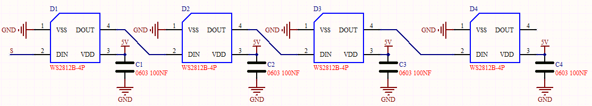

实验元件：

||||||
|-|-|-|-|-|
|Raspberry Pi Pico板*1|Raspberry Pi Pico扩展板*1|keyes DIY电子积木 6812 RGB模块*1|防反插3Pin*1|MicroUSB线*1|

实验接线图：

运行示例代码：

找到sk6812.py，然后双击打开代码，再点击运行代码

代码说明：

我们介绍下主要的几个函数接口及功能：

NUM_LEDS = 4，我们板子上灯珠为4颗，所以这里设置为4

PIN_NUM = 16，这是引脚号，我们接在GP16，可更改

brightness =
0.1，这是亮度设置，为了不那么刺眼，我们设置亮度较低，1最亮

pixels_show()，这个函数用来刷新显示，这是必要的

pixels_set(i, color)，这个函数用来设置6812RGB的灯珠号也就是位置，及每颗灯珠的颜色，这里的颜色参数color是一个元组类

pixels_fill(color)，将所有灯珠显示颜色color

实验现象：

运行测试代码，按照接线图连接好线，上电后，我们可以看到模块上的四个灯珠分别亮红绿蓝白色，如下图所示。

### 实验18：旋转编码器

实验介绍：

在这个套件中，有一个Keyes DIY电子积木
旋转编码器模块，也叫开关编码器、旋转编码器。此款编码器有做20脉冲20定位点、15脉冲30定位点两种。编码器主要用于汽车电子、多媒体音响、仪器仪表、家用电器、智能家居、计算机周边、医疗器械等领域。主要用于频率调节、亮度调节、温度调节、音量调节的参数控制等。

实验中，我们利用Keyes DIY电子积木
旋转编码器模块用于计数，当我们顺时针旋转编码器时，设置数据减1；逆时针旋转编码器时，设置数据加1；按下编码器中间按键时，打印编码器的值；将测试结果在Shell显示。

实验原理：

增量式编码器是将位移转换成周期性的电信号，再把这个电信号转变成计数脉冲，用脉冲的个数表明位移的巨细。这个模块主要采用20脉冲旋转编码器元件。它可通过旋转计数正方向和反方向转动过程中输出脉冲的次数，这种转动计数是没有限制的，复位到初始状态，即从0开始计数。

实验元件：

||||||
|-|-|-|-|-|
|Raspberry Pi Pico板*1|Raspberry Pi Pico扩展板*1|keyes DIY电子积木 旋转编码器模块*1|防反插5Pin*1|MicroUSB线*1|

实验接线图： 

运行示例代码：

找到encoder.py，然后双击打开代码，再点击运行代码，我们会发现编译出错：

原因是我们没有放入编码器所需要的模块，模块的导入，我们前面已经讲过，以特定的名称保存在pico上就可以了。

我们保存完之后，可以在左侧文件区的pico下方看到，然后我们再次运行encoder.py，这时就可以正常运行了

代码说明：

我们看代码中管脚接口，SW=Pin(20,Pin.IN,Pin.PULL_UP)说明SW管脚接GP20，pin_num_clk=18说明管脚CLK接GP18，pin_num_dt=19说明DT管脚接GP19，当然这些管脚号我们是可以更改的，但是更改后我们实物接线位置也要更改。

try/except是python语言异常捕捉处理语句，try执行代码，except发生异常时执行的代码，当我们按下Ctrl+C时，退出程序。

r.value()返回编码器的值

实验现象：

运行测试代码成功，观察下方Shell。顺时针旋转编码器，显示数据减小；逆时针旋转编码器，显示数据增加；按下编码器中间按键，显示数据为此刻编码器的值。

### 实验19：伺服舵机

实验介绍：

舵机的用途很广泛，特别是用于机器人行业，例如人形机器人，多足机器人。这一课我们就学习舵机的原理及基本的控制方法。舵机是一种位置伺服的驱动器，主要是由外壳、电路板、无核心马达、齿轮与位置检测器所构成。舵机有很多规格，有360°舵机、180°舵机和90度舵机，我们这款舵机为90度舵机，但是它转动的角度接近于180度，所以我们也可把它当做180度舵机使用，控制原理都是一样的。所有的舵机都有外接三根线，分别用棕、红、橙三种颜色进行区分，由于舵机品牌不同，颜色也会有所差异，棕色为接地线，红色为电源正极线，橙色为信号线。

实验原理：

舵机的转动的角度是通过调节PWM（脉冲宽度调制）信号的占空比来实现的，标准PWM（脉冲宽度调制）信号的周期固定为20ms（50Hz），理论上脉宽分布应在1ms到2ms
之间，但是，事实上脉宽可由0.5ms 到2.5ms
之间，脉宽和舵机的转角0°～180°相对应。有一点值得注意的地方，由于舵机牌子不同，对于同一信号，不同牌子的舵机旋转的角度也会有所不同。

实验元件：

|||||
|-|-|-|-|
|Raspberry Pi Pico板*1|Raspberry Pi Pico扩展板*1|伺服舵机*1|MicroUSB线*1|

实验接线图：

运行示例代码：

找到Servo test 1.py和Servo test 2.py，然后双击打开代码，再点击运行代码

代码说明：

代码1说明：

根据信号脉宽的角度换算成占空比，公式为：2.5+角度/180\*10 ，以 Pi Pico 的
PWM 引脚解析度为 2^16 = 65535，换算成 0 度时，其占空比值为 65535 \* 2.5%
= 1638.375 ，当角度为180度时，其占空比值为65535 \* 12.5% =
8191.875，这两个值会跟程序有关，考虑到误差及转动角度，我将占空比定在1000与9000
之间，可以让舵机顺利转动0~180度。

代码2说明：

1.  convert(x, i_m, i_M, o_m, o_M)：x为我们要映射的值；i_m,     i_M为当前值的下限和上限；o_m,     o_M为我们要映射到的目标范围的下限和上限。比如我们在实验中convert(degree,     0, 180, 1000,     9000)的意思就是我们传进来一个需要转动的角度值为degree，然后这个值的范围是0度到180度，我们要映射的占空比范围为1000到9000，即把0到180转到了1000到9000然后被返回了，返回的数据类型为整型，余数会被截断，不进行四舍五入或平均。例如:convert(90,     0, 180, 1000, 9000)，那么转换后返回的值为5000.

实验现象：

实验1 结果：

运行测试代码成功，舵机由0度，90度，180度三个角度循环转动。

实验2 结果：

运行测试代码成功，舵机由0~180度来回转动，并且每10ms转动一度。

### 实验20：超声波传感器

蝙蝠和某些海洋动物都能够利用高频率的声音进行回声定位或信息交流。它们能通过口腔或鼻腔把从喉部产生的超声波发射出去，利用折回的声波来定向，并判定附近物体的位置、大小以及是否在移动。超声波是一种频率高于20000赫兹的声波，它的方向性好，穿透能力强，易于获得较集中的声能，在水中传播距离远，可用于测距、测速、清洗、焊接、碎石、杀菌消毒等。在医学、军事、工业、农业上有很多的应用。超声波因其频率下限大于人的听觉上限而得名。科学家们将每秒钟振动的次数称为声音的频率，它的单位是赫兹(Hz)。

实验介绍：

在这个套件中，有一个keyes HC-SR04超声波传感器，它可以检测前方是否存在障碍物，并且检测出传感器与障碍物的详细距离。它的原理和蝙蝠飞行的原理一样，就是超声波模块发送出一种频率很高的超声波信号，通常正常人耳朵的听力的声波范围是20Hz~20kHz，人类无法听到。这些超声波的信号若是碰到障碍物，就会立刻反射回来，在接收到返回的信息之后，通过判断发射信号和接收信号的时间差，计算出传感器和障碍物的距离。

实验中，我们利用传感器检测传感器和障碍物之间的距离，将测试结果打印出来。

实验原理：

最常用的超声测距的方法是回声探测法，如图，超声波发射器向某一方向发射超声波，在发射时刻的同时计数器开始计时，超声波在空气中传播，途中碰到障碍物面阻挡就立即反射回来，超声波接收器收到反射回的超声波就立即停止计时。超声波也是一种声波，其声速V与温度有关。一般情况下超声波在空气中的传播速度为340m/s，根据计时器记录的时间t，就可以计算出发射点距障碍物面的距离s，即：s=340t/2

HC-SR04超声波测距模块可提供2cm-400cm的非接触式距离感测功能，
测距精度可达高到3mm；模块包括超声波发射器、接收器与控制电路。基本工作原理：

(1)采用IO口TRIG触发测距，给至少10us的高电平信号;

(2)模块自动发送8个40khz的方波，自动检测是否有信号返回；

(3)有信号返回，通过IO口ECHO输出一个高电平，高电平持续的时间就是超声波从发射到返回的时间。

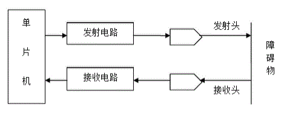

实验元件：

||||||
|-|-|-|-|-|
|Raspberry Pi Pico板*1|Raspberry Pi Pico扩展板*1|keyes SR01超声波模块*1|杜邦线4Pin*1|MicroUSB线*1|

实验接线图：

运行示例代码：

找到ultrasonic.py，然后双击打开代码，再点击运行代码

代码说明：

HC-SR04超声波传感器最大测试距离为3-4m，最小测试距离为2cm。我们在软件的shell显示出传感器和障碍物之间的距离，单位为cm。

utime.ticks_us()返回程序运行到当前的微秒数。

实验结果：

运行测试代码，观察下方Shell。显示超声波传感器和前方障碍物之间的距离，单位为cm。

### 实验21：红外遥控与接收

实验介绍：

红外线遥控是目前使用最广泛的一种通信和遥控手段。由于红外线遥控装置具有体积小、功耗低、功能强、成本低等特点，因而，继彩电、录像机之后，在录音机、音响设备、空凋机以及玩具等其它小型电器装置上也纷纷采用红外线遥控。红外遥控的发射电路是采用红外发光二极管来发出经过调制的红外光波；红外接收电路由红外接收二极管、三极管或硅光电池组成，它们将红外发射器发射的红外光转换为相应的电信号，再送后置放大器。

这一实验中，我们了解下红外接收传感器的使用方法。红外接收传感器主要采用VS1838B红外接收传感器元件。该元件是集接收、放大、解调一体的器件，内部IC就已经完成了解调，输出的就是数字信号。它可接收标准38KHz调制的遥控器信号。

实验中，我们利用红外接收传感器接收外部红外发射设备发射的红外信号，并将接收信号在shell显示出来。

实验原理：

红外遥控系统的主要部分为调制、发射和接收。红外遥控是以调制的方式发射数据，就是把数据和一定频率的载波进行“与”操作，这样既可以提高发射效率又可以降低电源功耗。调制载波频率一般在30khz到60khz之间，大多数使用的是38kHz，占空比1/3的方波。在红外接收的信号端加上了4.7K的上拉电阻R3，大家在下面看代码时可以发现，首先等待检测低电平，因为接收到信号，信号端立即由高电平转为低电平。

实验元件：

|||||||
|-|-|-|-|-|-|
|Raspberry Pi Pico板*1|Raspberry Pi Pico扩展板*1|keyes DIY电子积木 红外接收模块*1|防反插3Pin*1|MicroUSB线*1|遥控器*1|

实验接线图：

运行示例代码：

找到IR receive.py，然后双击打开代码，再点击运行代码

代码说明：

read_ircode(ird)返回字典的键即对应我们遥控器上的按键符号。

实验结果：

找到红外遥控器，拔出绝缘片，对准红外接收传感器的接收头按下按键。接收到信号后，红外接收传感器上的LED也开始闪烁。

### 实验22：实时时钟DS1307

实验介绍：

这个模块主要用到实时时钟芯片DS1307。是美国DALLAS公司推出的I2C总线接口实时时钟芯片，它可独立于CPU工作，不受CPU主晶振及其电容的影响，且计时准确，月累积误差一般小于10秒。芯片还具有主电源掉电情况下的时钟保护电路，DS1307的时钟靠后备电池维持工作，拒绝CPU对其读出和写入访问。同时还具有备用电源自动切换控制电路，因而可在主电源掉电和其它一些恶劣环境场合中保证系统时钟的定时准确性。DS1307具有产生秒、分、时、日、月、年等功能，且具有闰年自动调整功能。同时，DS1307芯片内部还集成有一定容量、具有掉电保护特性的静态RAM，可用于保存一些关键数据。

实验中，我们利用DS1307时钟模块获取系统时间，将测试结果打印出来。

实验原理：

DS1307 把8 个寄存器和56 字节的RAM
进行了统一编址，记录年、月、日、时、分、秒及星期; AM、PM
分别表示上午和下午; 56
个字节的NVRAM存放数据; 2线串口;
可编程的方波输出;电源故障检测及自动切换电路;电池电流小于500nA。

主要引脚定义如下：

X1、32.768kHz 晶振接入端;

VBAT:X2：+3V 电池电压输入;

SDA：串行数据;

SCL：串行时钟;

SQW/OUT：方波/输出驱动器。

实验元件：

||||||
|-|-|-|-|-|
|Raspberry Pi Pico板*1|Raspberry Pi Pico扩展板*1|keyes DIY电子积木DS1307传感器模块*1|防反插4Pin*1|MicroUSB线*1|

实验接线图：

我们前面介绍了，VUSB为5V，所以我们这里的电源接到了VUSB也是可以的。

运行示例代码：

找到DS1307.py，然后双击打开代码，运行代码之前，我们需要先导入时钟模块，urtc.py，前面实验十八我们已经讲过，我们将下列代码直接保存在pico上命名为urtc.py即可：

然后我们再来运行DS1307.py：

代码说明：

rtc.datetime()返回的是一个时间日期的元组，我们在程序运行时，设置了“请输入”程序，运行代码，会提示我们输入时间与日期，输入完成后，每隔一秒打印一次数据。

DateTimeTuple\[0\]存放年份

DateTimeTuple\[1\]存放月份

DateTimeTuple\[2\]存放日

DateTimeTuple\[3\]存放星期

Rtc.GetDateTime().Month() 返回月份

DateTimeTuple\[4\]存放时

DateTimeTuple\[5\]存放分

DateTimeTuple\[6\]存放秒

实验结果：

运行测试代码，我们在shell按照提示输入对应的时间信息，可看到设置时间日期每秒刷新（年、月、日、时、分、秒、周）。

### 实验23：TM1650四位数码管模块 

实验介绍：

这个模块主要由一个0.36英寸红色共阳4位数码管组成，它的驱动芯片是TM1650。使用时，我们只需要2根信号线即可使单片机控制4位数码管，大大节约了控制板IO口资源。TM1650是一种带键盘扫描接口的LED驱动控制专用电路。内部集成有MCU输入输出控制数字接口、数据锁存器、LED
驱动、键盘扫描等电路。TM1650性能稳定、质量可靠、抗干扰能力强，可适用于24小时长期连续工作的应用场合。TM1650采用两线串行传输协议通讯（注意该数据传输协议不是标准的I2C协议）。该芯片只需要通过两个引脚与MCU通讯就可以完成数码管的驱动，可以节省MCU引脚资源。

实验中，我们利用四位数码管从0到9999累加显示出来，并刷新时间为0.01秒。

实验原理：

TM1650采用的是IIC协议。使用SDA、SCL两条总线。

我们使用封装好的库函数直接驱动，当然大家有兴趣也可以去了解底层的库函数是如何实现的。

数据命令设置：0x48，这个是告诉TM1650，我们要用点亮数码管的功能，而不是按键扫描的功能

显示命令设置：

这里实际是一个字节数据，只是不同位部分代表不同功能。   bit\[6:4\]：设置数码管亮度，注意，000是最亮。   bit\[3\]：设置要不要显示小数点   bit\[0\]：是不是要开启数码管的显示

实验元件：

||||||
|-|-|-|-|-|
|Raspberry Pi Pico板*1|Raspberry Pi Pico扩展板*1|keyes DIY子积木 TM1650四位数码管模块*1|防反插4Pin*1|MicroUSB线*1|

实验接线图：

运行示例代码：

找到TM1650.py，然后双击打开代码，再点击运行代码

代码说明：

clkPin = 15、dioPin =
14为设置引脚号，即CLK管脚接GP15，DIO管脚接GOP14，我们也可以任意设置两个引脚。

displayBit(bit, num)显示bit(1~4)位显示数字num(0~9)

clearBit(bit)清除bit(1~4)位显示

setBrightness()亮度设置

displayOnOFF()0为关显示，1为开显示

displayDot(bit, OnOff)显示点，0为关，1为开

ShowNum(num)显示整数num，范围为0~9999

实验结果：

运行测试代码，按照接线图连接好线,上电后，4位数码管从0开始显示的数字每10毫秒加1，直到大于9999又从0开始。

### 实验24：HT16K33_8X8点阵模块

实验介绍：

什么是点阵？我们用之前的方法一个IO口只能控制一个led，如果需要用更少的IO口控制更多的led怎么办呢，于是就有了点阵。

8X8点阵共由64个发光二极管组成，且每个发光二极管是放置在行线和列线的交叉点上，当对应的某一行置1电平，某一列置0电平，则相应的二极管就亮；如要将第一个点点亮，则1脚接高电平a脚接低电平，则第一个点就亮了。实验中我们用点阵显示一些字符图案图案。

实验原理：

如原理图所示，我们如果想要点亮第一行第一列的那个LED灯，只需要把C1置高电平，R1置电平它就亮了，如果我们想让第一行led全部点亮，那么我们让R1为低电平，C1~C8全部为高电平就可以了，原理非常简单。但是这样的话我们总共需要用到16个IO口，这样就极大的浪费单片机资源。为此，我们特别设计了这个模块，利用HT16K33芯片驱动1个8\*8点阵，只需要利用单片机的I2C通信端口控制点阵，大大的节约了单片机资源。

有些模块上自带3个拨码开关，可以让你随意拨动开关，这是用来设置I2C通信地址的。设置方法如下表格。我们的这个模块中，模块已经固定了通信地址，A0，A1，A2全部接地，即地址为0x70.

|A0（1）|A1（2）|A2（3）|A0（1）|A1（2）|A2（3）|A0（1）|A1（2）|A2（3）|
|-|-|-|-|-|-|-|-|-|
|0（OFF）|0（OFF）|0（OFF）|1（ON）|0（OFF）|0（OFF）|0（OFF）|1（ON）|0（OFF）|
|OX70|OX71|OX72||
|A0（1）|A1（2）|A2（3）|A0（1）|A1（2）|A2（3）|A0（1）|A1（2）|A2（3）|
|1（ON）|1（ON）|0（OFF）|0（OFF）|0（OFF）|1（ON）|1（ON）|0（OFF）|1（ON）|
|OX73|OX74|OX75||
|A0（1）|A1（2）|A2（3）|A0（1）|A1（2）|A2（3）||
|0（OFF）|1（ON）|1（ON）|1（ON）|1（ON）|1（ON）|
|OX76|OX77|

实验元件：

||||||
|-|-|-|-|-|
|Raspberry Pi Pico板*1|Raspberry Pi Pico扩展板*1|keyes DIY电 积木 HT16K33_8X8点阵模块*1|防反插4Pin*1|MicroUSB线*1|

实验接线图：

运行示例代码：

运行代码前我们先保存以下代码到pico，导入模块，命名为ht16k33_matrix.py：

再保存以下代码到pico，命名为matrix_fonts.py

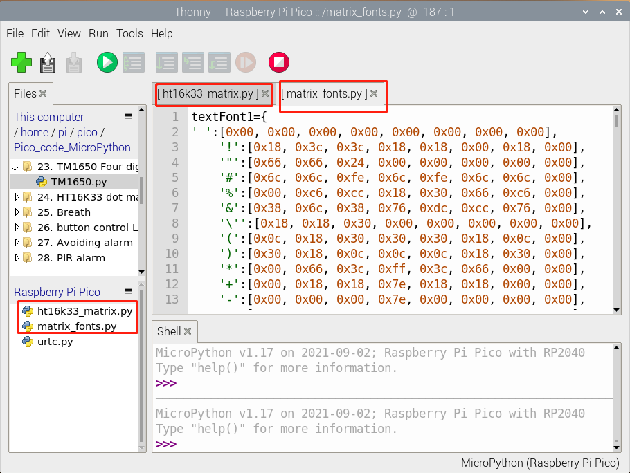

然后我们在我们保存的代码路径中找到matrix dot.py，然后双击打开代码，再点击运行代码

代码说明：

show_char()为显示字符，例如show_char(matrix_fonts.textFont1\['A'\])就是显示字母A

scroll_message(font,message='hello',delay=0.05)为滚屏显示，0.05为滚屏的速度massage为滚屏显示字符串，font为模文件。

实验结果：

按照接线图连接好线，运行测试代码；点阵显示“A”一秒、“B”一秒、“C”一秒，然后滚屏显示“Hello World”图案，反复循环。

### 实验25：呼吸灯

前面课程中，我们单独测试了传感器/模块的功能，功能比较单一。在此，我们可以将多个传感器/模块搭配使用，组合出各种各样的功能。传感器/模块种类比较多，我们只是选择几款比较经典的组合实验。你们也可以根据自己的想法，自己设置代码，组合出你想要的特别的功能。

实验介绍：

在第一课我们就学习了如何点亮LED灯及让LED闪烁。但是LED的玩法远不仅如此，例如有时候我们看到灯光的慢慢变亮或者慢慢变暗，这个就叫呼吸灯。所谓呼吸灯，就是控制LED首先逐渐变亮，然后逐渐变暗，循环交替，如人体呼吸一样。我们前面是直接用高电平点亮LED,用低电平熄灭LED，如果要让LED不那么亮但又不完全熄灭，那怎么办呢?这个也很简单，我们控制流过LED的电流就可以，电流小了，LED自然就暗了，也就是LED两端的电压小了LED就暗了。如何控制电压呢？前面我们已经学习的插件RGB就是利用PWM原理进行调色，所以我们使用PWM就可以了。

实验元件：

||||||
|-|-|-|-|-|
|Raspberry Pi Pico板*1|Raspberry Pi Pico扩展板*1|keyes DIY电子积木 白色LED模块*1|防反插3Pin*1|MicroUSB线*1|

实验接线图：

运行示例代码：

找到Breath.py，然后双击打开代码，再点击运行代码

代码说明：

通过整合前面知识，我们知道，设置的占空比越大，LED就越亮，最大为65535。duty刚开始由0增加到255，每次加1，每加一次延迟10毫秒，模块上LED逐渐变亮。PWM为255\*255后，i开始由255减小到0，每次减1，每减一次延迟10毫秒，模块上LED逐渐变暗。然后又逐渐变亮，循环交替，如人体呼吸一样。

如果我们感觉逐渐变亮
或者逐渐变暗的时间过长，我们可以更改代码设置。有两种方法，一种是将每次加1减1的延迟时间降低；另一种是更改步长，如direction
= -2或direction = 2。

实验结果：

运行测试代码，模块上LED逐渐变暗。然后又逐渐变亮，循环交替，如人体呼吸一样。

### 实验26：按键控制led灯

实验介绍：

通常，一个完整的开环控制装置有三个基本部分组成：外部信息输入、控制器和执行器。它们之间的关系是，外部信息输入到控制器，控制器对输入的信息进行分析出结果后输出控制信号，使执行器做出指定的动作。

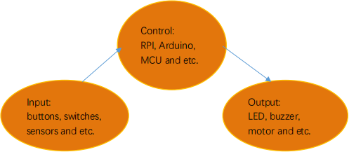

从前面的实验课程中我们了解到按键模块按下我们的单片机读取到低电平，松开读取到高电平。在这一实验课程中，我们利用按键和LED做一个扩展，如果当按键按下时即读取到低电平时我们点亮LED，松开按键时即读取到高电平时我们熄灭LED，这样就可以通过一个模块控制另一个模块了，但是这样似乎过于简单，所以我们在这里使用中断，按下按键LED点亮，再次按下按键LED熄灭，再次按下再次点亮...。

实验元件：

|||||||
|-|-|-|-|-|-|
|Raspberry Pi Pico板*1|Raspberry Pi Pico扩展板*1|keyes DIY电子积木 白色LED模块*1|keyes DIY电子积木 单路按键模块*1|防反插3Pin*2|MicroUSB线*1|

实验接线图：

运行示例代码：

找到button control LED.py，然后双击打开代码，再点击运行代码

代码说明：

1.  我们需要跟前面学习的课程一样，根据接线设置传感器/模块连接的IO口，然后配置引脚模式。

2.  我们前面已经知道，button.irq(trigger = Pin.IRQ_FALLING, handler =
toggle_handle)触发模式为下降沿触发也就是高电平变为低电平时，触发中断，然后调用中断服务函数toggle_handle，每次进入中断，我们都把变量touch取反，这样就可以按下点亮再次按下熄灭的效果了。

实验结果：

运行测试代码，当我们按下按键，LED被点亮，再次按下，LED熄灭，再按再亮，再按再灭。

### 实验27：障碍物报警

实验介绍：

在前面实验课程中中，我们利用一个输入模块控制另一个输出模块。在这一实验中，我们还是用一个模块控制另一个模块，当避障传感器检测到障碍物时有源蜂鸣器响起。

生活中，我们可以利用一个检测传感器控制一个有源蜂鸣器响起或者LED点亮，做声光报警设备，如检测磁场（干簧管）、检测倾斜（倾斜模块）等等。

实验元件：

|||||||
|-|-|-|-|-|-|
|Raspberry Pi Pico板*1|Raspberry Pi Pico扩展板*1|keyes DIY电子积木 避障传感器*1|keyes DIY电子积木 有源蜂鸣器模块*1|防反插3Pin*2|MicroUSB线*1|

实验接线图： 

运行示例代码

找到Avoiding alarm.py，然后双击打开代码，再点击运行代码

代码说明：

检测到障碍物时sensor.value()会返回一个低电平信号，然后我们再把它用not()取反，这样检测到障碍物，蜂鸣器管脚接的GP16就会输出高电平信号了，蜂鸣器就响了。

实验结果：

运行测试代码，检测到障碍物时，外接的有源蜂鸣器响起声音，否则有源蜂鸣器停止响音。

### 实验28：pico入侵检测报警器

实验介绍：

在上一课实验中，我们利用避障传感器检测障碍物进行报警提醒，在这一实验中，我们利用人体红外热释传感器检测结果控制一个有源蜂鸣器响起和板载LED快速闪烁。

实验元件：

|||||||
|-|-|-|-|-|-|
|Raspberry Pi Pico板*1|Raspberry Pi Pico扩展板*1|keyes DIY电子积木 人体红外热释传感器*1|keyes DIY电子积木 有源蜂鸣器模块*1|防反插3Pin*2|MicroUSB线*1|

实验接线图：

运行示例代码：

找到PIR alarm.py，然后双击打开代码，再点击运行代码

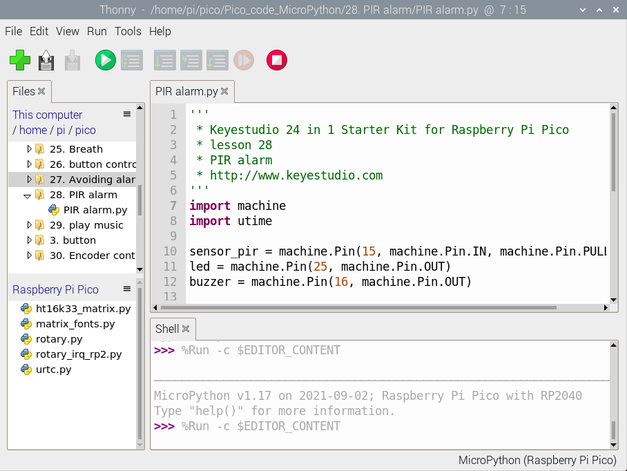

代码说明：

前面实验二十六我们使用到了中断，sensor_pir.irq(trigger=machine.Pin.IRQ_RISING, handler=pir_handler)同样我们这个实验中也用到了中断，只是触发方式与前面相反，这里是上升沿触发，即低电平变为高电平触发，pir_handler为中断服务函数，使蜂鸣器响起，LED快速闪烁。

实验结果：

程序运行之后，LED灯慢闪，检测器开始工作，中断触发方式为IRQ_RISING，当有入侵时，PIR的输出口电平从0变到1，会调用pir_handler()函数，蜂鸣器响起，LED快速闪烁。

### 实验29：音乐播放

实验介绍：

在前面的单个模块是学校中，我们学习了让8002b功放
喇叭模块发出特定频率的声音、播放的节拍以及调节喇叭的声音大小，其实每首音乐就是由一个个特定的节拍与音调（频率）组合而成的。在这一实验中，我们利用这个喇叭模块播放一首音乐。

要演奏出音乐，我们首先需要搞清楚各音调的频率，具体见下表：

低音：

| 音调 音符 |1#|2#|3#|4#|5#|6#|7#|
|-|-|-|-|-|-|-|-|
|A|221|248|278|294|330|371|416|
|B|248|278|294|330|371|416|467|
|C|131|147|165|175|196|221|248|
|D|147|165|175|196|221|248|278|
|E|165|175|196|221|248|278|312|
|F|175|196|221|234|262|294|330|
|G|196|221|234|262|294|330|371|

中音：

| 音调 音符 |1|2|3|4|5|6|7|
|-|-|-|-|-|-|-|-|
|A|441|495|556|589|661|724|833|
|B|495|556|624|661|724|833|935|
|C|262|294|330|350|393|441|495|
|D|294|330|350|393|441|495|556|
|E|330|350|393|441|495|556|624|
|F|350|393|441|495|556|624|661|
|G|393|441|495|556|624|661|724|

高音：

| 音调 音符 |1#|2#|3#|4#|5#|6#|7#|
|-|-|-|-|-|-|-|-|
|A|882|990|1112|1178|1322|1484|1665|
|B|990|1112|1178|1322|1484|1665|1869|
|C|525|589|661|700|786|882|990|
|D|589|661|700|786|882|990|1112|
|E|661|700|786|882|990|1112|1248|
|F|700|786|882|935|1049|1178|1322|
|G|786|882|990|1049|1178|1322|1484|

我们知道了音调的频率后，下一步就是控制音符的演奏时间。每个音符都会播放一定的时间，这样才能构成一首优美的曲子，而不是生硬的一个调的把所有的音符一股脑的都播放出来。音符节奏分为一拍、半拍、1/4拍、1/8拍，我们规定一拍音符的时间为1；半拍为0.5；1/4拍为0.25；1/8拍为0.125……，所以我们可以为每个音符赋予这样的拍子播放出来，音乐就成了。

这里我们具体以《生日快乐》为例：

实验元件：

||||||
|-|-|-|-|-|
|Raspberry Pi Pico板*1|Raspberry Pi Pico扩展板*1|keyes DIY电子积木 8002b功放 喇叭模块*1|防反插3Pin*1|MicroUSB线*1|

实验接线图：

运行示例代码：

找到play music.py，然后双击打开代码，再点击运行代码

代码说明：

我们先是列出了所有D调的频率，方便后面使用。然后根据简谱列出各频率，再列出各节拍，我们用到的一个节拍为500ms，这个可以自己调整，然后循环响起音调与对应节拍就成了一首歌曲。

实验结果：

按照接线图接好线，运行测试代码，功放喇叭模块播放出生日快乐歌曲。

### 实验30：旋转编码器模块控制RGB模块

实验介绍：

在前面课程的实验十八中，我们利用旋转编码器计数。在这里我们将它扩展一下，通过得出的计数，我们用来控制RGB模块上LED显示不同颜色。

设计代码时，我们需要对所得数据除以3，得到余数，余数为0控制插件RGB模块上LED亮红光，余数为1，RGB模块上LED亮绿光，余数为2，RGB模块上LED亮蓝光。

实验元件：

|||||
|-|-|-|-|
|Raspberry Pi Pico板*1|Raspberry Pi Pico扩展板*1|keyes DIY电子积木 共阴RGB模块*1|keyes DIY电子积木 旋转编码器模块*1|
|||||
|防反插5Pin*1|防反插4Pin*1|MicroUSB线*1||

实验接线图：

运行示例代码：

找到Encoder control RGB.py，然后双击打开代码，再点击运行代码

代码说明：

在实验中我们将val除以3的余数，得到余数后根据接线设置管脚为GP9（红灯）、GP10（绿灯）和GP11（蓝灯）。参考前面实验学习的控制方法，利用余数控制模块上LED显示对应灯光颜色，任何数对3进行取余得到的值都是0或1或2，我们就利用这三个值来判断，并显示对应的颜色。

6.实验结果：

按照接线图接好线，运行测试代码，观察Shell。旋转编码器，打印对应余数。即可控制外接的RGB模块上的LED的颜色（红绿蓝）。

### 实验31：无级调灯

1.实验介绍：

市面上有些台灯是可以实现无级调节亮度的，用起来相对其它的只能开关灯的体验要好一些。这节课我们就来学习实现无级调节台灯的功能。在前面课程中，我们学习了呼吸灯、按键控制LED灯，我们可不可以把这两个实验现象结合起来呢？答案是肯定的。学习利用可调电位器读取模拟值的方法，我们利用从可调电位器读取到的模拟值控制LED的亮度。设计代码时，模拟值的范围是0-65535；LED的亮度是由PWM值控制，范围为0-65535。刚好对应。

设置成功后，我们就可以通过旋转电位器，控制模块上LED的亮度。

2.实验元件：

<table >

|||||||
|-|-|-|-|-|-|
|Raspberry Pi Pico板*1|Raspberry Pi Pico扩展板*1|keyes DIY电子积木 白色LED模块*1|keyes DIY电子积木 旋转电位器传感器*1|防反插3Pin*2|MicroUSB线*1|

实验接线图： 

运行示例代码：

找到adjust the light.py，然后双击打开代码，再点击运行代码

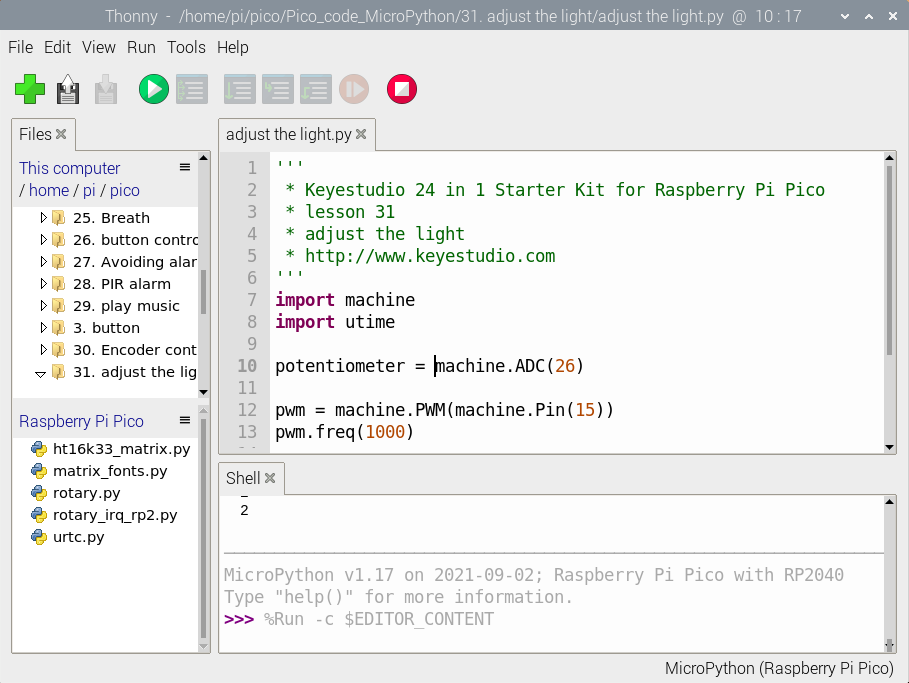

代码说明：

用电位器控制LED灯的亮度，也就比较容易了，这里可以发现MicroPython把ADC的数值范围统一在0到65535之间，直接赋值就行了，简单方便。

实验结果：

运行测试代码，转动模块上电位器，就可以调节LED模块上的LED的亮度。

### 实验32：声控灯

实验介绍：

如今智能家居发展迅速，很多人都想自己制作一个可以根据温度和湿度发生变换的智能感光声控灯，在这里我就教大家做一个最简单的智能声控灯。这些灯平时不亮，当我们吼一句或者拍拍手，LED自动亮起；当没有声音时，这些灯就自动关闭。难道是有人在手动控制这些灯光？实际上不是的，实际上这些灯光上都安装有声音探测元件，这些传感器将外界声音的大小，转换成对应数值。然后设置一个临界点，当超过临界点时，控制灯光熄灭，没有超过时，控制灯光亮起。

在这个实验中，我们利用套件中自带的声音传感器和LED模块模拟这一现象。

实验元件:

|||||||
|-|-|-|-|-|-|
|Raspberry Pi Pico板*1|Raspberry Pi Pico扩展板*1|keyes DIY电子积木 声音传感器*1|keyes DIY电子积木 白色LED模块*1|防反插3Pin*2|MicroUSB线*1|

实验接线图：

运行示例代码：

找到sound-controlled lights.py，然后双击打开代码，再点击运行代码

代码说明：

在实验中，我们设置了当模拟值阈值为5000，超过5000点亮LED，否则熄灭。

实验结果：

运行测试代码，shell显示对应音量模拟值。我们制造声音，数据变大，大于5000时，LED模块上LED亮起，否则熄灭。

### 实验33：6812花样彩灯

实验介绍：

晚上的时候，我们可以看到各种各样的非常漂亮，炫目的灯光。城市的夜景也是是一个个霓虹灯组成，其实这么美丽炫目的灯光，我们也可以用我们的模块来完成。在前面实验十七，我们学会了使用6812RGB模块，我们知道这个模块只用到一个管脚便可点亮任何一个灯的任何一种颜色；我们这个实验就通过制作一个炫目的灯光来加深对这个灯的印象。（注意，灯光的亮度可能过高，避免用眼睛长时间直视灯珠！以免损害我们的眼睛。）

实验元件：

<table >

||||||
|-|-|-|-|-|
|Raspberry Pi Pico板*1|Raspberry Pi Pico扩展板*1|keyes DIY电子积木 6812 RGB模块*1|防反插3Pin*1|MicroUSB线*1|

实验接线图：

运行示例代码：

找到6812.py，然后双击打开代码，再点击运行代码

代码说明：

color_chase(color, wait)流水灯显示color颜色，等待时间为wait

rainbow_cycle(0)：显示彩虹效果灯

实验结果：

按照接线图接好线，运行代码成功，我们就能看到我们6812RGB模块。四个灯珠以黑红黄绿青蓝紫白颜色显示流水灯，然后显示一个彩虹灯效果。

### 实验34：超声波雷达

实验介绍：

我们知道，蝙蝠飞行与获取猎物是通过回声定位的。在现实生活中有种在水里专用的电子设备：声呐，一种声学探测设备，由于
电磁波在水中衰减的速率非常的高，无法做为侦测的讯号来源，因此以声波探测水面下的人造物体成为运用最广泛的手段在水中进行观察和测量，具有得天独厚条件的只有声波。

在前面实验中，我们学会了控制RGB模块发出彩色光；也学会了利用功放喇叭模块发出不同频率的声音及播放音乐，我们也学会了利用超声波传感器检测前方障碍物的距离，也会用四位数码管来显示检测数据；如果说，我们把这几个模块结合起来呢？我们利用距离大小控制功放喇叭模块模块响起对应频率的声音和RGB亮起对应颜色，然后把这个距离显示在四位数码管上。这就搭建好了一个简易的超声波雷达系统。

实验元件：

||||||
|-|-|-|-|-|
|Raspberry Pi Pico板*1|Raspberry Pi Pico扩展板*1|HC-SR04超声波传感器*1|keyes DIY电子积木 8002b功放 喇叭模块*1|keyes DIY电子积木 共阴RGB模块*1|
||||||
|keyes DIY电子积木 TM1650四位数码管模块*1|防反插4Pin*3|防反插3Pin*1|MicroUSB线*1||

实验接线图：

运行示例代码：

找到Ultrasonic radar.py，然后双击打开代码，再点击运行代码

代码说明：

设置时，我们通过调节不同距离范围，设置声音频率和灯光颜色。为方便控制障碍物距离，我们可以在上面代码中，根据实际情况，在控制逻辑里调节距离范围。

实验结果：

按照接线图接好线，运行测试代码，超声波传感器检测到障碍物不同距离时，外接功放喇叭模块上蜂鸣器响起不同频率的声音、RGB亮起不同的颜色，并且测得的距离显示在四位数码管上。

### 实验35：红外遥控灯

实验介绍：

大家生活中不知道有没有这个场景，当我们快要入睡的时候，还没有关灯，然而灯的开关又比较远，当我们起床去关灯，又影响了我们入睡，这个时候大家是不是希望有个遥控器能遥控电视一样来控制灯光，这样就方便多了。在前面实验中，我们学会了点亮或熄灭LED、利用PWM技术调节灯光的亮度；实验二十一，我们学会了使用红外接收模块，并把接收到的遥控器的信息打印了出来。那么在这个实验中，我们就用红外遥控接控制我们的LED模块亮灭和亮度。

当我们接收到一个按键值时，我们通过对应按键值来设置输出的PWM值，这样就可以设置亮度了，控制LED亮灭也一样，但是如果说，在控制LED亮灭这里，我们用同一个按键来控制LED的亮与灭，就需要一个灵活的编程技巧了。我们可以先自己思考，再来看程序。

实验元件：

|||||
|-|-|-|-|
|Raspberry Pi Pico板*1|Raspberry Pi Pico扩展板*1|keyes DIY电子积木 白色LED模块*1|keyes DIY电子积木 红外接收模块*1|
|||||
|MicroUSB线*1|遥控器*1|防反插3Pin*2||

实验接线图：

运行示例代码：

找到IR control LED.py，然后双击打开代码，再点击运行代码

代码说明：

1\.
与前面定义变量不同，这里我们定义一个布尔变量，布尔变量的值只有两个，真（True）或者假（False）。

2\.
我们按下OK键时，红外接收返回的键为：“OK”，此时我们需要设置一个布尔变量flag，flag为真(True)的时候点亮LED，为假(False)的时候熄灭LED，点亮LED后我们又把它设置为假，这样当下次按下OK键时，LED将熄灭。

实验结果：

按照接线图接好线，运行测试代码，观察Shell。按下遥控器按钮，显示我们按下的值，按下ok键点亮LED，再次按下熄灭LED。

### 实验36：综合实验

实验介绍：

在前面我们做了很多实验，每做一个实验，我们都需要重新上传一次代码。那我们可以把多个实验组合在一起吗？可以的，在这一实验中，我们将第四章节中的实验三、实验十一、实验十六、实验十七、实验二十、实验二十一和本章节中的实验二十六、三十一，组合在一起。设置时，我们利用外接按键模块。每按一次按键，功能变换一次，实验功能循环交替。

实验元件：

||||||
|-|-|-|-|-|
|Raspberry Pi Pico板*1|Raspberry Pi Pico扩展板*1|keyes DIY电子积木 白色LED模块*1|keyes DIY电子积木 单路按键模块*1|keyes DIY电子积木 旋转电位器模块*1|
||||||
|keyes DIY电子积木 红外接收模块*1|keyes DIY电子积木 摇杆模块*1|keyes brick HC-SR04超声波传感器*1|Keyes DIY电子积木 6812 RGB模块*1|MicroUSB线*1|
||||||
|防反插3Pin*5|防反插4Pin*1|防反插5Pin*1|遥控器*1||

实验接线图：

运行示例代码：

找到Comprehensive experiment.py，然后双击打开代码，再点击运行代码

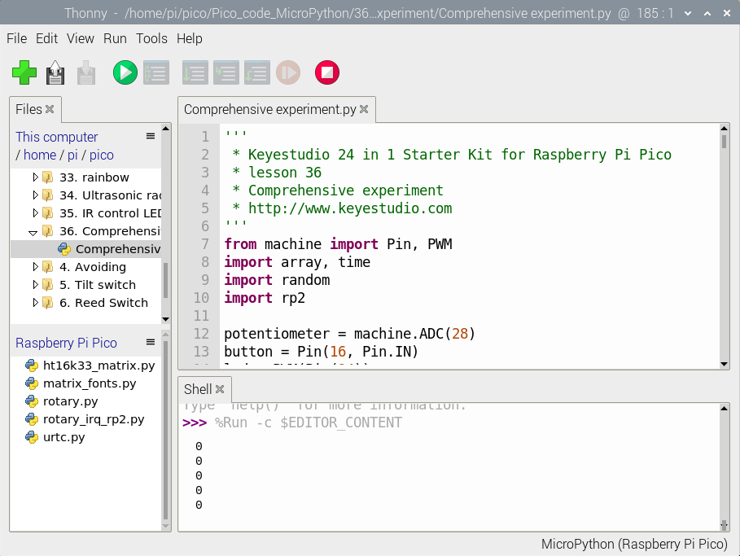

代码说明：

设置时，我们参考本章节实验三十方法。利用按键中断计算出按下按键的次数，除以5，得到余数，为0 1 2 3 4
，根据不同的余数，构造5个独一的函数来控制实验实现不同功能。参照介绍方法，我们可以在接线中添加或减少传感器/模块，然后在代码中更改实验功能。

实验结果：

刚开始时，按键次数为0，余数为0，6812RGB模块上四个灯珠循环闪烁随机颜色。

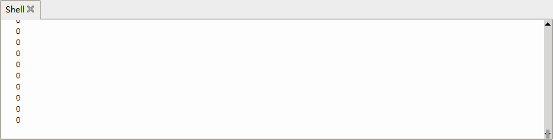

观察Shell，按一下按键，6812灯停止闪烁，按键次数为1，余数为1，实验实现的功能是红外接收模块红外发射信息。如果我们利用红外遥控对准接收模块接收头，按下按键，红外接收头接收到信息，显示如下。

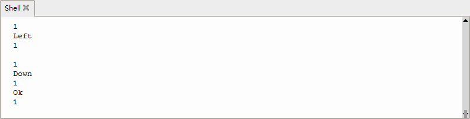

再按一下按键，按键次数为2，余数为2，实验实现的功能是读取摇杆模块传感器X轴和Y轴对应的模拟值(注意：此时我们需要再次按下遥控任一按键，因为此时上一个红外接收函数还在等待信号)，KEY（Z轴）接口对应的数字值，显示如下图。

再按一下按键，按键次数为3，余数为3，实验实现的功能是利用外接可调电位器模块调节LED(GP14)接口的PWM值，从而调节外接的白色LED模块上LED的亮度。显示图下图。

再按一下按键，按键次数为4，余数为4，实验实现的功能是利用超声波模块检测距离并在shell打印出来，如下图。

再按一下按键，按键次数为5，余数为0，实现初始时的现象，6812RGB再次闪烁。不断按下按键，余数循环变化，实验功能也循环变化。
