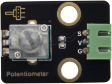
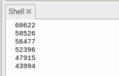

# 实验11：旋转电位器 

**实验介绍：**

前面我们学习过的传感器，都是数字传感器，在这个套件中，有一个Keyes DIY电子积木
旋转电位器传感器，它与我们前面学到的传感器不同，它是一个模拟传感器，意思是例如我们前面学习的按键模块，当按键没有按下去时，我们读取到高电平（3.3V），当按键按下去时，我们读取到低电平（0V），而在0~3.3V中间的电压值，我们数字IO口无法读取到，当然按键模块也只能输出高低电平。而模拟传感器就可以通过我们pico板上的ADC模拟口（GP26~GP28）读取。

实验中，我们利用这个模块测试对应的模拟值；并且，我们在shell显示测试结果。

**实验原理：**

我们学过滑动变阻器的就很好理解，随着滑动变阻器上的滑片移动，滑片上的电压随着改变。我们的旋转电位器原理也是如此，它主要采用一个10K可调电阻。通过旋转电位器，我们可以改变电阻大小，信号端S检测到电压变化（0~3.3V），而这个电压变化是一个连续变化的模拟量，也就是在0~3.3V内可以取任意值，我们必须先对这个模拟量进行ADC采集，来测量连续的这些模拟量，A/D
是模拟量到数字量的转换，依靠的是模数转换器(Analog to Digital Converter)，简称ADC。我们的pico板已经集成了ADC采集，我们直接使用就可以。

我们pico板ADC位数是12位，前面我们说了MicroPython把范围映射到16位，一个 n
位的 ADC 表示这个 ADC 共有 2 的 n 次方个刻度。16 位的
ADC，输出的是从0～65535一共65536个数字量，也就是 2 的 16
次方个数据刻度，那么每个刻度就是3.3V/65536=0.00005V，这个也叫分辨率。

**实验元件：**

|  |  |  |  |  |
| ----------------------------------------------- | ----------------------------------------------- | ----------------------------------------------- | ------------------------------------------------ | ----------------------------------------------- |
| Raspberry Pi Pico板*1                           | Raspberry Pi Pico扩展板*1                       | keyes DIY电子积木 旋转电位器传感器*1            | 防反插3Pin*1                                     | MicroUSB线*1                                    |

**实验接线图：**

**运行示例代码：**

找到potentiometer.py，然后双击打开代码，再点击运行代码

**代码说明：**

1.  在实验中，我们首先创建ADC类实例，连接GP26即ADC(26)，也是0通道即ADC(0)。

2.  .read_u16()这个方法为读取模拟值，范围为0~65535，那么potentiometer.read_u16()即读取ADC(26)引脚输入的模拟值，然后赋给名为pot_value的变量。

3.  utime.sleep()延时函数与time.sleep()作用是一样的。

**实验结果：**

运行测试代码，观察下方Shell显示对应模拟值。实验中，顺时针旋转电位器，模拟值增大，逆时针旋转电位器，模拟值减小，范围为65535，如下图。

