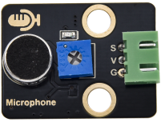

# 实验12：声音传感器

**实验介绍：**

在这个套件中，有一个Keyes DIY电子积木
声音传感器，实验中，我们利用这个传感器测试当前环境中的声音大小对应的模拟值，声音越大，模拟值越大；并且，我们在shell显示测试结果。

**实验原理：**

它主要采用一个高感度麦克风元件和LM386芯片。高感度麦克风元件用于检测外界的声音。利用LM386芯片搭建合适的电路，我们对高感度麦克风检测到的声音进行放大，最大倍数为200倍。使用时我们可以通过旋转传感器上电位器，调节声音的放大倍数。调节时，顺时针调节电位器到尽头，放大倍数最大。

**实验元件：**

|  |  |  |  |  |
| ----------------------------------------------- | ----------------------------------------------- | ----------------------------------------------- | ------------------------------------------------ | ----------------------------------------------- |
| Raspberry Pi Pico板*1                           | Raspberry Pi Pico扩展板*1                       | keyes DIY电子积木 声音传感器*1                  | 防反插3Pin*1                                     | MicroUSB线*1                                    |

**实验接线图：** 

**运行示例代码：**

找到MicroPhone.py，然后双击打开代码，再点击运行代码

**代码说明：**

设置方法和实验十一类似，这里用到ADC(27)即通道1：ADC(1)。

**实验结果：**

运行测试代码成功，观察下方Shell显示对应模拟值。实验中，我们顺时针旋转电位器和对准MIC头大声说话，可以看到模拟值数据变大。

