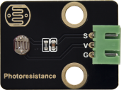

# 实验13：光敏电阻传感器

**实验介绍：**

在这个套件中，有一个Keyes DIY电子积木
光敏电阻传感器，这是一个常用的光敏电阻传感器，它主要采用光敏电阻元件。该电阻元件电阻大小随着光照强度的变化而变化，该传感器就是利用光敏电阻元件这一特性，搭建电路将电阻变化转换为电压变化。光敏电阻传感器可以模拟人对环境光线的强度的判断，从而方便做出与人友好互动的应用。

接线时，我们将传感器信号端(S端)输入到pico模拟口，感知模拟值的变化，并在shell显示出对应的模拟值。

**实验原理：**

当没有亮光时，电阻大小为0.2MΩ，信号端（2点）检测的电压接近0，当随着光照抢度增大，光线传感器的电阻值越来越小，所以信号端检测的电压越来越小。

**实验元件：**

|  |  |  |  |  |
| ----------------------------------------------- | ----------------------------------------------- | ----------------------------------------------- | ------------------------------------------------ | ----------------------------------------------- |
| Raspberry Pi Pico板*1                           | Raspberry Pi Pico扩展板*1                       | keyes DIY电子积木 光敏电阻传感器*1              | 防反插3Pin*1                                     | MicroUSB线*1                                    |

**实验接线图：**

**运行示例代码：**

找到photoresistance.py，然后双击打开代码，再点击运行代码

**代码说明：**

设置方法和实验十一类似，这里用到ADC(28)即通道2：ADC(2)。这里就不多做介绍了。

**实验结果：**

按照接线图连接好线，烧录好测试代码，观察下方Shell打印的信息。我们可以看到对应光照强度的模拟值，光照越强，模拟值越大。

