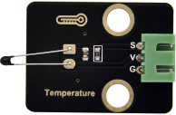

# 实验14：模拟温度传感器 

**实验介绍：**

在这个套件中，有一个Keyes DIY电子积木
NTC-MF52AT模拟温度传感器，它的原理像光敏电阻传感器，只是感应的器件不同，实验中，我们将传感器信号端接到Raspberry Pi Pico板模拟口，读出对应的模拟值。我们可以利用模拟值，通过特定公式，计算出当前环境的温度。由于温度计算公式比较复杂，这里就不多介绍了。实验中，我们只是读取对应的模拟值。

**实验原理：**

这个模块主要采用NTC-MF52AT热敏电阻元件。NTC-MF52AT热敏电阻元件能够时感知周边环境温度的变化，电阻大小随着温度的变化而变化，从而引起信号端S的电压变化。该传感器就是利用NTC-MF52AT热敏电阻元件这一特性，搭建电路将电阻变化转换为电压变化。

**实验元件：**

|  |  |  |  |  |
| ----------------------------------------------- | ----------------------------------------------- | ----------------------------------------------- | ------------------------------------------------ | ----------------------------------------------- |
| Raspberry Pi Pico板*1                           | Raspberry Pi Pico扩展板*1                       | keyes DIY电子积NTC-MF52AT模拟温度传感器*1       | 防反插3Pin*1                                     | MicroUSB线*1                                    |

**实验接线图：**

**运行示例代码：**

找到temperature.py，然后双击打开代码，再点击运行代码

**代码说明：**

设置方法和实验十一类似，只是这里我们用ADC(0)，也就是ADC(26)。

**实验结果：**

运行测试代码成功，观察软件下方Shell，显示对应的模拟值，温度越高，模拟值越大。

