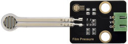

# 实验15：薄膜压力传感器

**实验介绍：**

在这个套件中，有一个Keyes DIY电子积木
薄膜压力传感器，薄膜压力传感器是基于新型纳米压敏材料辅以舒适杨式模量的超薄薄膜衬底一次性贴片而成，兼具防水和压敏双重功能。

实验中，我们通过采集模块上S端模拟信号，判断压力大小，模拟值越小，压力越大；并且，我们在shell显示测试结果。

**实验原理：**

当传感器感知到外界压力时，传感器电阻值发生变化，我们采用电路将传感器感知压力变化的压力信号转换成相应变化强度的电信号输出。这样我们就可以通过检测电压信号变化就可以得到压力变化情况。

**实验元件:**

|  |  |  |  |  |
| ----------------------------------------------- | ----------------------------------------------- | ----------------------------------------------- | ------------------------------------------------ | ----------------------------------------------- |
| Raspberry Pi Pico板*1                           | Raspberry Pi Pico扩展板*1                       | keyes DIY电子积木 薄膜压力传感器*1              | 防反插3Pin*1                                     | MicroUSB线*1                                    |

**实验接线图：**

**运行示例代码：**

找到film pressure.py，然后双击打开代码，再点击运行代码

**代码说明：**

设置方法和实验十一类似，只是这里我们用ADC(1)，也就是ADC(27)。

**实验结果：**

运行测试代码成功，观察下方Shell。当我们用手挤压薄膜时，可以看到我们打印的模拟值变小，如下图。

