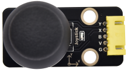
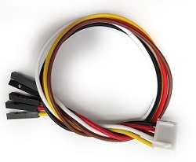
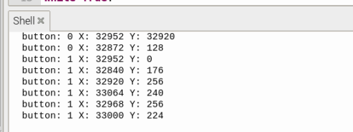

# 实验16：遥杆模块

**实验介绍：**

大家都应该看过游戏手柄，有些游戏手柄上除了按键，还有摇杆，那摇杆是什么工作原理呢？那么在我们这个套件中，就有一个Keyes DIY电子积木 摇杆模块，它主要采用PS2手柄摇杆元件。控制时，我们需要将模块X Y端口连接单片机模拟口，B端口连接单片机数字口，VCC接单片机电源输出端（3.3-5V），GND接单片机GND。我们可以读取两个模拟值和一个数字口）的高低电平情况，判断模块上摇杆的工作状态。

实验中，我们将读取两个模拟值（X轴Y轴）和一个数字值（Z轴，并在shell显示测试结果。

**实验原理：**

其实它的原理非常简单，内部相当于两个可调电位器（左右和上下)和一个按键，这个按键没被按下时被R1下拉为低电平，按下时接通VCC即为高电平，与我们前面学习过的按键模块是相反的，我们摇动摇杆时内部的电位器就会调节从而输出不同的电压，我们就可以读取到模拟值。

**实验元件：**

|  |  |  |  |  |
| ----------------------------------------------- | ----------------------------------------------- | ----------------------------------------------- | ------------------------------------------------ | ----------------------------------------------- |
| Raspberry Pi Pico板*1                           | Raspberry Pi Pico扩展板*1                       | keyes DIY电子积木 摇杆模块*1                    | 防反插5Pin*1                                     | MicroUSB线*1                                    |

**实验接线图：**

**运行示例代码：**

找到joystick.py，然后双击打开代码，再点击运行代码

**代码说明：**

在实验中，根据接线，X管脚设置为ADC(26)，Y管脚设置为ADC(27)，摇杆按钮管脚设置为GP22并且为输入模式，显示数据时我们的print()函数后面加了个end
= " "，这样使打印数据时不换行。

**实验现象：**

测试代码成功，观察下方Shell显示对应数值。摇动摇杆，x轴和y轴对应的模拟值发生改变，按下按钮，读取到的数字值为1，否则为0，如下图。

