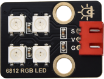

# 实验17：SK6812 RGB模块

**实验介绍：**

前面我们学习了插件RGB模块，利用PWM信号对模块的三个引脚进行调色。我们这个套价中，还有一个Keyes DIY电子积木 6812 RGB模块，但是这个SK6812 RGB
模块驱动原理不与我们前面学习过的插件RGB模块相同，而且只需要一个引脚就能控制，这是一个集控制电路与发光电路于一体的智能外控LED光源。每个LED原件其外型与一个5050LED灯珠相同，每个元件即为一个像素点，我们这个模块上有四个灯珠即四个像素，

实验中，我们分别使不同的灯亮出不同的颜色。

**实验原理：**

从原理图中我们可以看出，这四个像素点灯珠都是串联起来的，其实不论多少个，我们都可以用一个引脚控制任一一个灯，并且让它显示任一种颜色。像素点内部包含了智能数字接口数据锁存信号整形放大驱动电路，还包含有高精度的内部振荡器和12V高压可编程定电流控制部分，有效保证了像素点光的颜色高度一致。

数据协议采用单线归零码的通讯方式，像素点在上电复位以后，S端接受从控制器传输过来的数据，首先送过来的24bit数据被第一个像素点提取后，送到像素点内部的数据锁存器。这个6812RGB通讯协议与驱动已经在底层封装好了，我们直接调用函数的接口就可以使用。

**实验元件：**

|  |  |  |  |  |
| ----------------------------------------------- | ----------------------------------------------- | ----------------------------------------------- | ------------------------------------------------ | ----------------------------------------------- |
| Raspberry Pi Pico板*1                           | Raspberry Pi Pico扩展板*1                       | keyes DIY电子积木 6812 RGB模块*1                | 防反插3Pin*1                                     | MicroUSB线*1                                    |

**实验接线图：**

**运行示例代码：**

找到sk6812.py，然后双击打开代码，再点击运行代码

**代码说明：**

我们介绍下主要的几个函数接口及功能：

NUM_LEDS = 4，我们板子上灯珠为4颗，所以这里设置为4

PIN_NUM = 16，这是引脚号，我们接在GP16，可更改

brightness = 0.1，这是亮度设置，为了不那么刺眼，我们设置亮度较低，1最亮

pixels_show()，这个函数用来刷新显示，这是必要的

pixels_set(i, color)，这个函数用来设置6812RGB的灯珠号也就是位置，及每颗灯珠的颜色，这里的颜色参数color是一个元组类

pixels_fill(color)，将所有灯珠显示颜色color

**实验现象：**

运行测试代码，按照接线图连接好线，上电后，我们可以看到模块上的四个灯珠分别亮红绿蓝白色，如下图所示。

