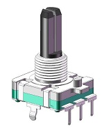
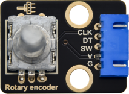

# 实验18：旋转编码器

**实验介绍：**

在这个套件中，有一个Keyes DIY电子积木旋转编码器模块，也叫开关编码器、旋转编码器。此款编码器有做20脉冲20定位点、15脉冲30定位点两种。编码器主要用于汽车电子、多媒体音响、仪器仪表、家用电器、智能家居、计算机周边、医疗器械等领域。主要用于频率调节、亮度调节、温度调节、音量调节的参数控制等。

实验中，我们利用Keyes DIY电子积木旋转编码器模块用于计数，当我们顺时针旋转编码器时，设置数据减1；逆时针旋转编码器时，设置数据加1；按下编码器中间按键时，打印编码器的值；将测试结果在Shell显示。

**实验原理：**

增量式编码器是将位移转换成周期性的电信号，再把这个电信号转变成计数脉冲，用脉冲的个数表明位移的巨细。这个模块主要采用20脉冲旋转编码器元件。它可通过旋转计数正方向和反方向转动过程中输出脉冲的次数，这种转动计数是没有限制的，复位到初始状态，即从0开始计数。

**实验元件：**

|  |  |  |  |  |
| ----------------------------------------------- | ----------------------------------------------- | ----------------------------------------------- | ------------------------------------------------ | ----------------------------------------------- |
| Raspberry Pi Pico板*1                           | Raspberry Pi Pico扩展板*1                       | keyes DIY电子积木 旋转编码器模块*1              | 防反插5Pin*1                                     | MicroUSB线*1                                    |

**实验接线图：** 

**运行示例代码：**

找到encoder.py，然后双击打开代码，再点击运行代码，我们会发现编译出错：

原因是我们没有放入编码器所需要的模块，模块的导入，我们前面已经讲过，以特定的名称保存在pico上就可以了。

我们保存完之后，可以在左侧文件区的pico下方看到，然后我们再次运行encoder.py，这时就可以正常运行了

**代码说明：**

我们看代码中管脚接口，SW=Pin(20,Pin.IN,Pin.PULL_UP)说明SW管脚接GP20，pin_num_clk=18说明管脚CLK接GP18，pin_num_dt=19说明DT管脚接GP19，当然这些管脚号我们是可以更改的，但是更改后我们实物接线位置也要更改。

try/except是python语言异常捕捉处理语句，try执行代码，except发生异常时执行的代码，当我们按下Ctrl+C时，退出程序。

r.value()返回编码器的值

**实验现象：**

运行测试代码成功，观察下方Shell。顺时针旋转编码器，显示数据减小；逆时针旋转编码器，显示数据增加；按下编码器中间按键，显示数据为此刻编码器的值。

