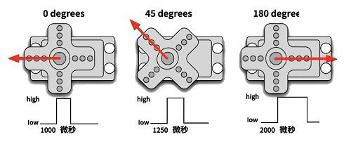

# 实验19：伺服舵机

**实验介绍：**

舵机的用途很广泛，特别是用于机器人行业，例如人形机器人，多足机器人。这一课我们就学习舵机的原理及基本的控制方法。舵机是一种位置伺服的驱动器，主要是由外壳、电路板、无核心马达、齿轮与位置检测器所构成。舵机有很多规格，有360°舵机、180°舵机和90度舵机，我们这款舵机为90度舵机，但是它转动的角度接近于180度，所以我们也可把它当做180度舵机使用，控制原理都是一样的。所有的舵机都有外接三根线，分别用棕、红、橙三种颜色进行区分，由于舵机品牌不同，颜色也会有所差异，棕色为接地线，红色为电源正极线，橙色为信号线。

**实验原理：**

舵机的转动的角度是通过调节PWM（脉冲宽度调制）信号的占空比来实现的，标准PWM（脉冲宽度调制）信号的周期固定为20ms（50Hz)，理论上脉宽分布应在1ms到2ms之间，但是，事实上脉宽可由0.5ms 到2.5ms之间，脉宽和舵机的转角0°～180°相对应。有一点值得注意的地方，由于舵机牌子不同，对于同一信号，不同牌子的舵机旋转的角度也会有所不同。

**实验元件：**

|  |  |  |  |
| ----------------------------------------------- | ----------------------------------------------- | ----------------------------------------------- | ----------------------------------------------- |
| Raspberry Pi Pico板*1                           | Raspberry Pi Pico扩展板*1                       | 伺服舵机*1                                      | MicroUSB线*1                                    |

**实验接线图：**

**运行示例代码：**

找到Servo test 1.py和Servo test 2.py，然后双击打开代码，再点击运行代码

**代码说明：**

代码1说明：

根据信号脉宽的角度换算成占空比，公式为：2.5+角度/180*10 ，以 Pi Pico 的PWM 引脚解析度为 2^16 = 65535，换算成 0 度时，其占空比值为 65535 \* 2.5% = 1638.375 ，当角度为180度时，其占空比值为65535 \* 12.5% = 8191.875，这两个值会跟程序有关，考虑到误差及转动角度，我将占空比定在1000与9000 之间，可以让舵机顺利转动0~180度。

代码2说明：

1.  convert(x, i_m, i_M, o_m, o_M)：x为我们要映射的值；i_m,     i_M为当前值的下限和上限；o_m,     o_M为我们要映射到的目标范围的下限和上限。比如我们在实验中convert(degree,     0, 180, 1000,     9000)的意思就是我们传进来一个需要转动的角度值为degree，然后这个值的范围是0度到180度，我们要映射的占空比范围为1000到9000，即把0到180转到了1000到9000然后被返回了，返回的数据类型为整型，余数会被截断，不进行四舍五入或平均。例如:convert(90,     0, 180, 1000, 9000)，那么转换后返回的值为5000.

**实验现象：**

实验1 结果：

运行测试代码成功，舵机由0度，90度，180度三个角度循环转动。

实验2 结果：

运行测试代码成功，舵机由0~180度来回转动，并且每10ms转动一度。

