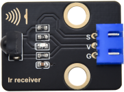

# 实验21：红外遥控与接收

**实验介绍：**

红外线遥控是目前使用最广泛的一种通信和遥控手段。由于红外线遥控装置具有体积小、功耗低、功能强、成本低等特点，因而，继彩电、录像机之后，在录音机、音响设备、空凋机以及玩具等其它小型电器装置上也纷纷采用红外线遥控。红外遥控的发射电路是采用红外发光二极管来发出经过调制的红外光波；红外接收电路由红外接收二极管、三极管或硅光电池组成，它们将红外发射器发射的红外光转换为相应的电信号，再送后置放大器。

这一实验中，我们了解下红外接收传感器的使用方法。红外接收传感器主要采用VS1838B红外接收传感器元件。该元件是集接收、放大、解调一体的器件，内部IC就已经完成了解调，输出的就是数字信号。它可接收标准38KHz调制的遥控器信号。

实验中，我们利用红外接收传感器接收外部红外发射设备发射的红外信号，并将接收信号在shell显示出来。

**实验原理：**

红外遥控系统的主要部分为调制、发射和接收。红外遥控是以调制的方式发射数据，就是把数据和一定频率的载波进行“与”操作，这样既可以提高发射效率又可以降低电源功耗。调制载波频率一般在30khz到60khz之间，大多数使用的是38kHz，占空比1/3的方波。在红外接收的信号端加上了4.7K的上拉电阻R3，大家在下面看代码时可以发现，首先等待检测低电平，因为接收到信号，信号端立即由高电平转为低电平。

**实验元件：**

|  |  |  |  |  |  |
| ----------------------------------------------- | ----------------------------------------------- | ----------------------------------------------- | ------------------------------------------------ | ----------------------------------------------- | ----------------------------------------------- |
| Raspberry Pi Pico板*1                           | Raspberry Pi Pico扩展板*1                       | keyes DIY电子积木 红外接收模块*1                | 防反插3Pin*1                                     | MicroUSB线*1                                    | 遥控器*1                                        |

**实验接线图：**

**运行示例代码：**

找到IR receive.py，然后双击打开代码，再点击运行代码

**代码说明：**

read_ircode(ird)返回字典的键即对应我们遥控器上的按键符号。

**实验结果：**

找到红外遥控器，拔出绝缘片，对准红外接收传感器的接收头按下按键。接收到信号后，红外接收传感器上的LED也开始闪烁。

