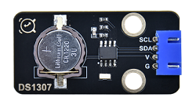
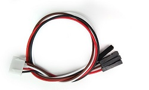

# 实验22：实时时钟DS1307

**实验介绍：**

这个模块主要用到实时时钟芯片DS1307。是美国DALLAS公司推出的I2C总线接口实时时钟芯片，它可独立于CPU工作，不受CPU主晶振及其电容的影响，且计时准确，月累积误差一般小于10秒。芯片还具有主电源掉电情况下的时钟保护电路，DS1307的时钟靠后备电池维持工作，拒绝CPU对其读出和写入访问。同时还具有备用电源自动切换控制电路，因而可在主电源掉电和其它一些恶劣环境场合中保证系统时钟的定时准确性。DS1307具有产生秒、分、时、日、月、年等功能，且具有闰年自动调整功能。同时，DS1307芯片内部还集成有一定容量、具有掉电保护特性的静态RAM，可用于保存一些关键数据。

实验中，我们利用DS1307时钟模块获取系统时间，将测试结果打印出来。

**实验原理：**

DS1307 把8 个寄存器和56 字节的RAM进行了统一编址，记录年、月、日、时、分、秒及星期; AM、PM
分别表示上午和下午; 56
个字节的NVRAM存放数据; 2线串口; 可编程的方波输出;电源故障检测及自动切换电路;电池电流小于500nA。

主要引脚定义如下：

X1、32.768kHz 晶振接入端;

VBAT:X2：+3V 电池电压输入;

SDA：串行数据;

SCL：串行时钟;

SQW/OUT：方波/输出驱动器。

**实验元件：**

|  |  |  |  |  |
| ----------------------------------------------- | ----------------------------------------------- | ----------------------------------------------- | ------------------------------------------------ | ----------------------------------------------- |
| Raspberry Pi Pico板*1                           | Raspberry Pi Pico扩展板*1                       | keyes DIY电子积木DS1307传感器模块*1             | 防反插4Pin*1                                     | MicroUSB线*1                                    |

**实验接线图：**

我们前面介绍了，VUSB为5V，所以我们这里的电源接到了VUSB也是可以的。

**运行示例代码：**

找到DS1307.py，然后双击打开代码，运行代码之前，我们需要先导入时钟模块，urtc.py，前面实验十八我们已经讲过，我们将下列代码直接保存在pico上命名为urtc.py即可：

然后我们再来运行DS1307.py：

**代码说明：**

rtc.datetime()返回的是一个时间日期的元组，我们在程序运行时，设置了“请输入”程序，运行代码，会提示我们输入时间与日期，输入完成后，每隔一秒打印一次数据。

DateTimeTuple\[0\]存放年份

DateTimeTuple\[1\]存放月份

DateTimeTuple\[2\]存放日

DateTimeTuple\[3\]存放星期

Rtc.GetDateTime().Month() 返回月份

DateTimeTuple\[4\]存放时

DateTimeTuple\[5\]存放分

DateTimeTuple\[6\]存放秒

**实验结果：**

运行测试代码，我们在shell按照提示输入对应的时间信息，可看到设置时间日期每秒刷新（年、月、日、时、分、秒、周）。

