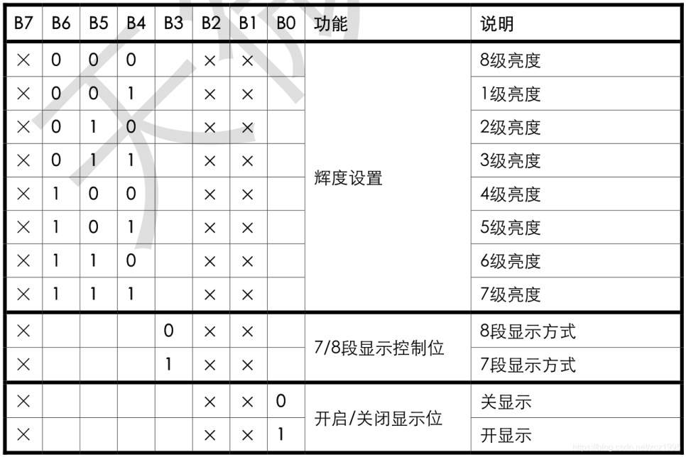
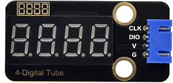

# 实验23：TM1650四位数码管模块 

**实验介绍：**

这个模块主要由一个0.36英寸红色共阳4位数码管组成，它的驱动芯片是TM1650。使用时，我们只需要2根信号线即可使单片机控制4位数码管，大大节约了控制板IO口资源。TM1650是一种带键盘扫描接口的LED驱动控制专用电路。内部集成有MCU输入输出控制数字接口、数据锁存器、LED
驱动、键盘扫描等电路。TM1650性能稳定、质量可靠、抗干扰能力强，可适用于24小时长期连续工作的应用场合。TM1650采用两线串行传输协议通讯（注意该数据传输协议不是标准的I2C协议）。该芯片只需要通过两个引脚与MCU通讯就可以完成数码管的驱动，可以节省MCU引脚资源。

实验中，我们利用四位数码管从0到9999累加显示出来，并刷新时间为0.01秒。

**实验原理：**

TM1650采用的是IIC协议。使用SDA、SCL两条总线。

我们使用封装好的库函数直接驱动，当然大家有兴趣也可以去了解底层的库函数是如何实现的。

数据命令设置：0x48，这个是告诉TM1650，我们要用点亮数码管的功能，而不是按键扫描的功能

显示命令设置：

这里实际是一个字节数据，只是不同位部分代表不同功能。   bit\[6:4\]：设置数码管亮度，注意，000是最亮。   bit\[3\]：设置要不要显示小数点   bit\[0\]：是不是要开启数码管的显示

**实验元件：**

|  |  |  |  |  |
| ----------------------------------------------- | ----------------------------------------------- | ----------------------------------------------- | ------------------------------------------------ | ----------------------------------------------- |
| Raspberry Pi Pico板*1                           | Raspberry Pi Pico扩展板*1                       | keyes DIY子积木 TM1650四位数码管模块*1          | 防反插4Pin*1                                     | MicroUSB线*1                                    |

**实验接线图：**

**运行示例代码：**

找到TM1650.py，然后双击打开代码，再点击运行代码

**代码说明：**

clkPin = 15、dioPin = 14为设置引脚号，即CLK管脚接GP15，DIO管脚接GOP14，我们也可以任意设置两个引脚。

displayBit(bit, num)显示bit(1~4)位显示数字num(0~9)

clearBit(bit)清除bit(1~4)位显示

setBrightness()亮度设置

displayOnOFF()0为关显示，1为开显示

displayDot(bit, OnOff)显示点，0为关，1为开

ShowNum(num)显示整数num，范围为0~9999

**实验结果：**

运行测试代码，按照接线图连接好线,上电后，4位数码管从0开始显示的数字每10毫秒加1，直到大于9999又从0开始。

