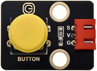

# 实验26：按键控制led灯

**实验介绍：**

通常，一个完整的开环控制装置有三个基本部分组成：外部信息输入、控制器和执行器。它们之间的关系是，外部信息输入到控制器，控制器对输入的信息进行分析出结果后输出控制信号，使执行器做出指定的动作。

从前面的实验课程中我们了解到按键模块按下我们的单片机读取到低电平，松开读取到高电平。在这一实验课程中，我们利用按键和LED做一个扩展，如果当按键按下时即读取到低电平时我们点亮LED，松开按键时即读取到高电平时我们熄灭LED，这样就可以通过一个模块控制另一个模块了，但是这样似乎过于简单，所以我们在这里使用中断，按下按键LED点亮，再次按下按键LED熄灭，再次按下再次点亮...。

**实验元件：**

|  |  |  |  |  |  |
| ----------------------------------------------- | ----------------------------------------------- | ----------------------------------------------- | ------------------------------------------------------------ | ------------------------------------------------ | ----------------------------------------------- |
| Raspberry Pi Pico板*1                           | Raspberry Pi Pico扩展板*1                       | keyes DIY电子积木 白色LED模块*1                 | keyes DIY电子积木 单路按键模块*1                             | 防反插3Pin*2                                     | MicroUSB线*1                                    |

**实验接线图：**

**运行示例代码：**

找到button control LED.py，然后双击打开代码，再点击运行代码

**代码说明：**

1.  我们需要跟前面学习的课程一样，根据接线设置传感器/模块连接的IO口，然后配置引脚模式。

2.  我们前面已经知道，button.irq(trigger = Pin.IRQ_FALLING, handler =
    toggle_handle)触发模式为下降沿触发也就是高电平变为低电平时，触发中断，然后调用中断服务函数toggle_handle，每次进入中断，我们都把变量touch取反，这样就可以按下点亮再次按下熄灭的效果了。

**实验结果：**

运行测试代码，当我们按下按键，LED被点亮，再次按下，LED熄灭，再按再亮，再按再灭。

