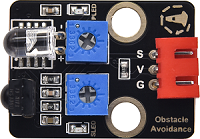

# 实验27：障碍物报警

**实验介绍：**

在前面实验课程中中，我们利用一个输入模块控制另一个输出模块。在这一实验中，我们还是用一个模块控制另一个模块，当避障传感器检测到障碍物时有源蜂鸣器响起。

生活中，我们可以利用一个检测传感器控制一个有源蜂鸣器响起或者LED点亮，做声光报警设备，如检测磁场（干簧管）、检测倾斜（倾斜模块）等等。

**实验元件：**

|  |  |  |  |  |  |
| ----------------------------------------------- | ----------------------------------------------- | ----------------------------------------------- | ----------------------------------------------- | ------------------------------------------------ | ----------------------------------------------- |
| Raspberry Pi Pico板*1                           | Raspberry Pi Pico扩展板*1                       | keyes DIY电子积木 避障传感器*1                  | keyes DIY电子积木 有源蜂鸣器模块*1              | 防反插3Pin*2                                     | MicroUSB线*1                                    |

**实验接线图：** 

**运行示例代码**

找到Avoiding alarm.py，然后双击打开代码，再点击运行代码

**代码说明：**

检测到障碍物时sensor.value()会返回一个低电平信号，然后我们再把它用not()取反，这样检测到障碍物，蜂鸣器管脚接的GP16就会输出高电平信号了，蜂鸣器就响了。

**实验结果：**

运行测试代码，检测到障碍物时，外接的有源蜂鸣器响起声音，否则有源蜂鸣器停止响音。

