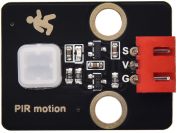
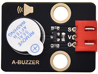

# 实验28：pico入侵检测报警器

**实验介绍：**

在上一课实验中，我们利用避障传感器检测障碍物进行报警提醒，在这一实验中，我们利用人体红外热释传感器检测结果控制一个有源蜂鸣器响起和板载LED快速闪烁。

**实验元件：**

|  |  |  |  |  |  |
| ----------------------------------------------- | ----------------------------------------------- | ----------------------------------------------- | ----------------------------------------------- | ------------------------------------------------ | ----------------------------------------------- |
| Raspberry Pi Pico板*1                           | Raspberry Pi Pico扩展板*1                       | keyes DIY电子积木 人体红外热释传感器*1          | keyes DIY电子积木 有源蜂鸣器模块*1              | 防反插3Pin*2                                     | MicroUSB线*1                                    |

**实验接线图：**

**运行示例代码：**

找到PIR alarm.py，然后双击打开代码，再点击运行代码

**代码说明：**

前面实验二十六我们使用到了中断，sensor_pir.irq(trigger=machine.Pin.IRQ_RISING, handler=pir_handler)同样我们这个实验中也用到了中断，只是触发方式与前面相反，这里是上升沿触发，即低电平变为高电平触发，pir_handler为中断服务函数，使蜂鸣器响起，LED快速闪烁。

**实验结果：**

程序运行之后，LED灯慢闪，检测器开始工作，中断触发方式为IRQ_RISING，当有入侵时，PIR的输出口电平从0变到1，会调用pir_handler()函数，蜂鸣器响起，LED快速闪烁。

