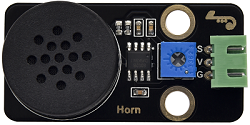

# 实验29：音乐播放

**实验介绍：**

在前面的单个模块是学校中，我们学习了让8002b功放
喇叭模块发出特定频率的声音、播放的节拍以及调节喇叭的声音大小，其实每首音乐就是由一个个特定的节拍与音调（频率）组合而成的。在这一实验中，我们利用这个喇叭模块播放一首音乐。

要演奏出音乐，我们首先需要搞清楚各音调的频率，具体见下表：

低音：

| 音调 音符 | 1#   | 2#   | 3#   | 4#   | 5#   | 6#   | 7#   |
| --------- | ---- | ---- | ---- | ---- | ---- | ---- | ---- |
| A         | 221  | 248  | 278  | 294  | 330  | 371  | 416  |
| B         | 248  | 278  | 294  | 330  | 371  | 416  | 467  |
| C         | 131  | 147  | 165  | 175  | 196  | 221  | 248  |
| D         | 147  | 165  | 175  | 196  | 221  | 248  | 278  |
| E         | 165  | 175  | 196  | 221  | 248  | 278  | 312  |
| F         | 175  | 196  | 221  | 234  | 262  | 294  | 330  |
| G         | 196  | 221  | 234  | 262  | 294  | 330  | 371  |

中音：

| 音调 音符 | 1    | 2    | 3    | 4    | 5    | 6    | 7    |
| --------- | ---- | ---- | ---- | ---- | ---- | ---- | ---- |
| A         | 441  | 495  | 556  | 589  | 661  | 724  | 833  |
| B         | 495  | 556  | 624  | 661  | 724  | 833  | 935  |
| C         | 262  | 294  | 330  | 350  | 393  | 441  | 495  |
| D         | 294  | 330  | 350  | 393  | 441  | 495  | 556  |
| E         | 330  | 350  | 393  | 441  | 495  | 556  | 624  |
| F         | 350  | 393  | 441  | 495  | 556  | 624  | 661  |
| G         | 393  | 441  | 495  | 556  | 624  | 661  | 724  |

高音：

| 音调 音符 | 1#   | 2#   | 3#   | 4#   | 5#   | 6#   | 7#   |
| --------- | ---- | ---- | ---- | ---- | ---- | ---- | ---- |
| A         | 882  | 990  | 1112 | 1178 | 1322 | 1484 | 1665 |
| B         | 990  | 1112 | 1178 | 1322 | 1484 | 1665 | 1869 |
| C         | 525  | 589  | 661  | 700  | 786  | 882  | 990  |
| D         | 589  | 661  | 700  | 786  | 882  | 990  | 1112 |
| E         | 661  | 700  | 786  | 882  | 990  | 1112 | 1248 |
| F         | 700  | 786  | 882  | 935  | 1049 | 1178 | 1322 |
| G         | 786  | 882  | 990  | 1049 | 1178 | 1322 | 1484 |

我们知道了音调的频率后，下一步就是控制音符的演奏时间。每个音符都会播放一定的时间，这样才能构成一首优美的曲子，而不是生硬的一个调的把所有的音符一股脑的都播放出来。音符节奏分为一拍、半拍、1/4拍、1/8拍，我们规定一拍音符的时间为1；半拍为0.5；1/4拍为0.25；1/8拍为0.125……，所以我们可以为每个音符赋予这样的拍子播放出来，音乐就成了。

这里我们具体以《生日快乐》为例：

**实验元件：**

|  |  |  |  |  |
| ----------------------------------------------- | ----------------------------------------------- | ----------------------------------------------- | ------------------------------------------------ | ----------------------------------------------- |
| Raspberry Pi Pico板*1                           | Raspberry Pi Pico扩展板*1                       | keyes DIY电子积木 8002b功放 喇叭模块*1          | 防反插3Pin*1                                     | MicroUSB线*1                                    |

**实验接线图：**

**运行示例代码：**

找到play music.py，然后双击打开代码，再点击运行代码

**代码说明：**

我们先是列出了所有D调的频率，方便后面使用。然后根据简谱列出各频率，再列出各节拍，我们用到的一个节拍为500ms，这个可以自己调整，然后循环响起音调与对应节拍就成了一首歌曲。

**实验结果：**

按照接线图接好线，运行测试代码，功放喇叭模块播放出生日快乐歌曲。

