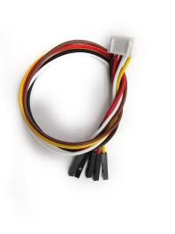

# 实验2：交通灯

**实验介绍：**

我想大家都看见过交通灯，就是马路上十字路口的红绿灯。如果您开过车，我想您一定仔细观察过交通灯，如果您还没有驾驶过车，您是否仔细观察过交通灯呢？在我们这个套件中，就包含一个交通灯模块。我们经常会用红绿黄3个LED外接电路来模拟路边的红绿黄灯闪烁。因此我们特别设计了这款模块，模块上自带了红黄绿3个LED灯，我们这个实验就做一个模拟交通灯。

**实验原理：**

前面第一课我们就学习了如何控制一个LED，由原理图容易得知，控制这个模块就好比分别控制3个独立的LED灯(我们这个灯可直接由单片机IO口驱动)，给对应颜色灯高电平就亮起对应的颜色。比如，我们给信号“R”输出高电平，也就是3.3V，则红色LED点亮。

**实验元件：**

|  |  |  |  |  |
| ----------------------------------------------- | ----------------------------------------------- | ----------------------------------------------- | ------------------------------------------------ | ----------------------------------------------- |
| Raspberry Pi Pico板*1                           | Raspberry Pi Pico扩展板*1                       | keyes DIY电子积木 交通灯模块*1                  | 防反插5Pin*1                                     | MicroUSB线*1                                    |

**接线图:**

**运行示例代码：**

找到Traffic_Light.py，然后双击打开代码，再点击运行代码

**代码说明：**

1.  创建管脚类接口，设置引脚模式，延时函数，输出高低电平参考实验一说明，这里就不多说了。

2.  这里我们还用到了for循环：最简单形式为for i in     range()，我们上面用到了range(3)，表示变量i从0开始，每次自加1，到小于3的最大整数，也就是2。即第一次i为0，第二次i为1，第三次i为2，再加i就为3了，此时跳出for循环，所以for循环下面的语句执行三次，每一次都是黄灯亮0.5秒，灭0.5秒，即闪烁3次。

3.  for循环我们还可用for x in     lists:，每次运行x遍历lists列表，直到遍历完列表所有的值，当然也可遍历元组，字典，字符串等等。

**实验结果：**

运行测试代码，模块上绿色LED亮5秒然后熄灭，黄色LED闪烁3秒然后熄灭，再然后红色LED亮5秒，然后熄灭，模块上3个LED自动模拟交通灯循环运行。

