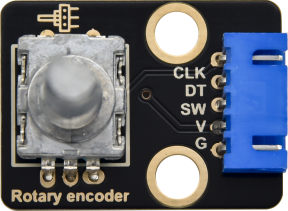

# 实验30：旋转编码器模块控制RGB模块

**实验介绍：**

在前面课程的实验十八中，我们利用旋转编码器计数。在这里我们将它扩展一下，通过得出的计数，我们用来控制RGB模块上LED显示不同颜色。

设计代码时，我们需要对所得数据除以3，得到余数，余数为0控制插件RGB模块上LED亮红光，余数为1，RGB模块上LED亮绿光，余数为2，RGB模块上LED亮蓝光。

**实验元件：**

|   |   |  |  |
| ------------------------------------------------ | ------------------------------------------------ | ----------------------------------------------- | ----------------------------------------------- |
| Raspberry Pi Pico板*1                            | Raspberry Pi Pico扩展板*1                        | keyes DIY电子积木 共阴RGB模块*1                 | keyes DIY电子积木 旋转编码器模块*1              |
|  |  |  |                                                 |
| 防反插5Pin*1                                     | 防反插4Pin*1                                     | MicroUSB线*1                                    |                                                 |

**实验接线图：**

**运行示例代码：**

找到Encoder control RGB.py，然后双击打开代码，再点击运行代码

**代码说明：**

在实验中我们将val除以3的余数，得到余数后根据接线设置管脚为GP9（红灯）、GP10（绿灯）和GP11（蓝灯）。参考前面实验学习的控制方法，利用余数控制模块上LED显示对应灯光颜色，任何数对3进行取余得到的值都是0或1或2，我们就利用这三个值来判断，并显示对应的颜色。

**实验结果：**

按照接线图接好线，运行测试代码，观察Shell。旋转编码器，打印对应余数。即可控制外接的RGB模块上的LED的颜色（红绿蓝）。

