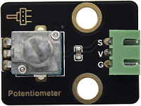
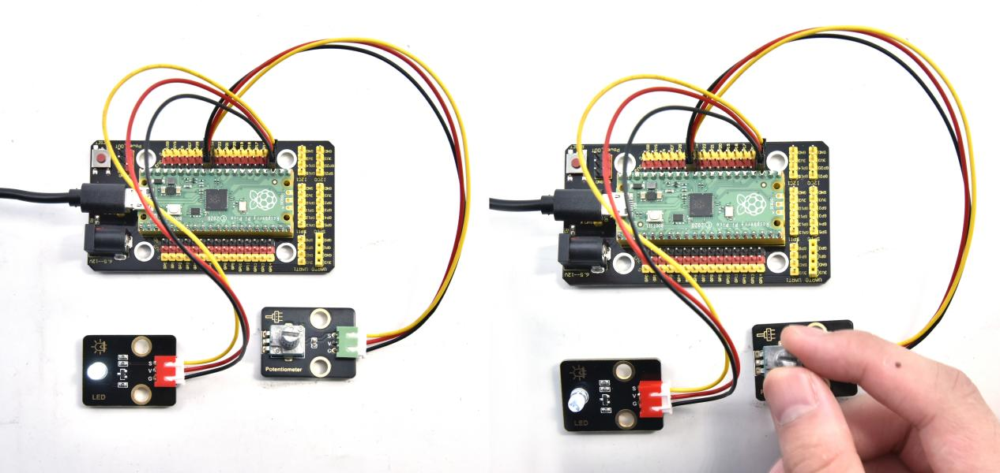

# 实验31：无级调灯

**实验介绍：**

市面上有些台灯是可以实现无级调节亮度的，用起来相对其它的只能开关灯的体验要好一些。这节课我们就来学习实现无级调节台灯的功能。在前面课程中，我们学习了呼吸灯、按键控制LED灯，我们可不可以把这两个实验现象结合起来呢？答案是肯定的。学习利用可调电位器读取模拟值的方法，我们利用从可调电位器读取到的模拟值控制LED的亮度。设计代码时，模拟值的范围是0-65535；LED的亮度是由PWM值控制，范围为0-65535。刚好对应。

设置成功后，我们就可以通过旋转电位器，控制模块上LED的亮度。

**实验元件：**

|  |  |  |  |  |  |
| ----------------------------------------------- | ----------------------------------------------- | ----------------------------------------------- | ----------------------------------------------- | ------------------------------------------------ | ----------------------------------------------- |
| Raspberry Pi Pico板*1                           | Raspberry Pi Pico扩展板*1                       | keyes DIY电子积木 白色LED模块*1                 | keyes DIY电子积木 旋转电位器传感器*1            | 防反插3Pin*2                                     | MicroUSB线*1                                    |

**实验接线图：** 

**运行示例代码：**

找到adjust the light.py，然后双击打开代码，再点击运行代码

**代码说明：**

用电位器控制LED灯的亮度，也就比较容易了，这里可以发现MicroPython把ADC的数值范围统一在0到65535之间，直接赋值就行了，简单方便。

**实验结果：**

运行测试代码，转动模块上电位器，就可以调节LED模块上的LED的亮度。

