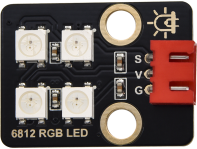
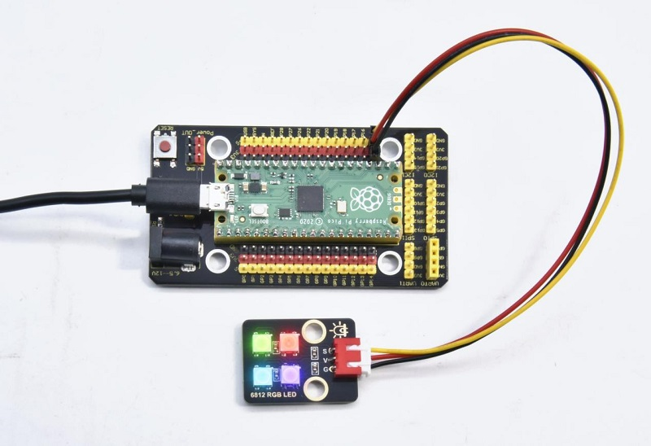

# 实验33：6812花样彩灯

**实验介绍：**

晚上的时候，我们可以看到各种各样的非常漂亮，炫目的灯光。城市的夜景也是是一个个霓虹灯组成，其实这么美丽炫目的灯光，我们也可以用我们的模块来完成。在前面实验十七，我们学会了使用6812RGB模块，我们知道这个模块只用到一个管脚便可点亮任何一个灯的任何一种颜色；我们这个实验就通过制作一个炫目的灯光来加深对这个灯的印象。（注意，灯光的亮度可能过高，避免用眼睛长时间直视灯珠！以免损害我们的眼睛。）

**实验元件：**

|  |  |  |  |  |
| ----------------------------------------------- | ----------------------------------------------- | ----------------------------------------------- | ------------------------------------------------ | ----------------------------------------------- |
| Raspberry Pi Pico板*1                           | Raspberry Pi Pico扩展板*1                       | keyes DIY电子积木 6812 RGB模块*1                | 防反插3Pin*1                                     | MicroUSB线*1                                    |

**实验接线图：**

**运行示例代码：**

找到6812.py，然后双击打开代码，再点击运行代码

**代码说明：**

color_chase(color, wait)流水灯显示color颜色，等待时间为wait

rainbow_cycle(0)：显示彩虹效果灯

**实验结果：**

按照接线图接好线，运行代码成功，我们就能看到我们6812RGB模块。四个灯珠以黑红黄绿青蓝紫白颜色显示流水灯，然后显示一个彩虹灯效果。

